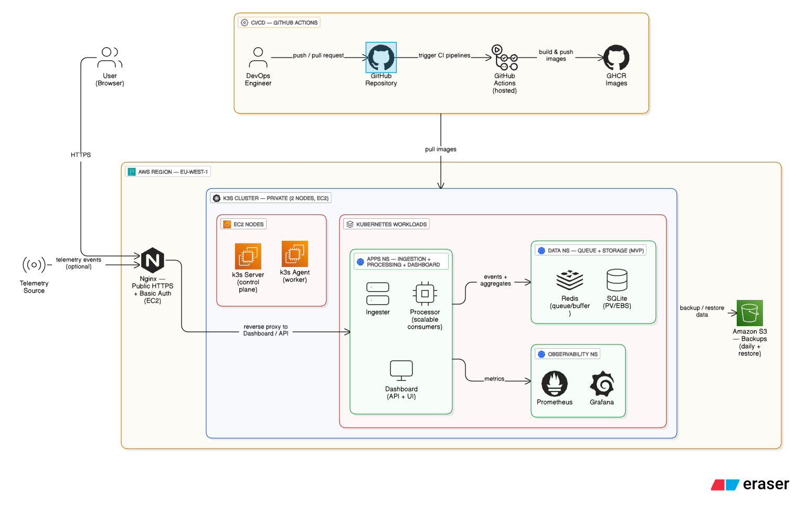
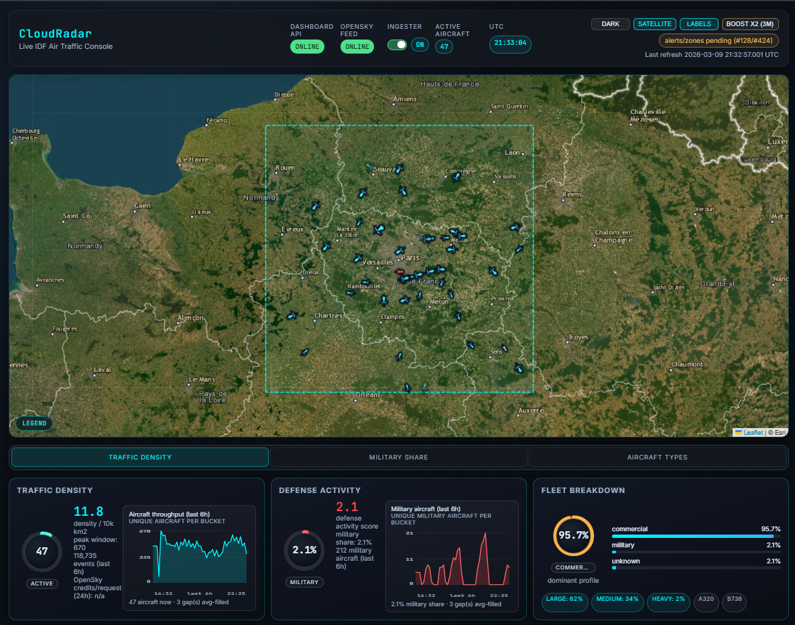
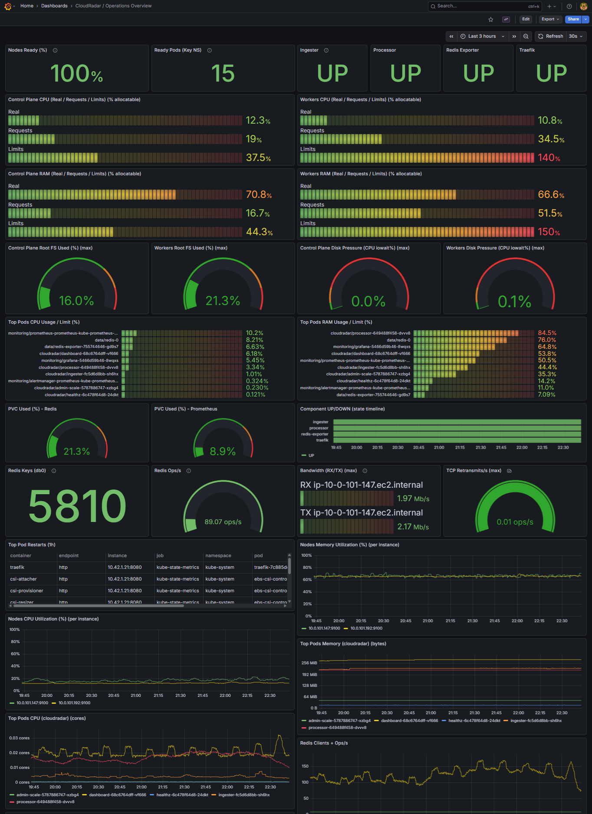
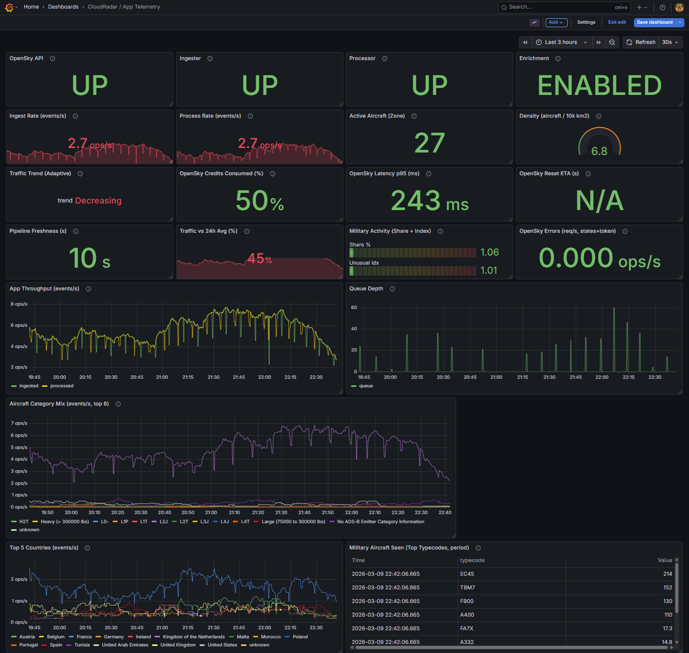
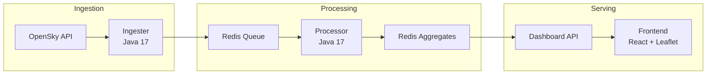
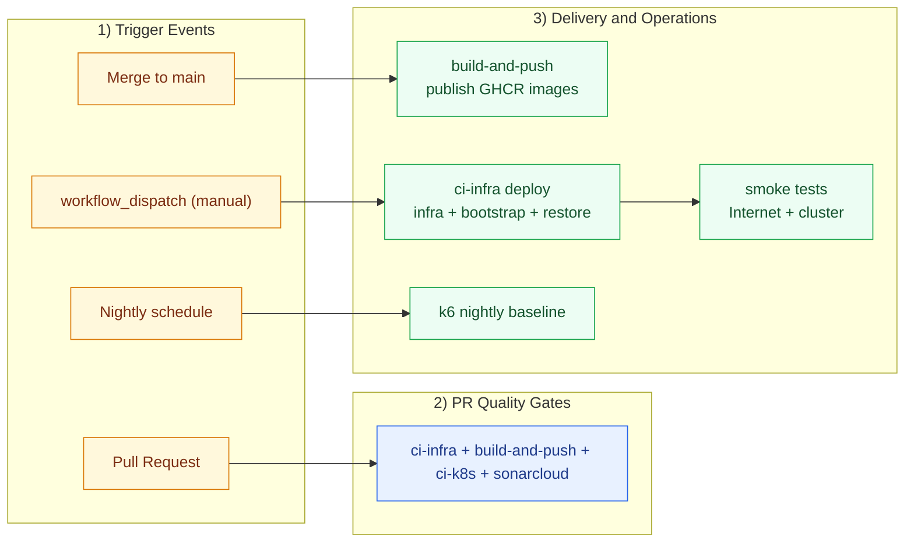
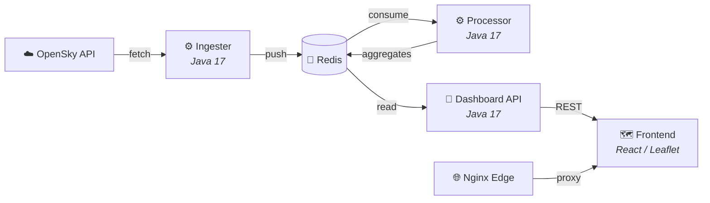

# CloudRadar - Real-Time Flight Telemetry Platform on AWS & Kubernetes

> End-to-end DevOps & Cloud Architecture portfolio: Terraform, k3s, GitOps, CI/CD, Observability.
<p align="center">
  <a href="https://cloudradar.iotx.fr">
    
  </a>
  <a href="https://github.com/ClementV78">
    
  </a>
  <br/><sub>Click the <strong>CloudRadar Live Demo</strong> badge to open the app.</sub>
</p>


[](https://sonarcloud.io/summary/new_code?id=ClementV78_CloudRadar)
[](https://sonarcloud.io/summary/new_code?id=ClementV78_CloudRadar)

---

## Why This Project Exists

I built CloudRadar to demonstrate **hands-on cloud architecture**, not just design slides. The objective was to run a production-like platform end-to-end on AWS, with Terraform, Kubernetes, GitOps, observability, and security guardrails, under strict cost constraints.

**CloudRadar** ingests live flight telemetry (ADS-B / OpenSky), processes events through a Redis-backed pipeline on k3s, and serves a real-time map. I own the full lifecycle: architecture decisions, infrastructure delivery, CI/CD, operations, troubleshooting, and documentation.

The result is a reproducible MVP platform used as an interview artifact: deployable from code, observable by default, and continuously improved through ADRs and runbooks. v1.1 now focuses on frontend polish and data/persistence hardening.

---

## Architecture Overview



<p align="center">
  <a href="./docs/architecture/technical-architecture-summary.md">
    
  </a>
  <a href="./docs/architecture/technical-architecture-summary.fr.md">
    
  </a>
</p>


## AI-Assisted Engineering

This project is **built with AI as a decision-support and implementation copilot under strict guardrails**, and is run as a **governed, auditable engineering practice**.

<p align="center">
  <a href="./docs/process/ai-assisted-engineering.md">
    
  </a>
  <a href="./docs/process/ai-assisted-engineering.fr.md">
    
  </a>
</p>

AI is used across the full lifecycle (planning, architecture, implementation, testing, documentation, and operations), while I keep ownership of scope, decisions, validation, and merges.

| Control model | How it works |
|---|---|
| **Governance** | [`AGENTS.md`](AGENTS.md) defines explicit guardrails: scope, security, merge policy, cost discipline, and documentation hygiene |
| **Decision ownership** | AI proposes options and challenges assumptions; I make the final architecture and delivery decisions |
| **Quality enforcement** | AI-generated changes pass the same CI quality gates as any other change (SonarCloud, PMD, Checkstyle, ArchUnit, Trivy, tfsec, tests) |
| **Traceability** | Decisions are backed by ADRs, issues, PRs, runbooks, and workflow logs |

| Phase | Human lead | AI assist |
|---|---|---|
| **Planning & scope** | Define goals, constraints, acceptance criteria | Break down work, suggest options, highlight trade-offs |
| **Architecture** | Choose direction and approve compromises | Challenge design assumptions and compare alternatives |
| **Implementation** | Review diffs and approve changes | Draft code/IaC/docs/workflows quickly |
| **Testing & quality** | Validate critical behavior and production impact | Generate/refine tests and quality checks |
| **Operations & docs** | Decide actions from metrics/incidents | Produce runbook updates, diagnostics, and documentation |

This allows one person to reliably cover multiple roles: **project manager, architect, developer, tester, technical writer, quality/security reviewer, DevOps, and FinOps**.

> **Why this matters:** AI is a governed accelerator here, not autopilot. It increases delivery speed and decision quality while keeping clear human accountability.

The result (snapshot, **2026-03-09**): **230+ issues, 300+ PRs, 20+ ADR records, 9 CI workflows**.

<p align="center">
  <a href="https://github.com/users/ClementV78/projects/1/">
    
  </a>
  <a href="https://github.com/ClementV78/CloudRadar/issues">
    
  </a>
</p>

Evidence: [Decision records](docs/architecture/decisions/) · [Workflow gates](.github/workflows/)

---

## Screenshots

<table>
  <thead>
    <tr>
      <th>App Dashboard</th>
      <th>Grafana Observability</th>
      <th>Grafana Ops Main Dashboard</th>
    </tr>
  </thead>
  <tbody>
    <tr>
      <td><a href="./docs/screenshots/dashboard.png"></a></td>
      <td><a href="./docs/screenshots/grafana-ops.png"></a></td>
      <td><a href="./docs/screenshots/grafana-app-telemetry.png"></a></td>
    </tr>
  </tbody>
</table>

<p align="center">
  <strong>Try the map interaction:</strong> click any aircraft marker to open its detail panel (callsign, altitude, speed, heading, origin country, and last update).
</p>

---

### Pipeline flow



### Key Design Decisions

| Decision | Choice | Rationale |
|---|---|---|
| Kubernetes distribution | **k3s on EC2** (not EKS) | ~$180/yr savings, full control, production-like experience |
| Event buffer | **Redis** (in-memory queue) | Simple, fast, sufficient for MVP throughput |
| Backend language | **Java 17 / Spring Boot** | Type-safe, production-proven, rich ecosystem |
| Frontend | **React 18 + Leaflet** | Interactive map, real-time updates |
| Egress | **NAT instance** (not NAT Gateway) | ~$30/month savings vs managed NAT |
| GitOps | **ArgoCD** | Declarative sync, drift detection, UI for visibility |
| Observability | **Prometheus + Grafana** | 7-day retention, $0.50/month (PVC), auto-deployed via ArgoCD |
| Aircraft enrichment | **Dual dataset** (OpenSky + ADSB Exchange) | Improved coverage: type, owner, military hint |
| Infrastructure lifecycle | **Fully reproducible** (destroy / redeploy) | Only the Terraform state backend (S3 + DynamoDB) is permanent |

> All significant decisions are documented as [ADRs](docs/architecture/decisions/) (20+ records).

### Disposable Infrastructure

The stack (VPC, EC2 nodes, k3s cluster, workloads) can be **destroyed and redeployed from code**. Application state is recovered from backups (RPO depends on backup cadence):

- **IaC as source of truth:** `terraform destroy` + `terraform apply` rebuilds everything identically
- **GitOps replay:** ArgoCD re-syncs all K8s workloads automatically from `k8s/apps` manifests
- **Data continuity:** Redis data and SQLite are backed up to S3; restore scripts rebuild state after redeploy
- **Only permanent resources:** the Terraform state bucket (S3) and lock table (DynamoDB), the strict minimum to bootstrap

> **Why this matters:** This enforces reproducibility, reduces manual drift risk, and makes recovery drills practical in a low-cost MVP setup.

---

## Security Posture

Security is treated as a **first-class concern**, not an afterthought:

| Layer | Practice | Status |
|---|---|---|
| **CI Authentication** | IAM OIDC, no static AWS keys in pipelines | ✅ Implemented |
| **Secrets Management** | AWS SSM Parameter Store + External Secrets Operator (ESO) | ✅ Implemented |
| **Network Segmentation** | Public edge subnet + private k3s subnet, SG-level isolation | ✅ Implemented |
| **Container Scanning** | Trivy CVE scan on every PR (image + filesystem) | ✅ Implemented |
| **Secret Detection** | GitGuardian pre-commit + CI scan | ✅ Implemented |
| **Code Quality** | SonarCloud quality gate + PMD + Checkstyle + ArchUnit (design rules) | ✅ Implemented |
| **GitHub Code Scanning** | SARIF upload for PMD, Checkstyle, and ArchUnit (unified Security tab for static Java rules) | ✅ Implemented |
| **IaC Security** | tfsec static analysis on Terraform PRs | ✅ Implemented |
| **Dockerfile Quality** | Hadolint linting on every PR | ✅ Implemented |
| **Edge Access** | Nginx + Basic Auth (dev), TLS | ✅ Implemented |
| **Least Privilege** | IAM roles scoped per service, OIDC for CI | ✅ Implemented |
| **Secrets Rotation** | Automated rotation via ESO + SSM | 📝 Planned |
| **WAF / CloudFront** | Edge security + caching | 📝 Planned |

---

## DevOps Skills & Tooling

| Category | Tools & Practices |
|---|---|
| **Infrastructure as Code** | Terraform modules, remote state (S3 + DynamoDB), environment-based layout |
| **GitOps** | ArgoCD sync from `k8s/apps`, drift-aware declarative delivery |
| **CI/CD Pipelines** | GitHub Actions with PR gates and manual deployment controls |
| **Containers** | Docker multi-stage builds, GHCR publishing on merge |
| **Kubernetes** | k3s, Kustomize, Helm via ArgoCD, persistent storage classes |
| **Observability** | Prometheus + Grafana, CloudWatch datasource integration |
| **Secret Management** | SSM Parameter Store, External Secrets Operator, IAM OIDC |
| **Cost Engineering** | k3s over EKS, NAT instance over NAT Gateway, resource sizing discipline |
| **Project Management** | GitHub Projects, issues, milestones, PR-linked execution |
| **Documentation** | ADRs, runbooks, architecture and troubleshooting documentation |

Proof links: [Project board](https://github.com/users/ClementV78/projects/1/) · [Workflows](.github/workflows/) · [ADRs](docs/architecture/decisions/) · [Troubleshooting journal](docs/runbooks/troubleshooting/issue-log.md)

---

## CI/CD Pipeline



### PR Gates (blocking)

| Workflow | What it validates |
|---|---|
| `ci-infra` | Terraform formatting, validation, plan, static security checks |
| `build-and-push` | Java tests + PMD/Checkstyle/ArchUnit (`mvn verify`), frontend tests, Dockerfile lint, dependency CVE scan |
| `ci-k8s` | Kubernetes manifest consistency and policy checks |
| `sonarcloud` | Code quality gate (bugs, smells, security hotspots, coverage context) |

---

## Testing & Quality

Testing is not limited to application code — it **validates the full delivery chain**: business logic, infrastructure-as-code, Kubernetes manifests, container security, and architectural constraints. This Shift-Left approach means **80% of checks run on PR, before merge**, catching issues across all three layers.

| Layer validated | What is tested | Tools |
|---|---|---|
| **Application** (Java + React) | Business logic, controllers, Redis data-path, component rendering | JUnit, Mockito, Testcontainers, Vitest |
| **Infrastructure** (Terraform + K8s) | IaC correctness, security posture, manifest schemas | tfsec, `terraform plan`, kubeconform |
| **Architecture & Quality** | Design rules, complexity, dependency vulnerabilities | ArchUnit, PMD, Checkstyle, SonarCloud, Trivy, Hadolint |

| Metric | Value |
|---|---|
| Automated tests | **125+** (Java + TypeScript, 31 files) |
| Test categories | **9** (unit, integration, contract, smoke, E2E, security, quality, infra, perf) |
| PR quality gates | **8** blocking checks in parallel |
| Static analysis rules | PMD (5) + Checkstyle (10) + ArchUnit (6) + SonarCloud |
| Infra validation | 40 `.tf` files + 69 k8s manifests validated per PR |
| Performance baseline | k6 nightly: 10 VUs, p95 < 1500 ms, error rate < 5% |

| Gate | Scope | Trigger |
|---|---|---|
| Java tests + quality (`mvn verify`) | 92 tests + PMD/Checkstyle/ArchUnit | Every PR |
| Frontend tests (Vitest) | 31 component + utility tests | Every PR |
| SonarCloud quality gate | Coverage, bugs, code smells, security hotspots | Every PR |
| Trivy CVE scan | Container images + filesystem (6 services) | Every PR |
| GitGuardian | Leaked secrets detection | Every PR |
| tfsec | Terraform security best practices | Infra PRs |
| Hadolint | Dockerfile quality (6 Dockerfiles) | App PRs |
| kubeconform | K8s manifest schemas + image naming | K8s PRs |
| Smoke tests (`/healthz`) | Post-deploy service availability (3 endpoints) | Post-merge |

PMD, Checkstyle, and ArchUnit results are uploaded as **SARIF to GitHub Code Scanning** (Security tab) for centralized visibility.
For practical day-to-day review, `build-and-push` also publishes:
- per-service artifacts (`quality-reports-<service>`) with raw XML + SARIF reports
- a consolidated PMD/Checkstyle/ArchUnit table in `ci-summary-report` (`GITHUB_STEP_SUMMARY`)

<p align="center">
  <a href="docs/testing-overview.md">
    
  </a>
  <a href="docs/testing-overview-en.md">
    
  </a>
</p>

---

## Operational Signals (MVP)

| Signal | How it is measured | Evidence |
|---|---|---|
| Service availability | Post-apply smoke tests validate `/healthz` from the Internet and in-cluster rollout status | [`ci-infra` workflow](.github/workflows/ci-infra.yml), [runbook](docs/runbooks/ci-cd/ci-infra.md) |
| TLS health | CI validates SSM certificate/key artifacts and checks public certificate expiry (`>= 14 days`) | [`ci-infra` workflow](.github/workflows/ci-infra.yml), [issue log](docs/runbooks/troubleshooting/issue-log.md) |
| Performance baseline | Nightly k6 run publishes check rate, failure rate, and p95 latency artifacts | [`k6-nightly-baseline` workflow](.github/workflows/k6-nightly-baseline.yml) |
| Incident learning loop | Incidents are logged with root cause, resolution, and guardrails | [troubleshooting journal](docs/runbooks/troubleshooting/issue-log.md) |

---

## Microservices



| Service | Language | Role | Namespace |
|---|---|---|---|
| **ingester** | Java 17 / Spring Boot | Fetches flight data from OpenSky, pushes to Redis queue | `cloudradar` |
| **processor** | Java 17 / Spring Boot | Consumes Redis events, builds aggregates | `cloudradar` |
| **dashboard** | Java 17 / Spring Boot | REST API: flights, details, metrics | `cloudradar` |
| **frontend** | React 18 / TypeScript | Interactive map (Leaflet), real-time aircraft display | `cloudradar` |
| **health** | Python 3.11 | `/healthz` + `/readyz` probes for edge/load balancer | `cloudradar` |
| **admin-scale** | Python 3.11 / boto3 | Ingester scaling API (K8s API) | `cloudradar` |
| **redis** | Redis | Event buffer + aggregate store | `data` |

All services expose `/healthz` (liveness) and `/metrics` (Prometheus scrape).

---

## AWS Infrastructure

| Component | Role | Status |
|---|---|---|
| **VPC** | Public edge subnet + private k3s subnet, SG isolation | ✅ |
| **EC2 (edge)** | Nginx reverse proxy, TLS, Basic Auth | ✅ |
| **EC2 (private)** | k3s control plane + worker | ✅ |
| **NAT Instance** | Private subnet egress (cost-optimized) | ✅ |
| **S3** | Terraform state + backup bucket | ✅ |
| **SSM Parameter Store** | Runtime secrets + config | ✅ |
| **IAM OIDC** | GitHub Actions ↔ AWS trust (zero static keys) | ✅ |
| **VPC Endpoints** | Private access to SSM, S3 | ✅ |
| **CloudFront** | Edge CDN + WAF | 📝 Planned |

> Full details: [Infrastructure Architecture](docs/architecture/infrastructure.md)

---

## Known Limitations (MVP)

- Single AWS region (`us-east-1`) with a small cluster footprint (edge + control plane + one worker): no multi-region HA.
- Data layer is still MVP-grade: Redis storage resilience hardening is in progress.
- Edge security is pragmatic for MVP (Nginx + Basic Auth + Let's Encrypt/SSM); managed edge hardening (CloudFront/WAF path) is planned.
- Performance validation is baseline-level (nightly k6), not full-scale capacity modeling.
- Some high-impact operations are intentionally manual-gated in CI/CD (apply/destroy) for safety and cost control.

---

## Roadmap

| Version | Focus | Target |
|---|---|---|
| **v1-mvp** | Core platform: IaC, GitOps, CI/CD, observability, 6 microservices | ✅ Completed |
| **v1.1** | Frontend polish, alertable zones, SQLite persistence, S3 backups | 🔧 In progress |
| **v2** | RDS migration, HPA autoscaling, CloudFront CDN, secrets rotation | 📝 Planned |

Tracked in [GitHub Project](https://github.com/users/ClementV78/projects/1/) and [milestones](https://github.com/ClementV78/CloudRadar/milestones).

---

## Documentation

| Topic | Link |
|---|---|
| Documentation Hub (start here) | [docs/README.md](docs/README.md) |
| Infrastructure Architecture | [docs/architecture/infrastructure.md](docs/architecture/infrastructure.md) |
| Application Architecture | [docs/architecture/application-architecture.md](docs/architecture/application-architecture.md) |
| Architecture Decision Records (20+) | [docs/architecture/decisions/](docs/architecture/decisions/) |
| Runbooks (bootstrap → ops) | [docs/runbooks/README.md](docs/runbooks/README.md) |
| Testing & QA Overview | [docs/testing-overview.md](docs/testing-overview.md) |
| Troubleshooting Log | [docs/runbooks/troubleshooting/issue-log.md](docs/runbooks/troubleshooting/issue-log.md) |

---

## Quick Tour

```bash
# Clone the repository
git clone https://github.com/ClementV78/CloudRadar.git
cd CloudRadar

# Optional: open in your editor
# code .
```

In 10 minutes, you can review the project at the right level for a DevOps/Cloud interview:

1. **Architecture first**: [Infrastructure Architecture](docs/architecture/infrastructure.md) and [Application Architecture](docs/architecture/application-architecture.md).
2. **Delivery model**: [CI/CD runbook](docs/runbooks/ci-cd/ci-infra.md) and workflows in [`.github/workflows`](.github/workflows/).
3. **Operational reality**: [Troubleshooting Journal](docs/runbooks/troubleshooting/issue-log.md) and [Testing & QA Overview](docs/testing-overview.md).
4. **Execution order** (if you want to deploy): [Runbooks hub](docs/runbooks/README.md).

---

## License

[MIT License](LICENSE)
© 2025-2026 Clément V.

---

<p align="center">
  <i>Designed and operated solo as a DevOps & Cloud Architecture portfolio project.</i><br/>
  <a href="https://github.com/ClementV78">GitHub Profile</a>
</p>
