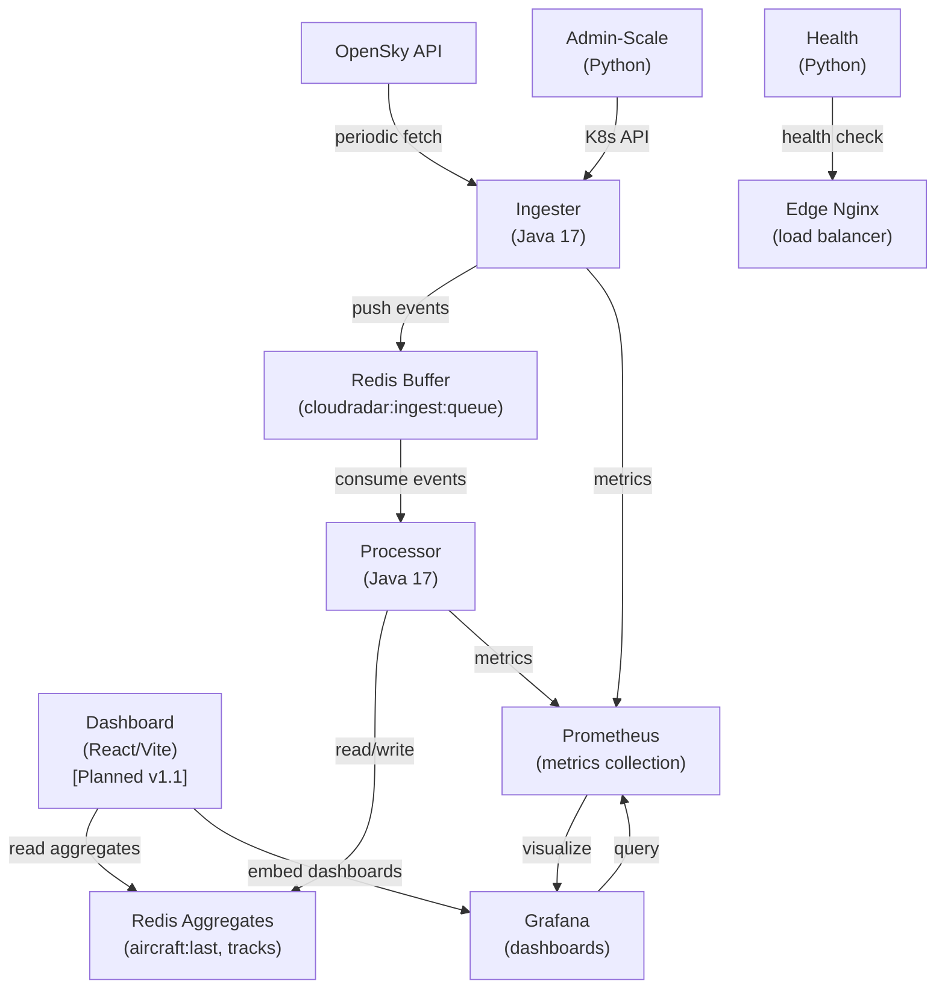
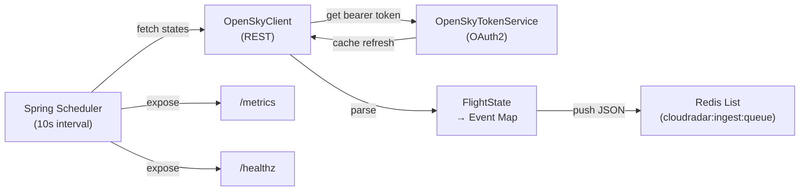
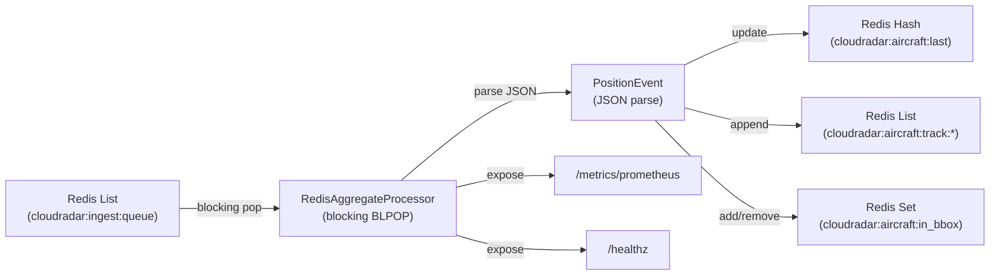
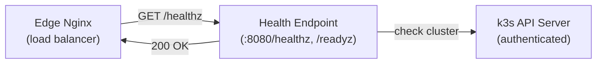
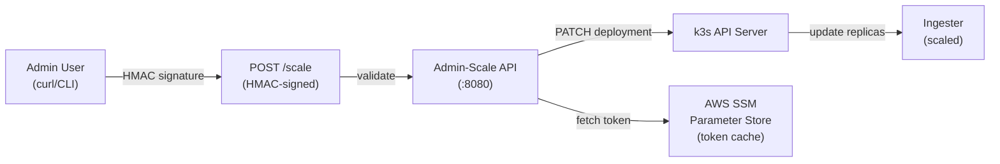
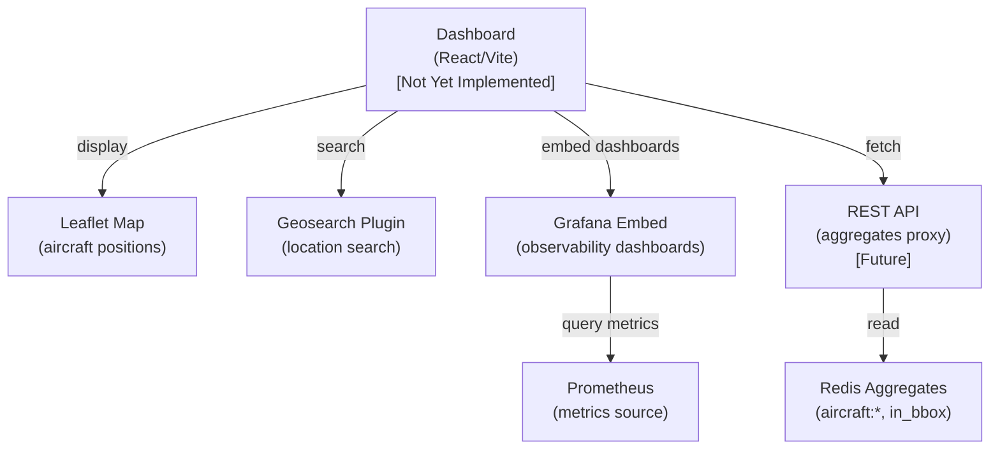
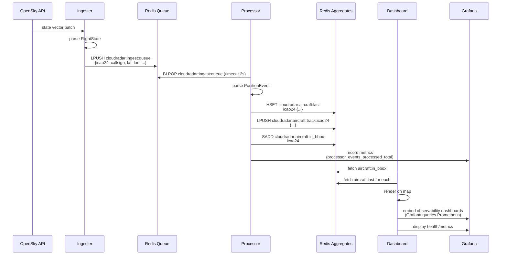

# CloudRadar Application Architecture

This document describes the architecture and design of all microservices in the CloudRadar platform. Each service is containerized and deployed to k3s via ArgoCD.

## Overview

CloudRadar consists of five main components:

1. **Ingester** (Java 17) — Fetches flight data from OpenSky API and publishes to Redis
2. **Processor** (Java 17) — Consumes Redis events and builds in-memory aggregates
3. **Health** (Python) — Health check endpoint for load balancer / edge ingress
4. **Admin-Scale** (Python) — Administrative API for scaling the ingester deployment
5. **Dashboard** (React/Vite) — Frontend for visualization (in planning)



### Observability Access Path
- **Edge Nginx (EC2)** is the only public entrypoint and applies Basic Auth. It forwards to K3s nodeports/Ingress.
- **In-cluster**: Traefik (k3s default) routes HTTP to services (Grafana, Prometheus). No additional in-cluster proxy.
- **Security**: Secrets for Basic Auth are stored in SSM (surfaced via ESO where needed). Remove duplicate proxies to reduce attack surface.

---

## 1. Ingester (Java 17 / Spring Boot)

### Purpose
Fetches live flight states from OpenSky API every 10 seconds and publishes each flight as a JSON event to Redis. Acts as the ingestion entry point for the CloudRadar pipeline.

### Technology Stack
- **Language**: Java 17
- **Framework**: Spring Boot 3.x
- **Scheduler**: Spring `@Scheduled`
- **HTTP Client**: RestTemplate / Spring WebClient
- **Authentication**: OAuth2 (OpenSky credentials via SSM Parameter Store)
- **Message Queue**: Redis List

### Architecture



### Code Organization

```
src/ingester/
├── IngesterApplication.java              # Spring Boot entrypoint, scheduling enabled
├── config/
│   ├── IngesterProperties.java            # Configuration: refresh interval, Redis key, bbox
│   ├── OpenSkyProperties.java             # OpenSky API URLs, token endpoint
│   ├── AwsProperties.java                 # AWS region, SSM parameter names
│   └── HttpClientConfig.java              # RestTemplate / WebClient beans
├── opensky/
│   ├── OpenSkyClient.java                 # Fetches /states/all, parses response
│   ├── OpenSkyTokenService.java           # Manages OAuth2 bearer token (10m TTL)
│   ├── OpenSkyCredentialsProvider.java    # Loads credentials from SSM
│   └── FlightState.java                   # DTO for OpenSky state objects
├── redis/
│   └── RedisPublisher.java                # Serializes events as JSON, pushes to Redis List
└── job/
    └── FlightIngestJob.java               # Scheduled job (runs every INGESTER_REFRESH_MS)
```

### Flow

1. `FlightIngestJob` runs every 10 seconds (configurable via `INGESTER_REFRESH_MS`)
2. `OpenSkyClient` requests `/states/all` for the defined bounding box (Île-de-France by default)
3. `OpenSkyTokenService` provides a cached OAuth2 bearer token (refreshed every ~10 minutes)
4. Response is parsed into `FlightState` objects, then to a simple JSON map:
   ```json
   {
     "icao24": "abc123",
     "callsign": "AFR123",
     "latitude": 48.5,
     "longitude": 2.5,
     "barometric_altitude": 2000,
     "true_track": 45.5,
     "velocity": 200.5,
     "vertical_rate": 5.0,
     "time_position": 1704067200,
     "last_contact": 1704067200
   }
   ```
5. `RedisPublisher` pushes the JSON to `cloudradar:ingest:queue` (Redis List)
6. Metrics (`/metrics`) and health (`/healthz`) exposed via Actuator

### Error Handling

Progressive backoff on OpenSky connectivity issues:
```
1s → 2s → 5s → 10s → 30s → 60s → 5m → 10m → 30m → 1h → stop
```

After the final backoff, ingestion is disabled until pod restart.

Token refresh has an additional local cooldown guard in `OpenSkyTokenService`:
```
15s → 30s → 60s → 120s → 300s → 600s
```

Details:
- Cooldown applies only to token refresh attempts after consecutive token failures.
- Successful token refresh resets the token failure counter and cooldown window.
- Token refresh failures are propagated to `FlightIngestJob` so ingestion-level backoff is applied consistently.

### Configuration (Environment Variables)

| Variable | Default | Purpose |
|----------|---------|---------|
| `INGESTER_REFRESH_MS` | 10000 | Scheduler interval in milliseconds |
| `INGESTER_REDIS_KEY` | `cloudradar:ingest:queue` | Redis List key for events |
| `OPENSKY_LAT_MIN`, `_MAX`, `_LON_MIN`, `_MAX` | IDF bbox | Bounding box for queries |
| `OPENSKY_BASE_URL` | OpenSky default | API base URL (or SSM reference) |
| `OPENSKY_CLIENT_ID`, `_SECRET` | — | OAuth2 credentials (SSM Parameter Store) |
| `REDIS_HOST`, `REDIS_PORT` | `redis.data.svc`, 6379 | Redis connection |

### Metrics Exposed

- `opensky_requests_total` — Total API requests sent
- `opensky_errors_total` — Total API errors
- `ingester_events_published_total` — Total events pushed to Redis
- `ingester_opensky_backoff_seconds` — Current OpenSky failure backoff duration in seconds
- `ingester_opensky_disabled` — Ingester disabled flag (1 = disabled after repeated failures)

---

## 2. Processor (Java 17 / Spring Boot)

### Purpose
Consumes events from the Redis queue (ingester output) and maintains real-time aggregates for aircraft positions, tracks, and bbox membership. Serves as the stateful aggregation layer.

### Technology Stack
- **Language**: Java 17
- **Framework**: Spring Boot 3.x
- **Event Loop**: Blocking Redis BLPOP with timeout
- **Redis Client**: Lettuce (Spring Data Redis)
- **Metrics**: Micrometer (Prometheus format)

### Architecture



### Code Organization

```
src/processor/
├── ProcessorApplication.java              # Spring Boot entrypoint
├── config/
│   └── ProcessorProperties.java           # Configuration: bbox, Redis keys, poll timeout
├── service/
│   ├── RedisAggregateProcessor.java       # Main processor loop (blocking BLPOP)
│   ├── PositionEvent.java                 # DTO for parsed OpenSky events
│   └── AircraftAggregate.java             # In-memory aggregate state
└── controller/
    └── MetricsController.java             # Prometheus metrics export
```

### Flow

1. `RedisAggregateProcessor` blocks on `cloudradar:ingest:queue` with a 2-second timeout
2. Each popped event is parsed into a `PositionEvent` (JSON deserialization)
3. Aggregates are updated atomically:
   - **Last position hash** (`cloudradar:aircraft:last`):
     ```
     HSET cloudradar:aircraft:last abc123 '{"callsign":"AFR123","lat":48.5,...}'
     ```
   - **Track list per aircraft** (`cloudradar:aircraft:track:<icao24>`):
     ```
     LPUSH cloudradar:aircraft:track:abc123 '{"lat":48.5,"lon":2.5,"ts":1704067200}'
     LTRIM cloudradar:aircraft:track:abc123 0 179  # keep last 180 positions
     ```
   - **Bbox membership set** (`cloudradar:aircraft:in_bbox`):
     ```
     SADD cloudradar:aircraft:in_bbox abc123      # if in bbox
     SREM cloudradar:aircraft:in_bbox abc123      # if left bbox
     ```
4. Metrics (`/metrics/prometheus`) and health (`/healthz`) exposed via Actuator

### Aggregates (Redis Schema)

| Structure | Key Pattern | Purpose | TTL |
|-----------|-------------|---------|-----|
| Hash | `cloudradar:aircraft:last` | Latest position of each aircraft | None (manual cleanup) |
| List | `cloudradar:aircraft:track:icao24` | Position history (180 entries) | None (LTRIM 0 179) |
| Set | `cloudradar:aircraft:in_bbox` | ICAO24s currently in bbox | None (manual cleanup) |

### Configuration (Environment Variables)

| Variable | Default | Purpose |
|----------|---------|---------|
| `PROCESSOR_POLL_TIMEOUT_SECONDS` | 2 | Redis BLPOP timeout |
| `PROCESSOR_TRACK_LENGTH` | 180 | Max positions per aircraft track |
| `PROCESSOR_REDIS_INPUT_KEY` | `cloudradar:ingest:queue` | Input Redis List |
| `PROCESSOR_LAST_POSITIONS_KEY` | `cloudradar:aircraft:last` | Last positions hash |
| `PROCESSOR_TRACK_KEY_PREFIX` | `cloudradar:aircraft:track:` | Track list prefix |
| `PROCESSOR_BBOX_SET_KEY` | `cloudradar:aircraft:in_bbox` | Bbox membership set |
| `PROCESSOR_LAT_MIN`, `_MAX`, `_LON_MIN`, `_MAX` | IDF bbox | Bounding box for membership |
| `REDIS_HOST`, `REDIS_PORT` | `redis.data.svc`, 6379 | Redis connection |

### Metrics Exposed

- `processor_events_processed_total` — Total events consumed from Redis
- `processor_events_errors_total` — Total parsing/processing errors
- `processor_bbox_count` — Current count of aircraft in bbox
- `processor_last_processed_epoch` — Unix timestamp of last processed event

---

## 3. Health (Python)

### Purpose
Lightweight health check endpoint for the edge load balancer and general cluster health validation. Queries the k3s API server to ensure cluster connectivity.

### Technology Stack
- **Language**: Python 3.11
- **HTTP Server**: Python `http.server`
- **K8s Interaction**: Direct HTTPS + Service Account Token

### Architecture



### Endpoints

| Endpoint | Method | Response | Purpose |
|----------|--------|----------|---------|
| `/readyz` | GET | 200 OK | Process readiness for probes |
| `/healthz` | GET | 200 OK (if cluster healthy) | Cluster health status |

### Configuration (Environment Variables)

| Variable | Default | Purpose |
|----------|---------|---------|
| `PORT` | 8080 | HTTP server listen port |

### Code Organization

```
src/health/
└── app.py
    ├── _load_token()               # Reads k3s service account token
    ├── _k8s_api_check()            # Queries k3s API server
    └── HealthHandler              # HTTP request handler
```

---

## 4. Admin-Scale (Python)

### Purpose
Administrative API for scaling the ingester deployment replicas. Accepts HMAC-signed POST requests to scale from 0 to 2 replicas (configurable).

### Technology Stack
- **Language**: Python 3.11
- **HTTP Server**: Python `http.server`
- **K8s Interaction**: Direct HTTPS + Service Account Token
- **Authentication**: HMAC-SHA256 signatures
- **AWS**: Boto3 (SSM Parameter Store for token caching)

### Architecture



### Endpoints

| Endpoint | Method | Body | Auth | Purpose |
|----------|--------|------|------|---------|
| `/scale` | POST | `{"replicas": 1}` | HMAC-SHA256 | Scale ingester replicas |
| `/health` | GET | — | None | Health check |

### Configuration (Environment Variables)

| Variable | Default | Purpose |
|----------|---------|---------|
| `PORT` | 8080 | HTTP server listen port |
| `TARGET_NAMESPACE` | `cloudradar` | k3s namespace for ingester |
| `TARGET_DEPLOYMENT` | `ingester` | k3s deployment name |
| `ADMIN_TOKEN_SSM_NAME` | `/cloudradar/admin/k8s-admin-api-token` | SSM parameter for k3s token |
| `AWS_REGION` | `us-east-1` | AWS region |
| `ADMIN_TOKEN_CACHE_SECONDS` | 300 | Token cache TTL |
| `ALLOWED_REPLICAS` | `0,1,2` | Comma-separated allowed replica counts |

### Signature Validation

Requests are signed with HMAC-SHA256. Header format:
```
Authorization: hmac-sha256=<hex_digest>
```

The secret is fetched from AWS SSM Parameter Store and cached locally.

### Code Organization

```
src/admin-scale/
└── app.py
    ├── _load_token()                  # Reads k3s service account token
    ├── _fetch_admin_token()           # Fetches HMAC secret from SSM (cached)
    ├── _k8s_patch_json()              # Executes PATCH on k3s deployment
    ├── _verify_hmac()                 # Validates request signature
    ├── _allowed_replicas()            # Parses allowed replica list
    └── ScaleHandler                   # HTTP request handler (POST /scale)
```

---

## 5. Dashboard (React / Vite)

### ⚠️ Status: Not Yet Implemented
**Planned for v1.1** — Currently in planning phase only. No code or deployment yet.

Dependencies:
- Processor aggregates finalized ✅
- Redis schema stable ✅
- Observability stack deployed ✅ (issue #10)

### Purpose
Frontend for visualizing aircraft positions, flight tracks, and cluster health. Will use Leaflet for map visualization and Grafana (via embedded iframes) for observability dashboards.

### Technology Stack (Planned)
- **Language**: TypeScript / React 18
- **Build Tool**: Vite
- **Map**: Leaflet + Leaflet-Geosearch
- **Styling**: TailwindCSS
- **Observability**: Grafana (embedded dashboards from metrics stack)
- **State**: Context API (minimal)

### Planned Architecture



### Planned Features (MVP)

- **Aircraft Map**: Real-time position markers from `cloudradar:aircraft:in_bbox`
- **Flight Tracks**: Historical paths from `cloudradar:aircraft:track:*`
- **Search**: Geosearch to pan/zoom
- **Health Metrics**: Embedded Grafana dashboard showing processor/ingester metrics
- **Responsive UI**: Mobile-friendly design

---

## Data Flow Diagram

End-to-end flow of a flight event through the pipeline:



---

## Deployment (Kubernetes)

All services are deployed via ArgoCD Applications in `k8s/apps/`:

```
k8s/apps/
├── ingester/
│   └── kustomization.yaml         # Ingester app + config
├── processor/
│   └── kustomization.yaml         # Processor app + config
├── health/
│   └── kustomization.yaml         # Health endpoint
├── admin-scale/
│   └── kustomization.yaml         # Admin-Scale API
└── monitoring/
    └── (Prometheus + Grafana)     # Observability stack
```

Each service:
- Runs in the `cloudradar` namespace (by default)
- Exposes `/healthz` for health checks; the health app also exposes `/readyz` for probes
- Exposes `/metrics` or `/metrics/prometheus` for Prometheus scraping
- Has defined resource requests/limits (CPU, memory)

---

## Testing & Validation

### Local Development

**Ingester**:
```bash
cd src/ingester
export OPENSKY_CLIENT_ID="..."
export OPENSKY_CLIENT_SECRET="..."
export REDIS_HOST=localhost
mvn -q spring-boot:run
```

**Processor**:
```bash
cd src/processor
export REDIS_HOST=localhost
mvn -q spring-boot:run
```

**Health**:
```bash
cd src/health
python3 app.py
curl http://localhost:8080/healthz
```

**Admin-Scale**:
```bash
cd src/admin-scale
export ADMIN_TOKEN_SSM_NAME="/cloudradar/admin/k8s-admin-api-token"
python3 app.py
```

### Production Validation

1. **Prometheus metrics**: `kubectl port-forward -n cloudradar <pod> 8080:8080`
2. **Health endpoints**: `kubectl logs -n cloudradar <pod>`
3. **Redis aggregates**: `redis-cli -n 0 HGETALL cloudradar:aircraft:last`

---

## Future Work

- **Dashboard MVP** (v1.1): React/Leaflet map + Grafana embeds
- **Persistence** (#165): SQLite for event history
- **Alerting** (MVP implemented): Alertmanager baseline rules for platform/pipeline anomalies
- **Loki** (v2): Log aggregation and analysis
- **API** (v2): REST/GraphQL interface to aggregates
