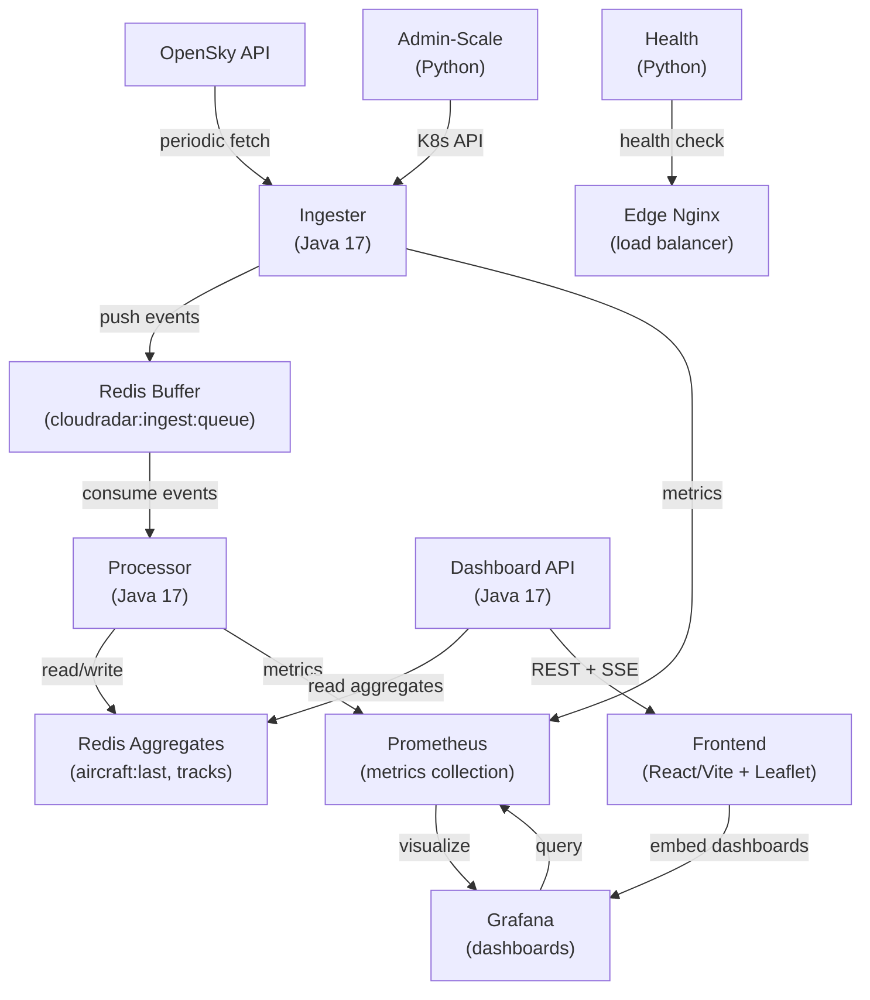
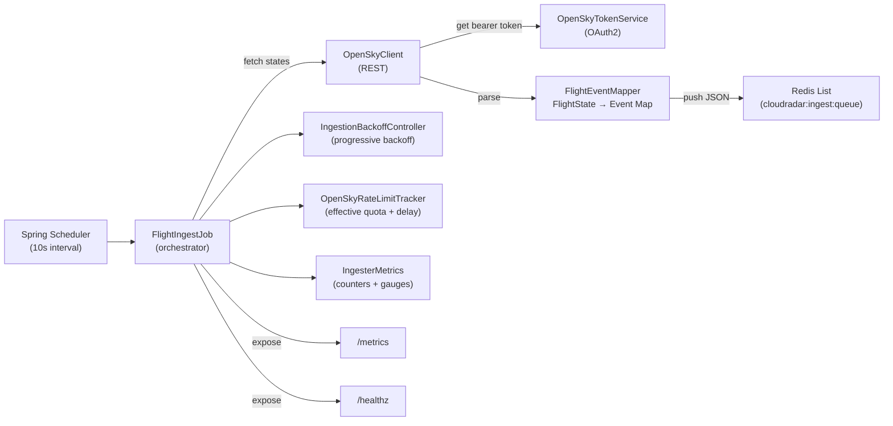
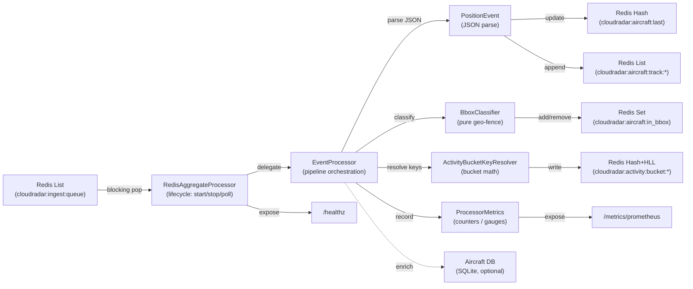
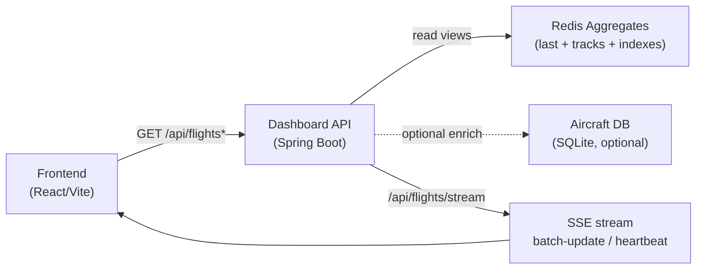
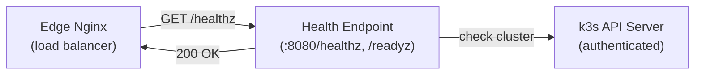
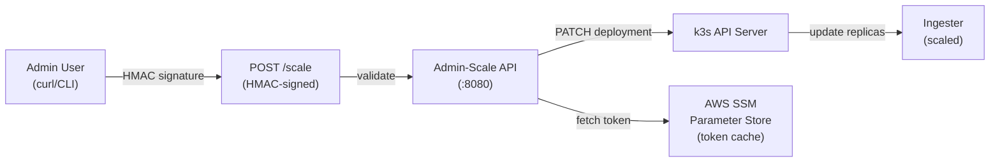
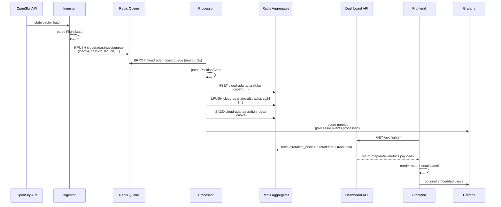

# CloudRadar Application Architecture

**Last updated**: 2026-03-12

This document describes the architecture and design of all microservices in the CloudRadar platform. Each service is containerized and deployed to k3s via ArgoCD.

## Overview

CloudRadar consists of six implemented application services:

1. **Ingester** (Java 17) — Fetches flight data from OpenSky API and publishes to Redis
2. **Processor** (Java 17) — Consumes Redis events and builds in-memory aggregates
3. **Dashboard API** (Java 17) — Read-only API for map payload, detail payload, metrics, and SSE refresh events
4. **Frontend** (React/Vite + Leaflet) — Interactive map and flight detail UI
5. **Health** (Python) — Health check endpoint for load balancer / edge ingress
6. **Admin-Scale** (Python) — Administrative API for scaling the ingester deployment


```mermaid
graph TB
    OpenSky["OpenSky API"]
    Ingester["Ingester<br/>(Java 17)"]
    Redis["Redis Buffer<br/>(cloudradar:ingest:queue)"]
    Processor["Processor<br/>(Java 17)"]
    RedisAgg["Redis Aggregates<br/>(aircraft:last, tracks)"]
    Health["Health<br/>(Python)"]
    AdminScale["Admin-Scale<br/>(Python)"]
    Edge["Edge Nginx<br/>(load balancer)"]
    DashboardAPI["Dashboard API<br/>(Java 17)"]
    Frontend["Frontend<br/>(React/Vite + Leaflet)"]
    Prometheus["Prometheus<br/>(metrics collection)"]
    Grafana["Grafana<br/>(dashboards)"]

    OpenSky -->|periodic fetch| Ingester
    Ingester -->|push events| Redis
    Redis -->|consume events| Processor
    Processor -->|read/write| RedisAgg
    Health -->|health check| Edge
    AdminScale -->|K8s API| Ingester
    Ingester -->|metrics| Prometheus
    Processor -->|metrics| Prometheus
    Prometheus -->|visualize| Grafana
    DashboardAPI -->|read aggregates| RedisAgg
    DashboardAPI -->|REST + SSE| Frontend
    Frontend -->|embed dashboards| Grafana
    Grafana -->|query| Prometheus
```

### Observability Access Path
- **Edge Nginx (EC2)** is the only public entrypoint and applies Basic Auth. It forwards to K3s nodeports/Ingress.
- **In-cluster**: Traefik (k3s default) routes HTTP to services (Grafana, Prometheus). No additional in-cluster proxy.
- **Security**: Secrets for Basic Auth are stored in SSM (surfaced via ESO where needed). Remove duplicate proxies to reduce attack surface.

---

## 1. Ingester (Java 17 / Spring Boot)

### Purpose
Fetches live flight states from OpenSky API every 10 seconds and publishes each flight as a JSON event to Redis. Acts as the ingestion entry point for the CloudRadar pipeline.

### Technology Stack
- **Language**: Java 17
- **Framework**: Spring Boot 3.x
- **Scheduler**: Spring `@Scheduled`
- **HTTP Client**: Java `HttpClient` (`java.net.http`)
- **Authentication**: OAuth2 (OpenSky credentials via SSM Parameter Store)
- **Message Queue**: Redis List

### Architecture


```mermaid
flowchart LR
    Scheduler["Spring Scheduler<br/>(10s interval)"] --> Job["FlightIngestJob<br/>(orchestrator)"]
    OpenSkyClient["OpenSkyClient<br/>(REST)"]
    TokenService["OpenSkyTokenService<br/>(OAuth2)"]
    Mapping["FlightEventMapper<br/>FlightState → Event Map"]
    Backoff["IngestionBackoffController<br/>(progressive backoff)"]
    RateLimit["OpenSkyRateLimitTracker<br/>(effective quota + delay)"]
    MetricsHelper["IngesterMetrics<br/>(counters + gauges)"]
    Redis["Redis List<br/>(cloudradar:ingest:queue)"]
    
    Job -->|fetch states| OpenSkyClient
    OpenSkyClient -->|get bearer token| TokenService
    OpenSkyClient -->|parse| Mapping
    Job --> Backoff
    Job --> RateLimit
    Job --> MetricsHelper
    Mapping -->|push JSON| Redis
    Job -->|expose| Metrics["/metrics"]
    Job -->|expose| Health["/healthz"]
```

### Code Organization

```
src/ingester/
├── src/main/java/com/cloudradar/ingester/
│   ├── IngesterApplication.java                # Spring Boot entrypoint, scheduling enabled
│   ├── FlightIngestJob.java                    # Scheduled orchestrator (fetch/map/publish)
│   ├── FlightEventMapper.java                  # FlightState -> Redis payload mapper
│   ├── IngestionBackoffController.java         # Progressive backoff + disable policy
│   ├── OpenSkyRateLimitTracker.java            # Effective quota and delay adaptation
│   ├── OpenSkyRateLimitMetricCalculator.java   # Table-driven rate-limit metric helpers
│   ├── IngesterMetrics.java                    # Ingestion/OpenSky gauges + counters
│   ├── config/
│   │   ├── AppConfig.java                      # Shared beans (HttpClient)
│   │   ├── IngesterProperties.java             # Refresh interval, Redis key, bbox
│   │   ├── OpenSkyProperties.java              # OpenSky routing + token settings
│   │   └── AwsProperties.java                  # AWS region/SSM parameter names
│   ├── opensky/
│   │   ├── OpenSkyClient.java                  # /states/all request/response orchestration
│   │   ├── OpenSkyTokenService.java            # OAuth token cache + cooldown
│   │   ├── OpenSkyResponseParser.java          # JSON payload + headers parsing
│   │   ├── OpenSkyBboxResolver.java            # Effective bbox resolution
│   │   ├── OpenSkyStatesHttpMetrics.java       # States-call HTTP metrics
│   │   ├── OpenSkyTokenHttpMetrics.java        # Token-call HTTP metrics
│   │   ├── TokenCooldownPolicy.java            # Token failure cooldown state machine
│   │   ├── OpenSkyEndpointProvider.java        # Routing mode endpoint selection
│   │   ├── OpenSkyRateLimitHeaders.java        # Parsed rate-limit header record
│   │   ├── FetchResult.java                    # Stable fetch contract
│   │   └── FlightState.java                    # OpenSky state DTO
│   └── redis/
│       └── RedisPublisher.java                 # Serializes events and pushes to Redis List
```

### Flow

1. `FlightIngestJob` runs every 10 seconds (configurable via `INGESTER_REFRESH_MS`) and orchestrates a full ingestion cycle.
2. `OpenSkyClient` requests `/states/all` for the effective bounding box and uses an OAuth2 bearer token from `OpenSkyTokenService`.
3. `OpenSkyRateLimitTracker` updates effective quota/remaining headers and computes the next refresh delay tier.
4. `FlightEventMapper` converts `FlightState` objects into Redis-ready JSON maps:
   ```json
   {
     "icao24": "abc123",
     "callsign": "AFR123",
     "latitude": 48.5,
     "longitude": 2.5,
     "barometric_altitude": 2000,
     "true_track": 45.5,
     "velocity": 200.5,
     "vertical_rate": 5.0,
     "time_position": 1704067200,
     "last_contact": 1704067200
   }
   ```
5. `RedisPublisher` pushes payloads to `cloudradar:ingest:queue` (Redis List).
6. `IngesterMetrics` updates counters/gauges while `IngestionBackoffController` handles failure backoff and disable-after-threshold behavior.

### Error Handling

Progressive backoff on OpenSky connectivity issues:
```
1s → 2s → 5s → 10s → 30s → 60s → 5m → 10m → 30m → 1h → stop
```

After the final backoff, ingestion is disabled until pod restart.

Token refresh has an additional local cooldown guard in `OpenSkyTokenService`:
```
15s → 30s → 60s → 120s → 300s → 600s
```

Details:
- Cooldown applies only to token refresh attempts after consecutive token failures.
- Successful token refresh resets the token failure counter and cooldown window.
- Token refresh failures are propagated to `FlightIngestJob` so ingestion-level backoff is applied consistently.

### Configuration (Environment Variables)

| Variable | Default | Purpose |
|----------|---------|---------|
| `INGESTER_REFRESH_MS` | 10000 | Scheduler interval in milliseconds |
| `INGESTER_REDIS_KEY` | `cloudradar:ingest:queue` | Redis List key for events |
| `OPENSKY_LAT_MIN`, `_MAX`, `_LON_MIN`, `_MAX` | IDF bbox | Bounding box for queries |
| `OPENSKY_BASE_URL` | OpenSky default | API base URL (or SSM reference) |
| `OPENSKY_CLIENT_ID`, `_SECRET` | — | OAuth2 credentials (SSM Parameter Store) |
| `REDIS_HOST`, `REDIS_PORT` | `redis.data.svc`, 6379 | Redis connection |

### Metrics Exposed

- `ingester.fetch.total` — Total states fetched
- `ingester.fetch.requests.total` — Total ingestion fetch cycles
- `ingester.push.total` — Total events pushed to Redis
- `ingester.errors.total` — Total failed ingestion cycles
- `ingester.opensky.backoff.seconds` — Current OpenSky failure backoff duration in seconds
- `ingester.opensky.disabled` — Ingester disabled flag (1 = disabled after repeated failures)

---

## 2. Processor (Java 17 / Spring Boot)

### Purpose
Consumes events from the Redis queue (ingester output) and maintains real-time aggregates for aircraft positions, tracks, and bbox membership. Serves as the stateful aggregation layer.

### Technology Stack
- **Language**: Java 17
- **Framework**: Spring Boot 3.x
- **Event Loop**: Blocking Redis pop with timeout (`RPUSH` producer + blocking `rightPop` consumer)
- **Redis Client**: Lettuce (Spring Data Redis)
- **Metrics**: Micrometer (Prometheus format)

### Architecture


```mermaid
flowchart LR
    Queue["Redis List<br/>(cloudradar:ingest:queue)"]
    RAP["RedisAggregateProcessor<br/>(lifecycle: start/stop/poll)"]
    EP["EventProcessor<br/>(pipeline orchestration)"]
    Parse["PositionEvent<br/>(JSON parse)"]
    BBox["BboxClassifier<br/>(pure geo-fence)"]
    Bucket["ActivityBucketKeyResolver<br/>(bucket math)"]
    Metrics["ProcessorMetrics<br/>(counters / gauges)"]
    Last["Redis Hash<br/>(cloudradar:aircraft:last)"]
    Track["Redis List<br/>(cloudradar:aircraft:track:*)"]
    BboxSet["Redis Set<br/>(cloudradar:aircraft:in_bbox)"]
    Activity["Redis Hash+HLL<br/>(cloudradar:activity:bucket:*)"]
    AircraftDB["Aircraft DB<br/>(SQLite, optional)"]
    
    Queue -->|blocking pop| RAP
    RAP -->|delegate| EP
    EP -->|parse JSON| Parse
    EP -->|classify| BBox
    EP -->|resolve keys| Bucket
    EP -->|record| Metrics
    EP -.->|enrich| AircraftDB
    Parse -->|update| Last
    Parse -->|append| Track
    BBox -->|add/remove| BboxSet
    Bucket -->|write| Activity
    Metrics -->|expose| PromEndpoint["/metrics/prometheus"]
    RAP -->|expose| Health["/healthz"]
```

### Code Organization

```
src/processor/
├── ProcessorApplication.java              # Spring Boot entrypoint
├── aircraft/
│   ├── AircraftDbConfig.java              # SQLite DataSource bean (optional)
│   ├── AircraftMetadata.java              # Immutable metadata record
│   ├── AircraftMetadataRepository.java    # Lookup interface
│   └── SqliteAircraftMetadataRepository.java # LRU-cached SQLite lookups
├── config/
│   └── ProcessorProperties.java           # Configuration: bbox, Redis keys, poll timeout
└── service/
    ├── RedisAggregateProcessor.java       # Lifecycle only: start/stop/poll loop (~100 lines)
    ├── EventProcessor.java                # Pipeline orchestration: parse → validate → write → enrich
    ├── BboxClassifier.java                # Pure domain: geo-fence classification (INSIDE/OUTSIDE/UNKNOWN)
    ├── ActivityBucketKeyResolver.java     # Pure domain: bucket epoch math and key generation
    ├── ProcessorMetrics.java              # Observability: all counters/gauges management
    └── PositionEvent.java                 # DTO for parsed OpenSky events
```

### Flow

1. `RedisAggregateProcessor` blocks on `cloudradar:ingest:queue` with a 2-second timeout
2. Each popped event is parsed into a `PositionEvent` (JSON deserialization)
3. Aggregates are updated atomically:
   - **Last position hash** (`cloudradar:aircraft:last`):
     ```
     HSET cloudradar:aircraft:last abc123 '{"callsign":"AFR123","lat":48.5,...}'
     ```
   - **Track list per aircraft** (`cloudradar:aircraft:track:<icao24>`):
     ```
     LPUSH cloudradar:aircraft:track:abc123 '{"lat":48.5,"lon":2.5,"ts":1704067200}'
     LTRIM cloudradar:aircraft:track:abc123 0 179  # keep last 180 positions
     ```
   - **Bbox membership set** (`cloudradar:aircraft:in_bbox`):
     ```
     SADD cloudradar:aircraft:in_bbox abc123      # if in bbox
     SREM cloudradar:aircraft:in_bbox abc123      # if left bbox
     ```
4. Metrics (`/metrics/prometheus`) and health (`/healthz`) exposed via Actuator

### Aggregates (Redis Schema)

| Structure | Key Pattern | Purpose | TTL |
|-----------|-------------|---------|-----|
| Hash | `cloudradar:aircraft:last` | Latest position of each aircraft | None (manual cleanup) |
| List | `cloudradar:aircraft:track:icao24` | Position history (180 entries) | None (LTRIM 0 179) |
| Set | `cloudradar:aircraft:in_bbox` | ICAO24s currently in bbox | None (manual cleanup) |
| String (JSON) | `cloudradar:photo:v1:icao24:<icao24>` | Cached aircraft photo metadata for detail panel | Yes (TTL, default 7d) |
| String (counter) | `cloudradar:photo:v1:ratelimit:sec:<epochSecond>` | Distributed Planespotters limiter counter (global 2 rps default) | Yes (2s) |

### Configuration (Environment Variables)

| Variable | Default | Purpose |
|----------|---------|---------|
| `PROCESSOR_POLL_TIMEOUT_SECONDS` | 2 | Redis blocking pop timeout |
| `PROCESSOR_TRACK_LENGTH` | 180 | Max positions per aircraft track |
| `PROCESSOR_REDIS_INPUT_KEY` | `cloudradar:ingest:queue` | Input Redis List |
| `PROCESSOR_LAST_POSITIONS_KEY` | `cloudradar:aircraft:last` | Last positions hash |
| `PROCESSOR_TRACK_KEY_PREFIX` | `cloudradar:aircraft:track:` | Track list prefix |
| `PROCESSOR_BBOX_SET_KEY` | `cloudradar:aircraft:in_bbox` | Bbox membership set |
| `PROCESSOR_LAT_MIN`, `_MAX`, `_LON_MIN`, `_MAX` | IDF bbox | Bounding box for membership |
| `REDIS_HOST`, `REDIS_PORT` | `redis.data.svc`, 6379 | Redis connection |

### Metrics Exposed

| Metric | Type | Purpose |
|--------|------|---------|
| `processor.events.processed` | Counter | Total events consumed from Redis |
| `processor.events.errors` | Counter | Total parsing/processing errors |
| `processor.bbox.count` | Gauge | Current count of aircraft in bbox |
| `processor.last_processed_epoch` | Gauge | Unix timestamp of last processed event |
| `processor.queue.depth` | Gauge | Current Redis queue depth |
| `processor.aircraft_db.enabled` | Gauge | Whether aircraft metadata DB is enabled (0/1) |
| `processor.aircraft.category.events` | Counter | Events per aircraft category (tag: `category`) |
| `processor.aircraft.country.events` | Counter | Events per country (tag: `country`) |
| `processor.aircraft.military.events` | Counter | Events by military status (tag: `military`) |
| `processor.aircraft.military.typecode.events` | Counter | Military events by typecode (tag: `typecode`) |
| `processor.aircraft.enrichment.events` | Counter | Enrichment field coverage (tags: `field`, `status`) |

---

## 3. Dashboard API (Java 17 / Spring Boot)

### Purpose
Provides read-only endpoints consumed by the frontend:
- map payload (`/api/flights`)
- per-aircraft details (`/api/flights/{icao24}`)
- KPI/summary payload (`/api/flights/metrics`)
- SSE refresh stream (`/api/flights/stream`)

### Technology Stack
- **Language**: Java 17
- **Framework**: Spring Boot 3.x
- **Data Source**: Redis aggregates (required), aircraft SQLite metadata (optional)
- **Streaming**: Server-Sent Events (SSE)
- **Security**: Read-only API surface + in-memory rate limiting

### Core Endpoints

| Endpoint | Method | Purpose |
|----------|--------|---------|
| `/api/flights` | GET | Returns map list payload with filters/sort/limit |
| `/api/flights/{icao24}` | GET | Returns enriched flight detail payload |
| `/api/flights/metrics` | GET | Returns KPI aggregates for dashboard cards/charts |
| `/api/flights/stream` | GET | SSE events: `connected`, `batch-update`, `heartbeat` |

### Architecture


```mermaid
flowchart LR
    FE["Frontend<br/>(React/Vite)"]
    API["Dashboard API<br/>(Spring Boot)"]
    REDIS["Redis Aggregates<br/>(last + tracks + indexes)"]
    AIRDB["Aircraft DB<br/>(SQLite, optional)"]
    SSE["SSE stream<br/>batch-update / heartbeat"]

    FE -->|GET /api/flights*| API
    API -->|read views| REDIS
    API -.->|optional enrich| AIRDB
    API -->|/api/flights/stream| SSE
    SSE --> FE
```

### Code Organization

```
src/dashboard/
├── DashboardApplication.java
├── api/
│   ├── DashboardController.java
│   └── ApiExceptionHandler.java
├── service/
│   ├── FlightQueryService.java
│   ├── FlightUpdateStreamService.java
│   └── PlanespottersPhotoService.java
└── aircraft/
    ├── AircraftMetadataRepository.java
    └── SqliteAircraftMetadataRepository.java
```

---

## 4. Health (Python)

### Purpose
Lightweight health check endpoint for the edge load balancer and general cluster health validation. Queries the k3s API server to ensure cluster connectivity.

### Technology Stack
- **Language**: Python 3.11
- **HTTP Server**: Python `http.server`
- **K8s Interaction**: Direct HTTPS + Service Account Token

### Architecture


```mermaid
flowchart LR
    Client["Edge Nginx<br/>(load balancer)"]
    HealthApp["Health Endpoint<br/>(:8080/healthz, /readyz)"]
    K8sAPI["k3s API Server<br/>(authenticated)"]
    
    Client -->|GET /healthz| HealthApp
    HealthApp -->|check cluster| K8sAPI
    HealthApp -->|200 OK| Client
```

### Endpoints

| Endpoint | Method | Response | Purpose |
|----------|--------|----------|---------|
| `/readyz` | GET | 200 OK | Process readiness for probes |
| `/healthz` | GET | 200 OK (if cluster healthy) | Cluster health status |

### Configuration (Environment Variables)

| Variable | Default | Purpose |
|----------|---------|---------|
| `PORT` | 8080 | HTTP server listen port |

### Code Organization

```
src/health/
└── app.py
    ├── _load_token()               # Reads k3s service account token
    ├── _k8s_api_check()            # Queries k3s API server
    └── HealthHandler              # HTTP request handler
```

---

## 5. Admin-Scale (Python)

### Purpose
Administrative API for scaling the ingester deployment replicas. Accepts HMAC-signed POST requests to scale from 0 to 2 replicas (configurable).

### Technology Stack
- **Language**: Python 3.11
- **HTTP Server**: Python `http.server`
- **K8s Interaction**: Direct HTTPS + Service Account Token
- **Authentication**: HMAC-SHA256 signatures
- **AWS**: Boto3 (SSM Parameter Store for token caching)

### Architecture


```mermaid
flowchart LR
    Admin["Admin User<br/>(curl/CLI)"]
    Request["POST /scale<br/>(HMAC-signed)"]
    AdminApp["Admin-Scale API<br/>(:8080)"]
    K8sAPI["k3s API Server"]
    SSM["AWS SSM<br/>Parameter Store<br/>(token cache)"]
    
    Admin -->|HMAC signature| Request
    Request -->|validate| AdminApp
    AdminApp -->|fetch token| SSM
    AdminApp -->|PATCH deployment| K8sAPI
    K8sAPI -->|update replicas| Ingester["Ingester<br/>(scaled)"]
```

### Endpoints

| Endpoint | Method | Body | Auth | Purpose |
|----------|--------|------|------|---------|
| `/scale` | POST | `{"replicas": 1}` | HMAC-SHA256 | Scale ingester replicas |
| `/health` | GET | — | None | Health check |

### Configuration (Environment Variables)

| Variable | Default | Purpose |
|----------|---------|---------|
| `PORT` | 8080 | HTTP server listen port |
| `TARGET_NAMESPACE` | `cloudradar` | k3s namespace for ingester |
| `TARGET_DEPLOYMENT` | `ingester` | k3s deployment name |
| `ADMIN_TOKEN_SSM_NAME` | `/cloudradar/admin/k8s-admin-api-token` | SSM parameter for k3s token |
| `AWS_REGION` | `us-east-1` | AWS region |
| `ADMIN_TOKEN_CACHE_SECONDS` | 300 | Token cache TTL |
| `ALLOWED_REPLICAS` | `0,1,2` | Comma-separated allowed replica counts |

### Signature Validation

Requests are signed with HMAC-SHA256. Header format:
```
Authorization: hmac-sha256=<hex_digest>
```

The secret is fetched from AWS SSM Parameter Store and cached locally.

### Code Organization

```
src/admin-scale/
└── app.py
    ├── _load_token()                  # Reads k3s service account token
    ├── _fetch_admin_token()           # Fetches HMAC secret from SSM (cached)
    ├── _k8s_patch_json()              # Executes PATCH on k3s deployment
    ├── _verify_hmac()                 # Validates request signature
    ├── _allowed_replicas()            # Parses allowed replica list
    └── ScaleHandler                   # HTTP request handler (POST /scale)
```

---

## 6. Frontend Dashboard (React / Vite)

### Status: Implemented (MVP)
Frontend is deployed on k3s via ArgoCD (`k8s/apps/frontend`) and served through edge Nginx/Traefik.

### Purpose
Render live aircraft traffic on an interactive map, show per-flight details, and consume backend SSE events for refresh orchestration.

### Technology Stack
- **Language**: TypeScript / React 18
- **Build Tool**: Vite
- **Map**: Leaflet
- **Runtime**: Nginx (containerized static frontend)
- **Data/API**: Dashboard API (`/api/flights*` + `/api/flights/stream`)

### Architecture

```mermaid
graph TB
    Frontend["Frontend<br/>(React/Vite + Leaflet)"]
    Api["Dashboard API<br/>(Spring Boot)"]
    Sse["SSE stream<br/>batch-update / heartbeat"]
    Grafana["Grafana Embed<br/>(optional observability views)"]

    Frontend -->|GET /api/flights, /api/flights/{icao24}, /api/flights/metrics| Api
    Frontend -->|EventSource /api/flights/stream| Sse
    Frontend -->|optional embeds| Grafana
```

### Implemented MVP Features

- Real-time aircraft markers and movement interpolation
- Aircraft detail panel on marker click
- SSE-driven refresh with polling watchdog fallback
- UI health/status chips for dashboard API and ingestion signals
- Flight density / defense activity / fleet breakdown cards

### Current Scope Boundaries

- Zone/alert business workflows are tracked separately and not finalized in this frontend scope (`#128`, `#424`).

---

## Data Flow Diagram

End-to-end flow of a flight event through the pipeline:


```mermaid
sequenceDiagram
    participant OpenSky as OpenSky API
    participant Ingester
    participant Redis as Redis Queue
    participant Processor
    participant RedisAgg as Redis Aggregates
    participant DashboardAPI as Dashboard API
    participant Frontend
    participant Grafana

    OpenSky->>Ingester: state vector batch
    Ingester->>Ingester: parse FlightState
    Ingester->>Redis: RPUSH cloudradar:ingest:queue<br/>{icao24, callsign, lat, lon, ...}
    
    Processor->>Redis: BRPOP cloudradar:ingest:queue (timeout 2s)
    Processor->>Processor: parse PositionEvent
    Processor->>RedisAgg: HSET cloudradar:aircraft:last<br/>icao24 {...}
    Processor->>RedisAgg: LPUSH cloudradar:aircraft:track:icao24<br/>{...}
    Processor->>RedisAgg: SADD cloudradar:aircraft:in_bbox<br/>icao24
    Processor->>Grafana: record metrics<br/>(processor.events.processed)
    
    Frontend->>DashboardAPI: GET /api/flights*
    DashboardAPI->>RedisAgg: fetch aircraft:in_bbox + aircraft:last + track data
    DashboardAPI-->>Frontend: return map/detail/metrics payloads
    Frontend->>Frontend: render map + detail panel
    Frontend->>Grafana: optional embedded views
```

---

## Deployment (Kubernetes)

All services are deployed via ArgoCD Applications in `k8s/apps/`:

Reference for GitOps object semantics (Application CR vs runtime workloads) and the canonical mapping table:  
[`k8s/README.md#argocd-applications-vs-kubernetes-workloads`](../../k8s/README.md#argocd-applications-vs-kubernetes-workloads)

```
k8s/apps/
├── ingester/
│   └── kustomization.yaml         # Ingester app + config
├── processor/
│   └── kustomization.yaml         # Processor app + config
├── dashboard/
│   └── kustomization.yaml         # Dashboard API service
├── frontend/
│   └── kustomization.yaml         # React/Leaflet frontend
├── health/
│   └── kustomization.yaml         # Health endpoint
├── admin-scale/
│   └── kustomization.yaml         # Admin-Scale API
├── redis/
│   └── kustomization.yaml         # Redis StatefulSet + exporter
└── monitoring/
    └── (Prometheus + Grafana)     # Observability stack
```

Namespace placement:
- `cloudradar`: ingester, processor, dashboard API, frontend, health, admin-scale
- `data`: redis stateful workloads
- `monitoring`: prometheus/grafana and monitoring CRs

Operational conventions:
- backend services expose `/healthz`; health also exposes `/readyz`
- Java services expose `/metrics/prometheus` for scraping
- workloads include defined resource requests/limits (MVP baseline)

---

## Testing & Validation

### Local Development

**Ingester**:
```bash
cd src/ingester
export OPENSKY_CLIENT_ID="..."
export OPENSKY_CLIENT_SECRET="..."
export REDIS_HOST=localhost
mvn -q spring-boot:run
```

**Processor**:
```bash
cd src/processor
export REDIS_HOST=localhost
mvn -q spring-boot:run
```

**Dashboard API**:
```bash
cd src/dashboard
export REDIS_HOST=localhost
mvn -q spring-boot:run
```

**Frontend**:
```bash
cd src/frontend
npm ci
npm run dev
```

**Health**:
```bash
cd src/health
python3 app.py
curl http://localhost:8080/healthz
```

**Admin-Scale**:
```bash
cd src/admin-scale
export ADMIN_TOKEN_SSM_NAME="/cloudradar/admin/k8s-admin-api-token"
python3 app.py
```

### Production Validation

1. **Dashboard API health**: `kubectl -n cloudradar get deploy dashboard`
2. **Frontend health**: `kubectl -n cloudradar get deploy frontend`
3. **Health endpoint**: `kubectl -n cloudradar get deploy healthz`
4. **Redis aggregates**: `redis-cli -n 0 HGETALL cloudradar:aircraft:last`

---

## Future Work

- **Frontend v1.1 polish**: UX refinements, richer aircraft details, and map interaction improvements
- **Persistence** (#165): SQLite for event history
- **Alerting** (MVP implemented): Alertmanager baseline rules for platform/pipeline anomalies
- **Loki** (v2): Log aggregation and analysis
- **API** (v2): REST/GraphQL interface to aggregates
