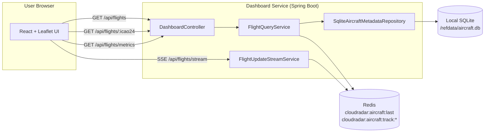
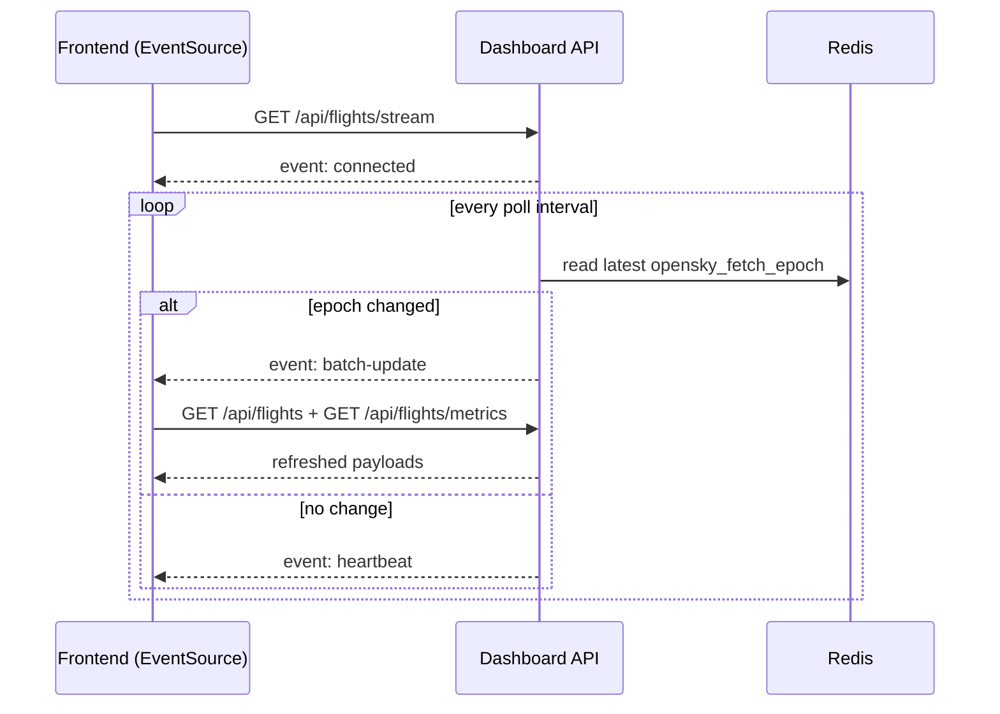

# Frontend Dashboard Technical Architecture

Technical internals for the CloudRadar dashboard path:

- Frontend app (`src/frontend`) rendering map, markers, tracks, KPIs.
- Dashboard API (`src/dashboard`) serving read-model endpoints from Redis + optional SQLite enrichment.

## 1. Runtime Topology

## 2. Main Components

- `DashboardController`
  - HTTP routes under `/api/flights`.
- `FlightQueryService`
  - map/detail/metrics query orchestration.
- `FlightUpdateStreamService`
  - SSE emitter management and batch-change detection.
- `SqliteAircraftMetadataRepository` (optional bean)
  - on-read metadata lookup with in-process LRU cache.

## 3. Data Sources

Redis keys:

- `cloudradar:aircraft:last` (Hash): latest telemetry payload per `icao24`.
- `cloudradar:aircraft:track:<icao24>` (List): bounded recent trajectory points.

Telemetry payload includes `opensky_fetch_epoch`, used as batch boundary.

## 4. Map Endpoint Internals (`GET /api/flights`)

Goal: stable map snapshot with low-latency reads.

Why latest + short fallback window:

- latest batch stays the primary source of truth,
- fallback to the previous two batches reduces flicker when OpenSky temporarily omits ICAO,
- no long historical blending.

## 5. Detail Endpoint Internals (`GET /api/flights/{icao24}`)

1. Read current aircraft payload from `cloudradar:aircraft:last`.
2. Optionally load track list from `cloudradar:aircraft:track:<icao24>`.
3. Optionally enrich with SQLite metadata.
4. Return merged DTO.

Track rendering note (frontend): large timestamp gaps should split the polyline into multiple segments to avoid fake straight lines across unrelated itineraries.

## 6. Metrics Endpoint Internals (`GET /api/flights/metrics`)

1. Reuse snapshot loading logic.
2. Aggregate active aircraft, density, military share, fleet/type/size mix, and activity series.
3. Return low-cardinality payload for KPI cards and compact charts.

## 7. Push Refresh Model (`GET /api/flights/stream`)

`FlightUpdateStreamService` maintains active `SseEmitter` clients.

Frontend keeps a low-frequency polling fallback if SSE disconnects.

## 8. Validation and Safety

- strict query parsing (`BadRequestException`) for malformed params,
- `NotFoundException` for unknown `icao24`,
- in-memory rate limiting on `/api/**`,
- read-only API surface (`GET` only).

## 9. Performance Notes

- Redis hash scan is O(n) on active aircraft count.
- SQLite lookups are local and cached to reduce repeated I/O.
- DTO payloads are intentionally compact for frequent refresh cycles.
- SSE avoids blind high-frequency polling.

## 10. Known Limits

- SSE stream is process-local (single instance friendly; multi-instance needs sticky sessions or pub/sub coordination for strict ordering).
- Snapshot consistency depends on processor update timeliness.
- Continuity window is intentionally limited to latest + two previous OpenSky batches.

## 11. Related References

- API contract: `docs/api/dashboard-api.md`
- Service README: `src/dashboard/README.md`
- Metadata ADR: `docs/architecture/decisions/ADR-0019-2026-02-10-aircraft-metadata-enrichment-for-ui.md`
