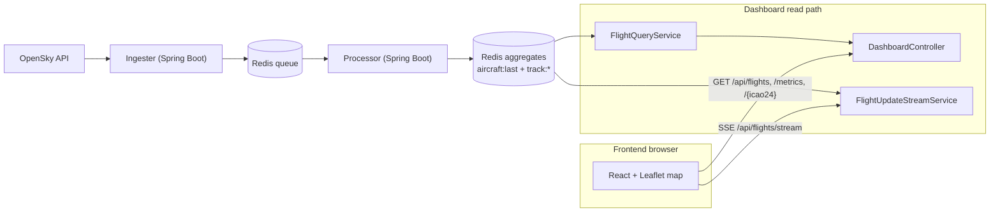
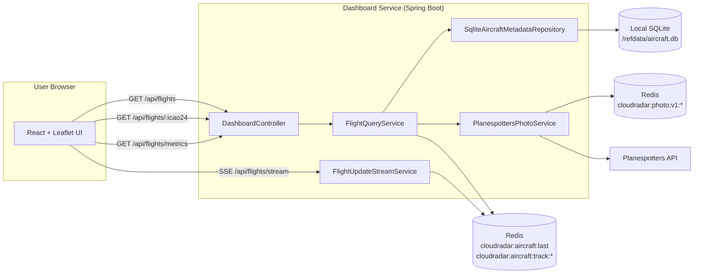
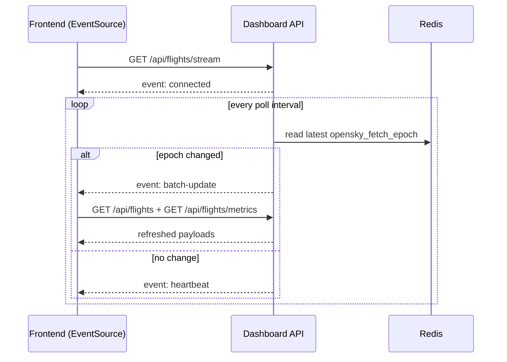

# Frontend Dashboard Technical Architecture

Technical internals for the CloudRadar dashboard path:

- Frontend app (`src/frontend`) rendering map, markers, tracks, KPIs.
- Dashboard API (`src/dashboard`) serving read-model endpoints from Redis + optional SQLite enrichment.

## 0. End-to-End Global View

This diagram shows the end-to-end view: ingestion feeds Redis through `ingester -> processor`, then the dashboard exposes an HTTP/SSE read path consumed by the frontend.
The browser never reads Redis directly; all reads go through dashboard service endpoints.

## 1. Runtime Topology

This flow describes the dashboard runtime topology: `DashboardController` centralizes REST routes, `FlightQueryService` reads the Redis snapshot, and `FlightUpdateStreamService` monitors batch changes for SSE.
SQLite enrichment stays optional and does not impact the minimal map/refresh path.
Photo lookup is also optional and resilient: dashboard reads photo metadata from Redis cache first, then calls Planespotters only on cache miss.

## 2. Main Components

- `DashboardController`
  - HTTP routes under `/api/flights`.
- `FlightQueryService`
  - map/detail/metrics query orchestration.
- `FlightUpdateStreamService`
  - SSE emitter management and batch-change detection.
- `SqliteAircraftMetadataRepository` (optional bean)
  - on-read metadata lookup with in-process LRU cache.

## 3. Data Sources

Redis keys:

- `cloudradar:aircraft:last` (Hash): latest telemetry payload per `icao24`.
- `cloudradar:aircraft:track:<icao24>` (List): bounded recent trajectory points.
- `cloudradar:activity:bucket:<epochMinute>` (Hash): processed event counters (`events_total`, `events_military`) used for KPI activity trends.
- `cloudradar:activity:bucket:<epochMinute>:aircraft_hll` (HLL): unique aircraft per bucket.
- `cloudradar:activity:bucket:<epochMinute>:aircraft_military_hll` (HLL): unique military aircraft per bucket.
- `cloudradar:photo:v1:icao24:<icao24>` (String/JSON): cached Planespotters photo metadata for detail panel.
- `cloudradar:photo:v1:ratelimit:sec:<epochSecond>` (String/increment): distributed global limiter counter (2 rps default).

Telemetry payload includes `opensky_fetch_epoch`, used as batch boundary for map refresh.
KPI activity trends are built from bucketed processor writes (events + unique aircraft), not from snapshot distribution in `aircraft:last`.

## 4. Map Endpoint Internals (`GET /api/flights`)

Goal: stable map snapshot with low-latency reads.

The map flow builds a frontend-friendly snapshot: ICAO normalization, continuity across recent batches, then enrichment/filtering before response.
The goal is to reduce flicker while keeping responses lightweight and deterministic.

Why latest + short fallback window:

- latest batch stays the primary source of truth,
- fallback to the previous two batches reduces flicker when OpenSky temporarily omits ICAO,
- no long historical blending.

## 5. Detail Endpoint Internals (`GET /api/flights/{icao24}`)

1. Read current aircraft payload from `cloudradar:aircraft:last`.
2. Optionally load track list from `cloudradar:aircraft:track:<icao24>`.
3. Optionally enrich with SQLite metadata.
4. Resolve photo metadata through `PlanespottersPhotoService`:
   - cache hit: return cached metadata immediately,
   - cache miss: call Planespotters by hex, fallback by registration, cache result.
5. Return merged DTO.

Track rendering note (frontend): large timestamp gaps should split the polyline into multiple segments to avoid fake straight lines across unrelated itineraries.
Frontend displays thumbnail directly in detail panel and opens large image only on explicit click.

## 6. Metrics Endpoint Internals (`GET /api/flights/metrics`)

1. Reuse snapshot loading logic.
2. Aggregate active aircraft, density, military share, fleet/type/size mix, and activity series.
3. Return low-cardinality payload for KPI cards and compact charts.

Metrics activity series includes both throughput dimensions: event counts and unique-aircraft counts per bucket.
Frontend trend cards display unique-aircraft throughput and can visually fill `hasData=false` gaps with a window average to keep charts readable during transient ingest holes.

## 7. Push Refresh Model (`GET /api/flights/stream`)

`FlightUpdateStreamService` maintains active `SseEmitter` clients.

This diagram shows the batch-driven refresh loop: a `batch-update` event triggers a map/metrics pull on the frontend side.
If no batch changes, the SSE connection stays alive (heartbeat) without forcing a heavy refresh cycle.

Frontend keeps a low-frequency polling watchdog fallback and reschedules it when relevant SSE events trigger a refresh.
On each batch update, marker positions are interpolated from `N-1` to `N` over the measured batch interval to avoid teleport effects.
Detail requests (`GET /api/flights/{icao24}`) are handled asynchronously and must not block the global refresh loop.
Ingester toggles use a write-then-read reconciliation pattern: `POST /admin/ingester/scale` followed by short `GET /admin/ingester/scale` polling until target replicas converge.

## 8. Frontend Rendering Invariants (Map UX)

- Static/grayed markers are computed only when `latestOpenSkyBatchEpoch` changes.
- `staticByIcao` compares aircraft movement between consecutive batches using `STATIC_POSITION_THRESHOLD_KM`.
- Static state context is reset when the active bbox changes.
- Same-batch refreshes do not cancel an in-progress marker interpolation.
- Selected flight details are refreshed on batch change, but detail fetch remains non-blocking.
- Ingester toggle state is optimistic in UI and reconciled against observed scale state before leaving loading mode.

## 9. Validation and Safety

- strict query parsing (`BadRequestException`) for malformed params,
- `NotFoundException` for unknown `icao24`,
- in-memory rate limiting on `/api/**`,
- read-only API surface (`GET` only).

## 10. Marker Typing Semantics (Backend-Driven)

Map marker visuals are derived from backend typing fields in `FlightMapItem`:
- `airframeType` (`airplane|helicopter|unknown`)
- `fleetType` (`commercial|military|rescue|private|unknown`)
- `aircraftSize` (`small|medium|large|heavy|unknown`)

The frontend does not re-infer business typing from raw telemetry. It only renders what the API provides.

Typing precedence in `FlightQueryService`:
1. `military` if `militaryHint=true`.
2. `rescue` if rescue heuristics match metadata or callsign (`samu`, `rescue`, `hems`, `medevac`, `lifeguard`, `dragon`, ...).
3. `private` for private/business/general aviation hints.
4. `commercial` when metadata exists but no previous profile matched.
5. `unknown` when metadata is missing.

Helicopter detection includes common rotorcraft signatures:
- category hints (`heli`, `rotor`, `H*` category codes such as `H2T`)
- typecode prefixes (`H*`, `EC*`, `AS*`, `SA*`, `AW*`, `BK*`, `MI*`, `KA*`, `UH*`, `CH*`)

This backend-driven model keeps legend, map markers, detail panel, and KPI fleet breakdown consistent.

## 11. Performance Notes

- Redis hash scan is O(n) on active aircraft count.
- SQLite lookups are local and cached to reduce repeated I/O.
- DTO payloads are intentionally compact for frequent refresh cycles.
- SSE avoids blind high-frequency polling, while watchdog fallback keeps resilience if stream delivery pauses.
- Marker interpolation updates Leaflet marker pose directly per frame; React state sync is performed at animation completion.
- Marker icons are cached by visual identity to avoid repeated `DivIcon` recreation churn.
- Non-blocking detail requests prevent selection interactions from degrading map refresh cadence.

## 12. Known Limits

- SSE stream is process-local (single instance friendly; multi-instance needs sticky sessions or pub/sub coordination for strict ordering).
- Snapshot consistency depends on processor update timeliness.
- Continuity window is intentionally limited to latest + two previous OpenSky batches.
- Smooth marker animation uses a short client-side buffering strategy, so displayed motion can lag by about one batch interval.
- Rescue detection is heuristic-based; false positives/negatives are possible without a curated allowlist.

## 13. Related References

- API contract: `docs/api/dashboard-api.md`
- Service README: `src/dashboard/README.md`
- Metadata ADR: `docs/architecture/decisions/ADR-0019-2026-02-10-aircraft-metadata-enrichment-for-ui.md`
