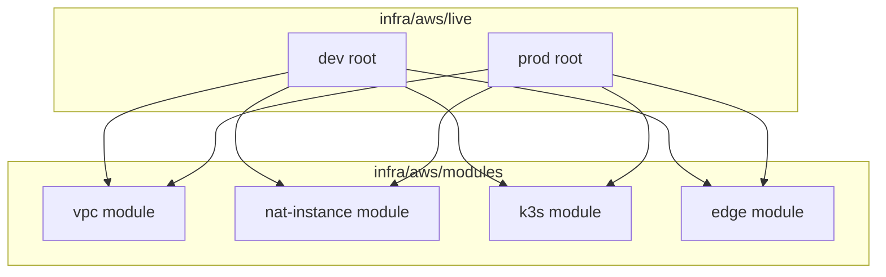
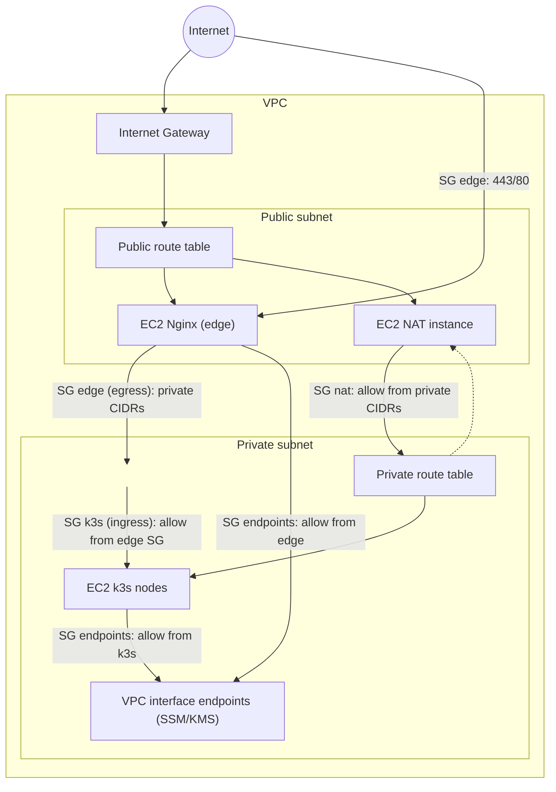
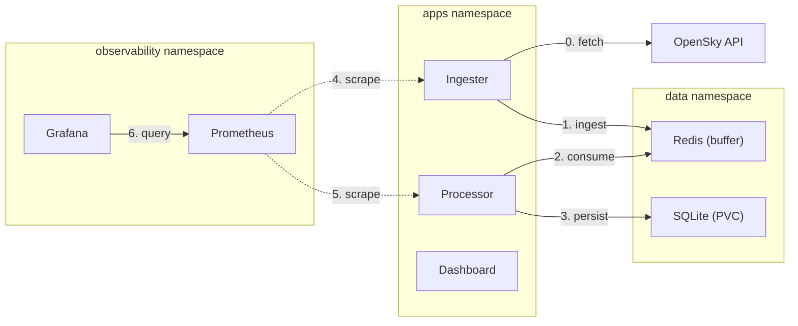

# Infrastructure Overview (v1)

This document describes the Terraform layout and the baseline VPC network used per environment.

## Terraform layout

## VPC diagram (SGs on network flows)

## Kubernetes workloads (namespaces + data flow)

## Resource inventory (per environment)

### Networking
- VPC, Internet Gateway, public/private subnets, public/private route tables.
- NAT instance (public subnet) with private route table default route.
- Interface VPC endpoints for SSM/KMS services.
- Gateway VPC endpoint for S3 (public + private route tables).

### Compute
- k3s server EC2 instance (private subnet).
- k3s worker Auto Scaling Group (private subnets) with launch template.
- NAT EC2 instance (public subnet).
- Edge EC2 instance (public subnet).
- ArgoCD deployed on k3s (bootstrapped via SSM from CI).

### Storage
- EBS CSI driver deployed via ArgoCD (kube-system).
- `ebs-gp3` StorageClass for stateful workloads.
- S3 backup bucket for SQLite snapshots.

### Security
- Security group for k3s nodes (explicit ports).
- Security group for NAT (allow from private CIDRs).
- Security group for edge (HTTPS from allowed CIDRs).
- Default VPC network ACLs (no custom NACLs yet).
  - k3s node SG rules are self-referenced for 6443/10250/8472 (node-to-node only).
  - Edge reaches k3s only through NodePorts (30080/30081) via SG edge -> SG k3s.
  - Edge may allow HTTPS egress for SSM when endpoints are disabled (dev only).
  - Without SSM endpoints, Session Manager access requires `ssm:StartSession` on `arn:aws:ssm:us-east-1:<account-id>:document/SSM-SessionManagerRunShell`.

### IAM
- IAM role + instance profile for k3s nodes (SSM managed policy).
- IAM managed policy attachment for EBS CSI driver (k3s nodes).
- IAM policy for k3s nodes to read/write SQLite backups in S3.
- IAM role + instance profile for edge (SSM managed policy + SSM parameter read).
- Full IAM inventory: `docs/iam/inventory.md`.

## Network table (example: dev)

| Component | CIDR / Range | AZ | Route table | Security group | SG name | NACL | Notes |
| --- | --- | --- | --- | --- | --- | --- | --- |
| VPC | 10.0.0.0/16 | us-east-1 | n/a | n/a | n/a | default | `infra/aws/live/dev/terraform.tfvars.example` |
| Public subnet | 10.0.1.0/24 | us-east-1a | public RT | nat SG (NAT), edge SG | `cloudradar-dev-nat`, `cloudradar-dev-edge` | default | Public IPs on launch |
| Private subnet | 10.0.101.0/24 | us-east-1a | private RT | k3s SG | `cloudradar-dev-k3s-nodes` | default | No public IPs |
| Public RT | 0.0.0.0/0 -> IGW | us-east-1 | n/a | n/a | n/a | default | Egress for public subnet |
| Private RT | 0.0.0.0/0 -> NAT | us-east-1 | n/a | n/a | n/a | default | Egress for private subnet |
| k3s SG | 6443/TCP, 10250/TCP, 8472/UDP | us-east-1 | n/a | k3s SG | `cloudradar-dev-k3s-nodes` | default | Self-referenced rules |
| NAT SG | All from private CIDRs | us-east-1 | n/a | nat SG | `cloudradar-dev-nat` | default | Egress to Internet |
| Edge SG | 443/TCP (and 80/TCP redirect) | us-east-1 | n/a | edge SG | `cloudradar-dev-edge` | default | Access limited by `edge_allowed_cidrs` |
| SSM endpoints | 443/TCP from edge SG | us-east-1 | n/a | edge SSM endpoints SG | `cloudradar-dev-edge-ssm-endpoints` | default | Interface endpoints for SSM/KMS |
| S3 endpoint | AWS prefix list | us-east-1 | public + private RT | edge SG (egress) | `cloudradar-dev-s3-endpoint` | default | Gateway endpoint for AL2023 repos |

## Status

- Implemented (IaC): VPC, subnets, route tables, internet gateway, NAT instance, k3s nodes, edge EC2, S3 backup bucket for SQLite snapshots.
- Implemented (IaC, dev): SSM/KMS interface endpoints are temporarily disabled to reduce cost; edge uses HTTPS egress for SSM.
- Implemented (Platform): ArgoCD bootstrap via SSM/CI for GitOps delivery, Redis buffer in the data namespace, EBS CSI driver + `ebs-gp3` StorageClass.
- Planned: observability stack, additional network hardening.

## Notes

- The VPC module is parameterized for multiple environments and can be destroyed cleanly because all core resources live in the module.
- Private subnet egress is handled by the NAT instance module and the private route table default route.
- The edge EC2 instance is the public entry point (Nginx reverse proxy) used for TLS termination and basic auth in front of k3s services.
- Edge basic auth password is read from SSM Parameter Store at boot (see `docs/runbooks/aws-account-bootstrap.md` for IAM).
- Edge SSM access is routed via VPC interface endpoints (SSM, EC2 messages, and KMS), keeping edge egress restricted to private subnets.
- Edge depends on the SSM/S3 endpoints being created first to avoid cloud-init timeouts during bootstrap.
- ArgoCD is bootstrapped via SSM from CI after infrastructure apply, then manages k8s apps via GitOps.
- Edge package installs use the S3 gateway endpoint plus SG egress to the S3 prefix list.
- TODO: set edge `server_name` to the public DNS name once available (remove nginx warning).
- TODO: improve edge HA by running nginx on public k3s nodes + ASG (min 1, ideally 2+) with vertical scaling as needed.
- TODO: migrate edge TLS to ACM + Route53 (issue #14).
- TODO: tighten edge egress to k3s SG (replace CIDR-based egress).
- IAM permissions needed for these resources are documented in `docs/runbooks/aws-account-bootstrap.md`.
