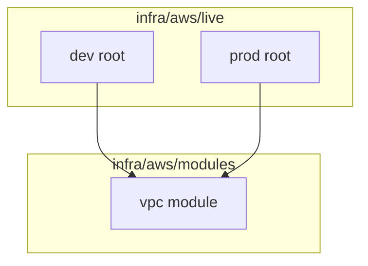
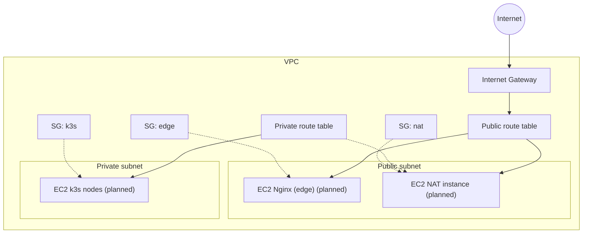

# Infrastructure Overview (v1)

This document describes the Terraform layout and the baseline VPC network used per environment.

## Terraform layout

## VPC baseline (per environment)

## Status

- Implemented: VPC, subnets, route tables, internet gateway.
- Planned: NAT instance route, edge EC2, k3s nodes.

## Notes

- The VPC module is parameterized for multiple environments and can be destroyed cleanly because all core resources live in the module.
- Private subnet egress is optional and only enabled when a NAT instance ID is provided.
- The edge EC2 instance is the public entry point (Nginx reverse proxy) used for TLS termination and basic auth in front of k3s services.
