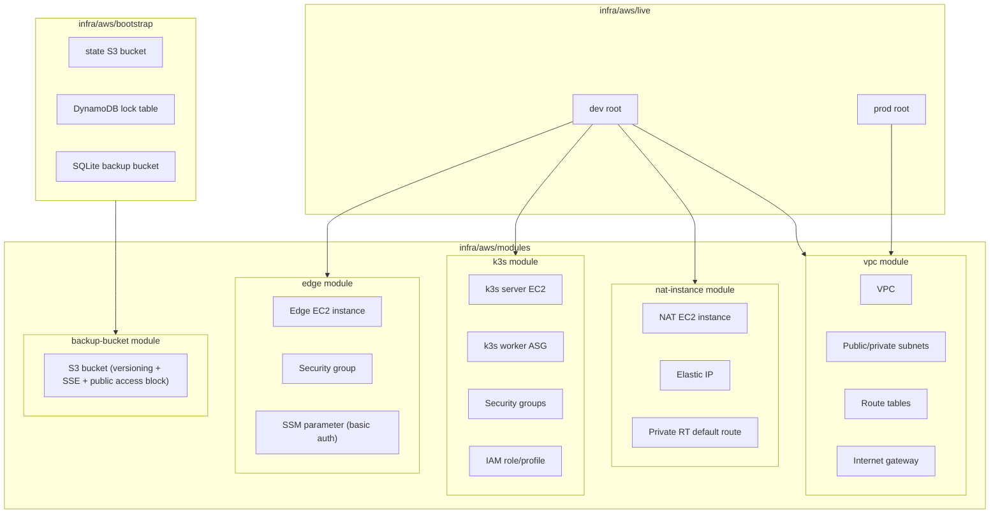
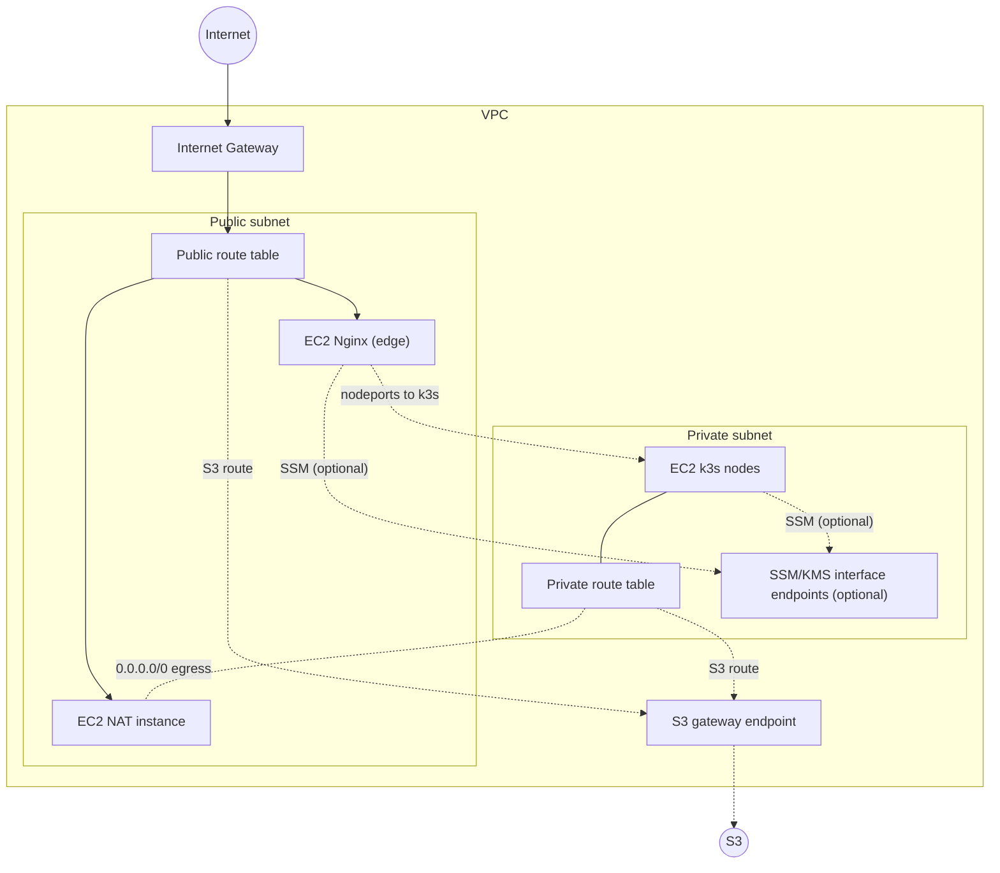
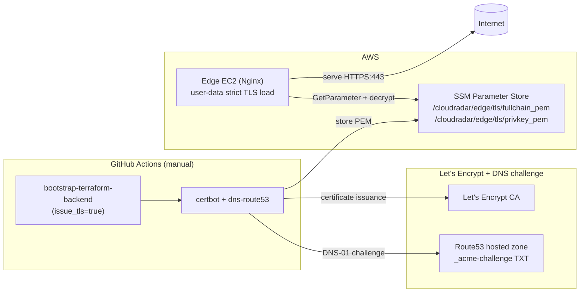
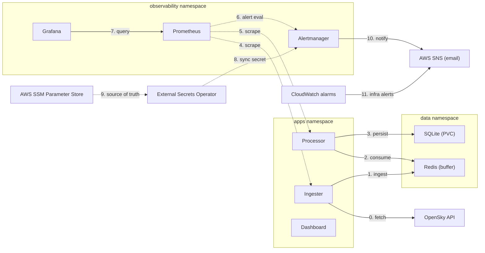

# Infrastructure Overview (v1)

This document describes the Terraform layout and the baseline VPC network used per environment.

## Terraform layout

### Terraform roots
- `infra/aws/bootstrap`: creates the Terraform backend (state bucket, lock table) and the SQLite backup bucket.
- `infra/aws/live/dev`: deploys the full dev stack (VPC, NAT instance, k3s, edge) and wires the backup bucket name to k3s.
- `infra/aws/live/prod`: deploys the prod VPC baseline only (future app/edge/k3s TBD).

## VPC diagram (SGs on network flows)

## Edge TLS Certificate Architecture (MVP)

The MVP edge certificate flow is:
- certificate issuance via Let's Encrypt DNS-01 from the bootstrap workflow,
- certificate artifacts stored in AWS SSM Parameter Store,
- strict certificate loading at edge boot (no self-signed fallback).

Strict behavior:
- edge boot fails if TLS parameters are missing, expired, or cert/key mismatch.
- bootstrap run fails when `issue_tls=false` and no valid existing certificate is found in SSM.

## Kubernetes workloads (namespaces + data flow)

## Resource inventory (per environment)

### Networking
- VPC, Internet Gateway, public/private subnets, public/private route tables.
- NAT instance (public subnet) with private route table default route.
- Interface VPC endpoints for SSM/KMS services.
- Gateway VPC endpoint for S3 (public + private route tables).
- Route53 hosted zone for delegated subdomain (optional; used for Grafana/Prometheus FQDNs).

### Compute
- k3s server EC2 instance (private subnet, AL2023 minimal AMI with SSM agent installed via cloud-init).
- k3s worker Auto Scaling Group (private subnets) with launch template (AL2023 minimal AMI with SSM agent installed via cloud-init).
- NAT EC2 instance (public subnet).
- Edge EC2 instance (public subnet, AL2023 minimal AMI with SSM agent installed via user-data).

### EC2 instance types (defaults)

Values come from `infra/aws/live/dev/terraform.tfvars` unless overridden per environment.

| Component | Default instance type | Notes |
| --- | --- | --- |
| k3s server | `t3a.medium` | Private subnet (dev). Increased headroom to avoid API timeouts during large CRD applies. |
| k3s workers | `t3a.medium` | Auto Scaling Group (dev). |
| edge | `t3.micro` | Public subnet (dev). |
| NAT instance | `t3.nano` | Public subnet (dev). |

Cost note: `t3a.medium` increases control-plane cost versus `t3.small`, but reduces API timeouts during bootstrap.

Prod values are currently aligned with module defaults and may be overridden later in `infra/aws/live/prod`.
- ArgoCD deployed on k3s (bootstrapped via SSM from CI).

### Storage
- EBS CSI driver deployed via ArgoCD (kube-system).
- `ebs-gp3` StorageClass for stateful workloads.
- S3 backup bucket for SQLite snapshots.

### Security
- Security group for k3s nodes (explicit ports).
- Security group for NAT (allow from private CIDRs).
- Security group for edge (HTTPS from allowed CIDRs).
- Default VPC network ACLs (no custom NACLs yet).
  - k3s node SG rules are self-referenced for 6443/10250/8472 (node-to-node only).
  - Edge reaches k3s only through NodePorts (30080/30081) via SG edge -> SG k3s.
  - Edge may allow HTTPS egress for SSM when endpoints are disabled (dev only).
  - Without SSM endpoints, Session Manager access requires `ssm:StartSession` on `arn:aws:ssm:us-east-1:<account-id>:document/SSM-SessionManagerRunShell`.

### IAM
- IAM role + instance profile for k3s nodes (SSM managed policy).
- IAM managed policy attachment for EBS CSI driver (k3s nodes).
- IAM policy for k3s nodes to read/write SQLite backups in S3.
- IAM role + instance profile for edge (SSM managed policy + SSM parameter read).
- Full IAM inventory: `docs/iam/inventory.md`.

## Network table (example: dev)

| Component | CIDR / Range | AZ | Route table | Security group | SG name | NACL | Notes |
| --- | --- | --- | --- | --- | --- | --- | --- |
| VPC | 10.0.0.0/16 | us-east-1 | n/a | n/a | n/a | default | `infra/aws/live/dev/terraform.tfvars` |
| Public subnet | 10.0.1.0/24 | us-east-1a | public RT | nat SG (NAT), edge SG | `cloudradar-dev-nat`, `cloudradar-dev-edge` | default | Public IPs on launch |
| Private subnet | 10.0.101.0/24 | us-east-1a | private RT | k3s SG | `cloudradar-dev-k3s-nodes` | default | No public IPs |
| Public RT | 0.0.0.0/0 -> IGW | us-east-1 | n/a | n/a | n/a | default | Egress for public subnet |
| Private RT | 0.0.0.0/0 -> NAT | us-east-1 | n/a | n/a | n/a | default | Egress for private subnet |
| k3s SG | 6443/TCP, 10250/TCP, 8472/UDP | us-east-1 | n/a | k3s SG | `cloudradar-dev-k3s-nodes` | default | Self-referenced rules |
| k3s SG (Ingress) | 80/TCP, 443/TCP from edge | us-east-1 | n/a | edge SG | `cloudradar-dev-k3s-nodes` | default | Allow edge to k3s Ingress Controller |
| NAT SG | All from private CIDRs | us-east-1 | n/a | nat SG | `cloudradar-dev-nat` | default | Egress to Internet |
| Edge SG | 443/TCP (and 80/TCP redirect) | us-east-1 | n/a | edge SG | `cloudradar-dev-edge` | default | Access limited by `edge_allowed_cidrs` |
| SSM endpoints | 443/TCP from edge SG | us-east-1 | n/a | edge SSM endpoints SG | `cloudradar-dev-edge-ssm-endpoints` | default | Interface endpoints for SSM/KMS |
| S3 endpoint | AWS prefix list | us-east-1 | public + private RT | edge SG (egress) | `cloudradar-dev-s3-endpoint` | default | Gateway endpoint for AL2023 repos |

## Observability Stack (Prometheus + Grafana)

| Component | Details | Status |
| --- | --- | --- |
| **Namespace** | `monitoring` | Managed by GitOps/ArgoCD |
| **Prometheus** | `prometheus-community/kube-prometheus-stack` v81.4.2 | Deployed via ArgoCD Application |
| **Alertmanager** | Included in kube-prometheus-stack | Enabled with config from ESO (`cloudradar-alertmanager-config`) |
| **Grafana** | `grafana/grafana` v10.5.15 | Deployed via ArgoCD Application |
| **Storage** | 5GB gp3 EBS (Prometheus PVC) | Provisioned via EBS CSI + gp3 StorageClass |
| **Retention** | 7 days (or when 4GB limit hit) | Configurable in Prometheus Helm values |
| **Datasource** | Prometheus + CloudWatch → Grafana | Auto-configured, cluster-local |
| **Ingress** | Traefik ingress controller (k3s default) | `grafana.cloudradar.local` + `prometheus.cloudradar.local` via edge (host rewrite) |
| **Authentication** | K8s Secrets (`grafana-admin`, `cloudradar-alertmanager-config`) | Synced by ESO from SSM |
| **Secrets Storage** | AWS SSM Parameter Store | `/cloudradar/grafana-admin-*`, `/cloudradar/alerting/*` |
| **External Notifications** | SNS email | Triggered by Alertmanager (in-cluster) and CloudWatch alarms (external) |
| **Cost** | ~$0.50/month (PVC only) | 5GB gp3 @ $0.10/GB/month |
| **Metrics Targets** | node-exporter, kube-state-metrics, app pods (with scrape labels) | Auto-discovered via ServiceMonitor |

**Deployment Flow:**
1. Terraform provisions infra and alerting resources (SNS + CloudWatch alarms) and writes SSM parameters for observability/alerting secrets.
2. ArgoCD syncs monitoring apps (`prometheus`, `grafana`) from `k8s/apps/monitoring/`.
3. ESO syncs SSM parameters into Kubernetes Secrets (`grafana-admin`, `grafana-domain`, `cloudradar-alertmanager-config`).
4. Prometheus scrapes targets and evaluates alert rules; Alertmanager routes alert notifications to SNS when enabled.
5. Grafana queries Prometheus and CloudWatch datasources.
6. Edge Nginx routes `/grafana` and `/prometheus` to k3s Ingress and rewrites Host to `grafana.cloudradar.local` / `prometheus.cloudradar.local`.

See [docs/runbooks/observability.md](../runbooks/observability.md) for operational details and setup steps.

## Status

- Implemented (IaC): VPC, subnets, route tables, internet gateway, NAT instance, k3s nodes, edge EC2, S3 backup bucket for SQLite snapshots.
- Implemented (Edge TLS MVP): Let's Encrypt DNS-01 issuance from bootstrap workflow and certificate storage in SSM (`/cloudradar/edge/tls/*`) consumed by edge at boot in strict mode.
- Implemented (IaC, dev): SSM/KMS interface endpoints are temporarily disabled to reduce cost; edge uses HTTPS egress for SSM.
- Implemented (Platform): ArgoCD bootstrap via SSM/CI for GitOps delivery, Redis buffer in the data namespace, EBS CSI driver + `ebs-gp3` StorageClass.
- Implemented (Observability): Prometheus + Grafana stack (7d retention, 5GB PVC, $0.50/month), auto-deployed via ArgoCD, secrets/config synced from SSM via ESO.
- Planned: migrate Redis PVC off `local-path` to resilient storage (`ebs-gp3`) to avoid node affinity lock-in (issue #221).
- Planned: additional network hardening.
- Implemented (Alerting MVP): Alertmanager enabled in-cluster with baseline CloudRadar rules and SNS routing configured via Terraform -> SSM -> ESO, plus external CloudWatch/SNS email alarms (k3s/edge/nat status checks), with workflow-driven mute/re-enable during destroy/apply.

## Notes

- The VPC module is parameterized for multiple environments and can be destroyed cleanly because all core resources live in the module.
- Private subnet egress is handled by the NAT instance module and the private route table default route.
- The edge EC2 instance is the public entry point (Nginx reverse proxy) used for TLS termination and basic auth in front of k3s services.
- Edge basic auth password is read from SSM Parameter Store at boot (see `docs/runbooks/aws-account-bootstrap.md` for IAM).
- Edge SSM access is routed via VPC interface endpoints when enabled; otherwise, edge allows HTTPS egress for SSM over the Internet.
- Edge depends on the SSM/S3 endpoints being created first to avoid cloud-init timeouts during bootstrap.
- ArgoCD is bootstrapped via SSM from CI after infrastructure apply, then manages k8s apps via GitOps.
- SSM agent is installed explicitly in k3s/edge bootstrap to avoid AMI package drift.
- Edge package installs use the S3 gateway endpoint plus SG egress to the S3 prefix list.
- SQLite backup bucket is provisioned by the Terraform bootstrap stack to keep it outside environment destroys.
- TODO: set edge `server_name` to the public DNS name once available (remove nginx warning).
- TODO: improve edge HA by running nginx on public k3s nodes + ASG (min 1, ideally 2+) with vertical scaling as needed.
- Planned (v1.1+): evaluate migration of edge TLS to ACM/managed edge path (issue #14). Current MVP remains Let's Encrypt DNS-01 + SSM TLS artifacts.
- TODO: tighten edge egress to k3s SG (replace CIDR-based egress).
- IAM permissions needed for these resources are documented in `docs/runbooks/aws-account-bootstrap.md`.
