# CloudRadar — Technical Architecture Document (DAT)

**Version**: v1-mvp  
**Date**: 2026-02-13  
**Status**: Current

---

## 1. System Overview

### 1.1 Context Diagram


### 1.2 Technology Stack

```mermaid
graph TB
    subgraph Infrastructure["☁️ Infrastructure"]
        AWS[AWS us-east-1]
        TF[Terraform 1.5+]
        VPC[VPC + Security Groups]
    end

    subgraph Platform["🔧 Platform"]
        K3S[k3s 1.28+]
        ARGO[ArgoCD]
        ESO[External Secrets Operator]
        PROM[Prometheus/Grafana]
    end

    subgraph Application["⚙️ Application"]
        JAVA[Java 17 + Spring Boot 3.x]
        REDIS[Redis 7.x]
        SQLITE[SQLite 3.x]
        PYTHON[Python 3.11]
    end

    subgraph CI["🚀 CI/CD"]
        GHA[GitHub Actions]
        GHCR[GitHub Container Registry]
        OIDC[OIDC for AWS]
    end

    Infrastructure --> Platform
    Platform --> Application
    CI --> Infrastructure
    CI --> Application
```



---

## 2. Infrastructure Architecture

### 2.1 Network Topology


### 2.2 Security Groups


### 2.3 IAM & Access


---

## 3. Application Architecture

### 3.1 Service Topology


### 3.2 Event Flow


### 3.3 Data Contracts


---

## 4. Data Architecture

### 4.1 Redis Schema


### 4.2 SQLite Schema


### 4.3 Storage Strategy


---

## 5. Deployment Architecture

### 5.1 GitOps Flow


### 5.2 ArgoCD Bootstrap


### 5.3 Resource Allocation

> **Note**: This diagram shows a logical distribution of workloads. Actual pod placement is dynamic and managed by k8s scheduler based on resource availability and constraints.


---

## 6. Observability Architecture

### 6.1 Metrics Pipeline


### 6.2 Health Checks


---

## 7. Security Architecture

### 7.1 Secrets Management


### 7.2 Network Security


### 7.3 IAM Policy Summary


---

## 8. Failure Scenarios

### 8.1 Component Failure Matrix


### 8.2 Recovery Procedures

```mermaid
stateDiagram-v2
    [*] --> Normal: System operational

    Normal --> RedisFailure: Redis pod crash
    Normal --> ProcessorFailure: Processor crash
    Normal --> IngesterBackoff: API degradation

    RedisFailure --> RedisRestart: k8s restarts pod
    RedisRestart --> RedisRecover: AOF replay
    RedisRecover --> WaitRepopulate: Wait ~10min
    WaitRepopulate --> Normal: Ingester/Processor repopulate

    ProcessorFailure --> ProcessorRestart: k8s restarts pod
    ProcessorRestart --> Normal: Resume BLPOP

    IngesterBackoff --> BackoffLevel: Exponential backoff
    BackoffLevel --> APIRecovery: API available again
    APIRecovery --> Normal: Reset backoff

    Normal --> [*]
```

---

## 9. Scalability Patterns

### 9.1 Current Scaling Limits

```mermaid
graph TB
    subgraph "Stateless (Horizontal Scale)"
        INGESTER[Ingester<br/>Current: 0-2<br/>Scale: Admin-Scale API<br/>Limit: API rate limit]
        DASHBOARD[Dashboard<br/>Current: 1<br/>Scale: HPA on CPU/Memory<br/>Limit: Redis HGETALL]
    end

    subgraph "Stateful (Vertical Scale Only)"
        PROCESSOR[Processor<br/>Current: 1<br/>Scale: Vertical only<br/>Bottleneck: Single BLPOP]
        REDIS[Redis<br/>Current: 1 replica<br/>Scale: None (SPOF)<br/>Bottleneck: Memory]
    end

    style INGESTER fill:#c8e6c9
    style DASHBOARD fill:#c8e6c9
    style PROCESSOR fill:#ffecb3
    style REDIS fill:#ffcdd2
```

### 9.2 Future Scaling Strategy

```mermaid
graph TB
    subgraph "v1-mvp (Current)"
        V1_REDIS[Redis<br/>Single replica<br/>local-path PVC]
        V1_PROC[Processor<br/>Single consumer<br/>BLPOP]
    end

    subgraph "v1.1 (Planned)"
        V11_REDIS[Redis<br/>Single replica<br/>ebs-gp3 PVC<br/>Node-portable]
    end

    subgraph "v2 (Future)"
        V2_REDIS[Redis Sentinel<br/>3 replicas<br/>Automatic failover]
        V2_PROC[Processor<br/>Partitioned queues<br/>Multiple consumers]
        V2_KAFKA[Kafka<br/>Topic partitions<br/>Strong durability]
    end

    V1_REDIS --> V11_REDIS
    V11_REDIS --> V2_REDIS
    V1_PROC --> V2_PROC
    V2_REDIS --> V2_KAFKA

    style V1_REDIS fill:#ffcdd2
    style V11_REDIS fill:#fff9c4
    style V2_REDIS fill:#c8e6c9
    style V2_KAFKA fill:#c8e6c9
```

---

## 10. Cost Breakdown

### 10.1 Monthly Cost Estimate (v1-mvp)

> **Based on terraform.tfvars**: 1 server + 1 worker (desired), not 2 workers

```mermaid
pie title Monthly AWS Cost (~$78-82)
    "k3s Server (t3a.medium)" : 34
    "k3s Worker (1x t3a.medium)" : 34
    "EBS Volumes (~133GB gp3)" : 13
    "Edge (t3.micro)" : 9
    "NAT Instance (t3.nano)" : 5
    "S3 Storage + Transfer" : 5
```

#### Detailed Cost Breakdown

| Component | Spec | Unit Price | Quantity | Monthly Cost |
|-----------|------|------------|----------|--------------|
| **k3s Server** | t3a.medium | $0.0376/h | 730h | **$27.45** |
| **k3s Worker** | t3a.medium | $0.0376/h | 730h | **$27.45** |
| **Edge** | t3.micro | $0.0104/h | 730h | **$7.59** |
| **NAT Instance** | t3.nano | $0.0052/h | 730h | **$3.80** |
| **EBS k3s Server** | gp3 40GB | $0.08/GB/mo | 40GB | $3.20 |
| **EBS k3s Worker** | gp3 40GB | $0.08/GB/mo | 40GB | $3.20 |
| **EBS Edge** | gp3 40GB | $0.08/GB/mo | 40GB | $3.20 |
| **EBS NAT** | gp3 8GB | $0.08/GB/mo | 8GB | $0.64 |
| **EBS Prometheus** | gp3 5GB | $0.08/GB/mo | 5GB | $0.40 |
| **Total EBS** | | | 133GB | **$10.64** |
| **S3 Storage** | SQLite backups | $0.023/GB | ~10GB | $0.23 |
| **S3 Requests** | GET/PUT | Variable | Low usage | $0.10 |
| **Data Transfer** | Egress (OpenSky, packages) | $0.09/GB (first 10TB) | ~5-10GB/mo | **$0.50-1.00** |
| | | | **Total** | **~$78.00** |

**Notes**:
- Pricing based on AWS us-east-1 on-demand rates (Feb 2026)
- 730 hours/month average (365 days / 12 months × 24h)
- EBS gp3 baseline: $0.08/GB/month (no IOPS/throughput charges at baseline)
- VPC Flow Logs to CloudWatch: ~$0.50/month (3-day retention, minimal traffic)
- Data transfer within same AZ: free (k3s nodes, Redis, Prometheus)
- Data transfer ingress: free (OpenSky responses)

#### FinOps Optimization Opportunities

| Optimization | Current | Optimized | Savings/mo | Trade-offs |
|--------------|---------|-----------|------------|------------|
| **Spot Instances (workers)** | On-demand t3a.medium | Spot t3a.medium (~70% discount) | **-$19.20** | Risk of interruption, need graceful node drain |
| **Instance Sizing** | t3a.medium (2 vCPU/4GB) | t3a.small (2 vCPU/2GB) | **-$13.70/node** | Less headroom, tighter resource limits |
| **EBS Volume Reduction** | 40GB root volumes | 20GB root volumes | **-$4.80** | Requires disk cleanup, less buffer |
| **Dev Shutdown Schedule** | 24/7 | 10h/day (workweeks only) | **-$43.00** | Dev downtime nights/weekends |
| **Prometheus Retention** | 7d (5GB PVC) | 3d (2GB PVC) | **-$0.24** | Less historical data |
| **S3 Lifecycle Policies** | No expiration | 30d→IA, 90d→Glacier | **-$0.10** | Slower restore for old backups |
| **Single-AZ Strategy** | Already single-AZ | ✅ Optimized | $0 | Lower availability vs multi-AZ |
| **NAT Instance vs Gateway** | Already NAT instance | ✅ Optimized | $0 | Saves ~$28/mo vs NAT Gateway |
| **k3s vs EKS** | Already k3s | ✅ Optimized | $0 | Saves ~$73/mo vs EKS control plane |

**Recommended Quick Wins (Low Risk)**:
1. **Reduce EBS volumes to 20GB** (-$4.80/mo) — 40GB is generous for minimal OS + Docker
2. **Spot instances for workers** (-$19.20/mo) — k3s tolerates node churn well, stateful workloads on server
3. **Prometheus 3d retention** (-$0.24/mo) — 3 days sufficient for MVP observability
4. **Total easy savings: ~$24/mo → New total: ~$54/mo**

**Aggressive Optimization (Higher Risk)**:
- Dev shutdown schedule (nights/weekends): -$43/mo → **$35/mo total**
- Downsize to t3a.small: additional -$27.40/mo → **$26/mo total**
- Trade-off: resource pressure, potential OOM, tighter limits

**Not Recommended** (Already Optimized):
- ❌ Remove NAT instance (no egress connectivity)
- ❌ Switch to EKS (increases cost by $73/mo)
- ❌ Multi-AZ deployment (increases costs significantly for marginal availability gain in portfolio context)

### 10.2 Cost Optimization Decisions

```mermaid
graph LR
    subgraph "MVP Choices (Low Cost)"
        K3S[k3s on EC2<br/>~$20/month]
        NAT_INST[NAT Instance<br/>~$4/month]
        REDIS_LOCAL[Redis in-cluster<br/>$0 + PVC]
        PROM_LOCAL[Prometheus in-cluster<br/>~$0.50/month]
    end

    subgraph "Enterprise Alternatives (High Cost)"
        EKS[EKS<br/>~$73/month control plane<br/>+ worker nodes]
        NAT_GW[NAT Gateway<br/>~$32/month]
        REDIS_ELASTIC[ElastiCache Redis<br/>~$15-50/month]
        CLOUDWATCH[CloudWatch Metrics<br/>~$10-30/month]
    end

    K3S -.->|Savings: ~$53/month| EKS
    NAT_INST -.->|Savings: ~$28/month| NAT_GW
    REDIS_LOCAL -.->|Savings: ~$15-50/month| REDIS_ELASTIC
    PROM_LOCAL -.->|Savings: ~$10-30/month| CLOUDWATCH

    style K3S fill:#c8e6c9
    style NAT_INST fill:#c8e6c9
    style REDIS_LOCAL fill:#c8e6c9
    style PROM_LOCAL fill:#c8e6c9
    style EKS fill:#ffcdd2
    style NAT_GW fill:#ffcdd2
    style REDIS_ELASTIC fill:#ffcdd2
    style CLOUDWATCH fill:#ffcdd2
```

---

## 11. Evolution Roadmap

### 11.1 Version Timeline

```mermaid
timeline
    title CloudRadar Evolution Timeline
    
    v1-mvp (Current) : Infrastructure IaC
                     : k3s + ArgoCD
                     : Event pipeline
                     : Dashboard API
                     : Observability
    
    v1.1 (Q1 2026) : Frontend React/Vite
                   : Redis ebs-gp3 PVC
                   : Alerting rules
                   : API documentation
    
    v2 (Q2 2026) : Redis HA (Sentinel)
                 : Processor partitioning
                 : Loki logging
                 : Chaos testing
                 : Multi-AZ
```

### 11.2 Technical Debt

```mermaid
graph TB
    subgraph "High Priority"
        TD1[Redis SPOF<br/>Migration: ebs-gp3 + Sentinel]
        TD2[Dashboard HGETALL<br/>Refactor: Filter-before-load]
        TD3[Integration Tests<br/>Add: Service-level tests]
    end

    subgraph "Medium Priority"
        TD4[Processor Scale-Out<br/>Design: Queue partitioning]
        TD5[Centralized Logging<br/>Deploy: Loki + Promtail]
        TD6[Secret Rotation<br/>Automate: Lambda + SSM]
    end

    subgraph "Low Priority"
        TD7[Multi-AZ Deployment<br/>Redesign: Network + Data]
        TD8[EKS Migration<br/>Migrate: Control plane]
        TD9[Chaos Engineering<br/>Implement: Chaos Mesh]
    end

    TD1 -.->|Blocks v1.1| TD4
    TD2 -.->|Enables 10k+ aircraft| Frontend[Frontend v1.1]

    style TD1 fill:#ffcdd2
    style TD2 fill:#ffcdd2
    style TD3 fill:#ffcdd2
```

---

## 12. References

### 12.1 Documentation Index

| Document | Purpose | Location |
|----------|---------|----------|
| Infrastructure Overview | Network, compute, storage | `docs/architecture/infrastructure.md` |
| Application Architecture | Service details, data flow | `docs/architecture/application-architecture.md` |
| Architecture Review | Quality assessment | `docs/code-reviews/architecture-review.md` |
| ADRs (19 total) | Decision rationale | `docs/architecture/decisions/` |
| Runbooks | Operational procedures | `docs/runbooks/` |
| IAM Inventory | Roles, policies, access | `docs/iam/inventory.md` |

### 12.2 Key Architecture Decision Records

```mermaid
timeline
    title Key ADR Timeline
    ADR-0001 (2026-01-08) : AWS Region (us-east-1)
    ADR-0002 (2026-01-08) : k3s on EC2
    ADR-0003 (2026-01-08) : Redis Buffer
    ADR-0008 (2026-01-08) : VPC + NAT Instance
    ADR-0009 (2026-01-08) : Security Baseline
    ADR-0010 (2026-01-08) : Terraform + OIDC
    ADR-0013 (2026-01-17) : ArgoCD via SSM
    ADR-0014 (2026-01-19) : Java/Spring Boot
    ADR-0018 (2026-02-10) : SQLite + S3 Distribution
```

---

## Appendix A: Glossary

| Term | Definition |
|------|------------|
| **ADR** | Architecture Decision Record — documented design choice with rationale |
| **AOF** | Append-Only File — Redis persistence mechanism |
| **ArgoCD** | GitOps continuous delivery tool for Kubernetes |
| **BLPOP** | Blocking List Pop — Redis command for consuming queue events |
| **EBS CSI** | Elastic Block Store Container Storage Interface — k8s persistent volumes |
| **ESO** | External Secrets Operator — sync external secrets to k8s |
| **HGETALL** | Redis command to retrieve all fields from a hash |
| **k3s** | Lightweight Kubernetes distribution optimized for resource-constrained environments |
| **NAT Instance** | EC2 instance acting as Network Address Translation gateway |
| **OIDC** | OpenID Connect — authentication protocol used for GitHub Actions AWS access |
| **SSM** | AWS Systems Manager — parameter store and session manager |
| **Sync Wave** | ArgoCD ordering mechanism for resource dependencies |

---

## Appendix B: Network Ports Reference

| Service | Port | Protocol | Purpose |
|---------|------|----------|---------|
| Edge → Internet | 443 | TCP | HTTPS ingress |
| Edge → k3s | 30080, 30081 | TCP | NodePort to Traefik |
| k3s API | 6443 | TCP | Kubernetes API server |
| k3s Kubelet | 10250 | TCP | Node metrics |
| k3s Flannel | 8472 | UDP | Pod network (VXLAN) |
| Redis | 6379 | TCP | Redis protocol (ClusterIP) |
| Prometheus | 9090 | TCP | Metrics query API |
| Grafana | 3000 | TCP | Dashboard UI |
| Application /metrics | 8080 | TCP | Prometheus scrape target |

---

**Document Version**: 1.0  
**Last Updated**: 2026-02-13  
**Maintained By**: CloudRadar Team  
**Review Cycle**: Quarterly or on major architecture changes
