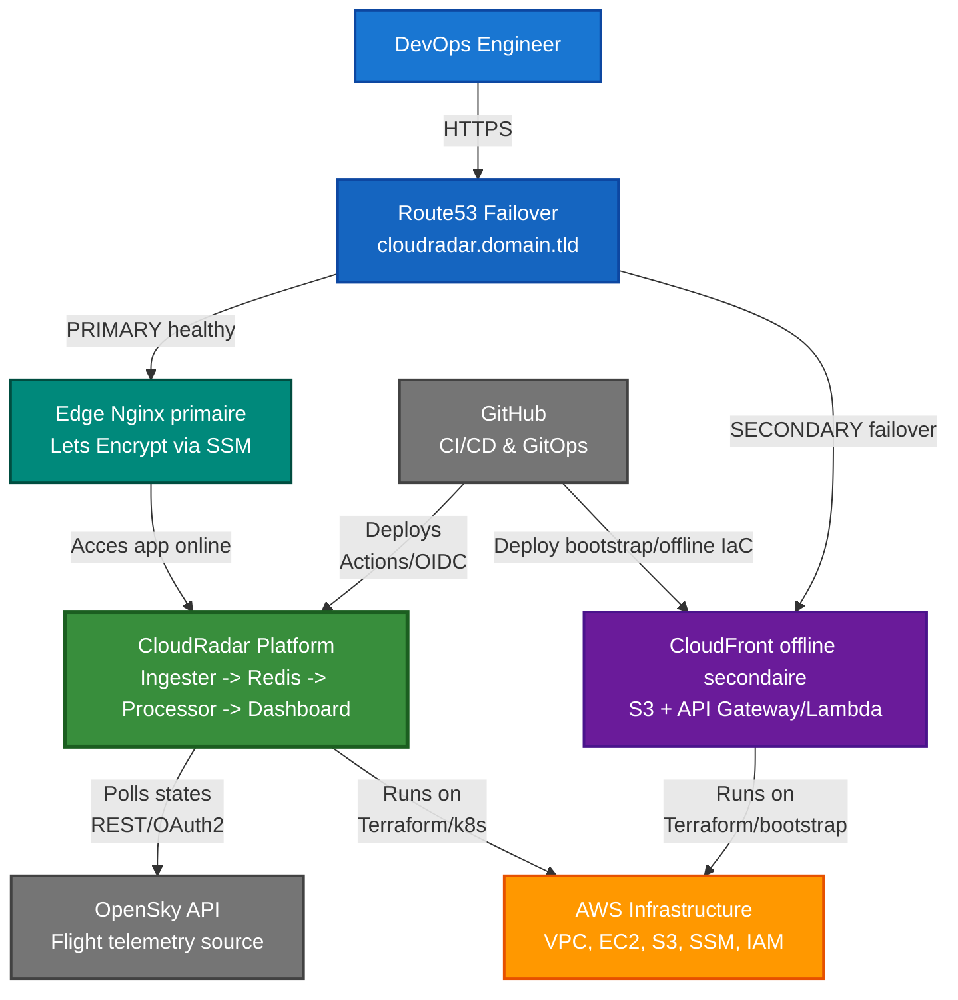
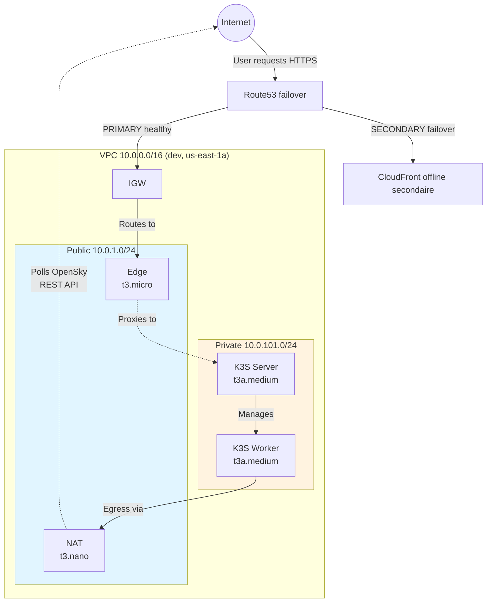
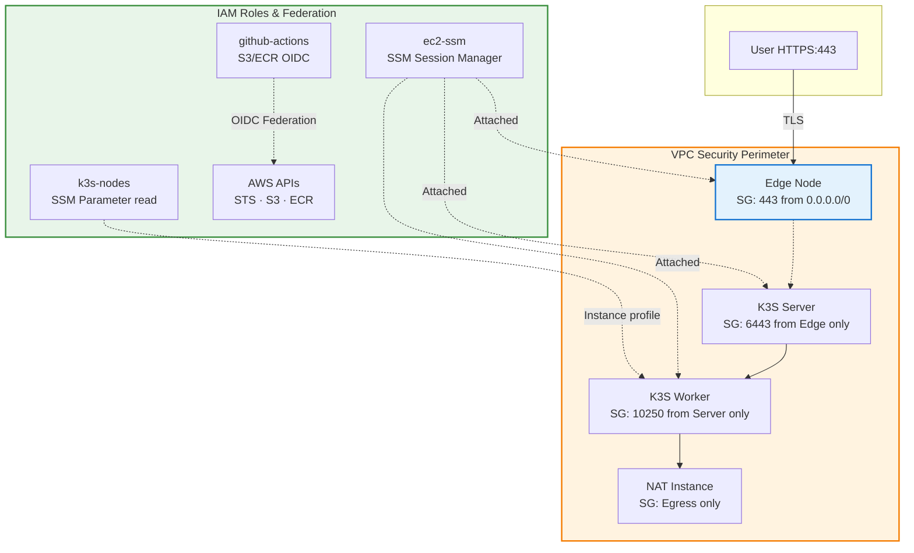
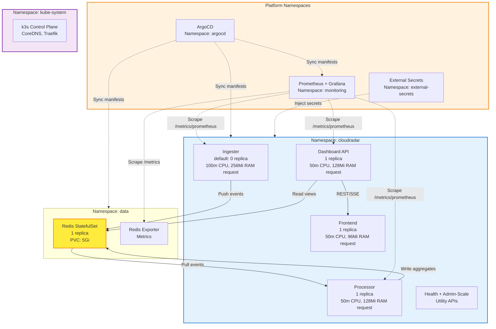
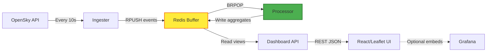
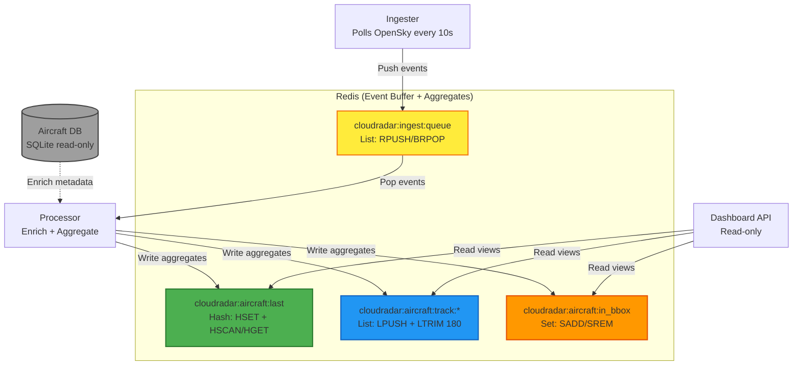
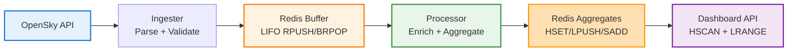
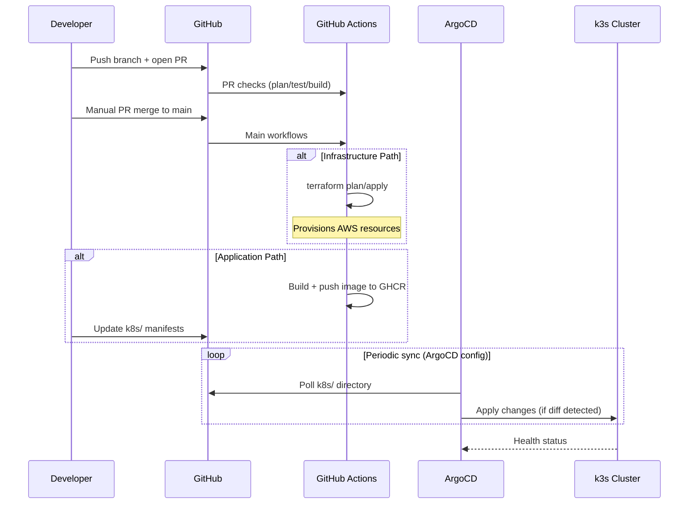
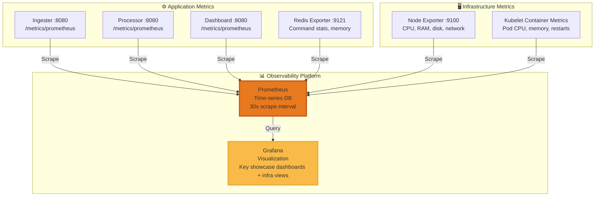
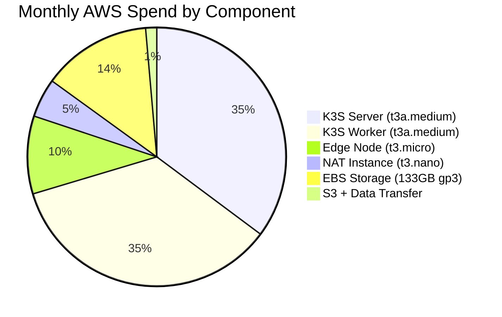

# CloudRadar — Synthese Technique d'Architecture

**Version**: v1-mvp  
**Date**: 2026-03-13  
**Audience**: Ingenieurs DevOps, Architectes Cloud, Recruteurs Techniques  
**Objectif**: Portfolio mettant en avant une architecture cloud de niveau production, des pratiques GitOps et l'automatisation de l'infrastructure

---

## Contexte et Objectifs du Projet

CloudRadar est une plateforme cloud de telemetrie aerienne temps reel, concue pour etre exploitable de bout en bout dans des conditions proches de la production. Le flux applicatif est explicite et verifiable: OpenSky API -> Ingester -> Redis -> Processor -> Dashboard API -> Frontend interactif (React/Leaflet).

L'architecture separe une couche applicative majoritairement stateless (services Java, frontend, APIs utilitaires) d'une couche de donnees stateful (Redis StatefulSet + PVC). Elle applique des pratiques orientees production: Infrastructure as Code, GitOps pull-based, observabilite native, controle d'acces IAM, et garde-fous de securite by design.

L'infrastructure AWS est provisionnee avec Terraform, les deploiements Kubernetes sont reconcilies par ArgoCD, et la CI/CD orchestre le build, les quality gates et le deploiement avec des controles explicites avant les etapes sensibles. Les secrets sont stockes dans AWS SSM puis synchronises vers Kubernetes via External Secrets Operator, sans credentials cloud statiques dans les pipelines.

Les choix techniques suivent une strategie FinOps explicite: maximiser la valeur de demonstration tout en maintenant un cout operationnel bas (k3s, NAT instance, stack OSS) et en conservant une architecture credible pour des entretiens d'architecture cloud. Les compromis techniques et incidents importants sont traces dans les issues, PRs, ADRs et runbooks pour garantir une tracabilite complete des decisions.

---

## Resultats Techniques Cles

**Automatisation Infrastructure**:
- ✅ 100% Infrastructure as Code (modules Terraform, state distant, federation OIDC)
- ✅ Support multi-environnements via racines Terraform dediees (`infra/aws/live/dev`, `infra/aws/live/prod`)
- ✅ CI/CD largement automatisee de bout en bout, avec gates d'approbation explicites pour les changements a risque

**GitOps et Platform Engineering**:
- ✅ Delivery continue pilotee par ArgoCD (sync cadence courte, auto-healing)
- ✅ External Secrets Operator pour une gestion des secrets sans vault dedie
- ✅ Manifests Kubernetes declaratifs avec overlays Kustomize

**Observabilite et Pratiques SRE**:
- ✅ Metriques full-stack (app -> plateforme -> infra) avec Prometheus + Grafana
- ✅ Instrumentation service-level (`/healthz` + endpoints de scrape Prometheus)
- ✅ 22 Architecture Decision Records documentant les compromis

**Securite et Conformite**:
- ✅ Architecture zero-trust (acces IAM uniquement, pas de SSH)
- ✅ Secrets jamais commits dans Git; secrets runtime geres via SSM Parameter Store + ESO
- ✅ IAM least-privilege avec separation claire entre acces runtime des noeuds et federation CI

**Cost Engineering (FinOps)**:
- ✅ k3s vs EKS: -$73/mo (-100% de frais de control plane manage)
- ✅ NAT instance vs NAT Gateway: -$28/mo (-88% de reduction de cout NAT)
- ✅ Depense mensuelle actuelle: ~$78 (optimisable a $54 avec des changements a faible risque)

---

## 1. Vue d'Ensemble du Systeme

### 1.1 Diagramme de Contexte

### 1.2 Stack Technologique

| Couche | Technologies | Pourquoi | Reference |
|-------|-------------|-----|-----------|
| **Infrastructure** | Terraform 1.5+, AWS VPC/EC2/S3/SSM | IaC-first, state distant (S3), immuable | [ADR-0001](decisions/ADR-0001-2026-01-08-aws-region-us-east-1.md), [ADR-0010](decisions/ADR-0010-2026-01-08-terraform-remote-state-and-oidc.md) |
| **Kubernetes** | k3s 1.28+ | -$73/mo vs EKS, <512MB RAM | [ADR-0002](decisions/ADR-0002-2026-01-08-k3s-on-ec2-for-kubernetes.md) |
| **GitOps** | ArgoCD + Kustomize | Git comme source of truth, reconciliation pull-based | [ADR-0013](decisions/ADR-0013-2026-01-17-gitops-bootstrap-strategy-argocd.md) |
| **Secrets** | SSM + External Secrets Operator | Pas de secrets en clair commits dans Git, sync runtime vers k8s | [ADR-0009](decisions/ADR-0009-2026-01-08-security-baseline-secrets-and-iam.md), [ADR-0016](decisions/ADR-0016-2026-01-29-external-secrets-operator.md) |
| **Observabilite** | Prometheus + Grafana | Metrics-first, retention 7j, pas de cout APM | [ADR-0005](decisions/ADR-0005-2026-01-08-observability-prometheus-grafana.md) |
| **Application** | Java 17 + Spring Boot 3.x | Type-safe, eprouve en production, Actuator | [ADR-0014](decisions/ADR-0014-2026-01-19-processor-language-java.md) |
| **Buffer d'evenements** | Redis 7.x | Buffer liste simple + agregats, sans Kafka | [ADR-0015](decisions/ADR-0015-2026-01-22-redis-list-for-ingestion-queue.md) |
| **CI/CD** | GitHub Actions + OIDC | Federation sans credentials statiques, audit trail | [ADR-0006](decisions/ADR-0006-2026-01-08-ci-cd-github-actions-ghcr.md), [ADR-0010](decisions/ADR-0010-2026-01-08-terraform-remote-state-and-oidc.md) |

**Principes de Design**: GitOps-first · Security-first · Cost-aware · Observability-native

---

## 2. Architecture Infrastructure

### 2.1 Topologie VPC et Reseau

**Caracteristiques Cles**:
- **Design Single-AZ**: optimise cout pour le portfolio (~$50/mo d'economie vs multi-AZ)
- **Defense in Depth**: edge public + compute prive, security groups qui limitent l'ingress a HTTPS (443)
- **NAT Instance**: t3.nano economise $28/mo vs NAT Gateway, gere le trafic egress OpenSky
- **Stockage EBS (defaults dev)**: volumes gp3 pour le stockage k3s (k3s server 40GB + worker 40GB + edge 40GB + NAT 8GB + Redis PVC 5Gi ≈ 133GB total), sans dependance runtime EFS/S3

### 2.2 Posture Securite et IAM

**Resume des Couches de Securite**:

| Couche | Implementation | Impact |
|-------|----------------|--------|
| **Reseau** | Ingress unique (443), subnets prives, security groups deny-by-default | Surface d'attaque minimisee |
| **Acces** | Pas de cles SSH, IAM-only (SSM Session Manager pour le debug) | Zero credential sprawl |
| **Secrets** | SSM Parameter Store + External Secrets Operator | Pas de secrets en clair commits dans Git; secrets runtime synchronises vers k8s |
| **Certificat TLS Edge** | Let's Encrypt DNS-01 -> SSM (`/cloudradar/edge/tls/*`) -> chargement au boot edge | Certificat public sans port 80; artefacts cert persistants hors destroy d'environnements ([ADR-0020](decisions/ADR-0020-2026-02-28-edge-tls-certificate-lifecycle-mvp.md)) |
| **IAM** | Roles least-privilege + OIDC pour CI/CD (pas de secrets CI longue duree) | Auditabilite CloudTrail, reduction credential sprawl |
| **Chiffrement** | EBS chiffre au repos, TLS en transit (edge Nginx + ingress intra-cluster) | Protection des donnees au repos/en transit |
| **State** | Backend Terraform dans S3 (chiffre, versionne, lock DynamoDB) | Operations concurrentes sures, rollback et historique d'audit |
| **Supply Chain** | GHCR avec `GITHUB_TOKEN` emis par GitHub; checks Hadolint + Trivy + SonarCloud en CI | Pas de credentials registry longue duree, chemin d'artefact controle avec gates qualite/securite automatisees |

**Principes Zero-Trust**: Pas de cles SSH · OIDC pour CI/CD · Secrets dans SSM Parameter Store · IAM least-privilege · Ingress unique (443)

### 2.3 Architecture Kubernetes

**Patterns K8s**: StatefulSets (persistence Redis) · Resource Requests/Limits · Probes Liveness/Readiness · Isolation par namespace · HPA prevu pour certains services stateless

---

## 3. Architecture Applicative

### 3.1 Flux Event-Driven

**Flux**: OpenSky (StateVector[]) -> Ingester (parse) -> Buffer Redis (`cloudradar:ingest:queue`) -> Processor (enrich + agregats) -> Dashboard API (`HSCAN` sur `cloudradar:aircraft:last` + lookup trajectoire par vol) -> UI React/Leaflet

**Semantique d'Ordonnancement**: l'ingestion utilise actuellement `RPUSH` + `BRPOP` sur la meme liste Redis, ce qui produit un comportement LIFO (priorite a la fraicheur) plutot qu'une semantique FIFO stricte.

**Patterns Cles**: Buffer d'evenements (operations Redis List push/blocking-pop) decouple ingestion/processing · Agregats pre-calcules (hash/list/set) pour des lectures <5ms · Traitement idempotent (safe en cas de restart processor) · SQLite en lecture seule pour la metadata avion

### 3.2 Responsabilites des Composants

| Composant | Role | Tech | Strategie de Scaling |
|-----------|---------|------|------------------|
| **Ingester** | Poll OpenSky API, parse, push vers Redis | Java 17 + Spring Boot 3.x | Scaling manuel/API (default 0, typiquement 0->2 replicas) |
| **Processor** | Enrichit les evenements, maintient les agregats | Java 17 + Spring Boot 3.x | Consommateur unique en MVP (parallelisme prevu en v2) |
| **Dashboard API** | API REST pour la carte de vol + details | Java 17 + Spring Boot 3.x | Stateless; replicas horizontales possibles (HPA prevu) |
| **Frontend** | UI cartographique interactive, details marker, boucle de refresh SSE | React 18 + TypeScript + Leaflet | Stateless; replica unique en MVP (scale-out possible) |
| **Redis** | Buffer d'evenements + agregats | Redis 7.x (StatefulSet) | Vertical (pas de mode cluster en MVP) |
| **Health Service** | Endpoint cluster-aware `/healthz` + `/readyz` pour edge/probes | Python 3.11 | Replica unique (leger) |
| **Admin-Scale** | API protegee HMAC pour ajuster les replicas ingester | Python 3.11 + boto3 | Replica unique (utilitaire operations) |

**Echelle Actuelle (snapshot observe, 2026-03-10)**: ingest/process autour de ~6.3 events/sec, avec ~62-67 avions actifs dans la zone monitorée. Les valeurs varient selon la fenetre de trafic et la disponibilite OpenSky.

---

## 4. Architecture Donnees

### 4.1 Redis comme Buffer d'Evenements + Store d'Agregats

**Pattern de Design**: Redis sert un double usage — buffer d'evenements (liste LIFO via `RPUSH/BRPOP`) + agregats pre-calcules (structures hash/set/list) pour des lectures quasi-zero latence.

**Caracteristiques de Performance**:

| Metrique | Valeur | Pourquoi c'est important |
|--------|-------|----------------|
| **Latence de Lecture** (dashboard) | <5ms p99 | Toutes les donnees sont en memoire, pas de requete base de donnees |
| **Write Throughput** | ~6.3 events/sec (ingest/process observe), ~183 Redis ops/sec commandes totales | Distingue le debit d'evenements du pipeline et le volume de commandes Redis lecture/ecriture d'agregats |
| **Empreinte Memoire** | ~200-400MB | 400 vols × ~1KB par agregat |
| **Retention Donnees** | Pas de TTL global en MVP | Historique trajectoires borne via `LTRIM`, nettoyage stale gere par l'application |
| **Frequence Backup** | Automatisation backup/restore dans les workflows infra destroy/apply | Pas de backup quotidien planifie en MVP |

**Cycle de Vie des Evenements** (vue simplifiee):

**Compromis d'Architecture** (analyse orientee entretien):

| Aspect | Redis In-Memory | Alternative (PostgreSQL) | Decision |
|--------|-----------------|--------------------------|----------|
| **Latence** | <5ms p99 lectures | ~20-50ms (disk I/O) | ✅ **Redis gagnant** pour UX temps reel |
| **Durabilite** | Risque de perte de donnees en cas de crash | Garanties ACID | ⚠️ **Acceptable** (telemetrie ephemere, non transactionnelle) |
| **Scalabilite** | Limitee par RAM (~10K vols max) | Scalabilite horizontale (sharding) | ✅ **Suffisant** pour scope MVP |
| **Complexite Ops** | StatefulSet unique, pas de schema | Migrations, backups, connection pools | ✅ **Redis plus simple** pour ce portfolio |
| **Cout** | Inclus dans la RAM worker (~1GB) | RDS t3.micro ~$15/mo | 💰 **Redis $0 supplementaire** |

**Point Cle pour Recruteurs**: le choix Redis montre une **evaluation explicite des compromis** — priorite a la simplicite + latence plutot qu'a la durabilite, justifiee par le use case (telemetrie temps reel, pas transactions financieres). C'est un marqueur d'architecture pragmatique.

---

## 5. Deploiement et GitOps

### 5.1 Workflow GitOps (Separation des Responsabilites)

**Bonnes Pratiques DevOps Appliquees**:

| Pratique | Implementation | Benefice |
|----------|----------------|---------|
| **Separation des responsabilites** | La CI build/test + execute bootstrap/checks sante via SSM sur les noeuds k3s; ArgoCD reconcilie les manifests app | Frontieres claires, troubleshooting plus simple |
| **Infrastructure declarative** | Toutes les ressources k8s dans Git, ArgoCD reconcilie l'etat desire | Audit trail, capacite de rollback, reproductibilite |
| **Deploiements immuables** | Nouveau tag image -> nouveau deploiement (jamais mutation des pods en cours) | Rollbacks fiables, environnements coherents |
| **Authentification OIDC** | GitHub Actions -> AWS via federation OIDC (pas de secrets longue duree) | Moins de credential sprawl, audit CloudTrail, rotation automatique |
| **Reconciliation automatisee** | Self-heal ArgoCD et reconciliation de drift (configurable) | Recuperation plus rapide du drift, MTTR reduit |
| **Mode Pull GitOps** | ArgoCD poll Git (pas de push), les credentials cluster ne sortent jamais du cluster | Securite (pas de kubectl externe), compatible firewall |

**Etapes du Pipeline**:
1. **Validation PR**: `terraform validate`, `terraform plan`, linting, security scanning
2. **Build**: Docker multi-stage builds (build -> test -> runtime layers)
3. **Publish**: Push GHCR avec tags `VERSION` (ex: `0.1.12`) + `latest` sur `main` (plus tags semver sur releases tagguees Git)
4. **Deploy**: Mise a jour du tag image dans les manifests k8s, puis reconciliation ArgoCD selon sa sync cadence
5. **Verify**: Prometheus scrape `/metrics/prometheus` (apps) et `/metrics` (exporters), Grafana remonte les anomalies

---

## 6. Stack Observabilite

### 6.1 Couverture Metriques Full-Stack

**Modele de Maturite Metriques** (framework orienté entretien):

| Couche | Metriques Exposees | Readiness SLI/SLO | Niveau Production? |
|-------|-----------------|-------------------|-------------------|
| **Application** | ✅ Taux requetes HTTP, latence (p50/p95/p99), taux d'erreur ✅ Metriques metier (events ingestes, vols suivis) ✅ Heap JVM, pauses GC, pools de threads | **SLI-ready** (Golden Signals presents) | ✅ Oui |
| **Plateforme** | ✅ Duree commandes Redis, hit rate, usage memoire ✅ Restarts pods Kubernetes, CPU/RAM par container ✅ Usage volume persistant, I/O wait | **SLI-ready** (saturation ressources) | ✅ Oui |
| **Infrastructure** | ✅ Utilisation CPU/RAM/disk des noeuds ✅ Network bytes in/out, packet loss ✅ EBS IOPS, throughput | **Sante infrastructure** | ✅ Oui |

**Dashboards Cles Mis en Avant**:

1. **CloudRadar / App Telemetry** (SLIs applicatifs)
   - Ingestion rate: events/sec (target: >30/sec sustained)
   - Processing lag: queue depth × avg processing time (target: <30s)
   - Error rate: failed events / total events (target: <1%)

2. **CloudRadar / Operations Overview** (plateforme + data layer)
   - Signaux ressources noeuds et pods (CPU/RAM/restarts)
   - Signaux sante/saturation Redis (latence, memoire, evictions)
   - Statut pipeline et services en un coup d'oeil

Des dashboards specialises supplementaires (Traefik, node exporter, Redis exporter, JVM, CloudWatch) restent disponibles pour les investigations deep-dive.

### 6.2 Baseline Alerting (Implementee)

L'alerting est actif en MVP avec regles Prometheus + routage Alertmanager:

- **Source des regles**: `k8s/apps/monitoring/alerts/prometheusrule-cloudradar-mvp.yaml`
- **Set de regles actuel** (exemples): target scrape down, processor stalled, Redis backlog high, ingester backoff active/disabled, OpenSky rate limiting
- **Modele de routage**:
  - la config Alertmanager est generee depuis ESO/SSM (`k8s/apps/external-secrets/alertmanager-config.yaml`)
  - les notifications sont routees vers SNS quand `/cloudradar/alerting/enabled=true`
  - le receiver fallback est `null` quand l'alerting est desactive

**Bonnes Pratiques Observabilite** (principes SRE):
- **Instrumentation-First**: tous les services exposent `/healthz` et des endpoints de scrape Prometheus avant deploiement (pas de zone aveugle)
- **Golden Signals**: Latence, Traffic, Errors, Saturation suivis a chaque couche
- **Cardinality Control**: eviter les labels a cardinalite elevee (pas de callsigns non bornes dans les noms de metriques)
- **Strategie de Retention**: retention locale 7j dans Prometheus pour debug et analyse de tendance court terme

---

## 7. Repartition des Couts et FinOps

### 7.1 Optimisations de Cout Architecture (deja implementees)

**Decisions strategiques apportant >$150/mo d'economies vs stack AWS par defaut**:

| Decision | Cout AWS par Defaut | Cout CloudRadar | Economies Mensuelles | Impact |
|----------|------------------|-----------------|-----------------|--------|
| **k3s vs EKS** | $73/mo | $0 | **-$73/mo (-100%)** | Control plane self-managed dans le cluster, sans frais AWS managés |
| **NAT Instance vs Gateway** | $32/mo | $3.80/mo | **-$28/mo (-88%)** | NAT custom sur t3.nano, suffisant pour egress <100 Mbps |
| **Design Single-AZ** | ~$130/mo | $78/mo | **-$52/mo (-40%)** | Pas de transfert cross-AZ, instance unique par role |
| **gp3 vs gp2 EBS** | ~$13/mo | $10.64/mo | **-$2.40/mo (-18%)** | Meme perf de base, meilleur $/GB |
| **Prometheus OSS** | $31/host/mo (Datadog) | $0.40/mo (PVC only) | **-$120/mo (-99%)** | Metriques self-hosted, pas d'APM commercial |

**Couts Evites Totaux**: ~$275/mo -> **depense reelle: $78/mo (72% de reduction)**

### 7.2 Repartition Mensuelle Actuelle ($78 Total)

Note sizing EBS (defaults dev): 40GB (k3s server) + 40GB (k3s worker) + 40GB (edge) + 8GB (NAT) + 5Gi (Redis PVC) ≈ 133GB.

**Principes FinOps Demontres**:
1. **Architecture Cost-Aware**: chaque choix de design evalue selon son impact cout (documente dans les ADRs)
2. **Right-Sizing**: les types d'instances correspondent a la charge reelle (pas de sur-provisionnement)
3. **OSS-First avec compromis explicites**: economies sur services manages tout en documentant les impacts resilience/disponibilite

**Opportunites d'Optimisation Supplementaires** (optionnelles, faible priorite):
- Spot instances pour workers: -$19/mo (70% de remise, risque d'interruption)
- Reduction des volumes EBS 40GB->20GB: -$5/mo (necessite cleanup)
- Planning d'arret dev (nuits/week-ends): -$43/mo (demo 24/7 indisponible)

**Point Cle**: le cout actuel de $78/mo montre une **maturite FinOps** — optimise sans sacrifier la fonctionnalite, avec une justification explicite de chaque dollar.

---

## 8. Limites Connues et Compromis Deliberes

- **Deploiement Single-AZ**: choix cout delibere en MVP; resilience inferieure a un design multi-AZ.
- **Ordonnancement ingestion Redis**: `RPUSH/BRPOP` produit un comportement LIFO (biais fraicheur plutot que FIFO stricte).
- **Trafic intra-cluster**: TLS est termine a l'edge Nginx; le trafic service-to-service interne est en HTTP dans les subnets prives.
- **Controles de scaling manuels**: HPA est volontairement differe; scaling ingester pilote par API/manuellement en MVP.
- **Cadence backups**: l'automatisation restore est implementee, mais pas encore de pipeline de backup continu a haute frequence.

---

## 9. Documentation de Reference

**Pour des details techniques complets**:
- [Full Technical Architecture Document](./technical-architecture-document.md) — Analyse complete avec 28 schemas (1000+ lignes)
- [Architecture Decision Records](./decisions/) — 22 ADRs (contexte, alternatives, compromis)
- [Infrastructure Documentation](./infrastructure.md) — Details architecture AWS/Terraform
- [Application Architecture](./application-architecture.md) — Patterns de design microservices
- [Runbooks](../runbooks/) — Bootstrap, operations, troubleshooting
- [Interview Preparation Guide](./interview-prepa.md) — Mise en avant des competences et angles d'entretien

---

**Maintenance du Document**: a mettre a jour quand des changements d'architecture majeurs sont merges. Derniere mise a jour: 2026-03-13.
