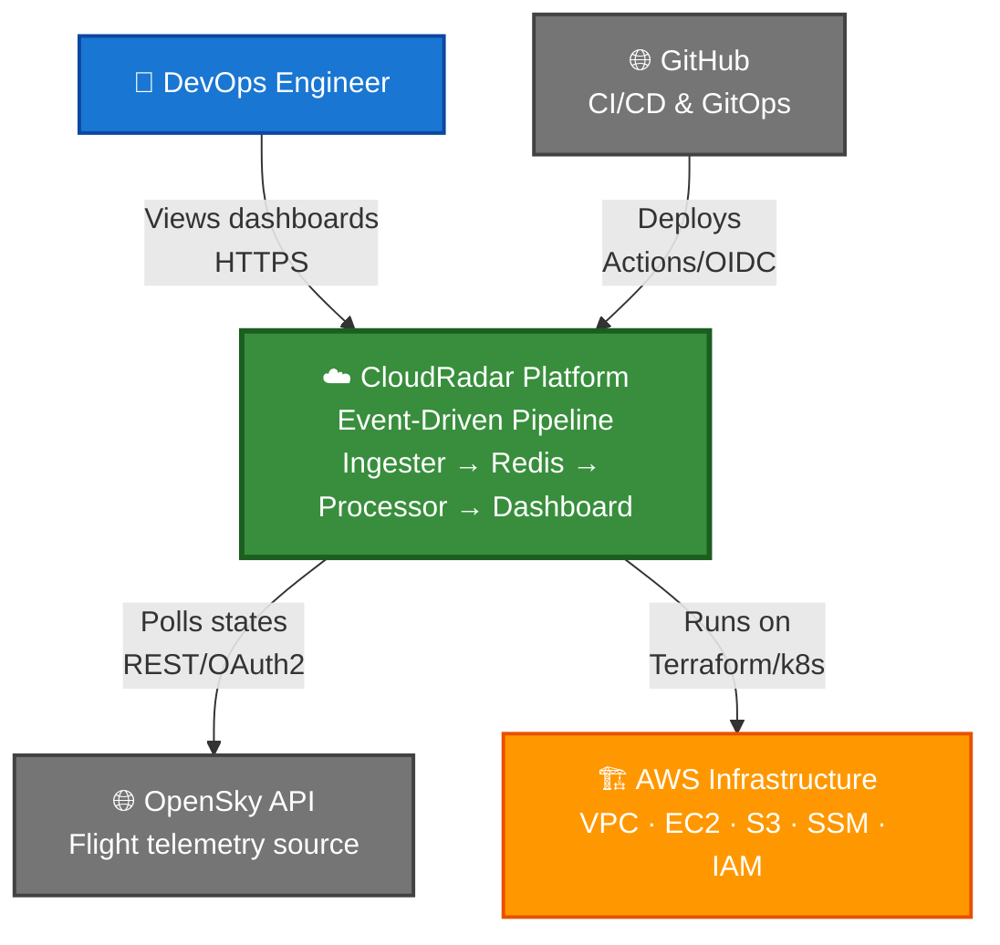
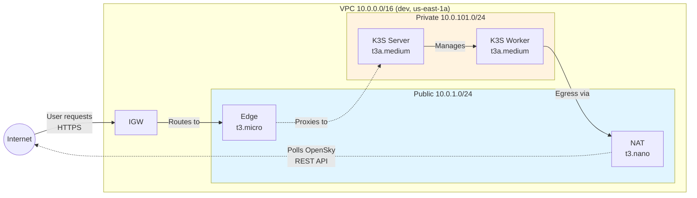
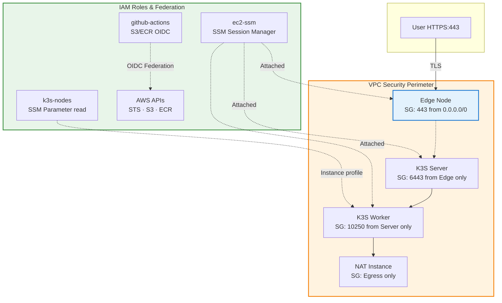
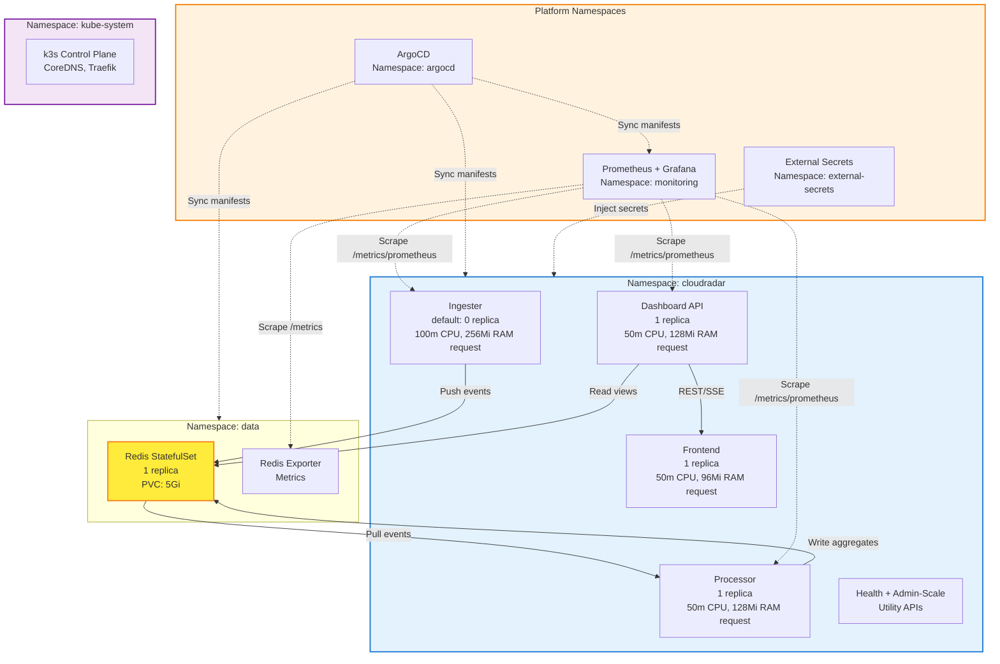
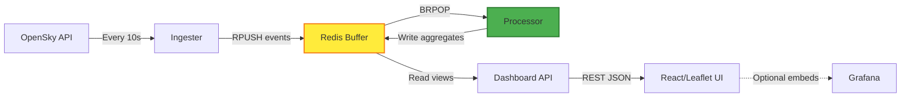
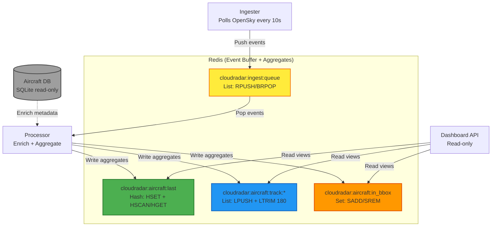
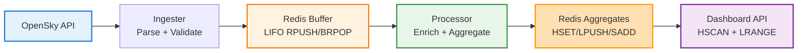
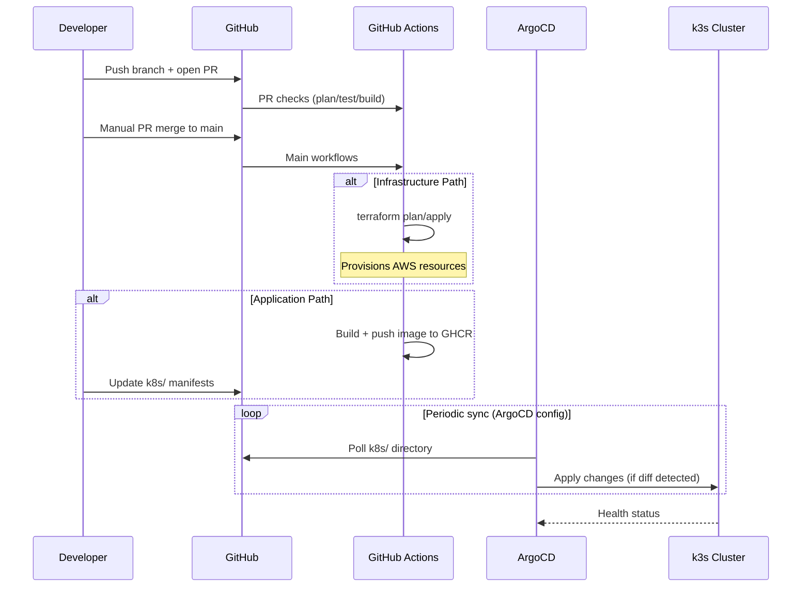
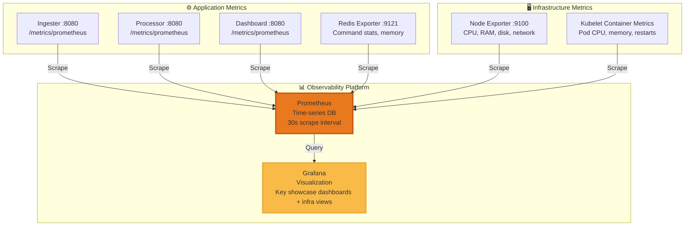
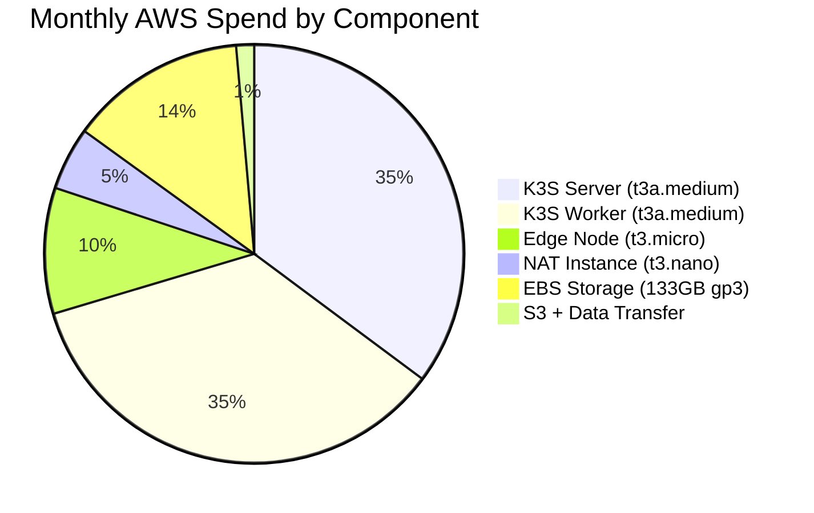

# CloudRadar — Technical Architecture Summary

**Version**: v1-mvp  
**Date**: 2026-03-10  
**Audience**: DevOps Engineers, Cloud Architects, Technical Recruiters  
**Purpose**: Portfolio showcase demonstrating production-grade cloud architecture, GitOps practices, and infrastructure automation

---

## Project Context & Objectives

CloudRadar is a real-time flight telemetry cloud platform, designed to be operated end-to-end in production-like conditions. The application path is explicit and verifiable: OpenSky API -> Ingester -> Redis -> Processor -> Dashboard API -> Interactive frontend (React/Leaflet).

The architecture separates a mostly stateless application layer (Java services, frontend, utility APIs) from a stateful data layer (Redis StatefulSet + PVC). It follows production-oriented practices: Infrastructure as Code, pull-based GitOps, native observability, IAM access control, and security guardrails by design.

AWS infrastructure is provisioned with Terraform, Kubernetes deployments are reconciled by ArgoCD, and CI/CD orchestrates build, quality gates, and deployment with explicit checks before sensitive steps. Secrets are stored in AWS SSM and synchronized to Kubernetes through External Secrets Operator, with no static cloud credentials in pipelines.

Technical choices follow an explicit FinOps strategy: maximize demonstration value while keeping operational cost low (k3s, NAT instance, OSS stack) and preserving architecture credibility for cloud architecture interviews. Key trade-offs and incidents are tracked in issues, PRs, ADRs, and runbooks to keep full decision traceability.

---

## Key Technical Achievements

**Infrastructure Automation**:
- ✅ 100% Infrastructure as Code (Terraform modules, remote state, OIDC federation)
- ✅ Multi-environment support via dedicated Terraform live roots (`infra/aws/live/dev`, `infra/aws/live/prod`)
- ✅ CI/CD largely automated end-to-end, with explicit approval gates for high-risk changes

**GitOps & Platform Engineering**:
- ✅ ArgoCD-driven continuous delivery (short sync cadence, auto-healing)
- ✅ External Secrets Operator for vault-less secrets management
- ✅ Declarative Kubernetes manifests with Kustomize overlays

**Observability & SRE Practices**:
- ✅ Full-stack metrics (app → platform → infra) with Prometheus + Grafana
- ✅ Service-level instrumentation (`/healthz` + Prometheus scrape endpoints)
- ✅ 21 Architecture Decision Records documenting trade-offs

**Security & Compliance**:
- ✅ Zero-trust network architecture (IAM-only access, no SSH)
- ✅ Secrets never committed in Git; runtime secrets managed via SSM Parameter Store + ESO
- ✅ Least-privilege IAM with clear separation between runtime node access and CI federation

**Cost Engineering (FinOps)**:
- ✅ k3s vs EKS: -$73/mo (-100% managed control plane fee)
- ✅ NAT instance vs NAT Gateway: -$28/mo (-88% NAT cost reduction)
- ✅ Current monthly spend: ~$78 (optimizable to $54 with low-risk changes)

---

## 1. System Overview

### 1.1 Context Diagram

```mermaid
graph TB
    USER[👤 DevOps Engineer]
    CORE[☁️ CloudRadar Platform<br/>Event-Driven Pipeline<br/>Ingester → Redis → Processor → Dashboard]
    
    OPENSKY[🌐 OpenSky API<br/>Flight telemetry source]
    GITHUB[🌐 GitHub<br/>CI/CD & GitOps]
    AWS[🏗️ AWS Infrastructure<br/>VPC · EC2 · S3 · SSM · IAM]
    
    USER -->|Views dashboards<br/>HTTPS| CORE
    CORE -->|Polls states<br/>REST/OAuth2| OPENSKY
    GITHUB -->|Deploys<br/>Actions/OIDC| CORE
    CORE -->|Runs on<br/>Terraform/k8s| AWS
    
    style USER fill:#1976d2,stroke:#0d47a1,stroke-width:2px,color:#fff
    style CORE fill:#388e3c,stroke:#1b5e20,stroke-width:3px,color:#fff
    style OPENSKY fill:#757575,stroke:#424242,stroke-width:2px,color:#fff
    style GITHUB fill:#757575,stroke:#424242,stroke-width:2px,color:#fff
    style AWS fill:#ff9800,stroke:#e65100,stroke-width:2px,color:#fff
```

### 1.2 Technology Stack

| Layer | Technologies | Why | Reference |
|-------|-------------|-----|-----------|
| **Infrastructure** | Terraform 1.5+, AWS VPC/EC2/S3/SSM | IaC-first, remote state (S3), immutable | [ADR-0001](decisions/ADR-0001-2026-01-08-aws-region-us-east-1.md), [ADR-0010](decisions/ADR-0010-2026-01-08-terraform-remote-state-and-oidc.md) |
| **Kubernetes** | k3s 1.28+ | -$73/mo vs EKS, <512MB RAM | [ADR-0002](decisions/ADR-0002-2026-01-08-k3s-on-ec2-for-kubernetes.md) |
| **GitOps** | ArgoCD + Kustomize | Git as source of truth, pull-based reconciliation | [ADR-0013](decisions/ADR-0013-2026-01-17-gitops-bootstrap-strategy-argocd.md) |
| **Secrets** | SSM + External Secrets Operator | No plaintext secrets committed in Git, runtime sync to k8s | [ADR-0009](decisions/ADR-0009-2026-01-08-security-baseline-secrets-and-iam.md), [ADR-0016](decisions/ADR-0016-2026-01-29-external-secrets-operator.md) |
| **Observability** | Prometheus + Grafana | Metrics-first, 7d retention, no APM cost | [ADR-0005](decisions/ADR-0005-2026-01-08-observability-prometheus-grafana.md) |
| **Application** | Java 17 + Spring Boot 3.x | Type-safe, production-proven, Actuator | [ADR-0014](decisions/ADR-0014-2026-01-19-processor-language-java.md) |
| **Event Buffer** | Redis 7.x | Simple list buffer + aggregates, no Kafka | [ADR-0015](decisions/ADR-0015-2026-01-22-redis-list-for-ingestion-queue.md) |
| **CI/CD** | GitHub Actions + OIDC | Credential-less federation, audit trail | [ADR-0006](decisions/ADR-0006-2026-01-08-ci-cd-github-actions-ghcr.md), [ADR-0010](decisions/ADR-0010-2026-01-08-terraform-remote-state-and-oidc.md) |

**Design Principles**: GitOps-first · Security-first · Cost-aware · Observability-native

---

## 2. Infrastructure Architecture

### 2.1 VPC & Network Topology

```mermaid
graph LR
    INTERNET((Internet))
    
    subgraph VPC["VPC 10.0.0.0/16 (dev, us-east-1a)"]
        IGW[IGW]
        
        direction TB
        subgraph Public["Public 10.0.1.0/24"]
            EDGE[Edge<br/>t3.micro]
            NAT[NAT<br/>t3.nano]
        end

        subgraph Private["Private 10.0.101.0/24"]
            K3S_S[K3S Server<br/>t3a.medium]
            K3S_W[K3S Worker<br/>t3a.medium]
        end
    end
    
    INTERNET -->|User requests<br/>HTTPS| IGW
    IGW -->|Routes to| EDGE
    EDGE -.->|Proxies to| K3S_S
    K3S_S -->|Manages| K3S_W
    K3S_W -->|Egress via| NAT
    NAT -.->|Polls OpenSky<br/>REST API| INTERNET

    style Public fill:#e1f5ff
    style Private fill:#fff3e0
```

**Key Characteristics**:
- **Single-AZ Design**: Cost-optimized for portfolio showcase (~$50/mo savings vs multi-AZ)
- **Defense in Depth**: Public edge + private compute, security groups restrict all ingress except HTTPS (443)
- **NAT Instance**: t3.nano saves $28/mo vs NAT Gateway, handles OpenSky egress traffic
- **EBS-Backed (dev defaults)**: gp3 volumes for k3s storage (k3s server 40GB + worker 40GB + edge 40GB + NAT 8GB + Redis PVC 5Gi ≈ 133GB total), no EFS/S3 runtime dependency

### 2.2 Security & IAM Posture

```mermaid
graph TB
    subgraph Internet[" "]
        USER[User HTTPS:443]
    end
    
    subgraph VPC["VPC Security Perimeter"]
        EDGE[Edge Node<br/>SG: 443 from 0.0.0.0/0]
        NAT[NAT Instance<br/>SG: Egress only]
        SERVER[K3S Server<br/>SG: 6443 from Edge only]
        WORKER[K3S Worker<br/>SG: 10250 from Server only]
    end
    
    subgraph IAM["IAM Roles & Federation"]
        ROLE_EC2[ec2-ssm<br/>SSM Session Manager]
        ROLE_K3S[k3s-nodes<br/>SSM Parameter read]
        ROLE_CI[github-actions<br/>S3/ECR OIDC]
        AWS_API[AWS APIs<br/>STS · S3 · ECR]
    end
    
    USER -->|TLS| EDGE
    EDGE -.-> SERVER
    SERVER --> WORKER
    WORKER --> NAT
    
    ROLE_EC2 -.->|Attached| EDGE
    ROLE_EC2 -.->|Attached| SERVER
    ROLE_EC2 -.->|Attached| WORKER
    ROLE_K3S -.->|Instance profile| WORKER
    ROLE_CI -.->|OIDC Federation| AWS_API
    
    style VPC fill:#fff3e0,stroke:#f57c00,stroke-width:2px
    style IAM fill:#e8f5e9,stroke:#388e3c,stroke-width:2px
    style EDGE fill:#e3f2fd,stroke:#1976d2,stroke-width:2px
```

**Security Layers Summary**:

| Layer | Implementation | Impact |
|-------|----------------|--------|
| **Network** | Single ingress (443), private subnets, security groups deny-by-default | Attack surface minimized |
| **Access** | No SSH keys, IAM-only (SSM Session Manager for debugging) | Zero credential sprawl |
| **Secrets** | SSM Parameter Store + External Secrets Operator | No plaintext secrets committed in Git; runtime secrets synced to k8s |
| **Edge TLS Cert** | Let's Encrypt DNS-01 -> SSM (`/cloudradar/edge/tls/*`) -> edge boot load | Public cert without port 80; cert artifacts persist outside env destroys ([ADR-0020](decisions/ADR-0020-2026-02-28-edge-tls-certificate-lifecycle-mvp.md)) |
| **IAM** | Least-privilege roles + OIDC for CI/CD (no long-lived CI secrets) | CloudTrail auditability, reduced credential sprawl |
| **Encryption** | EBS encrypted at rest, TLS in transit (edge Nginx + in-cluster ingress) | Data protection at rest/transit |
| **State** | Terraform backend in S3 (encrypted, versioned, DynamoDB lock) | Safe concurrent operations, rollback and audit history |
| **Supply Chain** | GHCR with GitHub-issued `GITHUB_TOKEN`; Hadolint + Trivy + PMD + Checkstyle + ArchUnit + SonarCloud checks in CI; PMD/Checkstyle/Trivy results in GitHub Code Scanning (SARIF) | No long-lived registry credentials, controlled artifact path with automated quality/security gates |

**Zero-Trust Principles**: No SSH keys · OIDC for CI/CD · Secrets in SSM Parameter Store · Least-privilege IAM · Single ingress (443)

### 2.3 Kubernetes Architecture

```mermaid
graph TB
    subgraph NS_Apps["Namespace: cloudradar"]
        ING[Ingester<br/>default: 0 replica<br/>100m CPU, 256Mi RAM request]
        PROC[Processor<br/>1 replica<br/>50m CPU, 128Mi RAM request]
        DASH[Dashboard API<br/>1 replica<br/>50m CPU, 128Mi RAM request]
        FE[Frontend<br/>1 replica<br/>50m CPU, 96Mi RAM request]
        HEALTH[Health + Admin-Scale<br/>Utility APIs]
    end

    subgraph NS_Data["Namespace: data"]
        REDIS[Redis StatefulSet<br/>1 replica<br/>PVC: 5Gi]
        REDIS_EXP[Redis Exporter<br/>Metrics]
    end

    subgraph NS_Platform["Platform Namespaces"]
        ARGO[ArgoCD<br/>Namespace: argocd]
        ESO[External Secrets<br/>Namespace: external-secrets]
        PROM[Prometheus + Grafana<br/>Namespace: monitoring]
    end

    subgraph NS_System["Namespace: kube-system"]
        CORE[k3s Control Plane<br/>CoreDNS, Traefik]
    end
    
    ING -->|Push events| REDIS
    REDIS -->|Pull events| PROC
    PROC -->|Write aggregates| REDIS
    DASH -->|Read views| REDIS
    DASH -->|REST/SSE| FE
    
    PROM -.->|Scrape /metrics/prometheus| ING
    PROM -.->|Scrape /metrics/prometheus| PROC
    PROM -.->|Scrape /metrics/prometheus| DASH
    PROM -.->|Scrape /metrics| REDIS_EXP
    ARGO -.->|Sync manifests| NS_Apps
    ARGO -.->|Sync manifests| NS_Data
    ARGO -.->|Sync manifests| PROM
    ESO -.->|Inject secrets| NS_Apps
    
    style NS_Apps fill:#e3f2fd,stroke:#1976d2,stroke-width:2px
    style NS_Platform fill:#fff3e0,stroke:#f57c00,stroke-width:2px
    style NS_System fill:#f3e5f5,stroke:#7b1fa2,stroke-width:2px
    style REDIS fill:#ffeb3b,stroke:#f57f17,stroke-width:2px
```

**K8s Patterns**: StatefulSets (Redis persistence) · Resource Requests/Limits · Liveness/Readiness Probes · Namespace isolation · HPA planned for selected stateless services

---

## 3. Application Architecture

### 3.1 Event-Driven Flow

```mermaid
graph LR
    O[OpenSky API] -->|Every 10s| I[Ingester]
    I -->|RPUSH events| R[Redis Buffer]
    R -->|BRPOP| P[Processor]
    P -->|Write aggregates| R
    R -->|Read views| D[Dashboard API]
    D -->|REST JSON| U[React/Leaflet UI]
    U -.->|Optional embeds| G[Grafana]
    
    style R fill:#ffeb3b,stroke:#f57f17,stroke-width:2px
    style P fill:#4caf50,stroke:#2e7d32,stroke-width:2px
```

**Flow**: OpenSky (StateVector[]) → Ingester (parse) → Redis buffer (`cloudradar:ingest:queue`) → Processor (enrich + aggregates) → Dashboard API (`HSCAN` on `cloudradar:aircraft:last` + per-flight track lookup) → React/Leaflet UI

**Ordering Semantics**: ingestion currently uses `RPUSH` + `BRPOP` on the same Redis list, which behaves as a LIFO buffer (freshness-first) rather than strict FIFO queue semantics.

**Key Patterns**: Event buffer (Redis List push/blocking-pop operations) decouples ingestion/processing · Pre-computed aggregates (hash/list/set) for <5ms reads · Idempotent processing (processor restart-safe) · Read-only SQLite for aircraft metadata

### 3.2 Component Responsibilities

| Component | Purpose | Tech | Scaling Strategy |
|-----------|---------|------|------------------|
| **Ingester** | Poll OpenSky API, parse, push to Redis | Java 17 + Spring Boot 3.x | Manual/API-driven scale (default 0, typically 0→2 replicas) |
| **Processor** | Enrich events, maintain aggregates | Java 17 + Spring Boot 3.x | Single consumer in MVP (parallelism planned in v2) |
| **Dashboard API** | REST API for flight map + details | Java 17 + Spring Boot 3.x | Stateless; horizontal replicas possible (HPA planned) |
| **Frontend** | Interactive map UI, marker details, SSE refresh loop | React 18 + TypeScript + Leaflet | Stateless; single replica in MVP (scale-out possible) |
| **Redis** | Event buffer + aggregates | Redis 7.x (StatefulSet) | Vertical (no cluster mode in MVP) |
| **Health Service** | Cluster-aware `/healthz` + `/readyz` endpoint for edge/probes | Python 3.11 | Single replica (lightweight) |
| **Admin-Scale** | HMAC-protected API to adjust ingester replicas | Python 3.11 + boto3 | Single replica (operational utility) |

**Current Scale (observed snapshot, 2026-03-10)**: ingest/process around ~6.3 events/sec, with ~62-67 active aircraft in the monitored zone. Values vary by traffic window and OpenSky availability.

---

## 4. Data Architecture

### 4.1 Redis as Event Buffer + Aggregate Store

**Design Pattern**: Redis serves dual purpose — event buffer (LIFO list via `RPUSH/BRPOP`) + pre-computed aggregates (hash/set/list structures) for near-zero latency reads.

```mermaid
graph TB
    ING[Ingester<br/>Polls OpenSky every 10s]

    subgraph Redis["Redis (Event Buffer + Aggregates)"]
        QUEUE[cloudradar:ingest:queue<br/>List: RPUSH/BRPOP]
        LATEST[cloudradar:aircraft:last<br/>Hash: HSET + HSCAN/HGET]
        TRACKS[cloudradar:aircraft:track:*<br/>List: LPUSH + LTRIM 180]
        INDEX[cloudradar:aircraft:in_bbox<br/>Set: SADD/SREM]
    end
    
    PROC[Processor<br/>Enrich + Aggregate]
    SQLITE[(Aircraft DB<br/>SQLite read-only)]
    DASH[Dashboard API<br/>Read-only]
    
    ING -->|Push events| QUEUE
    QUEUE -->|Pop events| PROC
    SQLITE -.->|Enrich metadata| PROC
    PROC -->|Write aggregates| LATEST
    PROC -->|Write aggregates| TRACKS
    PROC -->|Write aggregates| INDEX
    DASH -->|Read views| LATEST
    DASH -->|Read views| TRACKS
    DASH -->|Read views| INDEX
    
    style QUEUE fill:#ffeb3b,stroke:#f57f17,stroke-width:2px
    style LATEST fill:#4caf50,stroke:#2e7d32,stroke-width:2px
    style TRACKS fill:#2196f3,stroke:#1565c0,stroke-width:2px
    style INDEX fill:#ff9800,stroke:#e65100,stroke-width:2px
    style SQLITE fill:#9e9e9e,stroke:#424242,stroke-width:2px
```

**Performance Characteristics**:

| Metric | Value | Why It Matters |
|--------|-------|----------------|
| **Read Latency** (dashboard) | <5ms p99 | All data in-memory, no database queries |
| **Write Throughput** | ~6.3 events/sec (ingest/process observed), ~183 Redis ops/sec total commands | Distinguishes pipeline event rate from Redis aggregate read/write command volume |
| **Memory Footprint** | ~200-400MB | 400 flights × ~1KB per aggregate |
| **Data Retention** | No global TTL in MVP | Track history bounded via `LTRIM`, stale cleanup is application-managed |
| **Backup Frequency** | Backup/restore automation on infra destroy/apply workflows | No daily scheduled backup in MVP |

**Event Lifecycle** (simplified view):

```mermaid
graph LR
    A[OpenSky API]
    B[Ingester<br/>Parse + Validate]
    C[Redis Buffer<br/>LIFO RPUSH/BRPOP]
    D[Processor<br/>Enrich + Aggregate]
    E[Redis Aggregates<br/>HSET/LPUSH/SADD]
    F[Dashboard API<br/>HSCAN + LRANGE]
    
    A --> B --> C --> D --> E --> F
    
    style A fill:#e3f2fd,stroke:#1976d2,stroke-width:2px
    style C fill:#fff3e0,stroke:#f57c00,stroke-width:2px
    style D fill:#e8f5e9,stroke:#388e3c,stroke-width:2px
    style E fill:#ffe0b2,stroke:#ff9800,stroke-width:2px
    style F fill:#f3e5f5,stroke:#7b1fa2,stroke-width:2px
```

**Architectural Trade-offs** (Interview-Ready Analysis):

| Aspect | Redis In-Memory | Alternative (PostgreSQL) | Decision |
|--------|-----------------|--------------------------|----------|
| **Latency** | <5ms p99 reads | ~20-50ms (disk I/O) | ✅ **Redis wins** for real-time UX |
| **Durability** | Risk of data loss on crash | ACID guarantees | ⚠️ **Acceptable** (telemetry is ephemeral, not transactional) |
| **Scalability** | Bounded by RAM (~10K flights max) | Horizontal scaling (sharding) | ✅ **Sufficient** for MVP scope |
| **Ops Complexity** | Single StatefulSet, no schema | Migrations, backups, connection pools | ✅ **Redis simpler** for portfolio |
| **Cost** | Included in worker RAM (~1GB) | RDS t3.micro ~$15/mo | 💰 **Redis $0 extra** |

**Key Insight for Recruiters**: Redis choice demonstrates **conscious trade-off evaluation** — prioritized simplicity + latency over durability, justified by use case (real-time telemetry, not financial transactions). This is a hallmark of pragmatic architecture.

---

## 5. Deployment & GitOps

### 5.1 GitOps Workflow (Separation of Concerns)

```mermaid
sequenceDiagram
    participant Dev as Developer
    participant GH as GitHub
    participant CI as GitHub Actions
    participant ARGO as ArgoCD
    participant K3S as k3s Cluster

    Dev->>GH: Push branch + open PR
    GH->>CI: PR checks (plan/test/build)
    Dev->>GH: Manual PR merge to main
    GH->>CI: Main workflows
    
    alt Infrastructure Path
        CI->>CI: terraform plan/apply
        Note over CI: Provisions AWS resources
    end
    
    alt Application Path
        CI->>CI: Build + push image to GHCR
        Dev->>GH: Update k8s/ manifests
    end
    
    loop Periodic sync (ArgoCD config)
        ARGO->>GH: Poll k8s/ directory
        ARGO->>K3S: Apply changes (if diff detected)
    end
    
    K3S-->>ARGO: Health status
```

**DevOps Best Practices Applied**:

| Practice | Implementation | Benefit |
|----------|----------------|---------|
| **Separation of Concerns** | CI builds/tests + runs bootstrap/health checks via SSM on k3s nodes; ArgoCD reconciles app manifests | Clear responsibility boundaries, easier troubleshooting |
| **Declarative Infrastructure** | All k8s resources in Git, ArgoCD reconciles desired state | Audit trail, rollback capability, reproducibility |
| **Immutable Deployments** | New image tag → new deployment (never mutate running pods) | Reliable rollbacks, consistent environments |
| **OIDC Authentication** | GitHub Actions → AWS via OIDC federation (no long-lived secrets) | Reduced credential sprawl, CloudTrail audit, automatic rotation |
| **Automated Reconciliation** | ArgoCD self-heal and drift reconciliation (configurable) | Faster recovery from config drift, reduced MTTR |
| **GitOps Pull Model** | ArgoCD polls Git (not push), cluster credentials never leave cluster | Security (no external kubectl access), firewall-friendly |

**Pipeline Stages**:
1. **PR Validation**: `terraform validate`, `terraform plan`, linting, security scanning
2. **Build**: Docker multi-stage builds (build → test → runtime layers)
3. **Publish**: Push to GHCR with `VERSION` tags (e.g., `0.1.12`) + `latest` on `main` (plus semver tags on Git tag releases)
4. **Deploy**: Update k8s manifest image tag, then ArgoCD reconciles on its configured sync cadence
5. **Verify**: Prometheus scrapes `/metrics/prometheus` (apps) and `/metrics` (exporters), Grafana surfaces anomalies

---

## 6. Observability Stack

### 6.1 Full-Stack Metrics Coverage

```mermaid
graph TB
    subgraph Apps["⚙️ Application Metrics"]
        ING[Ingester :8080<br/>/metrics/prometheus]
        PROC[Processor :8080<br/>/metrics/prometheus]
        DASH[Dashboard :8080<br/>/metrics/prometheus]
        REDIS[Redis Exporter :9121<br/>Command stats, memory]
    end
    
    subgraph Infra["🖥️ Infrastructure Metrics"]
        NODE[Node Exporter :9100<br/>CPU, RAM, disk, network]
        CADV[Kubelet Container Metrics<br/>Pod CPU, memory, restarts]
    end
    
    subgraph Platform["📊 Observability Platform"]
        PROM[Prometheus<br/>Time-series DB<br/>30s scrape interval]
        GRAF[Grafana<br/>Visualization<br/>Key showcase dashboards + infra views]
    end
    
    ING -->|Scrape| PROM
    PROC -->|Scrape| PROM
    DASH -->|Scrape| PROM
    REDIS -->|Scrape| PROM
    NODE -->|Scrape| PROM
    CADV -->|Scrape| PROM
    
    PROM -->|Query| GRAF
    
    style PROM fill:#e8791e,stroke:#c05517,stroke-width:3px
    style GRAF fill:#f9ba48,stroke:#e8a839,stroke-width:3px
```

**Metrics Maturity Model** (Interview-Ready Framework):

| Layer | Metrics Exposed | SLI/SLO Readiness | Production-Grade? |
|-------|-----------------|-------------------|-------------------|
| **Application** | ✅ HTTP request rate, latency (p50/p95/p99), error rate ✅ Business metrics (events ingested, flights tracked) ✅ JVM heap, GC pauses, thread pools | **SLI-ready** (Golden Signals present) | ✅ Yes |
| **Platform** | ✅ Redis command duration, hit rate, memory usage ✅ Kubernetes pod restarts, CPU/RAM per container ✅ Persistent volume usage, I/O wait | **SLI-ready** (resource saturation) | ✅ Yes |
| **Infrastructure** | ✅ Node CPU/RAM/disk utilization ✅ Network bytes in/out, packet loss ✅ EBS IOPS, throughput | **Infrastructure health** | ✅ Yes |

**Key Dashboards Highlighted**:

1. **CloudRadar / App Telemetry** (Application SLIs)
   - Ingestion rate: events/sec (target: >30/sec sustained)
   - Processing lag: queue depth × avg processing time (target: <30s)
   - Error rate: failed events / total events (target: <1%)

2. **CloudRadar / Operations Overview** (Platform + Data Layer)
   - Node and pod resource signals (CPU/RAM/restarts)
   - Redis health and saturation signals (latency, memory, evictions)
   - Pipeline and service status at a glance

Additional specialized dashboards (Traefik, node exporter, Redis exporter, JVM, CloudWatch) remain available for deep-dive troubleshooting.

### 6.2 Alerting Baseline (Implemented)

Alerting is enabled in MVP with Prometheus rules + Alertmanager routing:

- **Rules source**: `k8s/apps/monitoring/alerts/prometheusrule-cloudradar-mvp.yaml`
- **Current rule set** (examples): scrape target down, processor stalled, Redis backlog high, ingester backoff active/disabled, OpenSky rate limiting
- **Routing model**:
  - Alertmanager config is generated from ESO/SSM (`k8s/apps/external-secrets/alertmanager-config.yaml`)
  - notifications route to SNS when `/cloudradar/alerting/enabled=true`
  - fallback receiver is `null` when alerting is disabled

**Observability Best Practices** (SRE Principles):
- **Instrumentation-First**: All services expose `/healthz` and Prometheus scrape endpoints before deployment (no blind spots)
- **Golden Signals**: Latency, Traffic, Errors, Saturation tracked at every layer
- **Cardinality Control**: Avoid high-cardinality labels (no unbounded callsigns in metric names)
- **Retention Strategy**: 7d local retention in Prometheus for debugging and short-term trend analysis

---

## 7. Cost Breakdown & FinOps

### 7.1 Architecture Cost Optimizations (Already Implemented)

**Strategic Decisions Delivering $150+/mo Savings vs. AWS Default Stack**:

| Decision | AWS Default Cost | CloudRadar Cost | Monthly Savings | Impact |
|----------|------------------|-----------------|-----------------|--------|
| **k3s vs EKS** | $73/mo | $0 | **-$73/mo (-100%)** | Self-managed control plane in-cluster, no AWS-managed fees |
| **NAT Instance vs Gateway** | $32/mo | $3.80/mo | **-$28/mo (-88%)** | Custom NAT on t3.nano handles <100 Mbps egress perfectly |
| **Single-AZ Design** | ~$130/mo | $78/mo | **-$52/mo (-40%)** | No cross-AZ data transfer, single instance per role |
| **gp3 vs gp2 EBS** | ~$13/mo | $10.64/mo | **-$2.40/mo (-18%)** | Same baseline perf, lower $/GB |
| **Prometheus OSS** | $31/host/mo (Datadog) | $0.40/mo (PVC only) | **-$120/mo (-99%)** | Self-hosted metrics, no commercial APM |

**Total Avoided Costs**: ~$275/mo → **Actual spend: $78/mo (72% reduction)**

### 7.2 Current Monthly Breakdown ($78 Total)

```mermaid
pie
    title Monthly AWS Spend by Component
    "K3S Server (t3a.medium)" : 27.45
    "K3S Worker (t3a.medium)" : 27.45
    "Edge Node (t3.micro)" : 7.59
    "NAT Instance (t3.nano)" : 3.80
    "EBS Storage (133GB gp3)" : 10.64
    "S3 + Data Transfer" : 1.08
```

EBS sizing note (dev defaults): 40GB (k3s server) + 40GB (k3s worker) + 40GB (edge) + 8GB (NAT) + 5Gi (Redis PVC) ≈ 133GB.

**FinOps Principles Demonstrated**:
1. **Cost-Aware Architecture**: Every design choice evaluated for cost impact (documented in ADRs)
2. **Right-Sizing**: Instance types match actual workload (no over-provisioning)
3. **OSS-First with explicit trade-offs**: Managed-service savings while documenting resilience/availability impacts

**Further Optimization Opportunities** (Optional, Low Priority):
- Spot instances for workers: -$19/mo (70% discount, some interruption risk)
- EBS volume reduction 40GB→20GB: -$5/mo (requires cleanup)
- Dev shutdown schedule (nights/weekends): -$43/mo (24/7 demo unavailable)

**Key Insight**: Current $78/mo demonstrates **mature FinOps thinking** — optimized without sacrificing functionality, every dollar justified.

---

## 8. Known Limitations & Deliberate Trade-offs

- **Single-AZ deployment**: deliberate MVP cost choice; lower resilience than multi-AZ.
- **Redis ingestion ordering**: `RPUSH/BRPOP` yields LIFO behavior (freshness bias over strict FIFO ordering).
- **In-cluster traffic**: TLS terminates at edge Nginx; internal service-to-service traffic is HTTP in private subnets.
- **Manual scaling controls**: HPA is intentionally deferred; ingester scaling is API/manual-driven in MVP.
- **Backups cadence**: restore automation is implemented, but no continuous high-frequency backup pipeline yet.

---

## 9. Reference Documentation

**For deeper technical details**:
- [Full Technical Architecture Document](./technical-architecture-document.md) — Complete 28-diagram analysis (1000+ lines)
- [Architecture Decision Records](./decisions/) — 21 ADRs (context, alternatives, trade-offs)
- [Infrastructure Documentation](./infrastructure.md) — AWS/Terraform architecture details
- [Application Architecture](./application-architecture.md) — Microservices design patterns
- [Runbooks](../runbooks/) — Bootstrap, operations, troubleshooting
- [Interview Preparation Guide](./interview-prepa.md) — Skills showcase and technical talking points

---

**Document Maintenance**: Update when major architectural changes are merged. Last updated: 2026-03-10.
