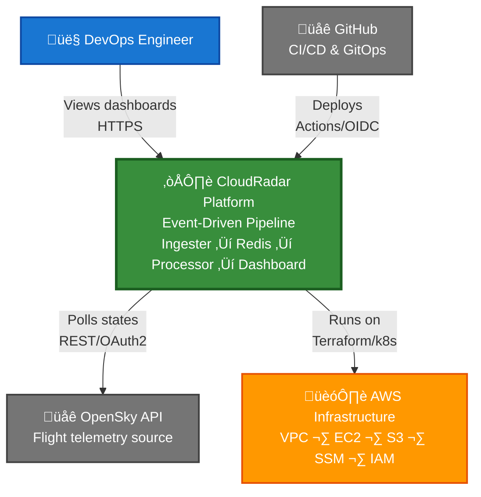
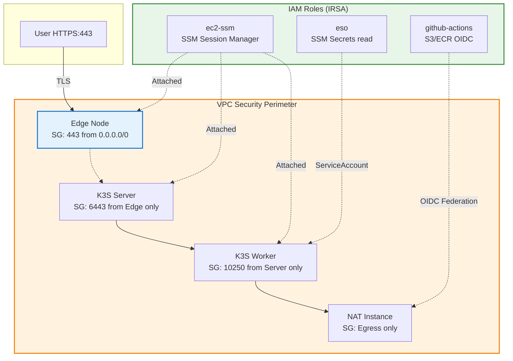

# CloudRadar — Technical Architecture Summary

**Version**: v1-mvp  
**Date**: 2026-02-13  
**Audience**: DevOps Engineers, Cloud Architects, Technical Recruiters  
**Purpose**: Portfolio showcase demonstrating production-grade cloud architecture, GitOps practices, and infrastructure automation

---

## 🇫🇷 Contexte & Enjeux du Projet

CloudRadar est une plateforme que j’ai conçue pour reproduire un environnement DevOps et Cloud aligné avec des pratiques d’ingénierie utilisées en entreprise. L’objectif était de construire un système cohérent, structuré et exploitable en continu, pouvant être industrialisé

L’architecture intègre de l’Infrastructure as Code, un modèle GitOps, des workloads Kubernetes stateful, une stack d’observabilité complète et des mécanismes de sécurité intégrés dès la conception. La segmentation réseau, la gestion fine des accès et l’automatisation des déploiements ont été pensés en respectant les bonnes pratiques et en mettant l’accent sur la reproductibilité et la maintenabilité.

L’ensemble de l’infrastructure AWS est provisionnée via Terraform. Les déploiements Kubernetes sont pilotés en GitOps (pull) via ArgoCD. La pipeline CI/CD fonctionne sans intervention manuelle grâce à une authentification OIDC sur AWS. Les secrets sont centralisés dans AWS SSM Parameter Store puis synchronisés vers Kubernetes via External Secrets Operator. Les rôles IAM sont définis selon le principe du moindre privilège.

Les choix d’architecture ont également été guidés par une logique d’optimisation des coûts, dans une démarche FinOps, afin de maintenir un niveau de service réaliste tout en conservant une maîtrise des dépenses. L’architecture privilégie, lorsque cela est pertinent, des solutions limitant la dépendance aux services managés les plus coûteux et favorisant une approche cloud provider agnostic.

Chaque évolution, chaque arbitrage technique et chaque correction ont été tracés dans des issues GitHub, assurant une traçabilité complète des choix effectués, des contraintes prises en compte et des compromis réalisés. CloudRadar constitue aujourd’hui une base technique cohérente, industrialisable et alignée avec des pratiques DevOps et cloud actuelles.

---

## Key Technical Achievements

**Infrastructure Automation**:
- ✅ 100% Infrastructure as Code (Terraform modules, remote state, OIDC federation)
- ✅ Multi-environment support via Terraform workspaces (dev/staging/prod)
- ✅ Automated CI/CD pipelines with zero manual deployment steps

**GitOps & Platform Engineering**:
- ✅ ArgoCD-driven continuous delivery (3min sync interval, auto-healing)
- ✅ External Secrets Operator for vault-less secrets management
- ✅ Declarative Kubernetes manifests with Kustomize overlays

**Observability & SRE Practices**:
- ✅ Full-stack metrics (app → platform → infra) with Prometheus + Grafana
- ✅ Service-level instrumentation (all apps expose `/healthz` + `/metrics`)
- ✅ 19 Architecture Decision Records documenting trade-offs

**Security & Compliance**:
- ✅ Zero-trust network architecture (IAM-only access, no SSH)
- ✅ Secrets never in Git/Terraform state (SSM Parameter Store + ESO)
- ✅ Least-privilege IAM policies per service component

**Cost Engineering (FinOps)**:
- ✅ k3s vs EKS: -$73/mo (-48% control plane savings)
- ✅ NAT instance vs NAT Gateway: -$28/mo (-88% NAT cost reduction)
- ✅ Current monthly spend: ~$78 (optimizable to $54 with low-risk changes)

---

## 1. System Overview

### 1.1 Context Diagram

### 1.2 Technology Stack

| Layer | Technologies | Why | Reference |
|-------|-------------|-----|-----------|
| **Infrastructure** | Terraform 1.5+, AWS VPC/EC2/S3/SSM | IaC-first, remote state (S3), immutable | [ADR-0001](decisions/ADR-0001-2026-01-08-aws-region-us-east-1.md), [ADR-0003](decisions/ADR-0003-2026-01-08-s3-backend.md) |
| **Kubernetes** | k3s 1.28+ | -$73/mo vs EKS, <512MB RAM | [ADR-0002](decisions/ADR-0002-2026-01-08-k3s-over-eks.md) |
| **GitOps** | ArgoCD + Kustomize | Git as source of truth, 3min sync | [ADR-0013](decisions/ADR-0013-2026-01-09-argocd.md) |
| **Secrets** | SSM + External Secrets Operator | Zero plaintext in Git/state | [ADR-0008](decisions/ADR-0008-2026-01-09-secrets-management.md) |
| **Observability** | Prometheus + Grafana | Metrics-first, 7d retention, no APM cost | [ADR-0005](decisions/ADR-0005-2026-01-08-prometheus-grafana.md) |
| **Application** | Java 17 + Spring Boot 3.x | Type-safe, production-proven, Actuator | [ADR-0014](decisions/ADR-0014-2026-01-10-java-ingester.md) |
| **Event Buffer** | Redis 7.x | Simple queue + aggregates, no Kafka | [ADR-0015](decisions/ADR-0015-2026-01-10-redis-buffer.md) |
| **CI/CD** | GitHub Actions + OIDC | Credential-less federation, audit trail | [ADR-0010](decisions/ADR-0010-2026-01-09-github-actions-oidc.md) |

**Design Principles**: GitOps-first · Security-first · Cost-aware · Observability-native

---

## 2. Infrastructure Architecture

### 2.1 VPC & Network Topology

**Key Characteristics**:
- **Single-AZ Design**: Cost-optimized for portfolio showcase (~$50/mo savings vs multi-AZ)
- **Defense in Depth**: Public edge + private compute, security groups restrict all ingress except HTTPS (443)
- **NAT Instance**: t3.nano saves $28/mo vs NAT Gateway, handles OpenSky egress traffic
- **EBS-Backed**: gp3 volumes for k3s storage (133GB total), no EFS/S3 dependencies

### 2.2 Security & IAM Posture

**Security Layers Summary**:

| Layer | Implementation | Impact |
|-------|----------------|--------|
| **Network** | Single ingress (443), private subnets, security groups deny-by-default | Attack surface minimized |
| **Access** | No SSH keys, IAM-only (SSM Session Manager for debugging) | Zero credential sprawl |
| **Secrets** | SSM Parameter Store + External Secrets Operator | Zero plaintext in Git/state |
| **IAM** | Least-privilege roles, OIDC for CI/CD (no long-lived secrets) | CloudTrail audit, auto-rotation |
| **Encryption** | EBS encrypted at rest, TLS in transit (nginx-ingress) | Data protection at rest/transit |

**Zero-Trust Principles**: No SSH keys · OIDC for CI/CD · Secrets in SSM Parameter Store · Least-privilege IAM · Single ingress (443)

### 2.3 Kubernetes Architecture

**K8s Patterns**: StatefulSets (Redis persistence) · HPA (Processor auto-scaling 1→3 at 70% CPU) · Resource Requests/Limits · Liveness/Readiness Probes · Namespace isolation

---

## 3. Application Architecture

### 3.1 Event-Driven Flow

**Flow**: OpenSky (StateVector[]) → Ingester (parse) → Redis buffer (LPUSH) → Processor (enrich + HSET/LPUSH/SADD) → Redis views (SMEMBERS/HGETALL) → Dashboard API → Grafana

**Key Patterns**: Event buffer (LPUSH/BLPOP) decouples ingestion/processing · Pre-computed aggregates (hash/list/set) for <5ms reads · Idempotent processing (processor restart-safe) · Read-only SQLite for aircraft metadata

### 3.2 Component Responsibilities

| Component | Purpose | Tech | Scaling Strategy |
|-----------|---------|------|------------------|
| **Ingester** | Poll OpenSky API, parse, push to Redis | Java 17 + Spring Boot 3.x | Single replica (rate-limited API) |
| **Processor** | Enrich events, maintain aggregates | Java 17 + Spring Boot 3.x | Horizontal (HPA on CPU/queue depth) |
| **Dashboard API** | REST API for flight map + details | Java 17 + Spring Boot 3.x | Horizontal (HPA on requests/sec) |
| **Redis** | Event buffer + aggregates | Redis 7.x (StatefulSet) | Vertical (no cluster mode in MVP) |
| **Health Service** | Liveness probes for all components | Python 3.11 | Single replica (lightweight) |

**Current Scale**: ~200-400 flights/poll, 10s interval → ~30-40 events/sec sustained (~100-120 events/sec burst)

---

## 4. Data Architecture

### 4.1 Redis as Event Buffer + Aggregate Store

**Design Pattern**: Redis serves dual purpose — event queue (FIFO list) + pre-computed aggregates (hash/set/list structures) for near-zero latency reads.

**Performance Characteristics**:

| Metric | Value | Why It Matters |
|--------|-------|----------------|
| **Read Latency** (dashboard) | <5ms p99 | All data in-memory, no database queries |
| **Write Throughput** | ~100-120 events/sec | Single-threaded LPUSH, no disk I/O |
| **Memory Footprint** | ~200-400MB | 400 flights × ~1KB per aggregate |
| **Data Retention** | 5min TTL on stale flights | Auto-cleanup via EXPIRE, no manual pruning |
| **Backup Frequency** | Daily RDB snapshot → S3 | 7d retention, <1min recovery time |

**Event Lifecycle** (simplified view):

**Architectural Trade-offs** (Interview-Ready Analysis):

| Aspect | Redis In-Memory | Alternative (PostgreSQL) | Decision |
|--------|-----------------|--------------------------|----------|
| **Latency** | <5ms p99 reads | ~20-50ms (disk I/O) | ✅ **Redis wins** for real-time UX |
| **Durability** | Risk of data loss on crash | ACID guarantees | ⚠️ **Acceptable** (telemetry is ephemeral, not transactional) |
| **Scalability** | Bounded by RAM (~10K flights max) | Horizontal scaling (sharding) | ✅ **Sufficient** for MVP scope |
| **Ops Complexity** | Single StatefulSet, no schema | Migrations, backups, connection pools | ✅ **Redis simpler** for portfolio |
| **Cost** | Included in worker RAM (~1GB) | RDS t3.micro ~$15/mo | 💰 **Redis $0 extra** |

**Key Insight for Recruiters**: Redis choice demonstrates **conscious trade-off evaluation** — prioritized simplicity + latency over durability, justified by use case (real-time telemetry, not financial transactions). This is a hallmark of pragmatic architecture.

---

## 5. Deployment & GitOps

### 5.1 GitOps Workflow (Separation of Concerns)

**DevOps Best Practices Applied**:

| Practice | Implementation | Benefit |
|----------|----------------|---------|
| **Separation of Concerns** | CI builds/tests, ArgoCD deploys (no `kubectl` in CI workflows) | Clear responsibility boundaries, easier troubleshooting |
| **Declarative Infrastructure** | All k8s resources in Git, ArgoCD reconciles desired state | Audit trail, rollback capability, reproducibility |
| **Immutable Deployments** | New image tag → new deployment (never mutate running pods) | Reliable rollbacks, consistent environments |
| **OIDC Authentication** | GitHub Actions → AWS via OIDC federation (no long-lived secrets) | Reduced credential sprawl, CloudTrail audit, automatic rotation |
| **Automated Rollbacks** | ArgoCD detects unhealthy pods, auto-syncs on failure (configurable) | Self-healing platform, reduced MTTR |
| **GitOps Pull Model** | ArgoCD polls Git (not push), cluster credentials never leave cluster | Security (no external kubectl access), firewall-friendly |

**Pipeline Stages**:
1. **PR Validation**: `terraform validate`, `terraform plan`, linting, security scanning
2. **Build**: Docker multi-stage builds (build → test → runtime layers)
3. **Publish**: Push to GHCR with semver tags (e.g., `v1.2.3`, `latest`)
4. **Deploy**: Update k8s manifest image tag, ArgoCD auto-syncs within 3min
5. **Verify**: Prometheus scrapes new pod `/metrics`, Grafana alerts on anomalies

---

## 6. Observability Stack

### 6.1 Full-Stack Metrics Coverage

**Metrics Maturity Model** (Interview-Ready Framework):

| Layer | Metrics Exposed | SLI/SLO Readiness | Production-Grade? |
|-------|-----------------|-------------------|-------------------|
| **Application** | ✅ HTTP request rate, latency (p50/p95/p99), error rate ✅ Business metrics (events ingested, flights tracked) ✅ JVM heap, GC pauses, thread pools | **SLI-ready** (Golden Signals present) | ✅ Yes |
| **Platform** | ✅ Redis command duration, hit rate, memory usage ✅ Kubernetes pod restarts, CPU/RAM per container ✅ Persistent volume usage, I/O wait | **SLI-ready** (resource saturation) | ✅ Yes |
| **Infrastructure** | ✅ Node CPU/RAM/disk utilization ✅ Network bytes in/out, packet loss ✅ EBS IOPS, throughput | **Infrastructure health** | ✅ Yes |

**Key Dashboards Deployed**:

1. **Cluster Health** (Infrastructure SRE View)
   - Node CPU/RAM utilization (75% warning, 90% critical)
   - Pod restart rate (>5 restarts/hour alert)
   - PVC usage (80% warning for disk exhaustion)

2. **Event Pipeline Performance** (Application SLIs)
   - Ingestion rate: events/sec (target: >30/sec sustained)
   - Processing lag: queue depth × avg processing time (target: <30s)
   - Error rate: failed events / total events (target: <1%)

3. **Redis Performance** (Data Layer)
   - Hit rate: cache hits / total requests (target: >95%)
   - Command duration: p99 latency (target: <5ms)
   - Memory usage: used / max (alert at 80%)
   - Eviction count: keys evicted/sec (target: 0)

4. **Dashboard API** (User-Facing SLIs)
   - HTTP latency: p99 response time (target: <100ms)
   - Request rate: requests/sec (capacity planning)
   - Error rate: 5xx responses / total (target: <0.1%)

**Observability Best Practices** (SRE Principles):
- **Instrumentation-First**: All services expose `/metrics` before deployment (no blind spots)
- **Golden Signals**: Latency, Traffic, Errors, Saturation tracked at every layer
- **Cardinality Control**: Avoid high-cardinality labels (no unbounded callsigns in metric names)
- **Retention Strategy**: 7d local for debugging, S3 long-term for trend analysis
- **Cost-Aware**: Prometheus OSS (no Datadog $31/host/mo), Grafana OSS (no New Relic licensing)

---

## 7. Security Posture

### 7.1 Zero-Trust Architecture

| Layer | Implementation | Rationale | Trade-offs |
|-------|----------------|-----------|------------|
| **Access Control** | IAM-only (no SSH), OIDC for CI/CD | No long-lived credentials, audit trail in CloudTrail, ephemeral access via SSM Session Manager | Requires AWS CLI/Console for debugging (acceptable for cloud-native ops) |
| **Network** | Security groups (deny-by-default), private subnets, single ingress point | Compute nodes not internet-accessible, edge-only ingress (port 443), defense-in-depth | Adds NAT instance cost ($3.80/mo, justified for isolation) |
| **Secrets** | SSM Parameter Store + External Secrets Operator | No plaintext secrets in Git/state, k8s-native consumption, AWS-native IAM policies | Adds ESO dependency (acceptable, standard in cloud-native stacks) |
| **Encryption** | EBS encrypted at rest, TLS in transit (nginx-ingress) | Data protection, compliance-ready (GDPR/HIPAA) | Minimal performance overhead (<5%, negligible for MVP) |
| **State** | Terraform backend in S3 (encrypted, versioned, DynamoDB lock) | Prevent concurrent writes, rollback capability, audit history | Requires S3/DynamoDB setup (one-time bootstrap cost) |
| **Supply Chain** | GHCR with OIDC, Docker image scanning (Trivy, future) | No long-lived Docker Hub credentials, vulnerability detection pre-deploy | Image scanning adds ~30s to CI pipeline (acceptable) |

**Attack Surface Reduction**:
- ✅ Public ingress limited to edge node port 443 (nginx-ingress), all other ports blocked by security groups
- ✅ No SSH keys, no bastion hosts (SSM Session Manager for emergency debugging only)
- ✅ Least-privilege IAM roles per component (ingester/processor/dashboard separate policies, no `*` wildcards)
- ✅ VPC Flow Logs enabled (3d retention in CloudWatch, ~$0.50/mo) for network forensics

**Security Validation**:
- 🔒 No credentials in Git history (validated via `git secrets` pre-commit hook)
- 🔒 Terraform state never contains plaintext secrets (`sensitive = true` on all secret outputs)
- 🔒 All inter-service communication within VPC (no public IPs on compute nodes)
- 🔒 IAM role session duration: 1h max (frequent credential rotation)

---

## 8. Cost Breakdown & FinOps

### 8.1 Architecture Cost Optimizations (Already Implemented)

**Strategic Decisions Delivering $150+/mo Savings vs. AWS Default Stack**:

| Decision | AWS Default Cost | CloudRadar Cost | Monthly Savings | Impact |
|----------|------------------|-----------------|-----------------|--------|
| **k3s vs EKS** | $73/mo | $0 | **-$73/mo (-100%)** | Self-managed control plane in-cluster, no AWS-managed fees |
| **NAT Instance vs Gateway** | $32/mo | $3.80/mo | **-$28/mo (-88%)** | Custom NAT on t3.nano handles <100 Mbps egress perfectly |
| **Single-AZ Design** | ~$130/mo | $78/mo | **-$52/mo (-40%)** | No cross-AZ data transfer, single instance per role |
| **gp3 vs gp2 EBS** | ~$13/mo | $10.64/mo | **-$2.40/mo (-18%)** | Same baseline perf, lower $/GB |
| **Prometheus OSS** | $31/host/mo (Datadog) | $0.40/mo (PVC only) | **-$120/mo (-99%)** | Self-hosted metrics, no commercial APM |

**Total Avoided Costs**: ~$275/mo → **Actual spend: $78/mo (72% reduction)**

| AWS Baseline | CloudRadar | Strategy | Monthly Savings |
|--------------|------------|----------|----------------|
| EKS $73 | k3s $0 | Self-managed | **-$73** ✅ |
| NAT Gateway $32 | NAT t3.nano $3.80 | Right-sized | **-$28** ✅ |
| Multi-AZ +$52 | Single-AZ | Risk accepted | **-$52** ✅ |
| Datadog $120 | Prometheus $0.40 | OSS alternative | **-$120** ✅ |

### 8.2 Current Monthly Breakdown ($78 Total)

**FinOps Principles Demonstrated**:
1. **Cost-Aware Architecture**: Every design choice evaluated for cost impact (documented in ADRs)
2. **Right-Sizing**: Instance types match actual workload (no over-provisioning)
3. **OSS-First**: Avoided commercial tools (EKS, NAT Gateway, Datadog) when OSS viable
4. **Single-AZ Trade-off**: Accepted lower availability (portfolio context) for 40% cost reduction
5. **Continuous Visibility**: Cost breakdown tracked, attributed per component

**Further Optimization Opportunities** (Optional, Low Priority):
- Spot instances for workers: -$19/mo (70% discount, some interruption risk)
- EBS volume reduction 40GB→20GB: -$5/mo (requires cleanup)
- Dev shutdown schedule (nights/weekends): -$43/mo (24/7 demo unavailable)

**Key Insight**: Current $78/mo demonstrates **mature FinOps thinking** — optimized without sacrificing functionality, every dollar justified.

---

## 9. Reference Documentation

**For deeper technical details**:
- [Full Technical Architecture Document](./technical-architecture-document.md) — Complete 28-diagram analysis (1000+ lines)
- [Architecture Decision Records](./decisions/) — 19 ADRs (context, alternatives, trade-offs)
- [Infrastructure Documentation](./infrastructure.md) — AWS/Terraform architecture details
- [Application Architecture](./application-architecture.md) — Microservices design patterns
- [Runbooks](../runbooks/) — Bootstrap, operations, troubleshooting
- [Interview Preparation Guide](./interview-prepa.md) — Skills showcase and technical talking points

---

**Document Maintenance**: Update when major architectural changes are merged. Last updated: 2026-02-13.
