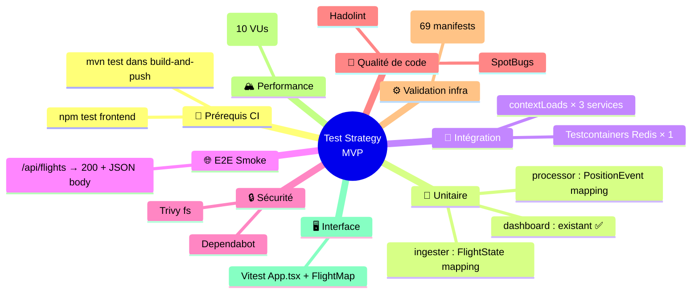
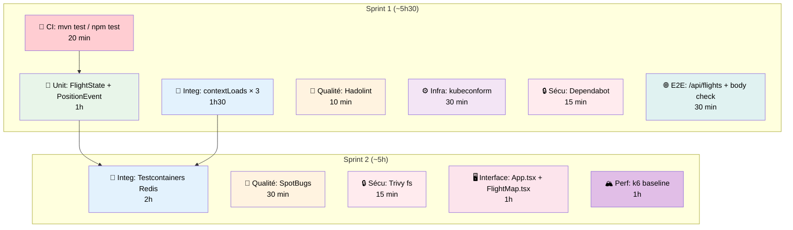

# Test Strategy MVP — CloudRadar

> Version MVP : **minimum 1 action** par type de test, focus ROI maximal.  
> Objectif : couverture visible par type et scope crédible pour un MVP.  
> Effort total estimé : **~10h30**  
> Référence complète : [test-strategy-review.md](test-strategy-review.md)

---

## Vue d'ensemble



---

## Principe

Chaque type de test ci-dessous a **au moins 1 action MVP** — les plus rentables du type.  
Le but n'est pas la couverture parfaite mais de pouvoir dire en entretien :

> "J'ai des tests unitaires, d'intégration avec Testcontainers, du smoke E2E post-deploy, du security scanning, du linting, de la validation k8s, un baseline de performance k6, et des tests de composants frontend."

> **Reviewer comment (execution guardrail #1)**  
> Treat CI test execution as a hard prerequisite: `mvn test` + `npm test` must run in CI before adding more test assets, otherwise coverage stays local-only and does not protect merges.

> **Reviewer comment (execution guardrail #2)**  
> Run `contextLoads()` very early (same initial wave as CI test execution) to catch Spring wiring/DI regressions quickly.

> **Reviewer comment (execution guardrail #3)**  
> Split checks by runtime cost: keep fast checks on PR (unit/context/lint) and move slower suites (Testcontainers, k6 baseline, heavier scans) to scheduled/nightly jobs.

---

## 0. 🚀 Prérequis CI — `mvn test` / `npm test` dans le pipeline

**Pourquoi c'est critique** : aujourd'hui `build-and-push.yml` compile et pousse les images Docker **sans exécuter aucun test**. Tous les tests du MVP (et les 4 tests existants du dashboard) ne tournent qu'en local. Sans cette étape, le reste du MVP n'a aucun effet en CI.

**Action** : ajouter `mvn test` et `npm test` dans `build-and-push.yml` avant le `docker build` :

```yaml
# build-and-push.yml — dans le job build, avant docker build
- name: Run tests
  working-directory: src/${{ matrix.service }}
  run: |
    if [ -f pom.xml ]; then
      mvn test -B -q
    elif [ -f package.json ]; then
      npm ci && npm test -- --run
    fi
```

> **Note** : le `if/elif` permet d'utiliser la même étape dans la matrice multi-service (Java + frontend). Le flag `--run` de Vitest évite le mode watch.

**Effort** : 20 min | **Impact** : ⚠️ **maximal** — sans ça, les tests existent mais ne protègent rien

---

## 1. 🧪 Test Unitaire — FlightState + PositionEvent

**Pourquoi ceux-ci** : le dashboard a déjà 4 tests unitaires. L'ingester et le processor n'en ont aucun. Ce sont les deux points d'entrée/sortie de toute la donnée.

**Actions :**

1. Ajouter `spring-boot-starter-test` au `pom.xml` de l'ingester et du processor
2. Créer les tests :

```java
// src/ingester/src/test/java/com/cloudradar/ingester/opensky/FlightStateTest.java
class FlightStateTest {

    @Test
    void mapsOpenSkyArrayToFlightState() {
        // Given: raw OpenSky JSON array for one aircraft
        Object[] raw = {"ab1234", "AFR123 ", "France", 1700000000L,
                         1700000005L, 2.35, 48.86, 10000.0, false,
                         250.0, 180.0, 5.0, null, 10200.0, "1234", false, 0};

        // When
        FlightState state = FlightState.fromArray(raw);

        // Then
        assertThat(state.icao24()).isEqualTo("ab1234");
        assertThat(state.callsign()).isEqualTo("AFR123");  // trimmed
        assertThat(state.longitude()).isEqualTo(2.35);
        assertThat(state.latitude()).isEqualTo(48.86);
        assertThat(state.onGround()).isFalse();
    }
}
```

**Test 2 : PositionEvent mapping (processor)**

```java
// src/processor/src/test/java/com/cloudradar/processor/service/PositionEventTest.java
class PositionEventTest {

    @Test
    void buildsPositionEventFromRedisHash() {
        // Given: Redis hash entries as the ingester writes them
        Map<String, String> hash = Map.of(
            "callsign", "AFR123",
            "lat", "48.86",
            "lon", "2.35",
            "alt", "10000.0",
            "velocity", "250.0",
            "heading", "180.0",
            "on_ground", "false"
        );

        // When
        PositionEvent event = PositionEvent.fromHash(hash);

        // Then
        assertThat(event.callsign()).isEqualTo("AFR123");
        assertThat(event.latitude()).isEqualTo(48.86);
        assertThat(event.onGround()).isFalse();
    }

    @Test
    void handlesNullFieldsGracefully() {
        Map<String, String> hash = Map.of("callsign", "AFR123");

        PositionEvent event = PositionEvent.fromHash(hash);

        assertThat(event.callsign()).isEqualTo("AFR123");
        assertThat(event.latitude()).isNull();
    }
}
```

**Effort** : 1h total | **Impact** : valide le parsing critique aux 2 extrémités du pipeline

---

## 2. 🔗 Test d'Intégration — `contextLoads()` + Testcontainers Redis

**Pourquoi** : un `contextLoads()` par service = filet de sécurité DI. Un test Testcontainers Redis = preuve d'intégration réelle.

### 2a. Context smoke (3 services, ~1h30 total)

```java
// Un par service : ingester, processor, dashboard
@SpringBootTest
@ActiveProfiles("test")
class IngesterApplicationTests {
    @Test
    void contextLoads() {
        // DI wiring, config binding, bean creation
    }
}
```

Avec `application-test.yml` :
```yaml
app:
  opensky.enabled: false
  scheduler.enabled: false
spring:
  data.redis.host: localhost
  data.redis.port: 6379
```

### 2b. Testcontainers Redis — ingester `RedisPublisher` (~2h)

```java
@SpringBootTest
@ActiveProfiles("test")
@Testcontainers
class RedisPublisherIntegrationTest {

    @Container
    static GenericContainer<?> redis =
        new GenericContainer<>("redis:7-alpine").withExposedPorts(6379);

    @DynamicPropertySource
    static void redisProperties(DynamicPropertyRegistry registry) {
        registry.add("spring.data.redis.host", redis::getHost);
        registry.add("spring.data.redis.port", redis::getFirstMappedPort);
    }

    @Autowired
    private RedisPublisher publisher;

    @Autowired
    private StringRedisTemplate redisTemplate;

    @Test
    void publishesFlightDataToRedis() {
        // Given: a FlightState
        FlightState state = /* test fixture */;

        // When
        publisher.publish(List.of(state));

        // Then: verify Redis keys exist with expected structure
        Map<Object, Object> hash = redisTemplate
            .opsForHash().entries("flight:" + state.icao24());
        assertThat(hash).containsKey("callsign");
        assertThat(hash.get("lat")).isEqualTo(String.valueOf(state.latitude()));
    }
}
```

**Effort** : 3h30 total | **Impact** : DI + data-path réel validés

---

## 3. 🌐 Test E2E / Smoke — `/api/flights` + body check dans CI

**Pourquoi** : le smoke test actuel vérifie `/healthz` mais pas que le pipeline de données fonctionne.

**Action 1** : ajouter le path check dans le job `smoke-tests` de `ci-infra.yml` :

```bash
# Après les checks existants /healthz /grafana/ /prometheus/
check_edge_path "/api/flights" 3
```

**Action 2** : ajouter un body check JSON (prouve que Redis contient des données) :

```bash
# Vérification que le body contient un JSON array non-vide
body="$(curl -k -sS "https://${EDGE_PUBLIC_IP}/api/flights")"
if ! echo "$body" | jq -e 'type == "array"' > /dev/null 2>&1; then
  echo "ERROR: /api/flights did not return a JSON array"
  exit 1
fi
count=$(echo "$body" | jq length)
echo "OK: /api/flights returned ${count} flights"
if [ "$count" -eq 0 ]; then
  echo "WARNING: 0 flights returned — data pipeline may not be running"
fi
```

**Effort** : 30 min | **Impact** : prouve le data-path end-to-end post-deploy

---

## 4. 🔒 Test de Sécurité — Dependabot + Trivy fs

**Pourquoi** : aucun scan de dépendances n'existe. 2 actions complémentaires (passif + actif).

### 4a. Dependabot (passif — PR automatiques)

```yaml
# .github/dependabot.yml
version: 2
updates:
  - package-ecosystem: "maven"
    directory: "/src/ingester"
    schedule: { interval: "weekly" }
  - package-ecosystem: "maven"
    directory: "/src/processor"
    schedule: { interval: "weekly" }
  - package-ecosystem: "maven"
    directory: "/src/dashboard"
    schedule: { interval: "weekly" }
  - package-ecosystem: "npm"
    directory: "/src/frontend"
    schedule: { interval: "weekly" }
  - package-ecosystem: "github-actions"
    directory: "/"
    schedule: { interval: "weekly" }
```

### 4b. Trivy fs (actif — CI gate)

```yaml
# dans build-and-push.yml, avant docker build
- name: Scan dependencies for CVEs
  uses: aquasecurity/trivy-action@master
  with:
    scan-type: fs
    scan-ref: src/${{ matrix.service }}
    severity: CRITICAL,HIGH
    exit-code: 1
```

**Effort** : 30 min | **Impact** : CVE coverage sur toutes les dépendances

---

## 5. 📏 Test Qualité de Code — Hadolint + SpotBugs

**Pourquoi** : 0 linting applicatif aujourd'hui. Hadolint = 10 min, SpotBugs = 30 min. ROI immédiat.

### 5a. Hadolint (Dockerfile)

```yaml
# dans build-and-push.yml, première étape
- name: Lint Dockerfile
  uses: hadolint/hadolint-action@v3.1.0
  with:
    dockerfile: src/${{ matrix.service }}/Dockerfile
```

### 5b. SpotBugs (Java)

Ajouter dans chaque `pom.xml` Java :
```xml
<plugin>
  <groupId>com.github.spotbugs</groupId>
  <artifactId>spotbugs-maven-plugin</artifactId>
  <version>4.8.3.1</version>
  <executions>
    <execution>
      <goals><goal>check</goal></goals>
    </execution>
  </executions>
</plugin>
```

Puis dans CI : `mvn verify` lance automatiquement SpotBugs.

**Effort** : 40 min | **Impact** : attrape null-pointer, concurrency bugs, Dockerfile anti-patterns

---

## 6. ⚙️ Test Validation Infra — kubeconform

**Pourquoi** : 69 manifests YAML, 0 validation de schéma. Le plus mature des types existants, il ne manque que ça.

**Action** : ajouter un job dans `ci-k8s.yml` :

```yaml
validate-manifests:
  runs-on: ubuntu-latest
  steps:
    - uses: actions/checkout@v4
    - name: Install kubeconform
      run: |
        curl -sSL https://github.com/yannh/kubeconform/releases/latest/download/kubeconform-linux-amd64.tar.gz \
          | tar xz -C /usr/local/bin
    - name: Validate k8s manifests
      run: |
        kubeconform -strict -summary \
          -schema-location default \
          -schema-location 'https://raw.githubusercontent.com/datreeio/CRDs-catalog/main/{{.Group}}/{{.ResourceKind}}_{{.ResourceVersion}}.json' \
          k8s/
```

**Effort** : 30 min | **Impact** : valide CRDs ArgoCD, ServiceMonitor, ExternalSecret + tous les core resources

---

## 7. 🏔️ Test de Performance — k6 baseline

**Pourquoi** : aucun test de perf. Même minimaliste, c'est un signal SRE/Platform fort en entretien.

```javascript
// tests/perf/baseline.js
import http from 'k6/http';
import { check } from 'k6';

export const options = {
  vus: 10,
  duration: '30s',
  thresholds: {
    http_req_duration: ['p95<500'],
    http_req_failed: ['rate<0.01'],
  },
};

export default function () {
  const res = http.get(`https://${__ENV.TARGET_HOST}/api/flights`);
  check(res, {
    'status 200': (r) => r.status === 200,
    'JSON array': (r) => JSON.parse(r.body).length >= 0,
  });
}
```

**Exécution** : `k6 run -e TARGET_HOST=<edge-ip> tests/perf/baseline.js`  
Pas dans le CI automatique — `workflow_dispatch` ou exécution manuelle.

**Effort** : 1h | **Impact faible sur le fonctionnel, impact fort en entretien**

---

## 8. 🖥️ Test d'Interface — Vitest `App.tsx`

**Pourquoi** : 0 test frontend. Un seul render smoke prouve que le build + les deps fonctionnent.

### Setup (~20 min)

```bash
cd src/frontend
npm install -D vitest @testing-library/react @testing-library/jest-dom jsdom
```

`vite.config.ts` :
```typescript
/// <reference types="vitest" />
export default defineConfig({
  // ... existing config
  test: {
    environment: 'jsdom',
    globals: true,
    setupFiles: './src/test/setup.ts',
  },
});
```

### Test (~10 min)

```tsx
// src/frontend/src/App.test.tsx
import { render, screen } from '@testing-library/react';
import App from './App';

test('renders without crashing', () => {
  render(<App />);
  // The app mounts, no import errors, no missing deps
  expect(document.body).toBeTruthy();
});
```

**Effort** : 30 min | **Impact** : prouve que le frontend build + monte correctement

**Test 2 : FlightMap avec données mock**

```tsx
// src/frontend/src/components/FlightMap.test.tsx
import { render } from '@testing-library/react';
import FlightMap from './FlightMap';

const mockFlights = [
  {
    icao24: 'ab1234',
    callsign: 'AFR123',
    latitude: 48.86,
    longitude: 2.35,
    altitude: 10000,
    velocity: 250,
    heading: 180,
    onGround: false,
  },
];

test('renders map with flight markers', () => {
  const { container } = render(<FlightMap flights={mockFlights} />);
  // Leaflet renders a container div
  expect(container.querySelector('.leaflet-container')).toBeTruthy();
});

test('renders empty map without crashing', () => {
  const { container } = render(<FlightMap flights={[]} />);
  expect(container.querySelector('.leaflet-container')).toBeTruthy();
});
```

**Effort total interface** : 1h | **Impact** : prouve que les 2 composants clefs montent avec et sans données

---

## Récapitulatif MVP



| # | Type | Actions MVP | Outil | Effort | Sprint |
|---|---|---|---|---|---|
| 0 | 🚀 **Prérequis CI** | **`mvn test` / `npm test` dans `build-and-push.yml`** | **Maven + npm** | **20 min** | **1** |
| 1 | 🧪 Unitaire | `FlightStateTest` + `PositionEventTest` | JUnit 5 | 1h | 1 |
| 2 | 🔗 Intégration | `contextLoads()` × 3 + Testcontainers Redis × 1 | Spring Boot Test + Testcontainers | 3h30 | 1+2 |
| 3 | 🌐 E2E / Smoke | `/api/flights` path check + body JSON validation | curl + jq via SSM | 30 min | 1 |
| 4 | 🔒 Sécurité | Dependabot + Trivy fs | Dependabot + Trivy | 30 min | 1+2 |
| 5 | 📏 Qualité de code | Hadolint + SpotBugs | Hadolint + SpotBugs Maven | 40 min | 1+2 |
| 6 | ⚙️ Validation infra | kubeconform (69 manifests + CRDs) | kubeconform | 30 min | 1 |
| 7 | 🏔️ Performance | k6 baseline (10 VUs, p95 < 500ms) | k6 | 1h | 2 |
| 8 | 🖥️ Interface | `App.test.tsx` + `FlightMap.test.tsx` | Vitest + Testing Library | 1h | 2 |
| | | **Total** | | **~10h30** | **2 sprints** |

---

## Ce que tu pourras dire en entretien

> "Sur CloudRadar j'ai mis en place une stratégie de test complète, **exécutée automatiquement en CI** à chaque PR :
> - **Tests unitaires** JUnit sur la logique de parsing des données d'entrée (ingester) et de sortie (processor)
> - **Tests d'intégration** avec `@SpringBootTest` pour valider le câblage DI sur chaque service, et **Testcontainers Redis** pour tester le data-path réel sans mock
> - **Smoke tests E2E** post-deploy qui vérifient `/healthz` et `/api/flights` (status + body JSON) automatiquement après chaque déploiement via SSM
> - **Security scanning** : tfsec sur le Terraform, GitGuardian pour les secrets, Dependabot pour les dépendances, et Trivy pour les CVEs critiques
> - **Static analysis** : SpotBugs pour les bugs potentiels Java, Hadolint pour les Dockerfiles
> - **Validation d'infra** : kubeconform sur 69 manifests Kubernetes avec support CRDs (ArgoCD, Prometheus)
> - **Baseline de performance** k6 avec des thresholds SLO (p95 < 500ms)
> - **Tests d'interface** Vitest pour valider le rendering de l'app et de la carte Leaflet avec et sans données"

Chaque phrase est vérifiable dans le repo. Aucune exagération.
