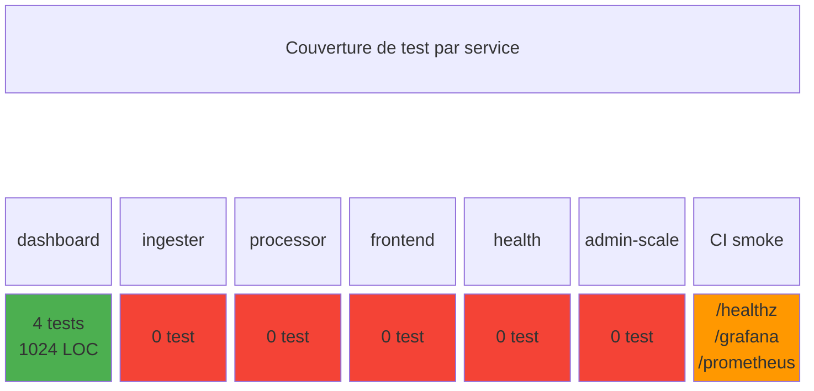
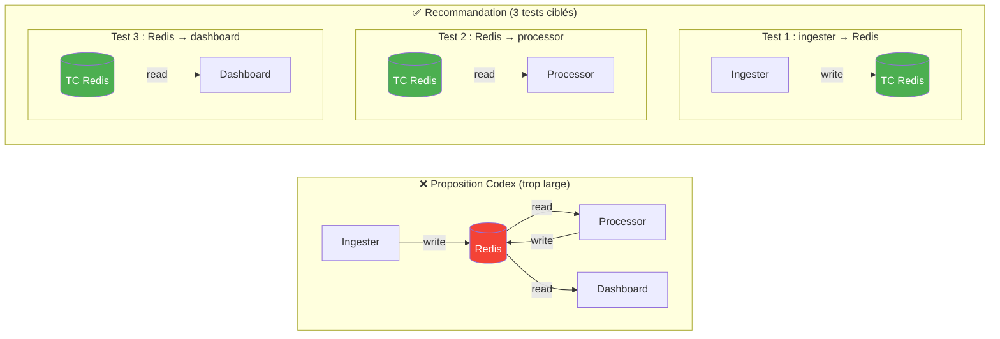
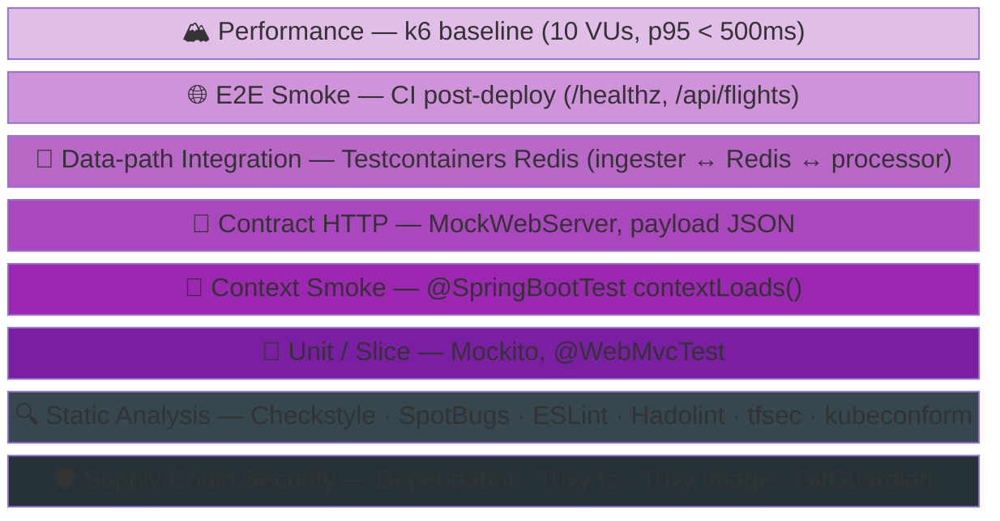
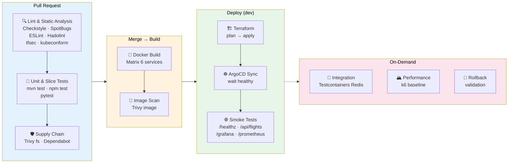
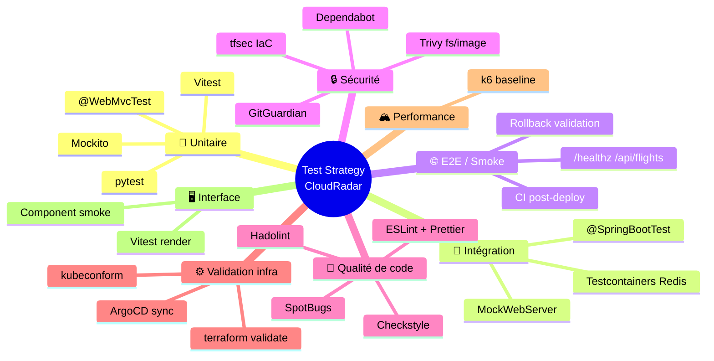
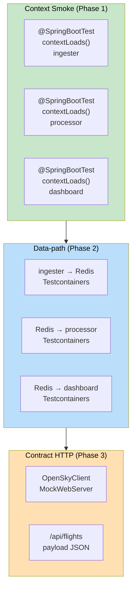
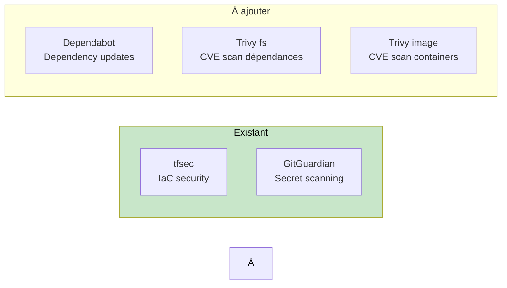
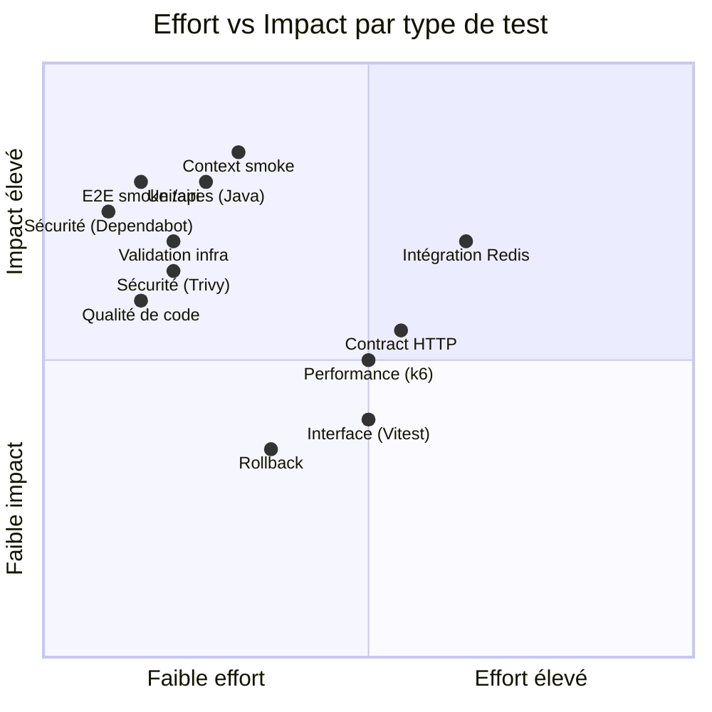

# Code Review — Proposition "Test Strategy v1.1" (Codex)

> Reviewer: GitHub Copilot  
> Date: 2026-02-23  
> Scope: Review de la proposition Codex pour introduire des tests d'intégration

---

## 1. État des lieux actuel

Avant de reviewer la proposition, il faut mesurer le point de départ :

| Service | Langage | Source files | Tests | Type | Framework test |
|---|---|---|---|---|---|
| **dashboard** | Java/Spring Boot 3.3.5 | 29 | 4 (1024 LOC) | 1 `@WebMvcTest` slice + 3 unit Mockito | `spring-boot-starter-test` |
| **ingester** | Java/Spring Boot 3.3.5 | 13 | **0** | — | **aucune dépendance test** |
| **processor** | Java/Spring Boot 3.3.5 | 8 | **0** | — | **aucune dépendance test** |
| **admin-scale** | Python 3.11 | 1 | **0** | — | — |
| **health** | Python 3.11 | ~2 | **0** | — | — |
| **frontend** | React/TS | ~20 | **0** | — | Vitest non configuré |

**Tests CI actuels :**
- `build-and-push.yml` : build Docker matrix (6 services) → **aucun `mvn test`**
- `ci-infra.yml` : smoke tests post-deploy (edge paths `/healthz`, `/grafana/`, `/prometheus/`) + ArgoCD sync check
- **Ratio actuel : 100% dashboard / 0% ailleurs**



### Diagnostic clé

Le problème n'est pas un manque de tests d'intégration — c'est un manque de tests tout court sur 5 des 6 services. La proposition Codex est bonne en structure mais **saute une étape critique** : il faut d'abord des fondations avant de penser intégration.

---

## 2. Review de la proposition Codex

### Niveau 1 : Context smoke tests — ✅ Bon, mais incomplet

> "1 test `@SpringBootTest` par service"

**Verdict : Excellent conseil, ROI maximal.**

Mais il manque un prérequis : ingester et processor n'ont même pas `spring-boot-starter-test` dans leur `pom.xml`. Il faut d'abord :

1. Ajouter la dépendance test dans `pom.xml` de ingester et processor
2. Créer le test `@SpringBootTest` qui charge le contexte
3. Exclure les beans qui nécessitent Redis/OpenSky (profil `test` ou `@MockBean`)

**Amélioration proposée :**

```java
// IngesterApplicationTests.java
@SpringBootTest
@ActiveProfiles("test")
class IngesterApplicationTests {
    @Test
    void contextLoads() {
        // catches DI wiring, missing beans, bad config
    }
}
```

Avec un `application-test.yml` minimal (scheduler disabled, Redis connection stubbed).  
Pas besoin de Testcontainers ici — juste `@MockBean` sur les clients externes.

**Effort :** ~1h par service (ingester, processor).  
**Ce que ça attrape :** erreurs de câblage DI, `@ConfigurationProperties` mal formées, constructeurs manquants — les bugs les plus fréquents lors de refactoring.

---

### Niveau 2 : Contract integration tests — ⚠️ Partiellement couvert, à recentrer

> "Test intégration endpoint réel avec dépendances mockées/stub (Redis/HTTP externe)"

**Verdict : La direction est bonne, mais il faut préciser la cible.**

Le dashboard a déjà un `@WebMvcTest(DashboardController.class)` avec `@MockBean` — c'est un test slice, pas un contract test au sens strict (pas de vérification du schéma JSON). Ce qui manque :

| Test manquant | Pourquoi c'est important |
|---|---|
| Ingester `OpenSkyClient` avec `MockWebServer` | Vérifie le parsing de la réponse OpenSky (JSON → `FlightState`) |
| Dashboard SSE endpoint (`/api/flights/stream`) | Vérifie le format SSE qu'attend le frontend |
| Dashboard `/api/flights` — payload complet | Vérifie la structure JSON finale (pas juste le status HTTP) |

**Ce que je ne recommanderais PAS :**
- ~~Contract testing (Pact/Spring Cloud Contract)~~ — overkill pour un projet solo avec 1 consommateur frontend
- ~~Test de tous les endpoints~~ — focus sur les 2-3 critiques

**Amélioration :** utiliser `MockWebServer` (OkHttp) pour l'ingester plutôt qu'un full mock Mockito du client HTTP. C'est plus réaliste et attrape les erreurs de sérialisation/désérialisation.

```java
@SpringBootTest(webEnvironment = NONE)
class OpenSkyClientIntegrationTest {
    private MockWebServer server;

    @BeforeEach void setUp() { server = new MockWebServer(); server.start(); }
    @AfterEach void tearDown() throws Exception { server.shutdown(); }

    @Test
    void parsesOpenSkyResponse() {
        server.enqueue(new MockResponse()
            .setBody(loadFixture("opensky-response.json"))
            .setHeader("Content-Type", "application/json"));
        // configure client to point at server.url("/")
        // assert FlightState list is correctly parsed
    }
}
```

---

### Niveau 3 : Data-path integration tests — ⚠️ Bon principe, mauvaise granularité

> "ingester → Redis → processor → dashboard — Testcontainers Redis"

**Verdict : Le principe est bon, l'implémentation proposée est trop ambitieuse.**

Tester la chaîne complète `ingester → Redis → processor → dashboard` dans un seul test implique 4 services Spring Boot + un Redis — c'est un test E2E déguisé. **Trop lourd, trop fragile, trop lent.**

**Ce que je recommande à la place :**



| Test | Scope | Ce qu'il valide |
|---|---|---|
| `RedisPublisherTest` (ingester) | ingester → Redis | Les clés Redis et le format de données publiés |
| `RedisAggregateProcessorTest` (processor) | Redis → processor | Le processor lit correctement ce que l'ingester écrit |
| `FlightQueryService` (dashboard) | Redis → dashboard | Le dashboard reconstruit les DTOs depuis les clés Redis |

Chaque test lance **un** Spring context + **un** Testcontainers Redis. Ils restent indépendants mais valident les mêmes clés/structures Redis — c'est un **contract test implicite par convention de clés**.

**Effort :** ~2h par test, ~6h total.  
**Impact pipeline :** +30-45s par service (Redis container startup avec cache).  
**Prérequis :** `org.testcontainers:testcontainers` + `junit-jupiter` dans les poms.

---

### Niveau 4 : E2E smoke en environnement — ✅ Déjà bien parti, à étendre

> "Après déploiement : health checks + quelques requêtes API critiques"

**Verdict : Tu as déjà la base, il manque les checks applicatifs.**

Existant (ci-infra smoke-tests) :
- ✅ ArgoCD app sync + healthy
- ✅ Edge path check : `/healthz` → 200
- ✅ Edge path check : `/grafana/` → 200/301/302
- ✅ Edge path check : `/prometheus/` → 200/301/302

Manquant :
- ❌ `/api/flights` → 200 + JSON array (prouve que le pipeline de données fonctionne)
- ❌ `/api/flights/count` ou équivalent → nombre > 0 (prouve que Redis a des données)

**Amélioration :** ajouter 2 lignes dans le smoke test existant :

```bash
check_edge_path "/api/flights" 3
# + vérification que le body contient du JSON non-vide
```

**Effort :** ~30 min.  
**Ce que ça attrape :** dérive infra/config qui casse le data flow sans casser les health checks.

---

### Ratio 70/20/10 — ⚠️ Cible correcte, mais priorisation à revoir

Le ratio proposé est standard et adapté au projet :

| Type | % cible | % actuel |
|---|---|---|
| Unit / slice | 70% | **100%** (mais uniquement dashboard) |
| Integration context/contract | 20% | **0%** |
| Pipeline / E2E smoke | 10% | **~5%** (edge path only) |

**Le problème : le ratio s'applique au dashboard, pas au projet.**

Pour que le ratio ait du sens, il faut d'abord **étendre la couverture de base** aux 3 autres services Java. L'ordre de priorité devrait être :

1. Foundation d'abord (Niveau 0 — ajouté ci-dessous)
2. Context smoke (Niveau 1)
3. Smoke E2E applicatifs (Niveau 4, quick win)
4. Data-path ciblé (Niveau 3)
5. Contract integration (Niveau 2, si budget temps)

---

## 3. Proposition améliorée — Plan incrémental

```mermaid
gantt
  title Roadmap d'implémentation des tests
  dateFormat X
  axisFormat %s h
  todayMarker off

  section Phase 0 — Fondations
    spring-boot-starter-test (pom.xml)   :a1, 0, 1
    application-test.yml                 :a2, after a1, 3
    mvn test dans CI                     :a3, after a1, 2
    Vitest frontend                      :a4, after a1, 3
    pytest health                        :a5, after a1, 2

  section Phase 1 — Context Smoke
    contextLoads × 3 services            :b1, after a5, 4
    App.test.tsx + test_healthz.py       :b2, after a5, 2

  section Phase 2 — Data-path
    Testcontainers Redis × 3             :c1, after b1, 12
    Redis keys documentation             :c2, after b1, 2

  section Phase 3 — Contract + Frontend
    MockWebServer OpenSky                :d1, after c1, 4
    Dashboard API contract               :d2, after c1, 3
    Smoke CI /api/flights                :d3, after c1, 1
    Frontend Vitest components           :d4, after c1, 4

  section Phase 4 — Excellence
    k6 performance baseline              :e1, after d1, 4
    Rollback validation                  :e2, after d1, 2
```



### Phase 0 : Fondations (prérequis, ~2h)

| Tâche | Service | Effort |
|---|---|---|
| Ajouter `spring-boot-starter-test` au `pom.xml` | ingester, processor | 10 min |
| Créer `application-test.yml` (scheduler off, Redis mock) | ingester, processor | 30 min |
| Configurer `mvn test` dans `build-and-push.yml` | CI | 20 min |
| Ajouter Vitest dans le frontend (`package.json`) | frontend | 30 min |
| Ajouter pytest pour health | health | 20 min |

> **Impact CI :** Le `build-and-push` devrait exécuter `mvn verify -DskipITs` (unit/slice only) ou l'équivalent `npm test` pour le frontend. Aujourd'hui il ne lance **aucun test** — c'est le trou le plus critique.

### Phase 1 : Context smoke — chaque service démarre (~2h)

| Test | Service | Attrape |
|---|---|---|
| `IngesterApplicationTests.contextLoads()` | ingester | DI wiring, config |
| `ProcessorApplicationTests.contextLoads()` | processor | DI wiring, config |
| `DashboardApplicationTests.contextLoads()` | dashboard | (manque aussi !) |
| `App.test.tsx` (render sans crash) | frontend | Import errors, build |
| `test_healthz.py` | health | Endpoint 200, JSON format |

### Phase 2 : Data-path ciblé avec Testcontainers (~6h)

| Test | Service | Validate |
|---|---|---|
| `RedisPublisherIntegrationTest` | ingester | Clés Redis écrites, format hash |
| `RedisAggregateProcessorIntegrationTest` | processor | Lecture et agrégation Redis |
| `FlightQueryServiceIntegrationTest` | dashboard | Reconstruction DTOs depuis Redis |

> **Convention de clés Redis** : documenter dans un fichier partagé (`docs/events-schemas/redis-keys.md`) pour que les tests restent alignés entre services.

### Phase 3 : Contract HTTP + smoke E2E étendu (~3h)

| Test | Service | Validate |
|---|---|---|
| `OpenSkyClientIntegrationTest` (MockWebServer) | ingester | Parsing JSON OpenSky |
| `DashboardApiContractTest` (payload JSON) | dashboard | Structure JSON `/api/flights` |
| Smoke test CI : `check_edge_path "/api/flights"` | ci-infra | Data flow end-to-end |

### Phase 4 : Frontend minimal (~2h)

| Test | Service | Validate |
|---|---|---|
| `FlightMap.test.tsx` (render, mock data) | frontend | Composant principal s'affiche |
| `DetailPanel.test.tsx` (render) | frontend | Panel détail avion |

---

## 4. Points d'attention

### 4.1 Coût CI

| Ajout | Impact pipeline |
|---|---|
| `mvn test` dans build-and-push | +20-30s par service |
| Testcontainers Redis | +30-45s par service (première run, cached ensuite) |
| Vitest frontend | +5-10s |
| pytest health | +2-3s |

Total estimé : **+2-3 min** sur le pipeline build. C'est acceptable si les tests sont en matrice (parallélisés par service, déjà le cas dans `build-and-push.yml`).

### 4.2 Testcontainers : attention au CI runner

GitHub Actions Ubuntu runners ont Docker, donc Testcontainers fonctionne nativement. Pas de config spéciale requise.

### 4.3 Ce que je ne recommande PAS (à ce stade)

| Outil/Approche | Pourquoi non |
|---|---|
| Pact / Spring Cloud Contract | Un seul consommateur (frontend), overkill |
| JaCoCo coverage gates | Ajouter d'abord les tests, la couverture viendra |
| Mutation testing (PIT) | Pertinent plus tard, pas maintenant |
| Test E2E frontend (Cypress/Playwright) | Trop lourd pour le MVP, les smoke CI suffisent |
| Test d'injection de fautes (Chaos) | Prématuré sans HA ni multi-node |

### 4.4 Profil `test` Spring — stratégie

Pour les tests de Phase 1, créer un `application-test.yml` par service :

```yaml
# src/ingester/src/test/resources/application-test.yml
spring:
  main:
    allow-bean-definition-overriding: true
app:
  opensky:
    enabled: false
  scheduler:
    enabled: false
  redis:
    host: localhost
    port: 6379  # stubbed by @MockBean or Testcontainers
```

Cela permet aux `@SpringBootTest` de charger le contexte sans dépendances externes réelles.

---

## 5. Catégories de tests manquantes — vers l'excellence DevOps

La stratégie Codex + les améliorations des sections 2-4 couvrent la **pyramide de tests applicatifs** (unit → intégration → E2E). Mais une stratégie de test DevOps complète dépasse le code applicatif. Voici les catégories **non couvertes** qui séparent un "bon" d'un "excellent" pipeline, sans tomber dans l'overkill.

### 5.1 Cartographie complète — ce qui existe vs ce qui manque

| Catégorie | Sous-type | Statut | Où | Effort |
|---|---|---|---|---|
| **Unit tests** | Logique métier (Mockito) | ✅ dashboard only | `src/dashboard/test/` | — |
| **Slice tests** | `@WebMvcTest` (controller layer) | ✅ dashboard only | `src/dashboard/test/` | — |
| **Context smoke** | `@SpringBootTest` | ❌ Absent | — | ~1h |
| **Integration** (data-path) | Testcontainers Redis | ❌ Absent | — | ~6h |
| **Contract HTTP** | MockWebServer / payload JSON | ❌ Absent | — | ~3h |
| **E2E smoke** (infra) | Edge path checks | ✅ Partiel | `ci-infra.yml` | ~30min pour étendre |
| **Static analysis — IaC** | tfsec (Terraform) | ✅ | `ci-infra.yml` | — |
| **Static analysis — Java** | Checkstyle / SpotBugs | ❌ Absent | — | ~1h |
| **Static analysis — Frontend** | ESLint + Prettier | ❌ Absent | — | ~30min |
| **Static analysis — Dockerfile** | Hadolint | ❌ Absent | — | ~10min |
| **K8s manifest validation** | kubeconform | ❌ Absent | — | ~30min |
| **Dependency vulnerability scan** | Dependabot / Trivy fs | ❌ Absent | — | ~30min |
| **Container image scan** | Trivy image | ❌ Absent | — | ~15min |
| **Secret scanning** | GitGuardian (GitHub App) | ✅ | GitHub App | — |
| **Performance baseline** | k6 / Artillery | ❌ Absent | — | ~2h |
| **Config drift detection** | ArgoCD sync status | ✅ | `ci-infra.yml` | — |
| **Rollback validation** | Post-rollback health check | ❌ Absent | — | ~1h |

### 5.2 Static Analysis (SAST / Linting) — **priorité haute**

La catégorie entière est absente côté applicatif. C'est le type de test le plus rentable : **0 faux négatif, pas de maintenance, exécution en secondes.**

#### Java — Checkstyle + SpotBugs

```yaml
# dans build-and-push.yml, etape avant mvn test
- name: Static analysis (Java)
  run: mvn checkstyle:check spotbugs:check -pl ${{ matrix.service }}
```

| Outil | Ce qu'il attrape | Config |
|---|---|---|
| **Checkstyle** | Style, naming, imports inutilisés, javadoc | `google_checks.xml` (standard) |
| **SpotBugs** | Null-pointer potentiels, concurrency bugs, perf anti-patterns | Plugin Maven, zero config |

**Effort** : ~1h (ajout plugins Maven + suppressions initiales).  
**Impact CI** : +5-10s par service.

#### Frontend — ESLint + Prettier

```yaml
- name: Lint frontend
  working-directory: src/frontend
  run: npx eslint src/ --max-warnings 0 && npx prettier --check src/
```

**Effort** : ~30 min (init config + fix warnings existants).  
**Impact CI** : +3-5s.

#### Dockerfile — Hadolint

Déjà recommandé dans [ci-workflows-review.md](ci-workflows-review.md) section 8.4.

```yaml
- name: Lint Dockerfile
  uses: hadolint/hadolint-action@v3.1.0
  with:
    dockerfile: src/${{ matrix.service }}/Dockerfile
```

**Effort** : ~10 min.

### 5.3 Kubernetes Manifest Validation — **priorité haute**

Tu as **69 manifests YAML** et **aucune validation de schéma**. `ci-k8s.yml` vérifie la cohérence des versions et la casse GHCR, mais ne valide pas que les manifests sont des objets Kubernetes corrects.

```yaml
# dans ci-k8s.yml
validate-manifests:
  runs-on: ubuntu-latest
  steps:
    - uses: actions/checkout@v4
    - name: Install kubeconform
      run: |
        curl -sSL https://github.com/yannh/kubeconform/releases/latest/download/kubeconform-linux-amd64.tar.gz \
          | tar xz -C /usr/local/bin
    - name: Validate k8s manifests
      run: |
        kubeconform -strict -summary \
          -schema-location default \
          -schema-location 'https://raw.githubusercontent.com/datreeio/CRDs-catalog/main/{{.Group}}/{{.ResourceKind}}_{{.ResourceVersion}}.json' \
          k8s/
```

| Outil | Avantage | Alternative |
|---|---|---|
| **kubeconform** | Rapide, supporte CRDs (ArgoCD, Prometheus), maintenu | `kubeval` (abandonné) |

**Ce que ça attrape** : champs mal nommés, apiVersion obsolètes, CRDs mal formés (ServiceMonitor, Application ArgoCD).  
**Effort** : ~30 min.  
**Impact CI** : +3-5s.  
**Pertinence DevOps** : ⭐⭐⭐ — en entretien, pouvoir dire "je valide mes manifests k8s en CI avec kubeconform et support CRDs" est un signal fort.

### 5.4 Dependency Vulnerability Scanning (SCA) — **priorité haute**

Pas de Dependabot configuré, pas de `trivy fs`. Les dépendances (Spring Boot, Redis client, Jackson) ne sont pas scannées pour des CVEs connues.

Deux options complémentaires :

#### Option A — Dependabot (passif, PR automatiques)

```yaml
# .github/dependabot.yml
version: 2
updates:
  - package-ecosystem: "maven"
    directory: "/src/ingester"
    schedule: { interval: "weekly" }
  - package-ecosystem: "maven"
    directory: "/src/processor"
    schedule: { interval: "weekly" }
  - package-ecosystem: "maven"
    directory: "/src/dashboard"
    schedule: { interval: "weekly" }
  - package-ecosystem: "npm"
    directory: "/src/frontend"
    schedule: { interval: "weekly" }
  - package-ecosystem: "github-actions"
    directory: "/"
    schedule: { interval: "weekly" }
```

#### Option B — Trivy filesystem scan (actif, bloquant en CI)

```yaml
# dans build-and-push.yml
- name: Scan dependencies for CVEs
  uses: aquasecurity/trivy-action@master
  with:
    scan-type: fs
    scan-ref: src/${{ matrix.service }}
    severity: CRITICAL,HIGH
    exit-code: 1
```

**Recommandation** : les deux. Dependabot pour les mises à jour proactives, Trivy pour le gate CI.  
**Effort** : ~30 min total.

### 5.5 Container Image Scanning — **priorité moyenne**

Les images Docker sont poussées sur GHCR sans scan de vulnérabilités. Un `trivy image` post-build détecte les CVEs dans les couches OS et les dépendances runtime.

```yaml
# dans build-and-push.yml, après docker push
- name: Scan container image
  uses: aquasecurity/trivy-action@master
  with:
    image-ref: ${{ steps.meta.outputs.tags }}
    severity: CRITICAL,HIGH
    exit-code: 0  # warning only, pas bloquant au début
```

**Effort** : ~15 min.  
**Impact CI** : +20-30s (pull + scan).

### 5.6 Performance Baseline Testing — **priorité basse, haut impact entretien**

Aucun test de performance n'existe. Pour un portfolio DevOps, même un test minimaliste démontre la compétence.

**Recommandation : k6** (open-source Grafana Labs, intégration native Prometheus/Grafana).

```javascript
// tests/perf/baseline.js
import http from 'k6/http';
import { check } from 'k6';

export const options = {
  vus: 10,               // 10 utilisateurs virtuels
  duration: '30s',
  thresholds: {
    http_req_duration: ['p95<500'],  // 95th percentile < 500ms
    http_req_failed: ['rate<0.01'],   // < 1% erreurs
  },
};

export default function () {
  const res = http.get('https://EDGE_IP/api/flights');
  check(res, {
    'status is 200': (r) => r.status === 200,
    'body is JSON array': (r) => JSON.parse(r.body).length >= 0,
  });
}
```

**Pas dans le CI standard** — à exécuter manuellement ou en workflow_dispatch post-deploy.  
**Effort** : ~2h (script + workflow optionnel).  
**Pertinence entretien** : pouvoir dire "j'ai un baseline k6 à 10 VUs avec des thresholds p95 < 500ms, intégré à Grafana" = signal fort SRE/Platform Engineering.

### 5.7 Rollback Validation — **priorité basse**

Le pipeline déploie mais ne vérifie pas que le système survit à un rollback. Dans un contexte GitOps ArgoCD, un test minimal :

```bash
# Post-deploy, vérifier que la version précédente peut être restaurée
argocd app rollback cloudradar 0  # rollback to previous sync
# re-check /healthz et /api/flights
sleep 30
check_edge_path "/healthz" 3
check_edge_path "/api/flights" 3
# re-sync to latest
argocd app sync cloudradar
```

Pas indispensable au MVP, mais pertinent en entretien pour démontrer une maturité opérationnelle.

### 5.8 Vision complète — Test Taxonomy DevOps



> Lecture : la pyramide se lit de bas en haut. Les couches basses (unit) sont nombreuses et rapides. Les couches hautes (perf, E2E) sont rares et lentes. Les deux couches transversales (static analysis + supply chain) s'exécutent en parallèle à chaque PR.

### 5.9 Où chaque test s'exécute dans le pipeline CI



### 5.10 Récapitulatif — Ordre d'implémentation complet

| Rang | Catégorie | Effort | ROI | Phase |
|---|---|---|---|---|
| 1 | `mvn test` / `npm test` dans CI | 20 min | ⭐⭐⭐⭐⭐ | Phase 0 |
| 2 | Hadolint Dockerfile | 10 min | ⭐⭐⭐⭐ | Phase 0 |
| 3 | kubeconform k8s manifests | 30 min | ⭐⭐⭐⭐ | Phase 0 |
| 4 | Dependabot config | 15 min | ⭐⭐⭐⭐ | Phase 0 |
| 5 | `@SpringBootTest.contextLoads()` × 3 | 2h | ⭐⭐⭐⭐⭐ | Phase 1 |
| 6 | ESLint + Prettier frontend | 30 min | ⭐⭐⭐ | Phase 1 |
| 7 | Checkstyle + SpotBugs Java | 1h | ⭐⭐⭐ | Phase 1 |
| 8 | Trivy fs (dependency CVEs) | 15 min | ⭐⭐⭐⭐ | Phase 1 |
| 9 | Smoke E2E `/api/flights` | 30 min | ⭐⭐⭐⭐ | Phase 1 |
| 10 | Trivy image (container CVEs) | 15 min | ⭐⭐⭐ | Phase 2 |
| 11 | Testcontainers Redis × 3 | 6h | ⭐⭐⭐ | Phase 2 |
| 12 | Contract HTTP (MockWebServer) | 3h | ⭐⭐⭐ | Phase 3 |
| 13 | Frontend Vitest | 2h | ⭐⭐ | Phase 3 |
| 14 | k6 performance baseline | 2h | ⭐⭐ (⭐⭐⭐⭐ pour entretien) | Phase 4 |
| 15 | Rollback validation | 1h | ⭐⭐ | Phase 4 |

**Total : ~20h** (vs 15h précédemment) pour passer de "tests dashboard uniquement" à "stratégie de test DevOps complète".

---

## 6. Vue par type de test

La section 3 organise le travail par **phase d'implémentation** (quand). Cette section organise le même périmètre par **type de test** (quoi), avec pour chacun : définition, outils, services concernés, et phase d'implémentation.



---

### 6.1 Tests Unitaires

> **Objectif** : valider la logique métier isolée, sans dépendances externes.

| Quoi | Service | Outil | Phase | Effort |
|---|---|---|---|---|
| Logique métier (mocking) | dashboard | Mockito + JUnit 5 | ✅ Existant | — |
| `QueryParser` string parsing | dashboard | JUnit 5 (pur) | ✅ Existant | — |
| `PlanespottersPhotoService` cache logic | dashboard | Mockito | ✅ Existant | — |
| `FlightState` mapping / DTO | ingester | JUnit 5 | Phase 1 | 30 min |
| `PositionEvent` / aggregation logic | processor | JUnit 5 | Phase 1 | 30 min |
| `test_healthz.py` endpoint logic | health | pytest | Phase 0 | 20 min |
| Composant React render | frontend | Vitest + Testing Library | Phase 4 | 2h |

**Prérequis** : `spring-boot-starter-test` dans les pom.xml (Phase 0).

**Ratio cible** : 70% du volume total de tests.

---

### 6.2 Tests d'Intégration

> **Objectif** : valider les interactions entre composants (DI wiring, Redis, HTTP externe).



| Sous-type | Service | Outil | Phase | Effort |
|---|---|---|---|---|
| **Context smoke** — DI wiring, config | ingester | `@SpringBootTest` + `@ActiveProfiles("test")` | Phase 1 | 1h |
| **Context smoke** — DI wiring, config | processor | `@SpringBootTest` + `@ActiveProfiles("test")` | Phase 1 | 1h |
| **Context smoke** — DI wiring, config | dashboard | `@SpringBootTest` | Phase 1 | 30 min |
| **Data-path** — clés Redis écrites | ingester | Testcontainers Redis | Phase 2 | 2h |
| **Data-path** — agrégation Redis | processor | Testcontainers Redis | Phase 2 | 2h |
| **Data-path** — DTOs depuis Redis | dashboard | Testcontainers Redis | Phase 2 | 2h |
| **Contract HTTP** — parsing OpenSky JSON | ingester | MockWebServer (OkHttp) | Phase 3 | 2h |
| **Contract HTTP** — payload `/api/flights` | dashboard | `@WebMvcTest` + assertions JSON | Phase 3 | 1h |

**Prérequis** : Testcontainers nécessite Docker sur le runner CI (GitHub Actions Ubuntu = OK).

**Ratio cible** : 20% du volume total de tests.

---

### 6.3 Tests E2E / Smoke

> **Objectif** : valider que le système déployé fonctionne de bout en bout.

| Quoi | Scope | Outil | Phase | Effort |
|---|---|---|---|---|
| Edge `/healthz` → 200 | Infra + app | curl via SSM | ✅ Existant | — |
| Edge `/grafana/` → 200/301 | Infra + monitoring | curl via SSM | ✅ Existant | — |
| Edge `/prometheus/` → 200/301 | Infra + monitoring | curl via SSM | ✅ Existant | — |
| ArgoCD sync + healthy | GitOps | kubectl via SSM | ✅ Existant | — |
| **`/api/flights` → 200 + JSON array** | **Data pipeline** | curl via SSM | **Phase 1** | **30 min** |
| **Rollback → re-check health** | **Résilience** | argocd CLI via SSM | **Phase 4** | **1h** |

**Impact CI** : aucun (s'intègre dans le job `smoke-tests` existant de `ci-infra.yml`).

**Ratio cible** : 10% du volume total de tests.

---

### 6.4 Tests de Sécurité

> **Objectif** : détecter les vulnérabilités dans le code, les dépendances, les images et les secrets.



| Sous-type | Scope | Outil | Phase | Effort |
|---|---|---|---|---|
| **IaC security scan** | Terraform | tfsec | ✅ Existant | — |
| **Secret scanning** | Tous les repos | GitGuardian (GitHub App) | ✅ Existant | — |
| **Dependency CVEs** (passive) | Maven + npm + Actions | Dependabot `.github/dependabot.yml` | Phase 0 | 15 min |
| **Dependency CVEs** (active, CI gate) | `src/*/` | Trivy fs (CRITICAL,HIGH) | Phase 1 | 15 min |
| **Container image CVEs** | Images GHCR post-build | Trivy image (warning only) | Phase 2 | 15 min |

**Note** : les tests de sécurité ne comptent pas dans le ratio 70/20/10 — ils sont **transversaux** et s'exécutent en parallèle.

---

### 6.5 Tests de Qualité de Code (Static Analysis)

> **Objectif** : détecter les anti-patterns, le code mort, les erreurs de style avant qu'ils n'atteignent le runtime.

| Sous-type | Langage | Outil | Phase | Effort |
|---|---|---|---|---|
| Style + conventions | Java | Checkstyle (`google_checks.xml`) | Phase 1 | 30 min |
| Bugs potentiels + null safety | Java | SpotBugs (plugin Maven) | Phase 1 | 30 min |
| Lint + best practices | TypeScript/React | ESLint | Phase 1 | 20 min |
| Format cohérent | TypeScript/React | Prettier | Phase 1 | 10 min |
| Dockerfile best practices | Docker | Hadolint | Phase 0 | 10 min |
| **IaC format** | Terraform | `terraform fmt` | ✅ Existant | — |

**Impact CI** : +10-15s total (tous les linters en parallèle dans la matrice).

---

### 6.6 Tests de Validation d'Infrastructure

> **Objectif** : valider que les manifests IaC et k8s sont syntaxiquement corrects et conformes aux schémas.

| Quoi | Scope | Outil | Phase | Effort |
|---|---|---|---|---|
| Terraform format | `infra/` | `terraform fmt -check` | ✅ Existant | — |
| Terraform validation | `infra/` | `terraform validate` | ✅ Existant | — |
| Terraform plan (dry-run) | `infra/` | `terraform plan` | ✅ Existant | — |
| Version sync images | `k8s/` | `check-app-version-sync.sh` | ✅ Existant | — |
| GHCR lowercase check | `k8s/` | `ci-k8s.yml` regex | ✅ Existant | — |
| **K8s schema validation** | **`k8s/` (69 manifests)** | **kubeconform + CRDs** | **Phase 0** | **30 min** |

**Note** : c'est le type le plus mature du projet. Il ne manque que kubeconform pour compléter.

---

### 6.7 Tests de Performance

> **Objectif** : établir une baseline mesurable pour détecter les régressions de latence.

| Quoi | Cible | Outil | Phase | Effort |
|---|---|---|---|---|
| Baseline API `/api/flights` | Dashboard | k6 (10 VUs, 30s, p95 < 500ms) | Phase 4 | 2h |

**Exécution** : `workflow_dispatch` uniquement (pas dans le CI standard). Résultats intégrables à Grafana via Prometheus remote write.

**Pertinence** : priorité basse pour le fonctionnel, mais **très haute pour les entretiens** — "j'ai un baseline k6 avec des thresholds SLO" est un signal SRE fort.

---

### 6.8 Tests d'Interface

> **Objectif** : valider que les composants frontend s'affichent correctement avec des données simulées.

| Quoi | Composant | Outil | Phase | Effort |
|---|---|---|---|---|
| Render smoke (le composant monte) | `App.tsx` | Vitest + React Testing Library | Phase 4 | 30 min |
| Carte Leaflet avec données mock | `FlightMap.tsx` | Vitest + Testing Library | Phase 4 | 1h |
| Panel détail avion | `DetailPanel.tsx` | Vitest + Testing Library | Phase 4 | 30 min |

**Ce qu'on ne fait PAS** (à ce stade) :
- ~~Cypress / Playwright~~ (E2E navigateur) — trop lourd pour un MVP
- ~~Visual regression testing~~ (Percy, Chromatic) — pertinent pour un design system, pas ici

---

### 6.9 Matrice croisée : Types × Phases



**Matrice complète :**

| Type de test | Phase 0 | Phase 1 | Phase 2 | Phase 3 | Phase 4 |
|---|---|---|---|---|---|
| 🧪 **Unitaire** | pytest health | JUnit ingester/processor | — | — | Vitest frontend |
| 🔗 **Intégration** | — | contextLoads() × 3 | Testcontainers Redis × 3 | MockWebServer + contract JSON | — |
| 🌐 **E2E / Smoke** | — | `/api/flights` dans CI smoke | — | — | Rollback validation |
| 🔒 **Sécurité** | Dependabot config | Trivy fs | Trivy image | — | — |
| 📏 **Qualité de code** | Hadolint | Checkstyle + SpotBugs + ESLint | — | — | — |
| ⚙️ **Validation infra** | kubeconform | — | — | — | — |
| 🏔️ **Performance** | — | — | — | — | k6 baseline |
| 🖥️ **Interface** | — | — | — | — | Vitest render × 3 |

> **Lecture** : chaque cellule = une action concrète. Les colonnes se lisent comme un sprint. Les lignes se lisent comme un thème de compétence à présenter en entretien.

---

## 7. Verdict

### La proposition Codex est-elle bonne ?

**Oui, la structure en 4 niveaux et le ratio 70/20/10 sont solides et standards.**  
C'est un cadre reconnu (Test Pyramid de Mike Cohn, adapté microservices).

### Ce qui manque dans la proposition :

| Gap | Impact |
|---|---|
| **Phase 0 absente** — aucune fondation test dans 5/6 services | Niveaux 1-3 impossibles sans ça |
| **`build-and-push` n'exécute aucun test** | Le pipeline build ne détecte rien, même les tests existants ne tournent qu'en local |
| **Granularité Niveau 3 trop large** | Test full-chain = E2E déguisé, préférer des tests par segment |
| **Frontend oublié** | 0 test, même un render smoke aurait de la valeur |
| **Pas de mention de documentation des clés Redis** | Les tests d'intégration inter-services nécessitent un contrat de clés partagé |
| **Pas de priorisation d'implémentation** | Phase 0 → 1 → 4(E2E) → 3 → 2, pas 1 → 2 → 3 → 4 |

### Recommandation finale

Implémenter dans cet ordre :
1. **Phase 0** — fondations + `mvn test` dans CI (**priorité maximale**, quick win)
2. **Phase 1** — context smoke par service
3. **Phase 3 partielle** — 2 checks applicatifs dans le smoke E2E existant
4. **Phase 2** — Testcontainers Redis (data-path)
5. **Phase 3 complète** — contract HTTP
6. **Phase 4** — frontend Vitest

Le tout est faisable en **~20h de travail incrémental**, réparti sur 3-4 sprints.

---

## 8. DoD pour l'issue "Test Strategy v1.1"

Si tu crées l'issue, voici le DoD proposé :

**Phase 0 — Fondations (quick wins)** :
- [ ] `spring-boot-starter-test` dans les pom.xml de ingester et processor
- [ ] `mvn test` (ou `mvn verify -DskipITs`) exécuté dans `build-and-push.yml`
- [ ] Hadolint dans `build-and-push.yml`
- [ ] kubeconform dans `ci-k8s.yml`
- [ ] `.github/dependabot.yml` configuré (maven + npm + github-actions)

**Phase 1 — Context smoke + static analysis** :
- [ ] 1 test `@SpringBootTest.contextLoads()` par service Java (3 services)
- [ ] Checkstyle + SpotBugs dans les pom.xml des services Java
- [ ] ESLint + Prettier configurés dans le frontend
- [ ] Trivy fs (dependency scan) dans `build-and-push.yml`
- [ ] 1 check applicatif ajouté au smoke test CI (`/api/flights` → 200 + JSON)

**Phase 2 — Intégration** :
- [ ] Testcontainers Redis dans au moins 1 service (ingester ou processor)
- [ ] Trivy image scan dans `build-and-push.yml`
- [ ] `docs/events-schemas/redis-keys.md` documentant les clés Redis partagées

**Phase 3 — Contract + frontend** :
- [ ] Contract HTTP test (MockWebServer ou payload JSON) dans au moins 1 service
- [ ] 1 test frontend Vitest (au moins un composant rend sans crash)

**Phase 4 — Excellence (optionnel, fort impact entretien)** :
- [ ] Script k6 baseline avec thresholds (p95 < 500ms)
- [ ] Rollback validation dans le smoke test CI
