# Code Review — "Test Strategy v1.1" Proposal (Codex)

> Reviewer: GitHub Copilot  
> Date: 2026-02-23  
> Scope: Review of the Codex proposal to introduce integration tests

---

## Status Update (2026-02-24)

Progress implemented in issue #491:
- Added `contextLoads()` smoke tests for `ingester`, `processor`, and `dashboard`.
- Added critical mapping/parsing unit tests:
  - `ingester`: `OpenSkyClientTest` (OpenSky row mapping + rate-limit headers parsing)
  - `processor`: `PositionEventTest` (JSON contract parsing/serialization)
- Added `spring-boot-starter-test` in `ingester` and `processor` test scopes.
- Updated Java service READMEs with local test command and coverage notes.

Note: most sections below keep the original proposal review snapshot from 2026-02-23 for traceability.

## 1. Current Baseline (2026-02-24)

Current repository status after issues #490 and #491:

| Service | Language | Source files | Tests | Type | Test framework |
|---|---|---|---|---|---|
| **dashboard** | Java/Spring Boot 3.3.5 | 29 | 6 test classes / 33 tests | `@WebMvcTest` + unit tests + `@SpringBootTest contextLoads()` | `spring-boot-starter-test` |
| **ingester** | Java/Spring Boot 3.3.5 | 13 | 2 test classes / 2 tests | `@SpringBootTest contextLoads()` + mapping/parsing unit test | `spring-boot-starter-test` |
| **processor** | Java/Spring Boot 3.3.5 | 8 | 2 test classes / 3 tests | `@SpringBootTest contextLoads()` + JSON contract unit tests | `spring-boot-starter-test` |
| **frontend** | React/TS | ~20 | 1 test file baseline | Vitest unit baseline | Vitest |
| **admin-scale** | Python 3.11 | 1 | 0 | — | — |
| **health** | Python 3.11 | ~2 | 0 | — | — |

**Current CI tests:**
- `build-and-push.yml`: matrix build (6 services) with blocking test gates:
  - Java (`ingester`, `processor`, `dashboard`): `mvn -B test`
  - Frontend (`frontend`): `npm ci && npm test -- --run`
- `ci-infra.yml`: post-deploy smoke tests (edge paths `/healthz`, `/grafana/`, `/prometheus/`) + ArgoCD sync check
- Current test baseline now covers all Java services plus a minimal frontend test.


### Key Diagnosis

Remaining gap is no longer the Java baseline. The next priority is now Python service coverage (`health`, `admin-scale`) and targeted integration depth (data-path and contract tests).

### Historical Snapshot (2026-02-23)

The next sections still contain the original 2026-02-23 review/proposal narrative for traceability.

---

## 2. Review of the Codex Proposal

### Level 1: Context smoke tests — ✅ Good, but incomplete

> "1 `@SpringBootTest` per service"

**Verdict: excellent recommendation, maximum ROI.**

But a prerequisite is missing: ingester and processor do not even have `spring-boot-starter-test` in their `pom.xml`. First steps should be:

1. Add test dependency to ingester and processor `pom.xml`
2. Create `@SpringBootTest` context loading test
3. Exclude beans that require Redis/OpenSky (`test` profile or `@MockBean`)

**Proposed improvement:**

```java
// IngesterApplicationTests.java
@SpringBootTest
@ActiveProfiles("test")
class IngesterApplicationTests {
    @Test
    void contextLoads() {
        // catches DI wiring, missing beans, bad config
    }
}
```

Use a minimal `application-test.yml` (scheduler disabled, Redis stubbed).  
No Testcontainers needed at this stage, just `@MockBean` for external clients.

**Effort:** ~1h per service (ingester, processor).  
**Catches:** DI wiring issues, malformed `@ConfigurationProperties`, missing constructors.

---

### Level 2: Contract integration tests — ⚠️ Partially covered, needs focus

> "Real endpoint integration test with mocked/stubbed dependencies (Redis/external HTTP)"

**Verdict: direction is good, target needs clarification.**

Dashboard already has a `@WebMvcTest(DashboardController.class)` with `@MockBean` — this is a slice test, not strict contract validation (no JSON schema-level check). Missing tests:

| Missing test | Why it matters |
|---|---|
| Ingester `OpenSkyClient` with `MockWebServer` | Validates OpenSky response parsing (JSON -> `FlightState`) |
| Dashboard SSE endpoint (`/api/flights/stream`) | Validates SSE format expected by frontend |
| Dashboard `/api/flights` full payload | Validates final JSON structure (not only HTTP status) |

**What I would NOT recommend now:**
- ~~Contract testing framework (Pact/Spring Cloud Contract)~~ — overkill for solo project with one frontend consumer
- ~~Testing every endpoint~~ — focus on 2-3 critical endpoints

**Improvement:** use `MockWebServer` (OkHttp) for ingester instead of full Mockito client mocking. It is more realistic and catches serialization/parsing issues.

```java
@SpringBootTest(webEnvironment = NONE)
class OpenSkyClientIntegrationTest {
    private MockWebServer server;

    @BeforeEach void setUp() { server = new MockWebServer(); server.start(); }
    @AfterEach void tearDown() throws Exception { server.shutdown(); }

    @Test
    void parsesOpenSkyResponse() {
        server.enqueue(new MockResponse()
            .setBody(loadFixture("opensky-response.json"))
            .setHeader("Content-Type", "application/json"));
        // configure client to point at server.url("/")
        // assert FlightState list is correctly parsed
    }
}
```

---

### Level 3: Data-path integration tests — ⚠️ Good principle, wrong granularity

> "ingester -> Redis -> processor -> dashboard — Testcontainers Redis"

**Verdict: good principle, implementation is too ambitious.**

Testing the full chain in one test means 4 Spring Boot services + Redis in one run — effectively an E2E test disguised as integration. **Too heavy, too fragile, too slow.**

**Recommended alternative:**


| Test | Scope | What it validates |
|---|---|---|
| `RedisPublisherTest` (ingester) | ingester -> Redis | Redis keys and payload format written by ingester |
| `RedisAggregateProcessorTest` (processor) | Redis -> processor | Processor correctly reads ingester output |
| `FlightQueryService` (dashboard) | Redis -> dashboard | Dashboard reconstructs DTOs from Redis keys |

Each test starts **one** Spring context + **one** Redis Testcontainer. Tests stay independent while validating the same shared Redis key contracts.

**Effort:** ~2h per test, ~6h total.  
**Pipeline impact:** +30-45s per service (Redis container startup, then cached).  
**Prerequisites:** `org.testcontainers:testcontainers` + `junit-jupiter` in poms.

---

### Level 4: Environment E2E smoke — ✅ Already started, should be extended

> "After deployment: health checks + a few critical API requests"

**Verdict: baseline exists, missing application-level checks.**

Existing (`ci-infra` smoke tests):
- ✅ ArgoCD app sync + healthy
- ✅ Edge path check: `/healthz` -> 200
- ✅ Edge path check: `/grafana/` -> 200/301/302
- ✅ Edge path check: `/prometheus/` -> 200/301/302

Missing:
- ❌ `/api/flights` -> 200 + JSON array (proves data pipeline is alive)
- ❌ `/api/flights/count` or equivalent -> value > 0 (proves Redis has data)

**Improvement:** add 2 lines to existing smoke test:

```bash
check_edge_path "/api/flights" 3
# plus verify body contains non-empty JSON
```

**Effort:** ~30 min.  
**Catches:** infra/config drift that breaks data flow while keeping health endpoints green.

---

### Ratio 70/20/10 — ⚠️ Correct target, wrong sequencing

The proposed ratio is standard and fits the project:

| Type | Target % | Current % |
|---|---|---|
| Unit / slice | 70% | **100%** (dashboard only) |
| Integration context/contract | 20% | **0%** |
| Pipeline / E2E smoke | 10% | **~5%** (edge paths only) |

**Problem:** the ratio applies to dashboard only, not to the project.

To make the ratio meaningful, we first need to extend baseline tests to the 3 other Java services. Recommended order:

1. Foundations first (Level 0 — added below)
2. Context smoke (Level 1)
3. Application E2E smoke quick wins (Level 4)
4. Targeted data-path tests (Level 3)
5. Contract integration (Level 2, if time allows)

---

## 3. Improved Proposal — Incremental Plan


### Phase 0: Foundations (prerequisites, ~2h)

| Task | Service | Effort |
|---|---|---|
| Add `spring-boot-starter-test` to `pom.xml` | ingester, processor | 10 min |
| Create `application-test.yml` (scheduler off, Redis mock) | ingester, processor | 30 min |
| Configure `mvn test` in `build-and-push.yml` | CI | 20 min |
| Add Vitest in frontend (`package.json`) | frontend | 30 min |
| Add pytest for health | health | 20 min |

> **CI impact:** `build-and-push` should run `mvn verify -DskipITs` (unit/slice only) or equivalent `npm test` for frontend. Right now it runs **no tests**.

### Phase 1: Context smoke — every service starts (~2h)

| Test | Service | Catches |
|---|---|---|
| `IngesterApplicationTests.contextLoads()` | ingester | DI wiring, config |
| `ProcessorApplicationTests.contextLoads()` | processor | DI wiring, config |
| `DashboardApplicationTests.contextLoads()` | dashboard | startup wiring regressions |
| `App.test.tsx` (render without crash) | frontend | import/build/runtime mount errors |
| `test_healthz.py` | health | endpoint 200 + JSON format |

### Phase 2: Targeted data-path with Testcontainers (~6h)

| Test | Service | Validates |
|---|---|---|
| `RedisPublisherIntegrationTest` | ingester | Redis keys written, hash format |
| `RedisAggregateProcessorIntegrationTest` | processor | Redis read + aggregation |
| `FlightQueryServiceIntegrationTest` | dashboard | DTO reconstruction from Redis |

> **Redis key convention:** document in a shared file (`docs/events-schemas/redis-keys.md`) to keep inter-service tests aligned.

### Phase 3: HTTP contract + extended E2E smoke (~3h)

| Test | Service | Validates |
|---|---|---|
| `OpenSkyClientIntegrationTest` (MockWebServer) | ingester | OpenSky JSON parsing |
| `DashboardApiContractTest` (JSON payload) | dashboard | `/api/flights` payload schema |
| CI smoke test: `check_edge_path "/api/flights"` | ci-infra | end-to-end data flow |

### Phase 4: Minimal frontend coverage (~2h)

| Test | Service | Validates |
|---|---|---|
| `FlightMap.test.tsx` (render, mock data) | frontend | main component renders |
| `DetailPanel.test.tsx` (render) | frontend | aircraft detail panel renders |

---

## 4. Attention Points

### 4.1 CI cost

| Addition | Pipeline impact |
|---|---|
| `mvn test` in build-and-push | +20-30s per Java service |
| Redis Testcontainers | +30-45s per service (first run, then cached) |
| Frontend Vitest | +5-10s |
| health pytest | +2-3s |

Estimated total: **+2-3 minutes** on build pipeline. Acceptable if tests run in matrix/parallel (already true in `build-and-push.yml`).

### 4.2 Testcontainers on CI runner

GitHub Actions Ubuntu runners include Docker, so Testcontainers works out-of-the-box.

### 4.3 What I do NOT recommend now

| Tool/Approach | Why not now |
|---|---|
| Pact / Spring Cloud Contract | One frontend consumer, overkill |
| JaCoCo coverage gates | Add tests first, enforce coverage later |
| Mutation testing (PIT) | Useful later, not now |
| Frontend browser E2E (Cypress/Playwright) | Too heavy for MVP, smoke tests are enough |
| Chaos/fault injection testing | Premature without HA/multi-node |

### 4.4 Spring `test` profile strategy

For Phase 1 tests, create one `application-test.yml` per service:

```yaml
# src/ingester/src/test/resources/application-test.yml
spring:
  main:
    allow-bean-definition-overriding: true
app:
  opensky:
    enabled: false
  scheduler:
    enabled: false
  redis:
    host: localhost
    port: 6379  # stubbed by @MockBean or Testcontainers
```

This allows `@SpringBootTest` context loading without real external dependencies.

---

## 5. Missing Test Categories — Path to DevOps Excellence

Codex strategy + improvements in sections 2-4 cover the **application testing pyramid** (unit -> integration -> E2E). A strong DevOps test strategy goes beyond app code. The categories below are **not yet covered** and differentiate a "good" from an "excellent" pipeline, without overengineering.

### 5.1 Full map — existing vs missing

| Category | Sub-type | Status | Where | Effort |
|---|---|---|---|---|
| **Unit tests** | Business logic (Mockito) | ✅ dashboard only | `src/dashboard/test/` | — |
| **Slice tests** | `@WebMvcTest` (controller layer) | ✅ dashboard only | `src/dashboard/test/` | — |
| **Context smoke** | `@SpringBootTest` | ❌ Missing | — | ~1h |
| **Integration** (data-path) | Redis Testcontainers | ❌ Missing | — | ~6h |
| **HTTP contract** | MockWebServer / JSON payload | ❌ Missing | — | ~3h |
| **E2E smoke** (infra) | Edge path checks | ✅ Partial | `ci-infra.yml` | ~30 min to extend |
| **Static analysis — IaC** | tfsec (Terraform) | ✅ | `ci-infra.yml` | — |
| **Static analysis — Java** | Checkstyle / SpotBugs | ❌ Missing | — | ~1h |
| **Static analysis — Frontend** | ESLint + Prettier | ❌ Missing | — | ~30 min |
| **Static analysis — Dockerfile** | Hadolint | ❌ Missing | — | ~10 min |
| **K8s manifest validation** | kubeconform | ❌ Missing | — | ~30 min |
| **Dependency vulnerability scan** | Dependabot / Trivy fs | ❌ Missing | — | ~30 min |
| **Container image scan** | Trivy image | ❌ Missing | — | ~15 min |
| **Secret scanning** | GitGuardian (GitHub App) | ✅ | GitHub App | — |
| **Performance baseline** | k6 / Artillery | ❌ Missing | — | ~2h |
| **Config drift detection** | ArgoCD sync status | ✅ | `ci-infra.yml` | — |
| **Rollback validation** | Post-rollback health check | ❌ Missing | — | ~1h |

### 5.2 Static analysis (SAST/linting) — **high priority**

This category is fully missing for application code. It is one of the highest-ROI test categories: **fast, deterministic, low maintenance**.

#### Java — Checkstyle + SpotBugs

```yaml
# in build-and-push.yml, before mvn test
- name: Static analysis (Java)
  run: mvn checkstyle:check spotbugs:check -pl ${{ matrix.service }}
```

| Tool | What it catches | Config |
|---|---|---|
| **Checkstyle** | Style, naming, unused imports, javadoc consistency | `google_checks.xml` |
| **SpotBugs** | Potential NPEs, concurrency bugs, perf anti-patterns | Maven plugin, low initial config |

**Effort:** ~1h (plugins + initial suppressions).  
**CI impact:** +5-10s per Java service.

#### Frontend — ESLint + Prettier

```yaml
- name: Lint frontend
  working-directory: src/frontend
  run: npx eslint src/ --max-warnings 0 && npx prettier --check src/
```

**Effort:** ~30 min.  
**CI impact:** +3-5s.

#### Dockerfile — Hadolint

Already recommended in [ci-workflows-review.md](ci-workflows-review.md) section 8.4.

```yaml
- name: Lint Dockerfile
  uses: hadolint/hadolint-action@v3.1.0
  with:
    dockerfile: src/${{ matrix.service }}/Dockerfile
```

**Effort:** ~10 min.

### 5.3 Kubernetes manifest validation — **high priority**

You have **69 YAML manifests** and no schema validation. `ci-k8s.yml` currently checks image version consistency and lowercase GHCR, but not Kubernetes schema correctness.

```yaml
# in ci-k8s.yml
validate-manifests:
  runs-on: ubuntu-latest
  steps:
    - uses: actions/checkout@v4
    - name: Install kubeconform
      run: |
        curl -sSL https://github.com/yannh/kubeconform/releases/latest/download/kubeconform-linux-amd64.tar.gz \
          | tar xz -C /usr/local/bin
    - name: Validate k8s manifests
      run: |
        kubeconform -strict -summary \
          -schema-location default \
          -schema-location 'https://raw.githubusercontent.com/datreeio/CRDs-catalog/main/{{.Group}}/{{.ResourceKind}}_{{.ResourceVersion}}.json' \
          k8s/
```

| Tool | Advantage | Alternative |
|---|---|---|
| **kubeconform** | Fast, CRD-aware (ArgoCD/Prometheus), maintained | `kubeval` (deprecated) |

**Catches:** invalid fields, outdated apiVersions, malformed CRDs (ServiceMonitor, ArgoCD Application).  
**Effort:** ~30 min.  
**CI impact:** +3-5s.  
**Interview signal:** very strong DevOps maturity marker.

### 5.4 Dependency vulnerability scanning (SCA) — **high priority**

No Dependabot config and no active `trivy fs` gate yet. Dependencies (Spring Boot, Redis client, Jackson, npm) are not continuously scanned for known CVEs.

Two complementary options:

#### Option A — Dependabot (passive, automated PRs)

```yaml
# .github/dependabot.yml
version: 2
updates:
  - package-ecosystem: "maven"
    directory: "/src/ingester"
    schedule: { interval: "weekly" }
  - package-ecosystem: "maven"
    directory: "/src/processor"
    schedule: { interval: "weekly" }
  - package-ecosystem: "maven"
    directory: "/src/dashboard"
    schedule: { interval: "weekly" }
  - package-ecosystem: "npm"
    directory: "/src/frontend"
    schedule: { interval: "weekly" }
  - package-ecosystem: "github-actions"
    directory: "/"
    schedule: { interval: "weekly" }
```

#### Option B — Trivy filesystem scan (active, CI gate)

```yaml
# in build-and-push.yml
- name: Scan dependencies for CVEs
  uses: aquasecurity/trivy-action@master
  with:
    scan-type: fs
    scan-ref: src/${{ matrix.service }}
    severity: CRITICAL,HIGH
    exit-code: 1
```

**Recommendation:** implement both. Dependabot for proactive upgrades, Trivy for blocking gate on critical findings.  
**Effort:** ~30 min total.

### 5.5 Container image scanning — **medium priority**

Docker images are pushed to GHCR without image CVE scan. Add `trivy image` post-build to detect OS/runtime layer vulnerabilities.

```yaml
# in build-and-push.yml, after docker push
- name: Scan container image
  uses: aquasecurity/trivy-action@master
  with:
    image-ref: ${{ steps.meta.outputs.tags }}
    severity: CRITICAL,HIGH
    exit-code: 0  # warning mode initially
```

**Effort:** ~15 min.  
**CI impact:** +20-30s.

### 5.6 Performance baseline testing — **low priority, high interview value**

No performance tests currently exist. For a DevOps portfolio, even a minimal baseline is valuable.

**Recommended tool: k6** (open-source, strong Grafana/Prometheus ecosystem fit).

```javascript
// tests/perf/baseline.js
import http from 'k6/http';
import { check } from 'k6';

export const options = {
  vus: 10,
  duration: '30s',
  thresholds: {
    http_req_duration: ['p95<500'],
    http_req_failed: ['rate<0.01'],
  },
};

export default function () {
  const res = http.get('https://EDGE_IP/api/flights');
  check(res, {
    'status is 200': (r) => r.status === 200,
    'body is JSON array': (r) => JSON.parse(r.body).length >= 0,
  });
}
```

Do not run in standard CI; run manually or via `workflow_dispatch` post-deploy.

**Effort:** ~2h.  
**Interview value:** strong SRE/platform signal.

### 5.7 Rollback validation — **low priority**

Pipeline deploys forward, but does not validate rollback survivability. In GitOps/ArgoCD, a minimal test pattern:

```bash
argocd app rollback cloudradar 0
sleep 30
check_edge_path "/healthz" 3
check_edge_path "/api/flights" 3
argocd app sync cloudradar
```

Not mandatory for MVP, but useful to demonstrate operational maturity.

### 5.8 Full DevOps test taxonomy view

```mermaid
block-beta
  columns 1

  P["🏔️ Performance — k6 baseline (10 VUs, p95 < 500ms)"]
  E["🌐 E2E Smoke — CI post-deploy (/healthz, /api/flights)"]
  D["🔗 Data-path Integration — Redis Testcontainers (ingester ↔ Redis ↔ processor)"]
  C["📝 HTTP Contract — MockWebServer, JSON payload"]
  S["🚀 Context Smoke — @SpringBootTest contextLoads()"]
  U["🧪 Unit / Slice — Mockito, @WebMvcTest"]
  SA["🔍 Static Analysis — Checkstyle · SpotBugs · ESLint · Hadolint · tfsec · kubeconform"]
  SC["🛡️ Supply Chain Security — Dependabot · Trivy fs · Trivy image · GitGuardian"]

  style P fill:#e1bee7,color:#000
  style E fill:#ce93d8,color:#000
  style D fill:#ba68c8,color:#fff
  style C fill:#ab47bc,color:#fff
  style S fill:#9c27b0,color:#fff
  style U fill:#7b1fa2,color:#fff
  style SA fill:#37474f,color:#fff
  style SC fill:#263238,color:#fff
```



Interpretation: read from bottom to top. Lower layers are fast and numerous; upper layers are slower and fewer. Static analysis and supply-chain checks are cross-cutting and run in parallel.

### 5.9 Where each test runs in CI pipeline


### 5.10 Complete implementation order (summary)

| Rank | Category | Effort | ROI | Phase |
|---|---|---|---|---|
| 1 | `mvn test` / `npm test` in CI | 20 min | ⭐⭐⭐⭐⭐ | Phase 0 |
| 2 | Hadolint Dockerfile | 10 min | ⭐⭐⭐⭐ | Phase 0 |
| 3 | kubeconform k8s manifests | 30 min | ⭐⭐⭐⭐ | Phase 0 |
| 4 | Dependabot config | 15 min | ⭐⭐⭐⭐ | Phase 0 |
| 5 | `@SpringBootTest.contextLoads()` x3 | 2h | ⭐⭐⭐⭐⭐ | Phase 1 |
| 6 | ESLint + Prettier frontend | 30 min | ⭐⭐⭐ | Phase 1 |
| 7 | Checkstyle + SpotBugs Java | 1h | ⭐⭐⭐ | Phase 1 |
| 8 | Trivy fs (dependency CVEs) | 15 min | ⭐⭐⭐⭐ | Phase 1 |
| 9 | E2E smoke `/api/flights` | 30 min | ⭐⭐⭐⭐ | Phase 1 |
| 10 | Trivy image (container CVEs) | 15 min | ⭐⭐⭐ | Phase 2 |
| 11 | Redis Testcontainers x3 | 6h | ⭐⭐⭐ | Phase 2 |
| 12 | HTTP contract tests (MockWebServer) | 3h | ⭐⭐⭐ | Phase 3 |
| 13 | Frontend Vitest components | 2h | ⭐⭐ | Phase 3 |
| 14 | k6 performance baseline | 2h | ⭐⭐ (⭐⭐⭐⭐ for interviews) | Phase 4 |
| 15 | Rollback validation | 1h | ⭐⭐ | Phase 4 |

**Total:** ~20h (vs previous ~15h) to move from "dashboard-only tests" to a complete DevOps-oriented test strategy.

---

## 6. View by Test Type

Section 3 organizes work by **implementation phase** (when). This section organizes the same scope by **test type** (what), with definition, tools, services, and target phase.

```mermaid
mindmap
  root((Test Strategy<br/>CloudRadar))
    🧪 Unit
      Mockito
      @WebMvcTest
      pytest
      Vitest
    🔗 Integration
      @SpringBootTest
      Redis Testcontainers
      MockWebServer
    🌐 E2E / Smoke
      CI post-deploy
      /healthz /api/flights
      Rollback validation
    🔒 Security
      tfsec IaC
      Trivy fs/image
      Dependabot
      GitGuardian
    📏 Code Quality
      Checkstyle
      SpotBugs
      ESLint + Prettier
      Hadolint
    ⚙️ Infra Validation
      kubeconform
      terraform validate
      ArgoCD sync
    🏔️ Performance
      k6 baseline
    🖥️ UI
      Vitest render
      Component smoke
```



---

### 6.1 Unit tests

> **Goal:** validate isolated business logic without external dependencies.

| What | Service | Tool | Phase | Effort |
|---|---|---|---|---|
| Business logic (mocking) | dashboard | Mockito + JUnit 5 | ✅ Existing | — |
| `QueryParser` string parsing | dashboard | JUnit 5 | ✅ Existing | — |
| `PlanespottersPhotoService` cache logic | dashboard | Mockito | ✅ Existing | — |
| `FlightState` mapping / DTO logic | ingester | JUnit 5 | Phase 1 | 30 min |
| `PositionEvent`/aggregation logic | processor | JUnit 5 | Phase 1 | 30 min |
| `test_healthz.py` endpoint logic | health | pytest | Phase 0 | 20 min |
| React component render | frontend | Vitest + Testing Library | Phase 4 | 2h |

**Prerequisite:** add `spring-boot-starter-test` to ingester and processor poms (Phase 0).

**Target ratio:** ~70% of total test volume.

---

### 6.2 Integration tests

> **Goal:** validate interactions between components (DI wiring, Redis, external HTTP).


| Sub-type | Service | Tool | Phase | Effort |
|---|---|---|---|---|
| **Context smoke** — DI/config startup | ingester | `@SpringBootTest` + `@ActiveProfiles("test")` | Phase 1 | 1h |
| **Context smoke** — DI/config startup | processor | `@SpringBootTest` + `@ActiveProfiles("test")` | Phase 1 | 1h |
| **Context smoke** — DI/config startup | dashboard | `@SpringBootTest` | Phase 1 | 30 min |
| **Data-path** — Redis keys written | ingester | Redis Testcontainers | Phase 2 | 2h |
| **Data-path** — Redis aggregation | processor | Redis Testcontainers | Phase 2 | 2h |
| **Data-path** — DTOs from Redis | dashboard | Redis Testcontainers | Phase 2 | 2h |
| **HTTP contract** — OpenSky JSON parsing | ingester | MockWebServer (OkHttp) | Phase 3 | 2h |
| **HTTP contract** — `/api/flights` payload | dashboard | `@WebMvcTest` + JSON assertions | Phase 3 | 1h |

**Prerequisite:** Docker availability on CI runners for Testcontainers (GitHub Actions Ubuntu = OK).

**Target ratio:** ~20% of total test volume.

---

### 6.3 E2E / smoke tests

> **Goal:** validate end-to-end behavior in deployed environment.

| What | Scope | Tool | Phase | Effort |
|---|---|---|---|---|
| Edge `/healthz` -> 200 | Infra + app | curl via SSM | ✅ Existing | — |
| Edge `/grafana/` -> 200/301 | Infra + monitoring | curl via SSM | ✅ Existing | — |
| Edge `/prometheus/` -> 200/301 | Infra + monitoring | curl via SSM | ✅ Existing | — |
| ArgoCD sync + healthy | GitOps | kubectl via SSM | ✅ Existing | — |
| **`/api/flights` -> 200 + JSON array** | **Data pipeline** | curl via SSM | **Phase 1** | **30 min** |
| **Rollback + health re-check** | **Resilience** | argocd CLI via SSM | **Phase 4** | **1h** |

**CI impact:** none (fits in existing `ci-infra.yml` smoke job).

**Target ratio:** ~10% of total test volume.

---

### 6.4 Security tests

> **Goal:** detect vulnerabilities in code, dependencies, images, and secrets.


| Sub-type | Scope | Tool | Phase | Effort |
|---|---|---|---|---|
| **IaC security scan** | Terraform | tfsec | ✅ Existing | — |
| **Secret scanning** | Repository | GitGuardian (GitHub App) | ✅ Existing | — |
| **Dependency CVEs** (passive) | Maven + npm + Actions | Dependabot `.github/dependabot.yml` | Phase 0 | 15 min |
| **Dependency CVEs** (active gate) | `src/*/` | Trivy fs (CRITICAL,HIGH) | Phase 1 | 15 min |
| **Image CVEs** | GHCR image post-build | Trivy image | Phase 2 | 15 min |

Security checks are cross-cutting and run in parallel with unit/integration tests.

---

### 6.5 Code quality tests (static analysis)

> **Goal:** catch anti-patterns, style issues, and potential defects before runtime.

| Sub-type | Language | Tool | Phase | Effort |
|---|---|---|---|---|
| Style + conventions | Java | Checkstyle (`google_checks.xml`) | Phase 1 | 30 min |
| Potential bugs + null safety | Java | SpotBugs (Maven plugin) | Phase 1 | 30 min |
| Lint + best practices | TypeScript/React | ESLint | Phase 1 | 20 min |
| Formatting consistency | TypeScript/React | Prettier | Phase 1 | 10 min |
| Dockerfile best practices | Docker | Hadolint | Phase 0 | 10 min |
| **IaC formatting** | Terraform | `terraform fmt` | ✅ Existing | — |

**CI impact:** +10-15s total when parallelized in matrix.

---

### 6.6 Infrastructure validation tests

> **Goal:** ensure IaC and k8s manifests are valid and schema-compliant.

| What | Scope | Tool | Phase | Effort |
|---|---|---|---|---|
| Terraform formatting | `infra/` | `terraform fmt -check` | ✅ Existing | — |
| Terraform validation | `infra/` | `terraform validate` | ✅ Existing | — |
| Terraform dry-run | `infra/` | `terraform plan` | ✅ Existing | — |
| Image tag/version sync | `k8s/` | `check-app-version-sync.sh` | ✅ Existing | — |
| GHCR lowercase check | `k8s/` | `ci-k8s.yml` regex | ✅ Existing | — |
| **K8s schema validation** | **`k8s/` (69 manifests)** | **kubeconform + CRD schemas** | **Phase 0** | **30 min** |

This area is already mature; kubeconform is the key missing piece.

---

### 6.7 Performance tests

> **Goal:** establish a measurable latency baseline and catch regressions.

| What | Target | Tool | Phase | Effort |
|---|---|---|---|---|
| `/api/flights` baseline | dashboard API | k6 (10 VUs, 30s, p95 < 500ms) | Phase 4 | 2h |

Run mode: `workflow_dispatch` or manual post-deploy, not on every PR.

---

### 6.8 UI tests

> **Goal:** validate frontend rendering behavior with mocked data.

| What | Component | Tool | Phase | Effort |
|---|---|---|---|---|
| Render smoke | `App.tsx` | Vitest + React Testing Library | Phase 4 | 30 min |
| Map render with mock flights | `FlightMap.tsx` | Vitest + Testing Library | Phase 4 | 1h |
| Aircraft detail panel render | `DetailPanel.tsx` | Vitest + Testing Library | Phase 4 | 30 min |

What we do **not** add at this stage:
- ~~Cypress/Playwright browser E2E~~ — too heavy for MVP
- ~~Visual regression tooling~~ — not needed yet

---

### 6.9 Cross matrix: test types x phases


Full matrix:

| Test type | Phase 0 | Phase 1 | Phase 2 | Phase 3 | Phase 4 |
|---|---|---|---|---|---|
| 🧪 **Unit** | pytest health | JUnit ingester/processor | — | — | Vitest frontend |
| 🔗 **Integration** | — | contextLoads() x3 | Redis Testcontainers x3 | MockWebServer + JSON contract | — |
| 🌐 **E2E / Smoke** | — | `/api/flights` in CI smoke | — | — | Rollback validation |
| 🔒 **Security** | Dependabot config | Trivy fs | Trivy image | — | — |
| 📏 **Code quality** | Hadolint | Checkstyle + SpotBugs + ESLint | — | — | — |
| ⚙️ **Infra validation** | kubeconform | — | — | — | — |
| 🏔️ **Performance** | — | — | — | — | k6 baseline |
| 🖥️ **UI** | — | — | — | — | Vitest render x3 |

---

## 7. Verdict

### Is the Codex proposal good?

**Yes.** The 4-level structure and 70/20/10 ratio are solid and aligned with standard testing strategy principles.

### What is missing in the original proposal

| Gap | Impact |
|---|---|
| **Missing Phase 0** (foundations) | Levels 1-3 are hard to execute without prerequisites |
| **No tests in `build-and-push`** | Build pipeline can pass while regressions exist |
| **Level 3 scope too broad** | Full-chain integration becomes fragile pseudo-E2E |
| **Frontend omitted** | Zero confidence on UI runtime behavior |
| **No shared Redis key contract docs** | Inter-service integration tests may drift |
| **No explicit implementation order** | Risk of doing expensive tests before quick wins |

### Final recommendation

Implement in this order:
1. **Phase 0** — foundations + test execution in CI (highest priority)
2. **Phase 1** — context smoke by service
3. **Phase 3 partial** — add app-level smoke checks to existing CI
4. **Phase 2** — Redis Testcontainers data-path tests
5. **Phase 3 full** — HTTP contract tests
6. **Phase 4** — frontend Vitest + optional excellence checks

This is achievable in **~20h incremental work**, spread over 3-4 short iterations.

---

## 8. DoD for "Test Strategy v1.1" Issue

**Phase 0 — Foundations (quick wins):**
- [ ] `spring-boot-starter-test` added to ingester and processor poms
- [ ] `mvn test` (or `mvn verify -DskipITs`) executed in `build-and-push.yml`
- [ ] Hadolint added to `build-and-push.yml`
- [ ] kubeconform added to `ci-k8s.yml`
- [ ] `.github/dependabot.yml` configured (maven + npm + github-actions)

**Phase 1 — Context smoke + static analysis:**
- [ ] one `@SpringBootTest.contextLoads()` test per Java service (3 services)
- [ ] Checkstyle + SpotBugs added to Java poms
- [ ] ESLint + Prettier configured in frontend
- [ ] Trivy fs dependency scan added to `build-and-push.yml`
- [ ] one application-level smoke check added in CI (`/api/flights` -> 200 + JSON)

**Phase 2 — Integration:**
- [ ] Redis Testcontainers implemented in at least one service (ingester or processor)
- [ ] Trivy image scan added to `build-and-push.yml`
- [ ] `docs/events-schemas/redis-keys.md` documents shared Redis key contracts

**Phase 3 — Contract + frontend:**
- [ ] HTTP contract test added (MockWebServer or payload JSON) in at least one service
- [ ] one frontend Vitest test added (at least one component renders without crash)

**Phase 4 — Excellence (optional, strong interview impact):**
- [ ] k6 baseline script with thresholds (p95 < 500ms)
- [ ] rollback validation added to CI smoke workflow
