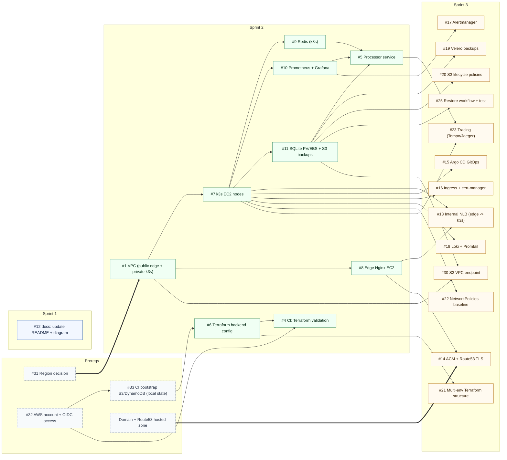

# Sprint Dependencies (Sprints 1-3)

```mermaid
flowchart LR
  %% Edge types:
  %%   blocking: -->
  %%   soft: -.-> (not used in S1-3 dataset)
  %%   technical/data/contract: ==>

  %% External prerequisites (left column)
  subgraph External["Prereqs"]
    direction TB
    E31["#31 Region decision"]
    E32["#32 AWS account + OIDC access"]
    E33["#33 CI bootstrap S3/DynamoDB (local state)"]
    EDNS["Domain + Route53 hosted zone"]
  end

  subgraph Sprint1["Sprint 1"]
    direction TB
    S1_12["#12 docs: update README + diagram"]
  end

  subgraph Sprint2["Sprint 2"]
    direction TB
    S2_1["#1 VPC (public edge + private k3s)"]
    S2_7["#7 k3s EC2 nodes"]
    S2_8["#8 Edge Nginx EC2"]
    S2_9["#9 Redis (k8s)"]
    S2_10["#10 Prometheus + Grafana"]
    S2_11["#11 SQLite PV/EBS + S3 backups"]
    S2_5["#5 Processor service"]
    S2_6["#6 Terraform backend config"]
    S2_4["#4 CI: Terraform validation"]
  end

  subgraph Sprint3["Sprint 3"]
    direction TB
    S3_13["#13 Internal NLB (edge -> k3s)"]
    S3_14["#14 ACM + Route53 TLS"]
    S3_15["#15 Argo CD GitOps"]
    S3_16["#16 Ingress + cert-manager"]
    S3_17["#17 Alertmanager"]
    S3_18["#18 Loki + Promtail"]
    S3_19["#19 Velero backups"]
    S3_20["#20 S3 lifecycle policies"]
    S3_21["#21 Multi-env Terraform structure"]
    S3_22["#22 NetworkPolicies baseline"]
    S3_23["#23 Tracing (Tempo/Jaeger)"]
    S3_25["#25 Restore workflow + test"]
    S3_30["#30 S3 VPC endpoint"]
  end

  %% External -> Sprint 2
  E31 ==> S2_1
  E32 --> E33
  E33 --> S2_6
  E32 --> S2_4

  %% Sprint 2 internal
  S2_1 --> S2_7
  S2_1 --> S2_8
  S2_7 --> S2_9
  S2_7 --> S2_10
  S2_7 --> S2_11
  S2_9 --> S2_5
  S2_10 --> S2_5
  S2_11 --> S2_5
  S2_6 --> S2_4

  %% Sprint 2 -> Sprint 3
  S2_7 --> S3_13
  S2_8 --> S3_13
  S2_8 --> S3_14
  EDNS ==> S3_14
  S2_7 --> S3_15
  S2_7 --> S3_16
  S2_10 --> S3_17
  S2_7 --> S3_18
  S2_11 --> S3_19
  S2_11 --> S3_20
  S2_6 --> S3_21
  S2_7 --> S3_22
  S2_7 --> S3_23
  S2_5 --> S3_23
  S2_11 --> S3_25
  S2_1 --> S3_30
  S2_11 --> S3_30

  %% Styling
  classDef sprint1 fill:#f2f7ff,stroke:#2b5fab,stroke-width:1px,color:#0b1b3a;
  classDef sprint2 fill:#f0fff4,stroke:#2f855a,stroke-width:1px,color:#0b2e1a;
  classDef sprint3 fill:#fffaf0,stroke:#b7791f,stroke-width:1px,color:#3a250b;
  classDef external fill:#f7fafc,stroke:#718096,stroke-dasharray:4 2,color:#2d3748;

  class S1_12 sprint1;
  class S2_1,S2_4,S2_5,S2_6,S2_7,S2_8,S2_9,S2_10,S2_11 sprint2;
  class S3_13,S3_14,S3_15,S3_16,S3_17,S3_18,S3_19,S3_20,S3_21,S3_22,S3_23,S3_25,S3_30 sprint3;
  class E31,E32,E33,EDNS external;
```
