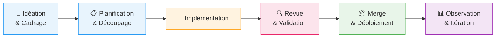

# Ingénierie Assistée par IA - Workflow Gouverné

**Dernière mise à jour** : 2026-03-10
**Public visé** : Recruteurs, Ingénieurs DevOps/Cloud, Tech Leads, Engineering Managers

CloudRadar est un projet portfolio solo livré en ~2 mois (v1-mvp + v1.1).
L'IA a été impliquée dès le premier jour - de l'idéation à la production - mais chaque décision, validation et merge est resté piloté par l'humain.
Ce document montre *comment* l'IA est gouvernée dans le projet, avec des exemples concrets.

---

## 1. Message Clé

> Je traite l'IA comme un partenaire d'ingénierie senior : je définis le scope, les garde-fous et les critères d'acceptation - l'IA propose, je valide.
> Résultat : une seule personne couvre gestion de projet, architecture, infrastructure, développement, tests, observabilité, documentation et FinOps - avec une traçabilité de grade professionnel.

---

## 2. Outils IA & Rôles

| Outil | Rôle | Exemple |
|---|---|---|
| **OpenAI Codex** (GPT-5.3) | Agent d'implémentation principal - code, IaC, docs, workflows CI, exécution de commandes | Modules Terraform, services Spring Boot, pipelines CI, runbooks |
| **GitHub Copilot + Claude Opus 4.6** | Revue d'architecture, audit croisé, raisonnement complexe, détection de contradictions | Audit multi-modèle sur l'[issue #459](https://github.com/ClementV78/CloudRadar/issues/459) (incohérences docs) |
| **Gemini** | Assistance design frontend (ponctuel) | Exploration de mise en page pour le dashboard React/Leaflet |

### Skills (Procédures IA Réutilisables)

Les Skills sont des fichiers d'instructions locaux qui codifient des workflows répétables :

- **`cloudradar-agents-update`** - Pipeline automatisé de mise à jour AGENTS.md : édition → branche → PR → auto-merge → changelog meta-issue → nettoyage. Une commande, traçabilité complète.
- **`diagram-3d-fossflow`** - Génère des diagrammes d'architecture 3D à partir des sources Terraform/k8s/CI en JSON structuré.

Ce ne sont pas des prompts collés dans un chat - ce sont des procédures versionnées et scopées que l'IA exécute de manière déterministe.

---

## 3. Gouvernance : AGENTS.md comme System Prompt

L'ensemble du workflow IA est gouverné par [`AGENTS.md`](../../AGENTS.md) (~260 lignes, 14 sections), qui agit comme un system prompt persistant pour chaque session IA. Règles clés :

- **Garde-fous d'ingénierie** : implémenter uniquement le scope demandé ; pas de features spéculatives ; expliciter les hypothèses avant de coder ; auto-vérification de simplicité.
- **Sécurité** : pas de secrets en clair ; IAM least-privilege ; les opérations sensibles nécessitent une confirmation humaine.
- **Discipline PR/Issue** : checklist metadata (assignees, labels, project, milestone) ; closing keywords ; preuves de DoD avant fermeture.
- **Hygiène de branches** : pas de push direct sur `main` ; une branche par issue ; branches courtes ; pas de force-push.
- **Responsabilité des merges** : l'humain merge toutes les PRs (sauf les mises à jour standalone d'AGENTS.md avec CI verte).
- **Conscience des coûts** : free-tier par défaut ; justifier tout service payant ; documenter l'allocation des ressources.

Ce fichier est revu et mis à jour régulièrement - il a évolué à travers 15+ itérations durant le projet.

---

## 4. Comment l'IA Participe à Chaque Phase

| Phase | Humain | IA |
|---|---|---|
| **Idéation** | **Pilote la vision architecturale** ; définit les contraintes (coûts, valeur d'apprentissage, production-readiness) | Propose des alternatives, met en lumière les compromis et limites de chaque option |
| **Planification** | Valide les EPICs, priorités, scope sprint | Décompose les EPICs en issues, crée les templates, organise les dépendances sur le Kanban |
| **Implémentation** | Relit les diffs, valide les chemins critiques | Écrit le code, l'IaC, les manifests, les docs, les workflows CI |
| **Revue** | Approbation finale ; audit croisé sur les changements complexes | Lance les tests, lints, analyse statique ; second modèle pour la détection de contradictions |
| **Merge & Déploiement** | Merge les PRs ; confirme `terraform apply` | Crée les PRs avec metadata, exécute les checks CI |
| **Observation & Itération** | Interprète les métriques, décide des prochaines actions | Génère les runbooks, met à jour l'issue-log, propose des corrections |

### Prise de Décision Architecturale avec l'IA

L'architecture est le moteur principal de ce projet. Chaque choix technique significatif est passé par un processus structuré :

1. **Cadrage** - Je définis le problème, les contraintes et les exigences non négociables.
2. **Exploration des options** - L'IA génère des alternatives en s'appuyant sur les patterns de l'industrie et des compromis auxquels je n'aurais pas forcément pensé.
3. **Évaluation structurée** - Pour chaque option : avantages, inconvénients, limites, coût opérationnel, alignement avec les objectifs.
4. **Décision & ADR** - Le choix final est le mien, consigné dans un ADR avec justification, alternatives considérées et compromis acceptés.

Ce processus a produit 20 ADRs couvrant topologie infra, distribution Kubernetes, observabilité, GitOps, design du pipeline de données, et plus - chacun une décision délibérée et évaluée plutôt qu'un choix par défaut.

> L'IA ne décide pas de l'architecture - elle améliore mes décisions en me forçant à les défendre.

### Exemple Concret : Audit Multi-Modèle ([#459](https://github.com/ClementV78/CloudRadar/issues/459))

1. Codex a audité les docs d'architecture et produit une liste d'incohérences.
2. Claude Opus a audité les mêmes docs indépendamment, sans voir la liste de Codex.
3. Les résultats ont été comparés : 8 constats communs + 2 problèmes supplémentaires identifiés uniquement par Claude.
4. Un [rapport de comparaison](../tmp/issue-459-audit-comparison.md) a été généré et utilisé pour corriger les docs.

Cette validation multi-modèle est utilisée pour les décisions structurantes ou les revues complexes où une seule perspective pourrait laisser passer des angles morts.

---

## 5. Ce Que Ça Permet (Solo = Couverture Équipe Complète)

Avec l'IA comme partenaire d'ingénierie, une seule personne couvre efficacement :

| Rôle | Comment |
|---|---|
| **Chef de projet** | Découpage en issues, planification sprint, suivi Kanban, cartographie des dépendances |
| **Architecte** | 20 ADRs, diagrammes d'infrastructure, décisions de stack technique avec analyse de compromis |
| **Ingénieur DevOps** | Modules Terraform, cluster k3s, GitOps ArgoCD, 9 workflows CI/CD |
| **Développeur** | Microservices Java 17 / Spring Boot, frontend React/Leaflet |
| **QA / Testeur** | Tests unitaires, validation CI, intégration SonarCloud, baselines de performance k6 |
| **Rédacteur technique** | Docs d'architecture, runbooks, logs de troubleshooting, docs API |
| **FinOps** | Choix par défaut orientés coût, ciblage free-tier, suivi de l'allocation ressources |

Le projet (v1-mvp + v1.1) a été livré en environ 2 mois, incluant infrastructure, application, CI/CD, observabilité, documentation et frontend.

---

## 6. Anti-Patterns Activement Évités

| Risque | Mitigation |
|---|---|
| **Sur-dépendance** (l'IA push sans revue) | L'humain merge toutes les PRs ; AGENTS.md impose la revue avant commit |
| **Dérive de scope** (l'IA ajoute des features non demandées) | Garde-fous d'ingénierie : « implémenter uniquement le scope demandé » |
| **Hallucinations** (faits incorrects dans les docs) | Audits multi-modèles ; checks CI ; affirmations appuyées par des preuves |
| **Fuites de sécurité** | Règles strictes sur les secrets ; pas de credentials en clair ; application `.gitignore` |
| **IA cargo-cult** (utiliser l'IA sans structure) | AGENTS.md gouverne chaque session ; les Skills codifient les procédures répétables |

---

## 7. Limites

- L'IA ne remplace ni la responsabilité, ni les décisions d'architecture, ni l'autorité de merge.
- Les opérations destructives (`terraform apply/destroy`, changements de permissions) nécessitent une confirmation humaine explicite.
- Toutes les affirmations dans la documentation projet sont appuyées par des preuves : logs CI, liens ADR, métriques ou références runbook.
- Le code généré par l'IA suit les mêmes standards de qualité que le code écrit manuellement - tests, linting et revue s'appliquent également.
