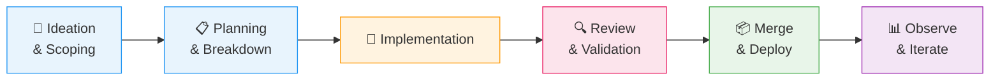

# AI-Assisted Engineering - Governed Workflow

**Last updated**: 2026-03-10
**Audience**: Recruiters, DevOps/Cloud Engineers, Tech Leads, Engineering Managers

CloudRadar is a solo portfolio project delivered in ~2 months (v1-mvp + v1.1).
AI was involved from day one - from ideation to production - but every decision, validation, and merge was human-driven.
This document shows *how* AI is governed across the project, with concrete examples.

---

## 1. Key Takeaway

> I treat AI as a senior engineering partner: I define the scope, the guardrails, and the acceptance criteria - AI proposes, I validate.
> The result: one person covering project management, architecture, infrastructure, development, testing, observability, documentation, and FinOps - with professional-grade traceability.

---

## 2. AI Tooling & Roles

| Tool | Role | Example |
|---|---|---|
| **OpenAI Codex** (GPT-5.3) | Primary implementation agent - code, IaC, docs, CI workflows, command execution | Wrote Terraform modules, Spring Boot services, CI pipelines, runbooks |
| **GitHub Copilot + Claude Opus 4.6** | Architecture review, cross-audit, complex reasoning, contradiction detection | Cross-model audit on [issue #459](https://github.com/ClementV78/CloudRadar/issues/459) (doc inconsistencies) |
| **Gemini** | Frontend design assistance (occasional) | UI layout exploration for React/Leaflet dashboard |

### Skills (Reusable AI Procedures)

Skills are local instruction files that codify repeatable workflows:

- **`cloudradar-agents-update`** - Automated AGENTS.md update pipeline: edit → branch → PR → auto-merge → meta-issue changelog → cleanup. One command, full traceability.
- **`diagram-3d-fossflow`** - Generates 3D architecture diagrams from Terraform/k8s/CI sources as structured JSON.

These are not prompts pasted into a chat - they are versioned, scoped procedures that the AI executes deterministically.

---

## 3. Governance: AGENTS.md as System Prompt

The entire AI workflow is governed by [`AGENTS.md`](../../AGENTS.md) (~260 lines, 14 sections), which acts as a persistent system prompt for every AI session. Key rules include:

- **Engineering Guardrails**: implement only requested scope; no speculative features; state assumptions before coding; simplicity self-check.
- **Security**: no plaintext secrets; least-privilege IAM; sensitive operations require human confirmation.
- **PR/Issue discipline**: metadata checklist (assignees, labels, project, milestone); closing keywords; DoD evidence before closure.
- **Branch hygiene**: no direct push to `main`; one branch per issue; short-lived branches; no force-push.
- **Merge responsibility**: the human merges all PRs (except standalone AGENTS.md updates with passing CI).
- **Cost awareness**: default to free-tier; justify any paid service; document resource allocation.

This file is reviewed and updated regularly - it evolved through 15+ iterations during the project.

---

## 4. How AI Participates at Each Phase

| Phase | Human | AI |
|---|---|---|
| **Ideation** | **Drives architecture vision**; defines constraints (cost, learning value, production-readiness) | Proposes alternatives, surfaces trade-offs and limits for each option |
| **Planning** | Validates EPICs, priorities, sprint scope | Decomposes EPICs into issues, creates templates, organizes dependencies on Kanban board |
| **Implementation** | Reviews diffs, validates critical paths | Writes code, IaC, manifests, docs, CI workflows |
| **Review** | Final approval; cross-audit on complex changes | Runs tests, lints, static analysis; second model for contradiction checks |
| **Merge & Deploy** | Merges PRs; confirms `terraform apply` | Creates PRs with metadata, runs CI checks |
| **Observe & Iterate** | Interprets metrics, decides next actions | Generates runbooks, updates issue-log, proposes fixes |

### Architecture Decision-Making with AI

Architecture is the primary driver of this project. Every significant technical choice went through a structured process:

1. **Context framing** - I define the problem, constraints, and non-negotiable requirements.
2. **Options exploration** - AI generates alternatives, drawing from industry patterns and trade-offs I might not have considered.
3. **Structured evaluation** - For each option: advantages, disadvantages, limits, operational cost, alignment with project goals.
4. **Decision & ADR** - The final choice is mine, recorded as an ADR with rationale, alternatives considered, and trade-offs accepted.

This produced 20 ADRs covering infrastructure topology, Kubernetes distribution, observability, GitOps, data pipeline design, and more - each a deliberate, evaluated decision rather than a default.

> The AI doesn't decide the architecture - it makes my decisions better by forcing me to defend them.

### Concrete Example: Cross-Model Audit ([#459](https://github.com/ClementV78/CloudRadar/issues/459))

1. Codex audited architecture docs and produced a list of inconsistencies.
2. Claude Opus independently audited the same docs without seeing Codex's list.
3. Results were compared: 8 shared findings + 2 additional issues found only by Claude.
4. A [comparison report](../tmp/issue-459-audit-comparison.md) was generated and used to fix the docs.

This cross-model validation is used for structuring decisions or complex reviews where a single perspective might miss blind spots.

---

## 5. What This Enables (Solo = Full Team Coverage)

With AI as an engineering partner, one person effectively covers:

| Role | How |
|---|---|
| **Project Manager** | Issue breakdown, sprint planning, Kanban tracking, dependency mapping |
| **Architect** | 20 ADRs, infrastructure diagrams, tech stack decisions with trade-off analysis |
| **DevOps Engineer** | Terraform modules, k3s cluster, ArgoCD GitOps, 9 CI/CD workflows |
| **Developer** | Java 17 / Spring Boot microservices, React/Leaflet frontend |
| **QA / Tester** | Unit tests, CI validation, SonarCloud integration, k6 performance baselines |
| **Technical Writer** | Architecture docs, runbooks, troubleshooting logs, API docs |
| **FinOps** | Cost-aware defaults, free-tier targeting, resource allocation tracking |

The project (v1-mvp + v1.1) was delivered in approximately 2 months, including infrastructure, application, CI/CD, observability, documentation, and frontend.

---

## 6. Anti-Patterns Actively Avoided

| Risk | Mitigation |
|---|---|
| **Over-reliance** (AI pushes without review) | Human merges all PRs; AGENTS.md mandates review before commit |
| **Scope creep** (AI adds unrequested features) | Engineering Guardrails: "implement only requested scope" |
| **Hallucinations** (incorrect facts in docs) | Cross-model audits; CI checks; evidence-backed claims |
| **Security leaks** | Strict secret-handling rules; no plaintext credentials; `.gitignore` enforcement |
| **Cargo-cult AI** (using AI without structure) | AGENTS.md governs every session; Skills codify repeatable procedures |

---

## 7. Boundaries

- AI does not replace ownership, architecture decisions, or merge authority.
- Destructive operations (`terraform apply/destroy`, permission changes) require explicit human confirmation.
- All claims in project documentation are backed by evidence: CI logs, ADR links, metrics, or runbook references.
- AI-generated code follows the same quality standards as human-written code - tests, linting, and review apply equally.
