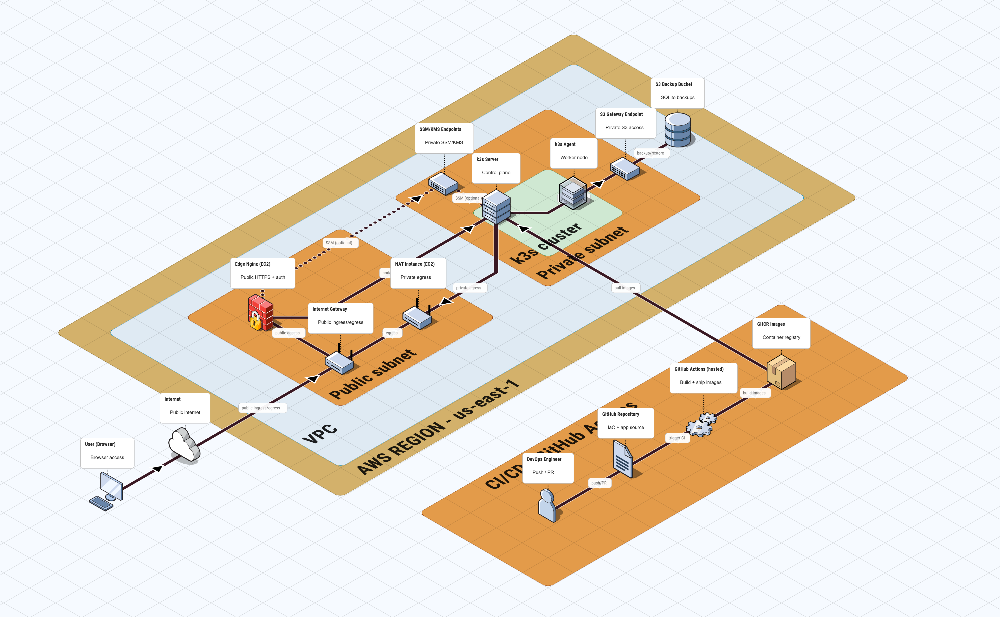
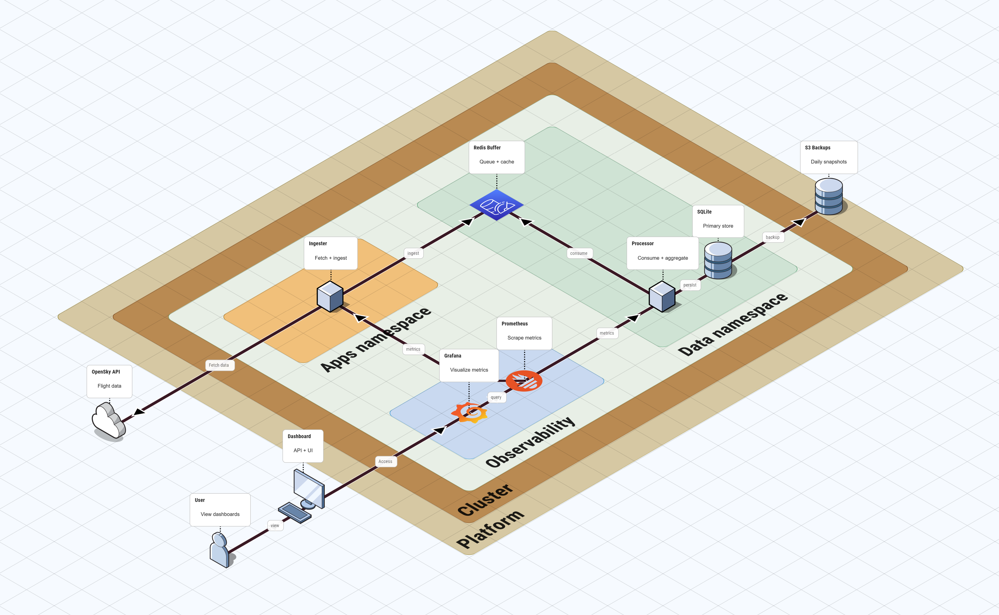

# Runbooks: Execution Order

This page is the entry point for all runbooks and describes the recommended execution order.

## 1) AWS account bootstrap (required)

Purpose: establish IAM baseline, MFA, budgets, and the GitHub OIDC provider + Terraform role.

- Runbook: `docs/runbooks/aws-account-bootstrap.md`
- IAM inventory reference: `docs/iam/inventory.md`

## 2) Terraform backend bootstrap (required)

Purpose: create the S3 bucket and DynamoDB table used by Terraform state and locking.

- Runbook: `docs/runbooks/terraform-backend-bootstrap.md`

## 2.1) CI workflow reference (recommended)

Purpose: understand what `ci-infra` validates on PRs and how manual apply works.

- Runbook: `docs/runbooks/ci-infra.md`

## 3) Terraform live roots (per environment)

Purpose: initialize and validate the Terraform roots for each environment.

1. Copy `backend.hcl.example` to `backend.hcl` in each env folder and set the real bucket/table names.
2. Run `terraform init -backend-config=backend.hcl`.
3. Run `terraform validate` and `terraform plan` with the env tfvars.

Example for dev:

```bash
cd infra/aws/live/dev
cp backend.hcl.example backend.hcl
terraform init -backend-config=backend.hcl
terraform validate
terraform plan -var-file=terraform.tfvars.example
```

Example for prod:

```bash
cd infra/aws/live/prod
cp backend.hcl.example backend.hcl
terraform init -backend-config=backend.hcl
terraform validate
terraform plan -var-file=terraform.tfvars.example
```

## 3.1) Capture infra outputs (optional)

Purpose: generate a local Markdown snapshot of Terraform outputs for quick reference.

```bash
./scripts/update-infra-outputs.sh dev
# If the local backend is not initialized (or you want to reconfigure it), use:
./scripts/update-infra-outputs.sh dev --init
```

This writes `docs/runbooks/infra-outputs.md` locally. The file is intentionally not committed.

## 3.2) ArgoCD bootstrap (one-time)

Purpose: deploy ArgoCD inside k3s to enable GitOps.

- Runbook: `docs/runbooks/argocd-bootstrap.md`

Post-bootstrap checks (optional):
- Verify the ArgoCD Application status (Synced/Healthy).
- Retrieve the initial admin password (if needed).

## 3.3) Edge health endpoint (optional)

Purpose: expose `/healthz` via the edge Nginx to validate end-to-end k3s connectivity.

- Runbook: `docs/runbooks/health-endpoint.md`
- TODO: configure a Docker credential helper to avoid GHCR login warnings.

## 3.4) Redis buffer (data namespace)

Purpose: deploy the Redis buffer used by ingester/processor.

- Runbook: `docs/runbooks/redis.md`

## Reference diagrams

Use these diagrams as visual context while following the runbooks.

- Infrastructure (auto-generated): 
- Workloads (auto-generated): 

## 4) Next steps (planned)

- Apply on dev when ready; keep prod for later.
- Add edge EC2 and observability stacks once k3s baseline is stable.
- Apply edge EC2 module for public entrypoint when ready (issue #8).
- Before edge apply: ensure the Basic Auth SSM parameter exists and the Terraform role has `ssm:PutParameter`/`iam:GetRolePolicy` (see `docs/runbooks/aws-account-bootstrap.md`).
- The Basic Auth username is set via `edge_basic_auth_user` in `infra/aws/live/<env>/terraform.tfvars`.
- Ensure `edge_root_volume_size` is at least 30 GB (40 GB recommended) for AL2023.
- TODO: Re-enable WebSocket headers in edge Nginx if the dashboard/API needs persistent connections.
