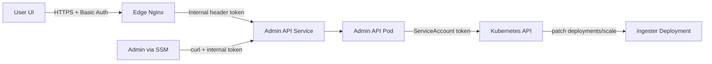

# Runbook: admin scale API (ingester)

Purpose: scale the ingester deployment via a small admin API that talks to the Kubernetes API using a ServiceAccount token. This enables UI-driven operations while keeping the internal token hidden from end users.

## Overview (DevOps flow)


## Prerequisites
- Edge Nginx is deployed and reachable.
- The admin scale app is deployed under `k8s/apps/admin-scale`.
- The internal token exists in **two places**:
  - SSM parameter for edge to inject (e.g. `/cloudradar/edge/admin-token`).
  - Kubernetes Secret `admin-scale-token` (same value).

## Secret configuration (Basic Auth + internal token)

### Edge Basic Auth (public access)
- Terraform input: `edge_basic_auth_ssm_parameter_name`
- Default SSM path: `/cloudradar/edge/basic-auth`

### Admin internal token (edge -> admin API)
- Terraform input: `edge_admin_token_ssm_parameter_name`
- Default SSM path: `/cloudradar/edge/admin-token`
- Kubernetes Secret: `admin-scale-token` (key: `token`)

The **SSM parameter** and the **Kubernetes Secret** must contain the **same token** value.

## Auth behavior (implementation detail)
- The API expects the header `X-Internal-Token`.
- The token is loaded from the `ADMIN_INTERNAL_TOKEN` environment variable.
- In code: `src/admin-scale/app.py` compares the header value to the env var and returns **401** when invalid.

## Steps

### 1) Build and publish the image
```bash
docker build -t ghcr.io/clementv78/cloudradar-admin-scale:0.1.0 src/admin-scale
docker push ghcr.io/clementv78/cloudradar-admin-scale:0.1.0
```

### 2) Create the admin token
Generate a strong token locally (example):
```bash
openssl rand -hex 32
```

### 3) Store the token in SSM (edge)
```bash
aws ssm put-parameter \
  --name "/cloudradar/edge/admin-token" \
  --type SecureString \
  --value "<token>" \
  --overwrite
```

### 4) Store the token in Kubernetes (admin-scale)
Do **not** commit the token in git. Apply a Secret locally:
```bash
kubectl -n cloudradar create secret generic admin-scale-token \
  --from-literal=token="<token>" \
  --dry-run=client -o yaml | kubectl apply -f -
```

### 5) Deploy the manifests
```bash
kubectl apply -k k8s/apps/admin-scale
```

### 6) Validate scaling
From an SSM session (or any network path that can reach the service):
```bash
curl -s -X POST \
  -H "X-Internal-Token: <token>" \
  -H "Content-Type: application/json" \
  --data '{"replicas": 0}' \
  http://<node-ip>:32737/admin/ingester/scale
```

Then verify:
```bash
kubectl -n cloudradar get deploy ingester
```

## Notes
- The ServiceAccount RBAC is restricted to `deployments/scale` for `ingester` only.
- The edge injects `X-Internal-Token` after Basic Auth; users never see the token.
- If you rotate the token, update **both** SSM and the Kubernetes Secret.
