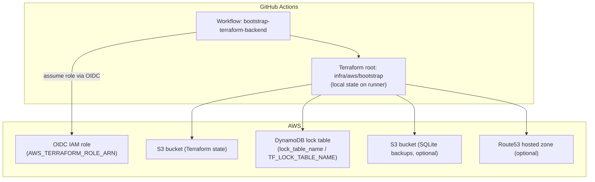

# Terraform Backend Bootstrap (CI)

## Purpose
Create the S3 bucket and DynamoDB table for Terraform state/locking via GitHub Actions,
using a temporary local Terraform state.

Optionally, it can also create:
- an S3 bucket for SQLite backups
- a Route53 hosted zone for DNS delegation

## Architecture (Bootstrap Stack)



## Prerequisites
- AWS account bootstrap completed (OIDC provider + CI role).
- Repo variables set (GitHub → Settings → Secrets and variables → Actions → Variables):
  - `AWS_TERRAFORM_ROLE_ARN`
  - `AWS_REGION` (default for workflow)
  - `TF_LOCK_TABLE_NAME` (default for workflow)
  - `TF_BACKUP_BUCKET_NAME` (optional default for SQLite backups)
  - `DNS_ZONE_NAME` (optional, delegated subdomain hosted zone name; keep real values out of the repo)

## Run
1) In GitHub Actions, run **bootstrap-terraform-backend** workflow.
2) Provide:
   - `state_bucket_name` (globally unique)
   - `lock_table_name` (prefilled from `TF_LOCK_TABLE_NAME`)
   - `backup_bucket_name` (optional, SQLite backups bucket)
   - `dns_zone_name` (optional, delegated subdomain hosted zone name)
   - `region` (prefilled from `AWS_REGION`)

Example bucket name:
- `cloudradar-tfstate-<account-id>`

### CLI alternative
```bash
gh workflow run bootstrap-terraform-backend \
  --ref main \
  -f region=us-east-1 \
  -f state_bucket_name=cloudradar-tfstate-<account-id> \
  -f lock_table_name=cloudradar-tf-lock \
  -f backup_bucket_name=cloudradar-dev-<account-id>-sqlite-backups \
  -f dns_zone_name=cloudradar.example.com
```

## Outputs
- S3 state bucket created with versioning, encryption, public access blocked.
- DynamoDB lock table created (PAY_PER_REQUEST).
- SQLite backup bucket created (if `backup_bucket_name` provided).
- Route53 hosted zone created (if `dns_zone_name` provided).

## Remote backend configuration (post-bootstrap)
After the backend exists, configure Terraform roots to use it.

CI setup (recommended):
- Store backend identifiers as GitHub Actions variables.
- Initialize Terraform in CI with explicit backend config, for example:
```bash
terraform -chdir=infra/aws/live/dev init \
  -backend-config="bucket=$TF_STATE_BUCKET" \
  -backend-config="region=$AWS_REGION" \
  -backend-config="dynamodb_table=$TF_LOCK_TABLE_NAME" \
  -backend-config="key=cloudradar/dev/terraform.tfstate"
```

Local setup (optional):
1) Copy the example backend file:
   - `infra/aws/live/dev/backend.hcl.example` → `infra/aws/live/dev/backend.hcl`
   - `infra/aws/live/prod/backend.hcl.example` → `infra/aws/live/prod/backend.hcl`
2) Fill in your real bucket name and region (keep lock table name consistent).
3) Initialize:
```bash
terraform -chdir=infra/aws/live/dev init -backend-config=backend.hcl
```

## Verification
- Confirm S3 bucket exists and has versioning/encryption enabled.
- Confirm DynamoDB table `cloudradar-tf-lock` exists in `us-east-1`.
- If provided: confirm SQLite backup bucket exists.
- If provided: confirm Route53 hosted zone exists and name servers are returned in outputs.
- Confirm workflow run succeeded in GitHub Actions.

## Notes
- This workflow uses a local backend and does not depend on existing remote state.
- The workflow imports existing resources (state bucket, lock table, optional backup bucket, optional hosted zone) when they already exist, so it can be rerun safely.
- Remote backend usage is configured in CI (see example `terraform init` commands above) and optionally locally via `backend.hcl`.

## Related issues
- #33
- #6
- #341
