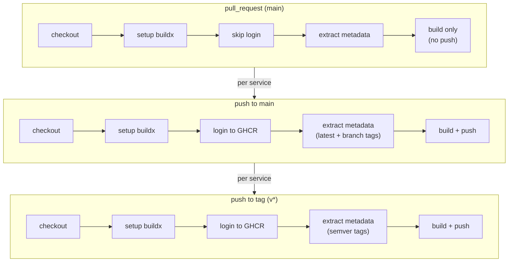

# Runbook: build-and-push workflow

This runbook explains the `build-and-push` GitHub Actions workflow, which automates Docker image builds and pushes for all CloudRadar application services.

## When it runs

- On **pull requests** to `main` that touch files in `src/`, workflow file, or Dockerfile: builds all services but **does not push** to GHCR (dry-run validation).
- On **push to main** with changes in `src/`, workflow file, or Dockerfile: builds and pushes images with tags.
- On **push to tags** (e.g., `v1.0.0`): builds and pushes images with semantic versioning tags (all services, regardless of path filters).
- Skipped: changes to docs, infra, k8s manifests, or other non-app files.

### Path filters

To avoid unnecessary builds, the workflow only runs when:
- Any file in `src/**` changes
- `.github/workflows/build-and-push.yml` changes
- `Dockerfile*` or `.dockerignore` changes

This ensures docs/infra/runbook updates don't trigger builds.

## What happens

The workflow uses a **matrix strategy** to build all services in **parallel**:

### Services built

1. **ingester** (Java 17 + Spring Boot) → `src/ingester/Dockerfile`
2. **processor** (Java 17 + Spring Boot) → `src/processor/Dockerfile`
3. **health** (Python Flask) → `src/health/Dockerfile`
4. **admin-scale** (Python) → `src/admin-scale/Dockerfile`

Note: `dashboard` (React/Vite) is currently a frontend-only build target, not containerized yet.

### Per-service job

For each service, the workflow:

1. **Checkout** code from the branch
2. **Setup Buildx** for multi-platform builds (optional future enhancement)
3. **Login to GHCR** (only on push/tag, skipped on PR)
   - Uses `secrets.GITHUB_TOKEN` provided by GitHub
   - No static credentials needed (OIDC-like pattern)
4. **Extract metadata** via `docker/metadata-action`
   - Tags are context-aware (PR, branch, SHA, latest)
   - See [Image tagging strategy](#image-tagging-strategy) for examples
5. **Build and push**
   - Build context: `./src/{service}`
   - Push only when **not** a PR (`push: ${{ github.event_name != 'pull_request' }}`)
   - Cache layers via GitHub Actions cache (`mode=max`)

### Image tagging strategy

Tags are **explicit and context-aware** for clarity and traceability.

### Quick reference

| Context | Tag Format | Lisibilité | Use Case |
| --- | --- | --- | --- |
| PR | `pr-173`, `85591c6` | ✅ PR number visible | Test image from PR #173 |
| Branch | `feature-xyz`, `feature-xyz-85591c6` | ✅ Branch name visible | Feature branch builds |
| Main | `main`, `latest`, `main-85591c6` | ✅ Latest release | Stable builds |
| Tag (semver) | `v1.0.0`, `85591c6` | ✅ Release version | Release-pinned versions |

### Examples per context

#### On pull requests

```
ghcr.io/clementv78/cloudradar/ingester:pr-173
ghcr.io/clementv78/cloudradar/ingester:85591c6
```

**Use case**: Test image from a specific PR without affecting main.

#### On branches (e.g., `feature/prometheus-exporter`)

```
ghcr.io/clementv78/cloudradar/ingester:feature-prometheus-exporter
ghcr.io/clementv78/cloudradar/ingester:feature-prometheus-exporter-85591c6
```

**Use case**: Build and test from feature branches before merge.

#### On main (default branch)

```
ghcr.io/clementv78/cloudradar/ingester:main
ghcr.io/clementv78/cloudradar/ingester:latest
ghcr.io/clementv78/cloudradar/ingester:main-85591c6
```

**Use case**: Stable release images; `latest` points to main.

#### On tags (e.g., `v1.0.0`)

```
ghcr.io/clementv78/cloudradar/ingester:v1.0.0
ghcr.io/clementv78/cloudradar/ingester:85591c6
```

**Use case**: Release-pinned versions.


## Image registry location

All images are pushed to **GitHub Container Registry (GHCR)**:

```
ghcr.io/{owner}/{repo}/{service}:{tag}
```

Example:
```
ghcr.io/clementv78/cloudradar/ingester:latest
ghcr.io/clementv78/cloudradar/ingester:main-5f3a2c1d
ghcr.io/clementv78/cloudradar/processor:v1.0.0
```

## Accessing GHCR images

After images are pushed:

1. **List packages**: [GHCR packages](https://github.com/ClementV78?tab=packages)
2. **Pull an image**:
   ```bash
   docker pull ghcr.io/clementv78/cloudradar/ingester:latest
   ```
3. **Authentication** (if image is private):
   ```bash
   echo $GITHUB_TOKEN | docker login ghcr.io -u $GITHUB_ACTOR --password-stdin
   docker pull ghcr.io/clementv78/cloudradar/ingester:latest
   ```

## Workflow diagram (Mermaid)



## Cache behavior

- **Layer cache**: stored in GitHub Actions cache (`type=gha`)
- **Retention**: 5 days (default GitHub Actions cache)
- **Speed benefit**: subsequent builds reuse unchanged layers

## Failure handling

If any service build fails:
- The entire workflow fails (fail-fast: false allows independent failures to be visible)
- Check the failed job in the Actions tab for logs
- Common causes:
  - Dockerfile syntax error
  - Missing build dependencies
  - Unresolvable `src/{service}` path

## Manual triggers (future)

The workflow can be extended to support `workflow_dispatch` for manual builds (e.g., rebuild without code changes).

## Related

- Terraform CI: `docs/runbooks/ci-infra.md`
- ArgoCD syncs images via deployments in `k8s/apps/`
- Image pulls use the tags from Kustomize overlays or ArgoCD resources
