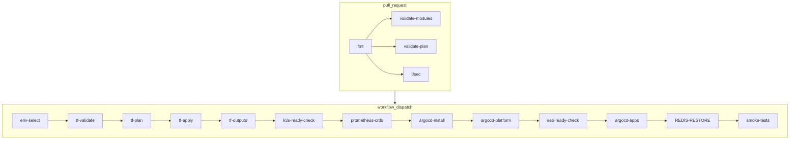

# Runbook: ci-infra workflow

This runbook explains what the `ci-infra` GitHub Actions workflow does and when to use it.

## When it runs

- On pull requests that touch `infra/**` or the workflow file itself.
- Manually via `workflow_dispatch` for controlled applies.

## What happens on pull_request

Jobs run in CI to validate Terraform safely (no apply):

1. `fmt`: `terraform fmt -check -recursive infra/aws`
2. `validate-modules`: init/validate each module under `infra/aws/modules/*` (backend disabled).
3. `validate-plan`:
   - `bootstrap`: local backend (`-backend=false`) + validate + plan with required vars.
   - `live-dev` and `live-prod`: remote backend init (S3 + DynamoDB) + validate + plan.
4. `tfsec`: static scan for common Terraform security issues (cost-aware exclusions).

## Manual apply inputs (workflow_dispatch)

- `environment`: target env (`dev` or `prod`).
- `redis_backup_restore`: when `true` (default, dev only), restores Redis from the latest backup after apps are bootstrapped.
- `auto_approve`: must be `true` to run apply.
- `run_smoke_tests`: when `true`, runs post-apply readiness and health checks (k3s, ArgoCD, healthz).
- `backup_bucket_name`: optional override for the dev SQLite backup bucket.
- DNS delegation uses the `DNS_ZONE_NAME` GitHub Actions variable (e.g., `cloudradar.example.com`).
  Keep real domain values out of the repo.
- Processor aircraft DB (optional) uses GitHub Actions Variables (environment-scoped):
  - `AIRCRAFT_REFERENCE_BUCKET_NAME` (or fallback `TF_AIRCRAFT_REFERENCE_BUCKET_NAME`) to align k3s IAM access with the aircraft DB S3 bucket used by the processor (via Terraform `aircraft_reference_bucket_name`, dev only).
  - Processor aircraft DB configuration for SSM/ESO:
    - `PROCESSOR_AIRCRAFT_DB_ENABLED`, `PROCESSOR_AIRCRAFT_DB_S3_URI`, `PROCESSOR_AIRCRAFT_DB_SHA256`
    - The workflow passes these as Terraform variables so Terraform writes `/cloudradar/processor/aircraft-db/*` SSM parameters for ESO.

Notes:
- When `backup_bucket_name` is empty, the workflow uses `TF_BACKUP_BUCKET_NAME` if set.
- If neither is provided, Terraform derives the default bucket name in `infra/aws/live/dev`.
- Local-only overrides can live in `local.donotcommit.auto.tfvars` inside the env folder (auto-loaded by Terraform, ignored by Git).

### Which environment is targeted in CI?

- For `bootstrap`: no environment, local backend only.
- For `live-dev` and `live-prod`: the workflow initializes the remote backend using:
  - bucket: `${TF_STATE_BUCKET}`
  - lock table: `${TF_LOCK_TABLE_NAME}`
  - keys: `cloudradar/dev/terraform.tfstate` and `cloudradar/prod/terraform.tfstate`

These jobs do **not** apply changes. They only validate and plan.

## Manual apply (workflow_dispatch)

The manual dispatch runs a chained set of jobs (visible in the Actions graph):

1. `env-select`: select `dev` or `prod`, expose `TF_DIR`/`TF_KEY`.
2. `tf-validate`: init + validate (remote backend).
3. `tf-plan`: init + plan with `terraform.tfvars`.
4. `tf-apply`: guarded apply (requires `auto_approve=true`).
5. `tf-outputs` (dev only): load Terraform outputs for SSM/edge checks.
6. `k3s-ready-check` (dev): wait for k3s nodes via SSM.
7. `prometheus-crds` (dev): apply Prometheus CRDs before ArgoCD bootstrap.
8. `argocd-install` (dev): install ArgoCD via SSM.
9. `argocd-platform` (dev): bootstrap platform apps (ESO/operator prerequisites).
10. `eso-ready-check` (dev): wait for ESO readiness.
11. `argocd-apps` (dev): bootstrap root apps from `k8s/apps`.
12. `REDIS-RESTORE` (dev): restore Redis from the latest backup.
   - Visible as a dedicated job in the Actions graph.
   - Logs explicit decision and reason (`RUN` / `SKIPPED`) in both logs and Step Summary.
   - Skips restore safely when disabled by input, when no backup is found, or when Redis `/data` is not empty.
13. `smoke-tests` (dev + smoke): wait for ArgoCD sync, healthz rollout, and curl `/healthz`.
   - Logs explicit decision and reason (`RUN` / `SKIPPED`) in both logs and Step Summary.

## Workflow diagram (Mermaid)

## Reference diagrams

- Infrastructure (auto-generated): 
- Workloads (auto-generated): 

- Select `environment` (`dev` or `prod`).
- Set `auto_approve=true` to allow apply.
- Uses the same S3/DynamoDB backend and the OIDC role.
- Uses `terraform.tfvars` for required inputs.
- `terraform.tfvars.example` is a reference template only.
- After apply (dev only), the workflow applies Prometheus CRDs, installs ArgoCD via SSM, bootstraps platform/apps, and then runs the optional Redis restore phase.
- The bootstrap uses the k3s server instance ID from Terraform outputs and requires SSM connectivity.
- ArgoCD then syncs `k8s/apps` to the cluster automatically.
- For dev applies, the workflow verifies k3s readiness with retries, then executes the full GitOps bootstrap chain (`prometheus-crds` -> `argocd-install` -> `argocd-platform` -> `eso-ready-check` -> `argocd-apps`).
- The Redis restore phase is represented by a dedicated job named `REDIS-RESTORE` in the graph.
  - If `redis_backup_restore=false`, the job emits an explicit skip reason in logs and summary.
  - If restore is requested, the job still protects data by skipping restore when Redis data is not fresh.
- When `run_smoke_tests=true` (dev only), it also waits for the ArgoCD app to be Synced/Healthy, waits for the `healthz` deployment rollout, then curls `/healthz` from the Internet.
  - If `run_smoke_tests=false`, the smoke-tests job emits an explicit skip reason in logs and summary.
- The smoke test verifies edge Nginx via SSM (3 retries with 10s delay) before running the external `/healthz` curl.
  - On failure, it prints `systemctl status nginx`, recent `journalctl` logs, and the 443 listen check to speed up diagnostics.
- The workflow now waits for **SSM PingStatus=Online** before sending commands, and retries `send-command` on transient `InvalidInstanceId` errors.
- SSM retry logs are sent to stderr so only the command ID is parsed.

## Post-apply smoke tests (optional)

When `run_smoke_tests=true` (dev only), the workflow:
- Waits for k3s nodes to be Ready via SSM (`kubectl wait` + `kubectl get nodes`).
- Waits for the ArgoCD Application to be Synced/Healthy via SSM.
- Waits for the `healthz` deployment rollout in the `cloudradar` namespace.
- Fetches the edge public IP and Basic Auth settings from Terraform outputs.
- Reads the Basic Auth password from SSM Parameter Store to curl `/healthz` externally.
  - Uses bounded polling for SSM command status to avoid long Pending/InProgress waits.

Prerequisite:
- The CI role must allow `ssm:GetParameter` on the edge Basic Auth parameter.

## Troubleshooting

For emergency break-glass access when SSM is offline, see:
- `docs/runbooks/troubleshooting/troubleshooting-guide.md` (section `3.5`)

## Manual destroy (workflow_dispatch)

Use the dedicated destroy workflow when you need to tear down an environment.

- Select `environment` (`dev` or `prod`).
- `redis_backup_restore`: when `true` (default, dev only), backs up Redis to S3 and rotates backups (keeps last 3) before Terraform destroy.
- Set `confirm_destroy=DESTROY` to allow destruction.
- Uses the same S3/DynamoDB backend and the OIDC role.
- The workflow validates the selected root before destroying.

## Required repo variables

- `AWS_TERRAFORM_ROLE_ARN`
- `AWS_REGION`
- `TF_STATE_BUCKET`
- `TF_LOCK_TABLE_NAME`
- `TF_BACKUP_BUCKET_NAME` (optional, used for SQLite and Redis backups)
- `PROCESSOR_AIRCRAFT_DB_ENABLED` (optional, workflow_dispatch only; writes SSM for ESO)
- `PROCESSOR_AIRCRAFT_DB_S3_URI` (optional, workflow_dispatch only; writes SSM for ESO)
- `PROCESSOR_AIRCRAFT_DB_SHA256` (optional, workflow_dispatch only; writes SSM for ESO)
- `AIRCRAFT_REFERENCE_BUCKET_NAME` (optional, dev only; overrides Terraform `aircraft_reference_bucket_name` in `ci-infra`)
- `TF_AIRCRAFT_REFERENCE_BUCKET_NAME` (optional fallback when `AIRCRAFT_REFERENCE_BUCKET_NAME` is not set)

## Related files

- Workflow: `.github/workflows/ci-infra.yml`
- Workflow: `.github/workflows/ci-infra-destroy.yml`
- Backend bootstrap runbook: `docs/runbooks/terraform-backend-bootstrap.md`
