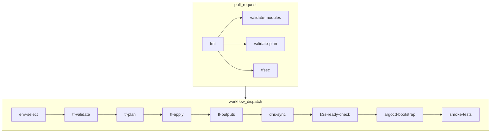

# Runbook: ci-infra workflow

This runbook explains what the `ci-infra` GitHub Actions workflow does and when to use it.

## When it runs

- On pull requests that touch `infra/**` or the workflow file itself.
- Manually via `workflow_dispatch` for controlled applies.

## What happens on pull_request

Jobs run in CI to validate Terraform safely (no apply):

1. `fmt`: `terraform fmt -check -recursive infra/aws`
2. `validate-modules`: init/validate each module under `infra/aws/modules/*` (backend disabled).
3. `validate-plan`:
   - `bootstrap`: local backend (`-backend=false`) + validate + plan with required vars.
   - `live-dev` and `live-prod`: remote backend init (S3 + DynamoDB) + validate + plan.
4. `tfsec`: static scan for common Terraform security issues (cost-aware exclusions).

## Manual apply inputs (workflow_dispatch)

- `environment`: target env (`dev` or `prod`).
- `auto_approve`: must be `true` to run apply.
- `run_smoke_tests`: when `true`, runs post-apply readiness and health checks (k3s, ArgoCD, healthz).
- `backup_bucket_name`: optional override for the dev SQLite backup bucket.
- `dns_zone_name`: delegated subdomain to manage in Route53 (e.g., `cloudradar.example.com`).

Note: keep real domain values out of the repo; pass them via workflow input or the `DNS_ZONE_NAME` GitHub Actions variable.

Notes:
- When `backup_bucket_name` is empty, the workflow uses `TF_BACKUP_BUCKET_NAME` if set.
- If neither is provided, Terraform derives the default bucket name in `infra/aws/live/dev`.

### Which environment is targeted in CI?

- For `bootstrap`: no environment, local backend only.
- For `live-dev` and `live-prod`: the workflow initializes the remote backend using:
  - bucket: `${TF_STATE_BUCKET}`
  - lock table: `${TF_LOCK_TABLE_NAME}`
  - keys: `cloudradar/dev/terraform.tfstate` and `cloudradar/prod/terraform.tfstate`

These jobs do **not** apply changes. They only validate and plan.

## Manual apply (workflow_dispatch)

The manual dispatch runs a chained set of jobs (visible in the Actions graph):

1. `env-select`: select `dev` or `prod`, expose `TF_DIR`/`TF_KEY`.
2. `tf-validate`: init + validate (remote backend).
3. `tf-plan`: init + plan with `terraform.tfvars`.
4. `tf-apply`: guarded apply (requires `auto_approve=true`).
5. `tf-outputs` (dev only): load Terraform outputs for SSM/edge checks.
6. `dns-sync` (dev only): update Route53 A records + write Grafana domain params to SSM.
6. `k3s-ready-check` (dev): wait for k3s nodes via SSM.
7. `argocd-bootstrap` (dev): bootstrap ArgoCD via SSM after k3s readiness.
8. `smoke-tests` (dev + smoke): wait for ArgoCD sync, healthz rollout, and curl `/healthz`.

## Workflow diagram (Mermaid)

## Reference diagrams

- Infrastructure (auto-generated): 
- Workloads (auto-generated): 

- Select `environment` (`dev` or `prod`).
- Set `auto_approve=true` to allow apply.
- Uses the same S3/DynamoDB backend and the OIDC role.
- Uses `terraform.tfvars` for required inputs.
- `terraform.tfvars.example` is a reference template only.
- After apply (dev only), the workflow boots ArgoCD via SSM and applies the root GitOps Application.
- The bootstrap uses the k3s server instance ID from Terraform outputs and requires SSM connectivity.
- ArgoCD then syncs `k8s/apps` to the cluster automatically.
- For dev applies, the workflow verifies k3s readiness with retries, then bootstraps ArgoCD.
- When `run_smoke_tests=true` (dev only), it also waits for the ArgoCD app to be Synced/Healthy, waits for the `healthz` deployment rollout, then curls `/healthz` from the Internet.
- The smoke test verifies edge Nginx via SSM (3 retries with 10s delay) before running the external `/healthz` curl.
  - On failure, it prints `systemctl status nginx`, recent `journalctl` logs, and the 443 listen check to speed up diagnostics.
- The workflow now waits for **SSM PingStatus=Online** before sending commands, and retries `send-command` on transient `InvalidInstanceId` errors.
- SSM retry logs are sent to stderr so only the command ID is parsed.

## Post-apply smoke tests (optional)

When `run_smoke_tests=true` (dev only), the workflow:
- Waits for k3s nodes to be Ready via SSM (`kubectl wait` + `kubectl get nodes`).
- Waits for the ArgoCD Application to be Synced/Healthy via SSM.
- Waits for the `healthz` deployment rollout in the `cloudradar` namespace.
- Fetches the edge public IP and Basic Auth settings from Terraform outputs.
- Reads the Basic Auth password from SSM Parameter Store to curl `/healthz` externally.
  - Uses bounded polling for SSM command status to avoid long Pending/InProgress waits.

Prerequisite:
- The CI role must allow `ssm:GetParameter` on the edge Basic Auth parameter.

## Troubleshooting: temporary EC2 Serial Console access (k3s server)

If SSM is offline and you need console access, you can temporarily enable a local password
for `ec2-user` on the k3s server via cloud-init.

1. Generate a SHA-512 hash (local only):
   - `openssl passwd -6 'change-me'`
2. Export the hash locally (do not commit it):
   - `export TF_VAR_k3s_server_serial_console_password_hash="$6$..."`
3. Apply with a replace of the k3s server instance so cloud-init re-runs.
4. Remove the variable once diagnostics are done and replace the instance again.

This keeps SSH password auth disabled while allowing Serial Console login.

## Manual destroy (workflow_dispatch)

Use the dedicated destroy workflow when you need to tear down an environment.

- Select `environment` (`dev` or `prod`).
- Set `confirm_destroy=DESTROY` to allow destruction.
- Uses the same S3/DynamoDB backend and the OIDC role.
- The workflow validates the selected root before destroying.

## Required repo variables

- `AWS_TERRAFORM_ROLE_ARN`
- `AWS_REGION`
- `TF_STATE_BUCKET`
- `TF_LOCK_TABLE_NAME`
- `TF_BACKUP_BUCKET_NAME` (optional, SQLite backups bucket)

## Related files

- Workflow: `.github/workflows/ci-infra.yml`
- Workflow: `.github/workflows/ci-infra-destroy.yml`
- Backend bootstrap runbook: `docs/runbooks/terraform-backend-bootstrap.md`
