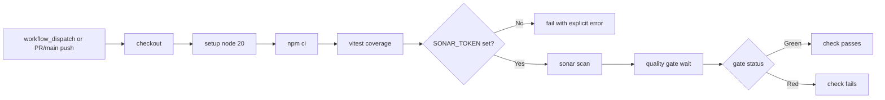

# Runbook: SonarCloud quality gate

This runbook explains how CloudRadar uses SonarCloud for PR quality-gate checks and how to configure the required GitHub/SonarCloud integration.

## Scope

- Workflow: `.github/workflows/sonarcloud.yml`
- Sonar config: `sonar-project.properties`
- Coverage source: `src/frontend/coverage/lcov.info` (Vitest)

## Workflow diagram



## Triggers

- `workflow_dispatch` (manual validation)
- `pull_request` to `main`
- `push` to `main`

Path filters:
- `src/**`
- `sonar-project.properties`
- `.github/workflows/sonarcloud.yml`

## One-time setup (required)

1. Import the repository in SonarCloud:
- Sign in to SonarCloud with GitHub
- Import `ClementV78/CloudRadar`
- Confirm organization + project key match `sonar-project.properties`

2. Disable SonarCloud automatic analysis:
- Project Settings -> Analysis Method -> disable automatic analysis
- Keep CI-based analysis only (GitHub Actions)

3. Create GitHub repository secret:
- Name: `SONAR_TOKEN`
- Value: SonarCloud token generated from your SonarCloud account

4. Verify project identifiers:
- `sonar.organization=clementv78`
- `sonar.projectKey=ClementV78_CloudRadar`

If your SonarCloud project key/org differs, update `sonar-project.properties` accordingly.

## Local validation before CI

```bash
cd src/frontend
npm ci
npm run test:coverage
ls -l coverage/lcov.info
```

Expected:
- tests pass
- `coverage/lcov.info` exists

## Run manually

1. Open GitHub Actions
2. Select `SonarCloud Quality Gate`
3. Click `Run workflow`

Expected results:
- `Run frontend tests with coverage (lcov)` succeeds
- `SonarCloud scan and quality gate` succeeds
- PR check appears as green quality gate

## Troubleshooting

### `SONAR_TOKEN is not configured`

Cause:
- missing repository secret

Fix:
- add `SONAR_TOKEN` in GitHub repository secrets
- re-run workflow

### Sonar scan succeeds but coverage is `0.0%`

Cause:
- lcov report missing or wrong path

Fix:
- ensure `src/frontend/coverage/lcov.info` is generated
- verify `sonar.javascript.lcov.reportPaths=src/frontend/coverage/lcov.info`

### Quality gate remains red

Cause:
- code smells/bugs/vulnerabilities or insufficient coverage against active quality profile

Fix:
- open SonarCloud project dashboard
- review New Code issues and Coverage conditions
- fix and re-run workflow

## Related

- App pipeline runbook: `docs/runbooks/ci-cd/ci-app.md`
- Frontend runbook: `docs/runbooks/operations/frontend.md`
- Issue: #507
