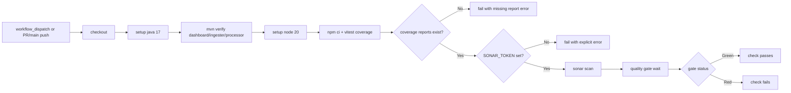

# Runbook: SonarCloud quality gate

This runbook explains how CloudRadar uses SonarCloud for PR quality-gate checks and how to configure the required GitHub/SonarCloud integration.

## Scope

- Workflow: `.github/workflows/sonarcloud.yml`
- Sonar config: `sonar-project.properties`
- Coverage sources:
  - Frontend: `src/frontend/coverage/lcov.info` (Vitest)
  - Java:
    - `src/dashboard/target/site/jacoco/jacoco.xml`
    - `src/ingester/target/site/jacoco/jacoco.xml`
    - `src/processor/target/site/jacoco/jacoco.xml`
- Java analyzer mode:
  - Default: optimized (`sonar.java.skipUnchanged=true`) to keep CI fast.
  - Manual first/full baseline: run `workflow_dispatch` with `full_java_scan=true`.

## Workflow diagram



## Triggers

- `workflow_dispatch` (manual validation)
- `pull_request` to `main`
- `push` to `main`

`workflow_dispatch` input:
- `full_java_scan` (boolean, default `false`)
  - `true`: force full Java analysis (including unchanged Java files)
  - `false`: optimized mode (skip unchanged Java files)

Path filters:
- `src/**`
- `sonar-project.properties`
- `.github/workflows/sonarcloud.yml`

## One-time setup (required)

1. Import the repository in SonarCloud:
- Sign in to SonarCloud with GitHub
- Import `ClementV78/CloudRadar`
- Confirm organization + project key match `sonar-project.properties`

2. Disable SonarCloud automatic analysis:
- Project Settings -> Analysis Method -> disable automatic analysis
- Keep CI-based analysis only (GitHub Actions)

3. Create GitHub repository secret:
- Name: `SONAR_TOKEN`
- Value: SonarCloud token generated from your SonarCloud account

4. Verify project identifiers:
- `sonar.organization=clementv78`
- `sonar.projectKey=ClementV78_CloudRadar`

If your SonarCloud project key/org differs, update `sonar-project.properties` accordingly.

## Local validation before CI

```bash
for svc in dashboard ingester processor; do
  mvn -B -f "src/${svc}/pom.xml" verify
done

cd src/frontend
npm ci
npm run test:coverage

ls -l \
  coverage/lcov.info \
  ../dashboard/target/site/jacoco/jacoco.xml \
  ../ingester/target/site/jacoco/jacoco.xml \
  ../processor/target/site/jacoco/jacoco.xml
```

Expected:
- tests pass
- `coverage/lcov.info` exists
- JaCoCo XML reports exist for all Java services

## Run manually

1. Open GitHub Actions
2. Select `SonarCloud Quality Gate`
3. Set `full_java_scan=true` for the first full Java baseline (or leave `false` for normal runs)
4. Click `Run workflow`

Expected results:
- `Run Java tests with JaCoCo XML reports` succeeds
- `Run frontend tests with coverage (lcov)` succeeds
- `SonarCloud scan and quality gate` succeeds
- PR check appears as green quality gate

## Troubleshooting

### `SONAR_TOKEN is not configured`

Cause:
- missing repository secret

Fix:
- add `SONAR_TOKEN` in GitHub repository secrets
- re-run workflow

### Sonar scan succeeds but coverage is `0.0%`

Cause:
- lcov and/or JaCoCo reports missing, wrong path, or not mapped to scanned sources

Fix:
- ensure `src/frontend/coverage/lcov.info` is generated
- verify `sonar.javascript.lcov.reportPaths=src/frontend/coverage/lcov.info`
- ensure Java reports are generated:
  - `src/dashboard/target/site/jacoco/jacoco.xml`
  - `src/ingester/target/site/jacoco/jacoco.xml`
  - `src/processor/target/site/jacoco/jacoco.xml`
- verify Sonar properties:
  - `sonar.coverage.jacoco.xmlReportPaths=...`
  - `sonar.java.binaries=...`
  - `sonar.java.libraries=...`

### Warning `sonar.java.libraries is empty`

Cause:
- Java analyzer cannot resolve external classpath dependencies, so some source analysis rules run with reduced precision.

Fix:
- keep the Sonar workflow step that prepares Java dependencies:
  - `mvn -B -f src/<service>/pom.xml -DskipTests dependency:copy-dependencies -DincludeScope=compile`
- ensure Sonar properties include:
  - `sonar.java.libraries=src/dashboard/target/dependency/*.jar,src/ingester/target/dependency/*.jar,src/processor/target/dependency/*.jar`

### PR shows `0 source files analyzed` for Java

Cause:
- Java unchanged-file optimization is enabled, so Java files outside PR diff can be skipped.

Fix:
- run `workflow_dispatch` with `full_java_scan=true` to force full Java analysis
- re-run the `SonarCloud Quality Gate` workflow

### Quality gate remains red

Cause:
- code smells/bugs/vulnerabilities or insufficient coverage against active quality profile

Fix:
- open SonarCloud project dashboard
- review New Code issues and Coverage conditions
- fix and re-run workflow

## Related

- App pipeline runbook: `docs/runbooks/ci-cd/ci-app.md`
- Frontend runbook: `docs/runbooks/operations/frontend.md`
- Issue: #507
- Issue: #514
