# External Secrets Operator (ESO) Setup & Operations

> Complete guide for deploying, configuring, and troubleshooting External Secrets Operator in CloudRadar.  
> ESO syncs secrets from AWS SSM Parameter Store into Kubernetes automatically (1h refresh interval).

---

## Architecture Flow

```mermaid
graph LR
    SSM["🔐 SSM Parameters<br/>/cloudradar/*"]
    EC2["☁️ k3s EC2 Instance<br/>(IAM role)"]
    ESO["🔄 ESO Pod<br/>(external-secrets)"]
    SS["🗝️ SecretStore<br/>(JWT auth)"]
    ES["📋 ExternalSecrets<br/>(3x)"]
    KS["🔑 K8s Secrets<br/>(3x)"]
    POD["📦 Pods"]
    
    SSM -->|IAM| EC2
    EC2 -->|1h poll| ESO
    ESO -->|JWT auth| SS
    SS -->|map paths| ES
    ES -->|sync| KS
    KS -->|env vars| POD
    
    style SSM fill:#e1f5ff
    style EC2 fill:#f3e5f5
    style ESO fill:#fff3e0
    style SS fill:#fff3e0
    style ES fill:#f1f8e9
    style KS fill:#e8f5e9
    style POD fill:#fce4ec
```



**Key Points:**
- **1h refresh interval** — Secrets sync automatically every hour (configurable)
- **No static credentials** — Temporary credentials via EC2 IAM role
- **GitOps-native** — ESO deployed via ArgoCD, all config in Git
- **Centralized management** — SSM Parameter Store is source of truth

See [ADR-0016](../architecture/decisions/ADR-0016-2026-01-29-external-secrets-operator.md) for design decisions and trade-offs.

---

## Prerequisites

- ✅ k3s cluster running (see [k3s runbook](./admin-scale.md))
- ✅ AWS SSM parameters created (see section below)
- ✅ IAM policy added to k3s_nodes role (terraform apply)
- ✅ ArgoCD deployed (for GitOps sync)

### SSM Parameters to Create

**OpenSky** (already exist, but included for reference):
```bash
aws ssm put-parameter --name /cloudradar/opensky/client_id --value "..." --type SecureString
aws ssm put-parameter --name /cloudradar/opensky/client_secret --value "..." --type SecureString
aws ssm put-parameter --name /cloudradar/opensky/base_url --value "https://opensky-network.org/api" --type String
aws ssm put-parameter --name /cloudradar/opensky/token_url --value "https://auth.opensky-network.org/auth/realms/opensky-network/protocol/openid-connect/token" --type String
aws ssm put-parameter --name /cloudradar/opensky/routing_mode --value "worker-fallback" --type String
aws ssm put-parameter --name /cloudradar/opensky/tunnel/base_url --value "<PRIVATE_TUNNEL_BASE_URL>" --type String
aws ssm put-parameter --name /cloudradar/opensky/tunnel/token_url --value "<PRIVATE_TUNNEL_TOKEN_URL>" --type String
aws ssm put-parameter --name /cloudradar/opensky/tunnel/auth_header --value "X-CloudRadar-Relay-Token" --type String
aws ssm put-parameter --name /cloudradar/opensky/tunnel/auth_token --value "<PRIVATE_RELAY_SHARED_TOKEN>" --type SecureString
aws ssm put-parameter --name /cloudradar/opensky/worker/base_url --value "<CLOUDFLARE_WORKER_BASE_URL>" --type String
aws ssm put-parameter --name /cloudradar/opensky/worker/token_url --value "<CLOUDFLARE_WORKER_TOKEN_URL>" --type String
```

OpenSky relay operations details (Cloudflare tunnel + private local relay contract):
- `docs/runbooks/operations/opensky-relay-mvp.md`

**Grafana:**
```bash
aws ssm put-parameter --name /cloudradar/grafana-admin-password --value "your-password" --type SecureString
```

**Processor (aircraft reference DB, non-sensitive):**
- Managed by Terraform (recommended) via `infra/aws/live/<env>`:
  - `/cloudradar/processor/aircraft-db/enabled` (`true|false`)
  - `/cloudradar/processor/aircraft-db/s3-uri` (`s3://.../aircraft.db`)
  - `/cloudradar/processor/aircraft-db/sha256` (optional)

**Prometheus**
- Prometheus access is protected by **edge Basic Auth** (`/cloudradar/edge/basic-auth`).
- No Prometheus-specific SSM parameters are required.

After creating these parameters, run the `ci-infra` workflow with `workflow_dispatch` to trigger the setup job that generates the htpasswd file.

---

## Overview

---

## Phase 1: Terraform IAM Setup

**File:** `infra/aws/modules/k3s/main.tf`

Changes:
- Added `aws_caller_identity` and `aws_region` data sources
- Created `ssm_secrets_access` IAM policy:
  - `ssm:GetParameter` / `GetParameters` on `/cloudradar/*`
  - `kms:Decrypt` limited to SSM service
- Attached policy to `k3s_nodes` role

**Apply:**
```bash
cd infra/aws/live/dev
terraform plan -var-file=terraform.tfvars  # Review
terraform apply -var-file=terraform.tfvars  # Apply
```

**Verify:**
```bash
aws iam list-attached-role-policies --role-name cloudradar-dev-k3s-xxxxx
# Should include: ssm_secrets_access policy
```

---

## Phase 2: Install External Secrets Operator

### Option A: Manual Install (if not via ArgoCD yet)

```bash
helm repo add external-secrets https://charts.external-secrets.io
helm repo update

helm install external-secrets \
  external-secrets/external-secrets \
  -n external-secrets \
  --create-namespace \
  --set installCRDs=true
```

**Verify:**
```bash
kubectl get pods -n external-secrets
# Should see: external-secrets-webhook-xxxxx, external-secrets-xxxxx

kubectl api-resources | grep external-secrets
# Should see: externalsecrets, secretstores
```

### Option B: Via ArgoCD (Recommended for GitOps)

Two ArgoCD Applications are used to respect CRD ordering:

1) **Operator (CRDs + controller)** — `k8s/platform/external-secrets/helmrelease.yaml`
```yaml
apiVersion: argoproj.io/v1alpha1
kind: Application
metadata:
  name: external-secrets-operator
  namespace: argocd
  annotations:
    argocd.argoproj.io/sync-wave: "0"
spec:
  project: default
  source:
    repoURL: https://charts.external-secrets.io
    chart: external-secrets
    targetRevision: 0.10.2
    helm:
      values: |
        installCRDs: true
        serviceAccount:
          create: true
          name: external-secrets-sa
        nodeSelector:
          node-role.kubernetes.io/control-plane: "true"
        tolerations:
          - key: "node-role.kubernetes.io/control-plane"
            operator: "Exists"
            effect: "NoSchedule"
  destination:
    server: https://kubernetes.default.svc
    namespace: external-secrets
  syncPolicy:
    automated:
      prune: true
      selfHeal: true
    syncOptions:
    - CreateNamespace=true
```

2) **Config (SecretStore + ExternalSecrets)** — `k8s/platform/external-secrets/config-application.yaml`
```yaml
apiVersion: argoproj.io/v1alpha1
kind: Application
metadata:
  name: external-secrets-config
  namespace: argocd
  annotations:
    argocd.argoproj.io/sync-wave: "1"
spec:
  project: default
  source:
    repoURL: https://github.com/ClementV78/CloudRadar.git
    targetRevision: main
    path: k8s/apps/external-secrets
  destination:
    server: https://kubernetes.default.svc
    namespace: default
  syncPolicy:
    automated:
      prune: true
      selfHeal: true
    syncOptions:
    - CreateNamespace=true
    - SkipDryRunOnMissingResource=true
```

ArgoCD root app (bootstrap) discovers both Applications in `k8s/platform/` and syncs them in wave order (operator first, then config).

---

## Phase 3: Create SecretStore

File: `k8s/apps/external-secrets/secretstore.yaml` (applied by the `external-secrets-config` Application)

```yaml
apiVersion: external-secrets.io/v1beta1
kind: ClusterSecretStore
metadata:
  name: ssm-parameter-store
spec:
  provider:
    aws:
      service: ParameterStore
      region: us-east-1
```

**Verify:**
```bash
kubectl get clustersecretstore
# Should show: ssm-parameter-store READY

kubectl describe clustersecretstore ssm-parameter-store
# Should show no auth errors
```

---

## Phase 4: Create ExternalSecrets

### 1. OpenSky credentials and routing

File: `k8s/apps/external-secrets/opensky-secret.yaml`

```yaml
apiVersion: external-secrets.io/v1beta1
kind: ExternalSecret
metadata:
  name: opensky-credentials
  namespace: cloudradar
spec:
  refreshInterval: 1h
  secretStoreRef:
    name: ssm-parameter-store
    kind: ClusterSecretStore
  target:
    name: opensky-secret
    creationPolicy: Owner
  data:
    - secretKey: client-id
      remoteRef:
        key: /cloudradar/opensky/client_id
    - secretKey: client-secret
      remoteRef:
        key: /cloudradar/opensky/client_secret
    - secretKey: routing-mode
      remoteRef:
        key: /cloudradar/opensky/routing_mode
        optional: true
    - secretKey: tunnel-base-url
      remoteRef:
        key: /cloudradar/opensky/tunnel/base_url
        optional: true
    - secretKey: worker-base-url
      remoteRef:
        key: /cloudradar/opensky/worker/base_url
        optional: true
```

**Test:**
```bash
kubectl apply -f k8s/apps/external-secrets/opensky-secret.yaml
kubectl -n cloudradar get externalsecret opensky-credentials
# Should show READY

kubectl -n cloudradar get secret opensky-secret
# Should exist with OpenSky credentials and routing keys

kubectl -n cloudradar get secret opensky-secret -o jsonpath='{.data.routing-mode}' | base64 -d
# Should print the current routing mode
```

### 2. Grafana Admin Password

File: `k8s/apps/external-secrets/grafana-secret.yaml`

```yaml
apiVersion: external-secrets.io/v1beta1
kind: ExternalSecret
metadata:
  name: grafana-admin
  namespace: default
spec:
  refreshInterval: 1h
  secretStoreRef:
    name: ssm-parameter-store
  target:
    name: grafana-admin  # K8s Secret name
    template:
      engineVersion: v2
      data:
        admin-password: "{{ .password }}"
  data:
    - secretKey: password
      remoteRef:
        key: /cloudradar/grafana-admin-password
```

### 3. Prometheus Basic Auth

Prometheus auth is enforced at the edge (`/cloudradar/edge/basic-auth`), so no Prometheus-specific ExternalSecret is required.

**Apply All:**
```bash
kubectl apply -f k8s/apps/external-secrets/
kubectl get externalsecrets
# Should see all 2 with READY status
```

---

## Phase 5: Update Deployments

### Grafana

Update `k8s/apps/monitoring/grafana-deployment.yaml`:

**Before:**
```yaml
env:
- name: GF_SECURITY_ADMIN_PASSWORD
  valueFrom:
    secretKeyRef:
      name: grafana-admin  # Manual Secret
      key: admin-password
```

**After:** (Same! ExternalSecret creates the same Secret name)
```yaml
env:
- name: GF_SECURITY_ADMIN_PASSWORD
  valueFrom:
    secretKeyRef:
      name: grafana-admin  # ← Now from ExternalSecret
      key: admin-password
```

### Ingester (Remove SSM code)

Remove direct SSM reads from Java code:

**Before:**
```java
// ❌ Couples app to AWS
AmazonSSM ssm = AmazonSSMClientBuilder.defaultClient();
GetParameterRequest req = new GetParameterRequest().withName("/cloudradar/opensky-api-key");
Parameter param = ssm.getParameter(req).getParameter();
String apiKey = param.getValue();
```

**After:**
```java
// ✅ Read from K8s Secret mounted as env var
String apiKey = System.getenv("OPENSKY_API_KEY");
```

Or from a Secret mount:
```yaml
env:
- name: OPENSKY_API_KEY
  valueFrom:
    secretKeyRef:
      name: opensky-secret  # ← From ExternalSecret
      key: api-key
```

---

## Phase 6: Cleanup

Delete manual Kubernetes Secrets (replaced by ExternalSecrets):

```bash
# Check what's there
kubectl get secrets | grep -E "grafana-admin|opensky"

# Delete old manual secrets (if any)
kubectl delete secret grafana-admin-old
# New ones are managed by ExternalSecret now
```

**Verify no conflicts:**
```bash
kubectl get secrets
kubectl get externalsecrets -o wide
# Should see both Secrets and ExternalSecrets in sync
```

---

## Troubleshooting

### ExternalSecret stuck in "Pending"

```bash
kubectl describe externalsecret opensky-credentials
# Look for: "error authenticating to AWS"
```

**Common causes:**
1. **IAM policy not attached:** Check k3s_nodes role has SSM policy
   ```bash
   aws iam list-attached-role-policies --role-name cloudradar-dev-k3s-xxxxx
   ```

2. **SecretStore auth failure:** Verify JWT service account
   ```bash
   kubectl get sa -n external-secrets
   kubectl describe sa external-secrets-sa
   ```

3. **SSM parameter doesn't exist:** Verify path
   ```bash
   aws ssm get-parameter --name /cloudradar/opensky-api-key --region us-east-1
   ```

### Secret not syncing from SSM

```bash
# Check ESO pod logs
kubectl logs -n external-secrets deployment/external-secrets

# Check ExternalSecret status
kubectl get externalsecret -o yaml | grep -A 10 status

# Force refresh (restart ESO, it will re-sync)
kubectl rollout restart deployment/external-secrets -n external-secrets
```

### Pod can't access Secret

```bash
# Verify Secret exists
kubectl get secret grafana-admin -o yaml

# Verify pod can mount it
kubectl get pod <grafana-pod> -o yaml | grep -A 5 secretKeyRef
```

---

## Deployment Checklist

### Pre-Deployment

- [ ] Create SSM parameters (see prerequisites section above)
- [ ] Terraform applied in `infra/aws/live/dev`
- [ ] k3s cluster running with updated IAM role
- [ ] ArgoCD deployed and ready

### Deployment Order

1. **Create SSM Parameters** (manual, one-time)
   ```bash
   aws ssm put-parameter --name /cloudradar/grafana-admin-password --value "..." --type SecureString
   # Prometheus auth handled at edge; no Prometheus-specific SSM parameters
   ```

2. **Run ci-infra workflow** (GitHub Actions)
   - Dispatches with `environment=dev` to trigger full stack
   - Terraform applies (includes IAM policy)
   - Prometheus auth handled at edge; no Prometheus-specific SSM parameters

3. **Push manifests to trigger ArgoCD sync**
   ```bash
   git push origin refactor/150-external-secrets-operator
   ```

4. **Verify ESO is running**
   ```bash
   kubectl rollout status deployment/external-secrets -n external-secrets
   ```

5. **Check SecretStore is ready**
   ```bash
   kubectl get clustersecretstore
   # Should show READY=True
   ```

6. **Verify ExternalSecrets synced**
   ```bash
   kubectl get externalsecret -A
   # Should show SecretSynced=True for all 3
   ```

7. **Verify K8s Secrets created**
   ```bash
   kubectl get secret | grep -E "opensky-secret|grafana-secret"
   # Should list both secrets
   ```

### Post-Deployment Verification

```bash
# Check ESO logs
kubectl logs deployment/external-secrets -n external-secrets

# Check ExternalSecret details
kubectl describe externalsecret opensky-secret -n external-secrets

# Check K8s Secret created correctly
kubectl get secret opensky-secret -o jsonpath='{.data}' | jq .

# Verify Ingester can access credentials
kubectl logs deployment/ingester -n cloudradar | head -20

# Test Grafana login
kubectl port-forward svc/grafana 3000:80 -n monitoring
# Visit http://localhost:3000, login with admin + password

# Prometheus is exposed via the edge Nginx (Basic Auth handled at the edge).
```

---

## Operations

### Monitor Secret Refresh

```bash
# Check last sync time
kubectl get externalsecret -w
# Should show recent timestamps

# Check refresh interval (default 1h)
kubectl get externalsecret grafana-admin -o yaml | grep refreshInterval
```

### Manual Secret Refresh

If urgent (before 1h refresh interval):

```bash
# Restart ESO (triggers immediate resync)
kubectl rollout restart deployment/external-secrets -n external-secrets

# Or update ExternalSecret to force refresh
kubectl annotate externalsecret grafana-admin \
  external-secrets.io/force-sync="$(date +%s)" --overwrite
```

### Rotate a Secret in SSM

1. Update the value in AWS SSM:
   ```bash
   aws ssm put-parameter \
     --name /cloudradar/grafana-admin-password \
     --value "new-password" \
     --overwrite \
     --type SecureString
   ```

2. ESO automatically syncs (within 1h or on force-sync)
   ```bash
   kubectl annotate externalsecret grafana-admin \
     external-secrets.io/force-sync="$(date +%s)" --overwrite
   ```

3. Pods will see the new secret after refresh

### Verify SSM Access from Cluster

```bash
# Get a node IP or use SSM endpoint
# Check EC2 instance can read SSM
aws ssm get-parameter --name /cloudradar/opensky-api-key --region us-east-1

# Check ESO pod can read
kubectl exec -it <eso-pod> -n external-secrets -- bash
# Inside: aws ssm get-parameter --name /cloudradar/opensky-api-key
```

---

## References

- **ADR-0016:** [External Secrets Operator Decision](../architecture/decisions/ADR-0016-2026-01-29-external-secrets-operator.md)
- **ESO Documentation:** https://external-secrets.io
- **AWS SecretStore:** https://external-secrets.io/latest/provider/aws-secrets-manager/
- **Issue #150:** Refactor to use External Secrets Operator
### Authentication notes (k3s on EC2)
- ESO uses the **instance profile** credentials from the k3s nodes (IMDS).
- Do **not** configure `auth.jwt.serviceAccountRef` unless you are on EKS with IRSA.
