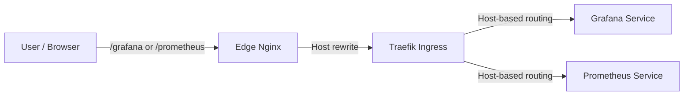
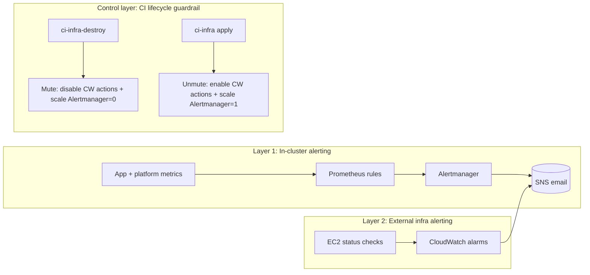
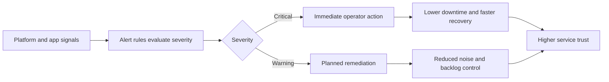
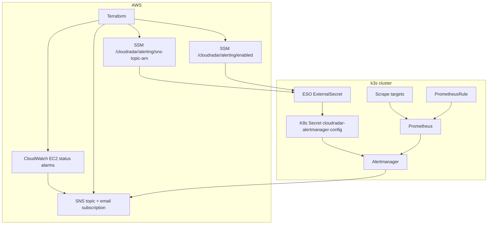

# Observability Stack (Prometheus + Grafana)

## Overview

Prometheus scrapes metrics from all k3s services. Grafana provides dashboards for ingestion/processing health monitoring.

**Stack**: Prometheus (7d retention, 5GB PVC) + Grafana (stateless, no persistence)  
**Cost**: ~$0.50/month (Prometheus PVC only)  
**Deployment**: Automatic via ArgoCD (GitOps) once k3s cluster is ready  
**Internet Access**: Grafana and Prometheus exposed via edge Nginx reverse proxy (Basic Auth at edge)

## Deployment & Bootstrap

### Deployment Flow

1. **Terraform Phase** (`terraform apply`)
   - Generates random Grafana admin password (or uses provided values from GitHub Secrets / .env)
   - Stores passwords in AWS SSM Parameter Store (`/cloudradar/grafana/admin-password`, `/cloudradar/edge/basic-auth`)
   - Outputs passwords for display/use
   - When `dns_zone_name` is set (in CI, via the `DNS_ZONE_NAME` GitHub Actions variable), Terraform writes `/cloudradar/grafana-domain` + `/cloudradar/grafana-root-url` for Grafana routing

2. **Bootstrap ArgoCD Phase** (`scripts/bootstrap-argocd-install.sh` + `scripts/bootstrap-argocd-app.sh`)
   - Installs ArgoCD on k3s server
   - Creates `cloudradar-platform` (k8s/platform) then `cloudradar` (k8s/apps)
   - ArgoCD discovers monitoring Applications in `k8s/apps/monitoring/`
   - **Waits for K8s Secrets before syncing Grafana**

3. **External Secrets Sync** (automated)
   - ESO syncs Grafana credentials from SSM into `monitoring/grafana-admin`
   - Grafana reads domain/root_url from the `grafana-domain` Secret

### Step-by-Step Sync Checks

#### 1. Verify SSM parameters exist

```bash
aws ssm get-parameter --name /cloudradar/grafana/admin-password --with-decryption --query 'Parameter.Value'
aws ssm get-parameter --name /cloudradar/edge/basic-auth --with-decryption --query 'Parameter.Value'
aws ssm get-parameter --name /cloudradar/grafana-domain --query 'Parameter.Value'
aws ssm get-parameter --name /cloudradar/grafana-root-url --query 'Parameter.Value'
```

#### 2. Confirm ESO created the secrets

```bash
kubectl get secret -n monitoring grafana-admin grafana-domain
```

#### 3. ArgoCD auto-syncs monitoring stack

Once K8s Secrets exist:
- ArgoCD detects changes in `k8s/apps/` (monitoring folder)
- Prometheus Application syncs first (creates namespace, deploys Prometheus)
- Grafana Application syncs (references grafana-admin Secret, deploys Grafana)
   - Ingress rules created (Traefik routes traffic based on host headers)

Check sync status:
```bash
# Port-forward to ArgoCD server
kubectl port-forward -n argocd svc/argocd-server 8080:443

# Or check via CLI
argocd app list
argocd app get prometheus
argocd app get grafana
```

#### 4. Verify deployments

```bash
# Check pods
kubectl get pods -n monitoring

# Check Grafana is ready
kubectl rollout status deployment/grafana -n monitoring

# Check Prometheus is ready
kubectl rollout status statefulset/prometheus-kube-prometheus-prometheus -n monitoring
```

### Automated Setup (Future: v1.1)

In Sprint 2, consider:
- Using External Secrets Operator to auto-sync SSM → K8s Secrets
- Creating a post-bootstrap hook in bootstrap-argocd-app.sh
- Using ArgoCD pre-sync hooks to verify Secrets exist

For now (MVP), the manual approach ensures we don't over-engineer the bootstrap flow.

## Access

### Grafana (Internet-Accessible)

**Via Internet** (through edge Nginx reverse proxy):
```
https://grafana.<dns_zone_name>/grafana/
User: admin
Password: (check AWS SSM `/cloudradar/grafana/admin-password`)
```

Notes:
- Grafana is served under `/grafana` (subpath). The edge proxy must keep the `/grafana` prefix.
- Grafana must serve from the subpath (`grafana.ini.server.root_url` includes `/grafana/` and `serve_from_sub_path=true` in `k8s/apps/monitoring/grafana-app.yaml`).
- Grafana should run **HTTP internally** (Traefik/probes), while edge terminates HTTPS.

**Via Port-Forward** (local development):
```bash
kubectl port-forward -n monitoring svc/grafana 3000:80
# Open http://localhost:3000
```

### Prometheus (Internet-Accessible)

Prometheus is exposed via edge Nginx with Basic Auth (same edge credentials as Grafana).

**Via Internet** (through edge Nginx reverse proxy):
```
https://prometheus.<dns_zone_name>/prometheus/
User: cloudradar
Password: (check AWS SSM `/cloudradar/edge/basic-auth`)
```

**For debugging via port-forward:**
```bash
kubectl port-forward -n monitoring svc/prometheus-kube-prometheus-prometheus 9090:9090
# Open http://localhost:9090
```

## Components

### Prometheus

- **Chart**: `prometheus-community/kube-prometheus-stack` v81.4.2
- **Namespace**: `monitoring`
- **Retention**: 7 days (MVP, data-flexible: if accumulation < 4 GB will keep all 7 days)
- **Storage**: 5 GB gp3 EBS
- **Scrape interval**: 30 seconds (default)
- **Targets**:
  - Kubernetes/node targets shipped with `kube-prometheus-stack` (kubelet, kube-state-metrics, node-exporter, etc.)
  - Application/exporter targets declared via `ServiceMonitor`/`PodMonitor` resources in `k8s/apps/monitoring/scrape-targets/`
- **Resource allocation**:
  - Requests: CPU 100m, Memory 512 Mi
  - Limits: CPU 500m, Memory 1 Gi
- **Alerting**: Alertmanager enabled (MVP baseline rules + config from ESO/SSM)
- **CRDs**: Applied pre-ArgoCD from `k8s/platform/crds/prometheus/` via server-side apply (CI + bootstrap script).

### Grafana

- **Chart**: `grafana/grafana` v10.5.15 (repo: `grafana-community/helm-charts`)
- **Admin password**: Retrieved from K8s Secret `grafana-admin` (synced from SSM via ESO)
- **Domain/Root URL**: Stored in SSM (`/cloudradar/grafana-domain`, `/cloudradar/grafana-root-url`) and injected via ESO
- **Datasource**: Prometheus (UID pinned to `prometheus` for deterministic dashboard provisioning)
- **Datasource**: CloudWatch (UID pinned to `cloudwatch` for AWS-native metrics + Logs Insights)
- **Dashboards**: Provisioned as code (no manual UI import)
- **Persistence**: Disabled (stateless, data loss on redeploy acceptable for MVP)
- **Resource allocation**:
  - Requests: CPU 50m, Memory 128 Mi
  - Limits: CPU 200m, Memory 256 Mi

## Prometheus Scrape Targets (MVP)

This repo uses **ServiceMonitor** and **PodMonitor** resources (Prometheus Operator) to scrape application/exporter metrics.

Targets defined in:
- `k8s/apps/monitoring/scrape-targets/`

Expected MVP targets:
- `processor` (Spring Boot): `GET /metrics/prometheus`
- `ingester` (Spring Boot): `GET /metrics/prometheus`
- `redis-exporter`: `GET /metrics`
- `traefik`: `GET /metrics` on `:9100` (enabled via k3s Traefik HelmChartConfig in `infra/aws/modules/k3s/templates/cloud-init-server.yaml`)
  - Scraped via `PodMonitor` because the default `kube-system/traefik` Service does not expose a `metrics` port.
  - Manifest: `k8s/apps/monitoring/scrape-targets/podmonitor-traefik.yaml`

Validation:
```bash
kubectl -n monitoring get servicemonitor
kubectl -n monitoring get podmonitor
kubectl -n monitoring port-forward svc/prometheus-kube-prometheus-prometheus 9090:9090
# Open http://localhost:9090/targets
```

## Grafana Dashboards (Provisioned)

Dashboards are stored in Git and provisioned via the Grafana Helm chart using ConfigMaps.

Source of truth:
- `k8s/apps/monitoring/dashboards/`

Provisioning mechanism:
- `k8s/apps/monitoring/grafana-app.yaml` uses `dashboardsConfigMaps` to mount `grafana-dashboards-default`.

Included baseline dashboards (pinned revisions):
- Nodes: Node Exporter Full
- Kubernetes: Kubernetes / Views / Global
- Ingress: Traefik Official Standalone Dashboard
- Redis: Redis Exporter
- Apps: JVM (Micrometer)
- CloudRadar: Operations Overview (custom)

Validation:
```bash
kubectl -n monitoring logs deploy/grafana --tail=50
# Grafana should not log "dashboards/default: no such file or directory"
```

## CloudWatch Integration (AWS-Native Signals)

Prometheus covers Kubernetes + application metrics, but it does not provide AWS-native infra visibility or VPC-level network flow analysis.

This project uses **Grafana CloudWatch datasource** (no static keys) plus **VPC Flow Logs** (CloudWatch Logs destination) to cover AWS-native signals.

### IAM / Authentication model (no static keys)

- Grafana uses the AWS SDK default credential chain and reads credentials from the **EC2 instance role** (IMDSv2).
- In k3s-on-EC2 (not EKS), there is no IRSA. This implies the node role is shared at the host level.
- The Terraform k3s module can attach a **read-only** IAM policy for CloudWatch metrics + logs queries to the node role.

Security note:
- If pods can reach IMDS (`169.254.169.254`), any pod could potentially use the node role credentials.
- This is acceptable for a single-tenant MVP cluster but should be re-evaluated if multi-tenancy is introduced.

### VPC Flow Logs (Terraform)

Terraform provisions:
- A dedicated CloudWatch Log Group (default name: `/cloudradar/<project>-<env>/vpc-flow-logs`)
- An IAM role for the Flow Logs service to write into that Log Group
- A VPC Flow Log resource attached to the VPC (`traffic_type=ALL` by default)

Validation:
```bash
# Check Flow Logs are enabled and writing to the expected Log Group
aws ec2 describe-flow-logs --query 'FlowLogs[*].{Id:FlowLogId,ResourceId:ResourceId,Status:FlowLogStatus,LogGroup:LogGroupName,TrafficType:TrafficType}' --output table

# Check Log Group retention
aws logs describe-log-groups --log-group-name-prefix /cloudradar/ --query 'logGroups[?contains(logGroupName, `vpc-flow-logs`)].{name:logGroupName,retention:retentionInDays,storedBytes:storedBytes}' --output table
```

Cost note:
- CloudWatch Logs is billed by **GB ingested** and **GB-month stored**. Keep retention low for MVP (default: 3 days).

### Grafana dashboards (CloudWatch)

Dashboards are provisioned as code under:
- `k8s/apps/monitoring/dashboards/json/`

Included CloudWatch dashboards (MVP):
- `CloudRadar: AWS Infra (CloudWatch)` (EC2/EBS/ASG/S3)
- `CloudRadar: VPC Flow Logs (CloudWatch Logs)` (Logs Insights queries)

Validation:
```bash
# Port-forward Grafana and check dashboards load
kubectl port-forward -n monitoring svc/grafana 3000:80
# Open http://localhost:3000 and verify CloudWatch datasource + dashboards.
```

## Dashboard Lifecycle (GitOps + Optional UI Imports)

This project treats dashboards as **code**:
- No manual UI imports are required for baseline dashboards.
- Grafana persistence is disabled (`persistence.enabled=false`), so UI-only changes may be lost on restart/reschedule.

### A) GitOps provisioning (recommended)

How it works:
1. Dashboard JSON files are stored in `k8s/apps/monitoring/dashboards/json/`.
2. `k8s/apps/monitoring/dashboards/kustomization.yaml` generates a stable ConfigMap named `grafana-dashboards-default`.
3. `k8s/apps/monitoring/grafana-app.yaml` mounts that ConfigMap using `dashboardsConfigMaps`.
4. Grafana loads dashboards from `/var/lib/grafana/dashboards/default` via `dashboardProviders`.

Add a new dashboard:
1. Add a JSON file under `k8s/apps/monitoring/dashboards/json/`.
2. Reference it in `k8s/apps/monitoring/dashboards/kustomization.yaml` (ConfigMap generator `files:` list).
3. Commit and let ArgoCD sync.

Local render check (no cluster required):
```bash
kubectl kustomize k8s/apps/monitoring | head -n 40
```

### B) Manual UI import (debug-only / prototyping)

UI import is acceptable for fast prototyping, but the end state should be committed to Git.

Steps:
1. Open Grafana.
2. Go to `Dashboards` -> `New` -> `Import`.
3. Use one of:
   - Paste dashboard JSON
   - Enter a Grafana.com dashboard ID (`gnetId`)
4. Select the `Prometheus` datasource when prompted.
5. Save the dashboard.

Important:
- Because Grafana persistence is disabled, UI-only dashboards are not guaranteed to survive a redeploy.

### Export a UI-created dashboard back to Git (recommended)

From Grafana UI:
1. Open the dashboard.
2. `Dashboard settings` -> `JSON model`.
3. Copy the JSON, save it into `k8s/apps/monitoring/dashboards/json/<name>.json`.
4. Add it to `k8s/apps/monitoring/dashboards/kustomization.yaml`.

### Updating pinned baseline dashboards

Baseline dashboards are vendored from grafana.com and pinned to a specific revision for determinism.

Example (replace `ID`, `REV`, and output file name as needed):
```bash
curl -fsSL "https://grafana.com/api/dashboards/ID/revisions/REV/download" > "k8s/apps/monitoring/dashboards/json/<file>.json"
```

After updating a JSON:
- Verify Grafana loads it (no provisioning errors in logs).
- Verify panels resolve the datasource correctly (common expectation: datasource named `Prometheus`).

## Password Management

### Grafana Admin Password

**Stored in**:
- AWS SSM Parameter Store: `/cloudradar/grafana/admin-password` (SecureString)
- K8s Secret: `monitoring/grafana-admin` (created by Terraform)

**To retrieve**:
```bash
# From AWS
aws ssm get-parameter --name /cloudradar/grafana/admin-password --with-decryption --query 'Parameter.Value'

# From Kubernetes
kubectl get secret grafana-admin -n monitoring -o jsonpath='{.data.admin-password}' | base64 -d
```

**To change**:
1. Update in AWS SSM:
   ```bash
   aws ssm put-parameter --name /cloudradar/grafana/admin-password --value "newpassword" --type SecureString --overwrite
   ```

2. Update K8s Secret:
   ```bash
   kubectl delete secret grafana-admin -n monitoring
   kubectl create secret generic grafana-admin -n monitoring --from-literal=admin-password="newpassword"
   ```

3. Restart Grafana pods:
   ```bash
   kubectl rollout restart deployment/grafana -n monitoring
   ```

### Prometheus Auth Password

Prometheus access currently uses the **edge Basic Auth** secret (`/cloudradar/edge/basic-auth`).  
The legacy `/cloudradar/prometheus/auth-password` parameter is not used.

### Access Path (Prometheus / Grafana)
- Public access goes through **edge Nginx (EC2)** which enforces Basic Auth (SSM: `/cloudradar/edge/basic-auth`).
- Traffic is forwarded to K3s via the **Traefik NodePort**; Traefik handles in-cluster routing by **host header**.
- Edge Nginx rewrites the Host header to match the internal Ingress hosts (`grafana.cloudradar.local`, `prometheus.cloudradar.local`).
- Edge upstream ports for Grafana/Prometheus should target the Traefik **HTTP NodePort** (pinned to `30080`).
- Terraform inputs: `edge_grafana_nodeport` and `edge_prometheus_nodeport` must match the Traefik NodePort.
- There is **no in-cluster proxy** for Prometheus or Grafana; keep a single auth layer at the edge.

**URLs (edge):**
- Prometheus: `https://<edge-host>/prometheus/`
- Grafana: `https://<edge-host>/grafana/`

**Internal Hostnames (Traefik match):**
- `grafana.cloudradar.local`
- `prometheus.cloudradar.local`



## Metrics

### Available metrics (from Prometheus)

- **Node**: CPU, memory, disk, network (via `node-exporter`)
- **Kubernetes**: Pod, deployment, statefulset metrics (via `kube-state-metrics`)
- **Applications**: Custom metrics from ingester/processor if instrumented

### Example Prometheus queries

```promql
# CPU usage per pod
sum by (pod) (rate(container_cpu_usage_seconds_total[5m]))

# Memory usage
sum by (pod) (container_memory_usage_bytes)

# Pod restart count
kube_pod_container_status_restarts_total

# Node disk usage
node_filesystem_avail_bytes / node_filesystem_size_bytes
```

## Resource Management

### CPU & Memory Requests/Limits

The observability stack is configured with minimal resources for MVP:

**Prometheus**:
- Requests: 100m CPU, 512 Mi memory
- Limits: 500m CPU, 1 Gi memory
- Monitor with: `kubectl top pod -n monitoring prometheus-*`

**Grafana**:
- Requests: 50m CPU, 128 Mi memory
- Limits: 200m CPU, 256 Mi memory

**When to scale up**:
- Prometheus: if scrape latency > 5s or OOMKilled events appear
  - Increase CPU: 100m → 200m-500m
  - Increase memory: 512 Mi → 1 Gi → 2 Gi
  - Cost: negligible (k3s pods share node resources)
- Grafana: if dashboards are slow (rare), increase memory to 512 Mi

### Check resource usage

```bash
kubectl top pods -n monitoring

# Example output:
# NAME                                       CPU(m)   MEMORY(Mi)
# prometheus-kube-prometheus-prometheus-0    50m      600Mi
# grafana-0                                   20m      150Mi
```

## Alerting

### Alertmanager (MVP baseline)

Alertmanager is enabled in `kube-prometheus-stack` with a conservative MVP setup:
- baseline alert routing and grouping
- CloudRadar PrometheusRule pack in `k8s/apps/monitoring/alerts/`
- configuration sourced from `cloudradar-alertmanager-config` Secret generated by ESO from SSM parameters:
  - `/cloudradar/alerting/sns-topic-arn`
  - `/cloudradar/alerting/enabled`

Current operating model:
- **In-cluster**: alert state and history visible in Prometheus/Grafana/Alertmanager UI.
- **Alertmanager notifications**: SNS receiver enabled when `/cloudradar/alerting/enabled=true`.
- **External infra notifications**: CloudWatch alarms + SNS email (infra-critical signals).

This avoids SMTP/provider complexity for MVP while keeping an external failure channel.

Alerting layers (MVP):



Toward a complete alerting model (next layers):
- **Edge/Synthetic alerting**: internet-facing probes for `/healthz`, `/api`, and latency thresholds (user-perceived availability).
- **SLO burn-rate alerting**: multi-window, multi-burn alerts on error rate and latency budgets to reduce false positives.
- **Log-based alerting**: repeated 5xx/exception/OOM patterns from centralized logs (Loki or CloudWatch Logs).
- **Data quality/freshness alerting**: detect stale OpenSky batches, ingestion gaps, and abnormal throughput drops.
- **Security alerting**: GuardDuty/CloudTrail/IAM anomaly signals for suspicious actions and permission drift.
- **FinOps alerting**: AWS budget and anomaly alerts for cost spikes (CloudWatch + Budgets).

Business function (why alerting exists):
- Detect service degradation early enough to act before user-facing impact grows.
- Separate critical incidents (immediate action) from warnings (monitor + schedule fix).
- Provide one external channel (SNS email) for incidents that matter outside cluster dashboards.



Technical function (how it works):



Key custom alerts (CloudRadar):
- `CloudRadarCriticalTargetDown`
- `CloudRadarProcessorStalled`
- `CloudRadarRedisQueueBacklogHigh`
- `CloudRadarIngesterBackoffActive`
- `CloudRadarIngesterDisabled`
- `CloudRadarOpenSkyRateLimited`

Destroy/deploy lifecycle guardrail:
- `ci-infra-destroy` disables CloudWatch alarm actions before destroy and scales Alertmanager down (best effort, dev).
- `ci-infra` re-enables CloudWatch alarm actions after apply and scales Alertmanager back to 1 replica (best effort, dev).

## Dashboards

### Starter dashboards included

- **Kubernetes Cluster**: Overview of cluster health, nodes, pods
- **Kubernetes Apps**: Deployment/statefulset health

Add custom dashboards:
1. Port-forward to Grafana (see Access section)
2. Create dashboard or import JSON
3. Save with folder `default` for persistence

## Troubleshooting

### Prometheus not scraping metrics

Check service discovery:
```bash
kubectl port-forward -n monitoring svc/prometheus-kube-prometheus-prometheus 9090:9090
# Open http://localhost:9090/service-discovery
# Verify targets are discovered
```

Check scrape config:
```bash
kubectl port-forward -n monitoring svc/prometheus-kube-prometheus-prometheus 9090:9090
# Open http://localhost:9090/config
```

### Grafana slow / high memory

Restart Grafana:
```bash
kubectl rollout restart deployment grafana -n monitoring
```

Check resources:
```bash
kubectl top pods -n monitoring
```

## Scaling

### Increase Prometheus retention (beyond 2 days)

Edit `k8s/apps/monitoring/prometheus-app.yaml`:
```yaml
retention: 7d           # from 2d
retentionSize: "20GB"   # from 4GB
storage: 20Gi           # from 5Gi
```

**Cost impact**: +$2-3/month per 10 GB added.

### Add persistent Grafana

Edit `k8s/apps/monitoring/grafana-app.yaml`:
```yaml
persistence:
  enabled: true
  size: 1Gi
```

**Cost impact**: +$0.10/month.

## Related

- [ADR: Observability Strategy](../../architecture/decisions/)
- [Backup Strategy](#126): Prometheus backup CronJob (Sprint 2)
- [Restore Workflow (#25)](#25): Backup/restore automation
