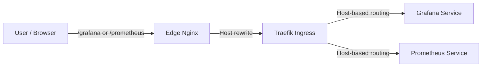

# Observability Stack (Prometheus + Grafana)

## Overview

Prometheus scrapes metrics from all k3s services. Grafana provides dashboards for ingestion/processing health monitoring.

**Stack**: Prometheus (7d retention, 5GB PVC) + Grafana (stateless, no persistence)  
**Cost**: ~$0.50/month (Prometheus PVC only)  
**Deployment**: Automatic via ArgoCD (GitOps) once k3s cluster is ready  
**Internet Access**: Grafana and Prometheus exposed via edge Nginx reverse proxy (Basic Auth at edge)

## Deployment & Bootstrap

### Deployment Flow

1. **Terraform Phase** (`terraform apply`)
   - Generates random Grafana admin password (or uses provided values from GitHub Secrets / .env)
   - Stores passwords in AWS SSM Parameter Store (`/cloudradar/grafana/admin-password`, `/cloudradar/edge/basic-auth`)
   - Outputs passwords for display/use
   - **Does NOT create K8s Secrets** (cluster access happens after bootstrap)

2. **Bootstrap ArgoCD Phase** (`scripts/bootstrap-argocd-install.sh` + `scripts/bootstrap-argocd-app.sh`)
   - Installs ArgoCD on k3s server
   - Creates `cloudradar-platform` (k8s/platform) then `cloudradar` (k8s/apps)
   - ArgoCD discovers monitoring Applications in `k8s/apps/monitoring/`
   - **Waits for K8s Secrets before syncing Grafana**

3. **Manual K8s Secrets Creation** (one-time, after terraform apply)
   - Retrieve passwords from SSM Parameter Store
   - Create K8s Secrets in monitoring namespace
   - After this, ArgoCD syncs monitoring stack

### Step-by-Step Manual Setup

#### 1. After `terraform apply` completes

```bash
# Get outputs
cd infra/aws/live/dev
GRAFANA_PASSWORD=$(terraform output -raw grafana_admin_password)

# Verify they're in SSM
aws ssm get-parameter --name /cloudradar/grafana/admin-password --with-decryption --query 'Parameter.Value'
aws ssm get-parameter --name /cloudradar/edge/basic-auth --with-decryption --query 'Parameter.Value'
```

#### 2. Get kubeconfig and connect to k3s

```bash
# Download kubeconfig from k3s server via SSM
bash scripts/get-aws-kubeconfig.sh

# Verify cluster access
kubectl get nodes
```

#### 3. Create K8s Secrets

```bash
# Create monitoring namespace (if not already created)
kubectl create namespace monitoring --dry-run=client -o yaml | kubectl apply -f -

# Create Grafana admin secret
kubectl create secret generic grafana-admin \
  -n monitoring \
  --from-literal=admin-password="$GRAFANA_PASSWORD" \
  --dry-run=client -o yaml | kubectl apply -f -

# Prometheus auth is enforced at the edge (Basic Auth).

# Verify secrets exist
kubectl get secrets -n monitoring
```

#### 4. ArgoCD auto-syncs monitoring stack

Once K8s Secrets exist:
- ArgoCD detects changes in `k8s/apps/` (monitoring folder)
- Prometheus Application syncs first (creates namespace, deploys Prometheus)
- Grafana Application syncs (references grafana-admin Secret, deploys Grafana)
   - Ingress rules created (Traefik routes traffic based on host headers)

Check sync status:
```bash
# Port-forward to ArgoCD server
kubectl port-forward -n argocd svc/argocd-server 8080:443

# Or check via CLI
argocd app list
argocd app get prometheus
argocd app get grafana
```

#### 5. Verify deployments

```bash
# Check pods
kubectl get pods -n monitoring

# Check Grafana is ready
kubectl rollout status deployment/grafana -n monitoring

# Check Prometheus is ready
kubectl rollout status statefulset/prometheus-kube-prometheus-prometheus -n monitoring
```

### Automated Setup (Future: v1.1)

In Sprint 2, consider:
- Using External Secrets Operator to auto-sync SSM → K8s Secrets
- Creating a post-bootstrap hook in bootstrap-argocd-app.sh
- Using ArgoCD pre-sync hooks to verify Secrets exist

For now (MVP), the manual approach ensures we don't over-engineer the bootstrap flow.

## Access

### Grafana (Internet-Accessible)

**Via Internet** (through edge Nginx reverse proxy):
```
https://<edge-host>/grafana/
User: admin
Password: (check AWS SSM `/cloudradar/grafana/admin-password`)
```

Notes:
- Grafana is served under `/grafana` (subpath). The edge proxy must keep the `/grafana` prefix.
- Grafana must serve from the subpath (`grafana.ini.server.root_url` includes `/grafana/` and `serve_from_sub_path=true` in `k8s/apps/monitoring/grafana-app.yaml`).
- Grafana should run **HTTP internally** (Traefik/probes), while edge terminates HTTPS.

**Via Port-Forward** (local development):
```bash
kubectl port-forward -n monitoring svc/grafana 3000:80
# Open http://localhost:3000
```

### Prometheus (Internet-Accessible)

Prometheus is exposed via edge Nginx with Basic Auth (same edge credentials as Grafana).

**Via Internet** (through edge Nginx reverse proxy):
```
https://<edge-host>/prometheus/
User: cloudradar
Password: (check AWS SSM `/cloudradar/edge/basic-auth`)
```

**For debugging via port-forward:**
```bash
kubectl port-forward -n monitoring svc/prometheus-kube-prometheus-prometheus 9090:9090
# Open http://localhost:9090
```

## Components

### Prometheus

- **Chart**: `prometheus-community/kube-prometheus-stack` v81.4.2
- **Namespace**: `monitoring`
- **Retention**: 7 days (MVP, data-flexible: if accumulation < 4 GB will keep all 7 days)
- **Storage**: 5 GB gp3 EBS
- **Scrape interval**: 30 seconds (default)
- **Targets**: All k3s nodes + services with `prometheus.io/scrape=true` label
- **Resource allocation**:
  - Requests: CPU 100m, Memory 512 Mi
  - Limits: CPU 500m, Memory 1 Gi
- **Alerting**: AlertManager included in chart but disabled (enable in Sprint 2 if needed)
- **CRDs**: Applied pre-ArgoCD from `k8s/platform/crds/prometheus/` via server-side apply (CI + bootstrap script).

### Grafana

- **Chart**: `grafana/grafana` v10.5.15 (repo: `grafana-community/helm-charts`)
- **Admin password**: Retrieved from K8s Secret `grafana-admin` (set by Terraform)
- **Datasource**: Auto-configured to Prometheus
- **Dashboards**: Starter dashboards for cluster + application health
- **Persistence**: Disabled (stateless, data loss on redeploy acceptable for MVP)
- **Resource allocation**:
  - Requests: CPU 50m, Memory 128 Mi
  - Limits: CPU 200m, Memory 256 Mi

## Password Management

### Grafana Admin Password

**Stored in**:
- AWS SSM Parameter Store: `/cloudradar/grafana/admin-password` (SecureString)
- K8s Secret: `monitoring/grafana-admin` (created by Terraform)

**To retrieve**:
```bash
# From AWS
aws ssm get-parameter --name /cloudradar/grafana/admin-password --with-decryption --query 'Parameter.Value'

# From Kubernetes
kubectl get secret grafana-admin -n monitoring -o jsonpath='{.data.admin-password}' | base64 -d
```

**To change**:
1. Update in AWS SSM:
   ```bash
   aws ssm put-parameter --name /cloudradar/grafana/admin-password --value "newpassword" --type SecureString --overwrite
   ```

2. Update K8s Secret:
   ```bash
   kubectl delete secret grafana-admin -n monitoring
   kubectl create secret generic grafana-admin -n monitoring --from-literal=admin-password="newpassword"
   ```

3. Restart Grafana pods:
   ```bash
   kubectl rollout restart deployment/grafana -n monitoring
   ```

### Prometheus Auth Password

Prometheus access currently uses the **edge Basic Auth** secret (`/cloudradar/edge/basic-auth`).  
The legacy `/cloudradar/prometheus/auth-password` parameter is not used.

### Access Path (Prometheus / Grafana)
- Public access goes through **edge Nginx (EC2)** which enforces Basic Auth (SSM: `/cloudradar/edge/basic-auth`).
- Traffic is forwarded to K3s via the **Traefik NodePort**; Traefik handles in-cluster routing by **host header**.
- Edge Nginx rewrites the Host header to match the internal Ingress hosts (`grafana.cloudradar.local`, `prometheus.cloudradar.local`).
- Edge upstream ports for Grafana/Prometheus should target the Traefik **HTTP NodePort** (pinned to `30080`).
- Terraform inputs: `edge_grafana_nodeport` and `edge_prometheus_nodeport` must match the Traefik NodePort.
- There is **no in-cluster proxy** for Prometheus or Grafana; keep a single auth layer at the edge.

**URLs (edge):**
- Prometheus: `https://<edge-host>/prometheus/`
- Grafana: `https://<edge-host>/grafana/`

**Internal Hostnames (Traefik match):**
- `grafana.cloudradar.local`
- `prometheus.cloudradar.local`



## Metrics

### Available metrics (from Prometheus)

- **Node**: CPU, memory, disk, network (via `node-exporter`)
- **Kubernetes**: Pod, deployment, statefulset metrics (via `kube-state-metrics`)
- **Applications**: Custom metrics from ingester/processor if instrumented

### Example Prometheus queries

```promql
# CPU usage per pod
sum by (pod) (rate(container_cpu_usage_seconds_total[5m]))

# Memory usage
sum by (pod) (container_memory_usage_bytes)

# Pod restart count
kube_pod_container_status_restarts_total

# Node disk usage
node_filesystem_avail_bytes / node_filesystem_size_bytes
```

## Resource Management

### CPU & Memory Requests/Limits

The observability stack is configured with minimal resources for MVP:

**Prometheus**:
- Requests: 100m CPU, 512 Mi memory
- Limits: 500m CPU, 1 Gi memory
- Monitor with: `kubectl top pod -n monitoring prometheus-*`

**Grafana**:
- Requests: 50m CPU, 128 Mi memory
- Limits: 200m CPU, 256 Mi memory

**When to scale up**:
- Prometheus: if scrape latency > 5s or OOMKilled events appear
  - Increase CPU: 100m → 200m-500m
  - Increase memory: 512 Mi → 1 Gi → 2 Gi
  - Cost: negligible (k3s pods share node resources)
- Grafana: if dashboards are slow (rare), increase memory to 512 Mi

### Check resource usage

```bash
kubectl top pods -n monitoring

# Example output:
# NAME                                       CPU(m)   MEMORY(Mi)
# prometheus-kube-prometheus-prometheus-0    50m      600Mi
# grafana-0                                   20m      150Mi
```

## Alerting

### AlertManager (Disabled by default)

AlertManager is included in `kube-prometheus-stack` but **disabled for MVP**. It handles alert routing (email, Slack, PagerDuty).

To enable AlertManager:

1. Edit `k8s/apps/monitoring/prometheus-app.yaml`:
   ```yaml
   alertmanager:
     enabled: true
     config:
       global:
         resolve_timeout: 5m
       route:
         receiver: 'null'
   ```

2. Add PrometheusRules for alerts (example):
   ```yaml
   groups:
   - name: kubernetes.rules
     rules:
     - alert: PodCrashLooping
       expr: rate(kube_pod_container_status_restarts_total[5m]) > 0.1
       for: 5m
   ```

3. ArgoCD will sync and AlertManager pod will start.

**When to add** (Sprint 2+):
- Have service health checks (ingester lag, processor queue depth)
- Define alert thresholds and owners
- Integrate with incident response (Slack webhook, etc.)

## Dashboards

### Starter dashboards included

- **Kubernetes Cluster**: Overview of cluster health, nodes, pods
- **Kubernetes Apps**: Deployment/statefulset health

Add custom dashboards:
1. Port-forward to Grafana (see Access section)
2. Create dashboard or import JSON
3. Save with folder `default` for persistence

## Troubleshooting

### Prometheus not scraping metrics

Check service discovery:
```bash
kubectl port-forward -n monitoring svc/prometheus-kube-prometheus-prometheus 9090:9090
# Open http://localhost:9090/service-discovery
# Verify targets are discovered
```

Check scrape config:
```bash
kubectl port-forward -n monitoring svc/prometheus-kube-prometheus-prometheus 9090:9090
# Open http://localhost:9090/config
```

### Grafana slow / high memory

Restart Grafana:
```bash
kubectl rollout restart deployment grafana -n monitoring
```

Check resources:
```bash
kubectl top pods -n monitoring
```

## Scaling

### Increase Prometheus retention (beyond 2 days)

Edit `k8s/apps/monitoring/prometheus-app.yaml`:
```yaml
retention: 7d           # from 2d
retentionSize: "20GB"   # from 4GB
storage: 20Gi           # from 5Gi
```

**Cost impact**: +$2-3/month per 10 GB added.

### Add persistent Grafana

Edit `k8s/apps/monitoring/grafana-app.yaml`:
```yaml
persistence:
  enabled: true
  size: 1Gi
```

**Cost impact**: +$0.10/month.

## Related

- [ADR: Observability Strategy](../../architecture/decisions/)
- [Backup Strategy](#126): Prometheus backup CronJob (Sprint 2)
- [Restore Workflow (#25)](#25): Backup/restore automation
