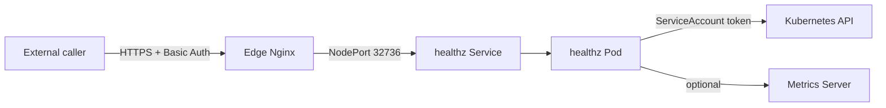

# Health Endpoint (edge -> k3s)

Purpose: expose a `/healthz` endpoint through the edge Nginx to validate end-to-end connectivity and return non-sensitive cluster aggregates. The pod also exposes `/readyz` for liveness/readiness probes.

## Prerequisites
- ArgoCD is installed and synced.
- Edge Nginx is deployed and reachable.
- Metrics server is available if you want CPU/RAM aggregates (optional).

## Steps
1) Build and publish the health image to GHCR:
```bash
docker build -t ghcr.io/clementv78/cloudradar-health:0.1.0 src/health
docker push ghcr.io/clementv78/cloudradar-health:0.1.0
```

2) Configure the health NodePort for the edge (Traefik HTTP NodePort):
```hcl
edge_health_nodeport = 32736
```

If you reuse the same NodePort as the dashboard (default), you can omit `edge_health_nodeport`.

3) Apply Terraform in the live env:
```bash
terraform apply -var-file=terraform.tfvars
```

4) Commit and push the GitOps manifests under `k8s/apps/health`.
ArgoCD will sync automatically.

5) Verify from the Internet:
```bash
curl -k -u "<user>:<password>" https://<edge-public-ip>/healthz
```

## Expected response (example)
```json
{
  "status": "ok",
  "timestamp": "2026-01-16T16:10:00Z",
  "cluster": { "nodes_ready": 2, "nodes_total": 2 },
  "workloads": { "deployments": 1, "pods": 3 },
  "metrics": { "available": true, "cpu_mcores": 120.5, "memory_bytes": 203341824 },
  "errors": []
}
```

## How it works (DevOps view)

### Data flow overview


### Components and responsibilities
- **Edge Nginx** exposes `/healthz` publicly and enforces Basic Auth.
- **healthz Service** is a ClusterIP/NodePort entrypoint so edge can reach the pod.
- **healthz Pod** serves `/healthz` and collects non-sensitive cluster aggregates.
- **Kubernetes API** is queried in-cluster using the pod ServiceAccount token.
- **Metrics Server** is optional; if absent, the response reports `metrics.available=false`.

### Authentication and authorization
- The pod authenticates to the Kubernetes API using the **ServiceAccount token** mounted at:
  - `/var/run/secrets/kubernetes.io/serviceaccount/token`
- Authorization is enforced via **RBAC**:
  - `ClusterRole healthz-reader` grants **read-only** access to `nodes`, `pods`, and `deployments`.
  - Access to `metrics.k8s.io` is also read-only (if Metrics Server is installed).
- This keeps the endpoint **observability-focused** without write permissions.

### Security posture
- **No sensitive data** is returned (only counts and aggregates).
- **Public access** is protected by **Basic Auth** at the edge.
- **K8s API access** is limited to read-only resources via RBAC.

### Operational notes
- If the Kubernetes API is unreachable, the endpoint returns `status=degraded` with error details.
- If Metrics Server is missing, health stays `ok` but `metrics.available=false`.
- The service is designed for **end-to-end validation** (edge → k3s → API) rather than deep diagnostics.
- Liveness/readiness probes use `/readyz` so cluster slowness does not crash the pod.

## Notes
- `/healthz` is protected by the edge Basic Auth.
- If metrics are not available, the response will include `"metrics": {"available": false}`.
