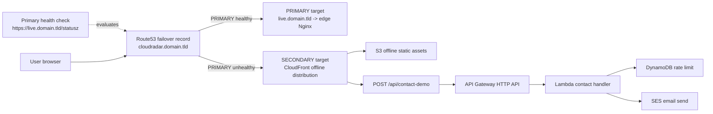

# Offline Fallback Landing Page (Route53 Failover)

## Purpose
Serve a branded CloudRadar offline landing page with demo-contact form when live infrastructure is down (or intentionally destroyed), while keeping the online stack unchanged.

## Architecture summary
- Primary path (online): `cloudradar.<domain>` -> edge Nginx (existing, Let's Encrypt cert from SSM).
- Failover path (offline): Route53 failover switches to CloudFront offline distribution backed by bootstrap S3.
- Both failover records use the same public hostname (`cloudradar.<domain>`); Route53 returns PRIMARY or SECONDARY target depending on primary health-check status.
- Contact form: `/api/contact-demo` -> CloudFront behavior -> API Gateway HTTP API -> Lambda -> SES.
- Anti-spam baseline (no WAF): API throttling + honeypot + backend validation + DynamoDB IP/window rate limit.

## Offline fallback diagram


## Prerequisites
- `DNS_ZONE_NAME` configured in bootstrap workflow vars.
- Hosted zone managed by `infra/aws/bootstrap`.
- SES available in the selected region.

## Required GitHub Action variables
Set in repository variables before running `bootstrap-terraform-backend`:
- `OFFLINE_SITE_ENABLED=true`
- `OFFLINE_CONTACT_SENDER_LOCAL_PART=<sender-local-part>` (optional; default: `noreply`)
- `OFFLINE_CONTACT_RECIPIENT_EMAIL=<your-mailbox>`

Optional tuning:
- `OFFLINE_SITE_BUCKET_NAME`
- `OFFLINE_SUBDOMAIN_LABEL` (default: `offline`)
- `OFFLINE_PRIMARY_DOMAIN_LABEL` (default: `live`)
- `OFFLINE_LOGS_RETENTION_DAYS` (default: `7`)
- `OFFLINE_RATE_LIMIT_WINDOW_SECONDS` (default: `900`)
- `OFFLINE_RATE_LIMIT_MAX_HITS` (default: `3`)
- `OFFLINE_API_THROTTLE_RATE_LIMIT` (default: `5`)
- `OFFLINE_API_THROTTLE_BURST_LIMIT` (default: `10`)
- `OFFLINE_PRIMARY_HEALTH_PATH` (default: `/statusz`)
- `OFFLINE_PRIMARY_HEALTH_PORT` (default: `443`)

## Apply order
Recommended sequence for this project:
1. Apply `infra/aws/bootstrap` with `OFFLINE_SITE_ENABLED=true`.
2. Apply `infra/aws/live/dev` (creates/updates `live.<zone>` record used by failover health checks).

In CI, use workflows:
1. `bootstrap-terraform-backend` for bootstrap/offline stack.
2. `ci-infra` for live env.

## Verification checklist
1. Validate offline DNS records:
```bash
aws route53 list-resource-record-sets --hosted-zone-id <ZONE_ID> \
  --query "ResourceRecordSets[?Name=='cloudradar.<domain>.' || Name=='offline.cloudradar.<domain>.' || Name=='live.cloudradar.<domain>.']"
```
2. Verify Route53 health check is healthy (primary):
```bash
aws route53 list-health-checks --query "HealthChecks[?contains(FullyQualifiedDomainName, 'live.')].Id"
```
3. Verify CloudFront distribution deployed and aliases include root + offline domains.
4. Verify SES domain identity records are present in Route53:
   - `_amazonses.<dns_zone_name>` TXT
   - `*._domainkey.<dns_zone_name>` CNAME (DKIM)
5. Open `https://offline.<zone>` and submit a test contact request.
6. Confirm SES email reception.

## Spam-protection checks
- Submit 1 valid request -> expected `200`.
- Submit a request with honeypot field set -> expected `400`.
- Submit > configured `OFFLINE_RATE_LIMIT_MAX_HITS` in one window -> expected `429`.

## Rollback
- Set `OFFLINE_SITE_ENABLED=false` and rerun bootstrap workflow.
- Root domain routing returns to primary live endpoint only.

## Notes
- No WAF in v1.1 by FinOps choice.
- CloudWatch retention should remain in the existing 3-7 day policy range.
