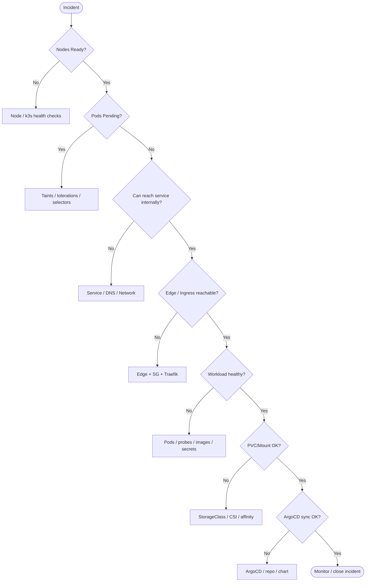

# Troubleshooting Guide (AWS + k3s)

Purpose: fast diagnosis of the most common failures in the CloudRadar stack.

> Rule of thumb: start with **cluster health**, then **networking**, then **workloads**.

---

## Table of Contents

1. Quick Triage (Decision Tree)
2. Fast Checks (Run First)
3. Cluster & Nodes
4. Networking & Traffic
5. GitOps & Supply Chain
6. Workloads & Runtime
7. Storage
8. Utilities
9. When to Escalate

---

## 1) Quick Triage (Decision Tree)



---

## 2) Fast Checks (Run First)

```bash
# Cluster state
kubectl get nodes -o wide
kubectl get pods -A --field-selector=status.phase!=Running

# Core infra
kubectl -n kube-system get pods -o wide
kubectl -n kube-system get svc -o wide

# Ingress + routes
kubectl get ingress -A
kubectl -n kube-system get pods -l app.kubernetes.io/name=traefik -o wide
kubectl -n kube-system get svc -l app.kubernetes.io/name=traefik -o wide

# ArgoCD app health
kubectl -n argocd get applications
```

---

## 3) Cluster & Nodes

### 3.1 Node / k3s Health (Nodes NotReady)

**Symptoms**: `NotReady`, pods stuck `Pending`, high restart count.

**Checks**
```bash
kubectl describe node <node>
ssh <node> 'sudo systemctl status k3s'  # server
ssh <node> 'sudo systemctl status k3s-agent'  # worker
ssh <node> 'sudo journalctl -u k3s -n 200'
```

**Likely causes & fixes**
- **k3s service crashed** -> restart service; check disk pressure, cgroup, kubelet logs.
- **No disk / inode** -> expand volume or clean containerd.
- **CNI down** -> check flannel/traefik pods in kube-system.

---

### 3.2 Scheduling / Taints / Tolerations

**Symptoms**: pods stuck `Pending`, `0/1 nodes available`, taint errors.

**Checks**
```bash
kubectl -n <ns> describe pod <pod>
kubectl get nodes -o custom-columns=NAME:.metadata.name,TAINTS:.spec.taints
```

**Fix**
- Add matching tolerations to the workload.
- Ensure node selectors/affinity match available nodes.

---

## 4) Networking & Traffic

### 4.1 Networking / DNS / CNI

**Symptoms**: service unreachable, DNS failures, timeouts.

**Checks**
```bash
kubectl -n kube-system get pods -l k8s-app=kube-dns -o wide
kubectl -n kube-system logs -l k8s-app=kube-dns --tail=100
kubectl get svc -A | head

# From a debug pod
kubectl -n default run nettest --rm -it --image=curlimages/curl:8.9.1 --restart=Never -- sh
nslookup kubernetes.default
curl -I http://<service>.<ns>.svc.cluster.local
```

**Fixes**
- Restart coredns if failing.
- Check Node security groups, NACLs, and route tables.
- Confirm NAT/VPC endpoints when egress is required (GitHub, SSM, Helm repos).

---

### 4.2 Edge / SG / NodePort / Traefik (502 / 504 / timeouts)

**Symptoms**: Edge 502, service OK internally.

**Checks**
```bash
# Traefik entrypoints
kubectl -n kube-system get svc -l app.kubernetes.io/name=traefik -o wide
kubectl get ingress -A

# From edge instance
curl -I http://<k3s-node-private-ip>:<traefik-nodeport>
curl -I -H "Host: grafana.cloudradar.local" http://<k3s-node-private-ip>:<traefik-nodeport>

# Edge config
sudo cat /etc/nginx/conf.d/edge.conf | sed -n '1,140p'
```

**Root causes**
- Edge SG missing inbound to NodePort
- Edge upstream points to wrong port (e.g., 80 instead of Traefik NodePort)
- Ingress host mismatch
- Grafana subpath loop (edge strips `/grafana` or missing `X-Forwarded-Prefix`)

**Fix**
- Align `edge_grafana_nodeport` / `edge_prometheus_nodeport` with Traefik NodePort
- Ensure SG rule from edge -> k3s NodePort
- Validate Traefik NodePort (k3s default) and update edge upstreams
- For Grafana subpath, keep the `/grafana` prefix and send `X-Forwarded-Prefix: /grafana`

---

## 5) GitOps & Supply Chain

### 5.1 ArgoCD / GitOps Sync

**Symptoms**: App `OutOfSync`, `ComparisonError`, `SyncError`.

**Checks**
```bash
kubectl -n argocd describe application <app>
kubectl -n argocd get events --sort-by=.lastTimestamp | tail -n 50
kubectl -n argocd logs -l app.kubernetes.io/name=argocd-repo-server --tail=200
```

**Common causes**
- Chart repo moved / version missing (helm repo migration)
- Repo auth issues
- Helm template errors

**Fix**
- Update `repoURL` / `targetRevision`
- Fix chart values or kustomize path

---

### 5.2 Image Build / GHCR / CI Permissions

**Symptoms**: CI build fails to push images, pulls denied.

**Checks**
```bash
gh run view <run-id>
cat .github/workflows/build-and-push.yml
```

**Common causes**
- `denied: permission_denied: write_package` -> token lacks `write:packages`.
- Package not repo-scoped or access not granted to Actions.
- Image name contains uppercase (invalid for GHCR).

**Fix**
- Ensure repo-scoped GHCR path and lowercase image name.
- Verify Actions permissions and package access.

---

## 6) Workloads & Runtime

### 6.1 Workloads (CrashLoop / Pending / ImagePull)

**Checks**
```bash
kubectl -n <ns> get pods -o wide
kubectl -n <ns> describe pod <pod>
kubectl -n <ns> logs <pod> --tail=200
```

**Common causes**
- `ImagePullBackOff` -> wrong image name/tag, missing GHCR permissions
- `InvalidImageName` -> uppercase in image path (GHCR requires lowercase)
- `CrashLoopBackOff` -> app config error, bad env, missing secret
- `CreateContainerConfigError` -> missing secret/key
- `TLS handshake error: client sent an HTTP request to an HTTPS server` -> app forced to HTTPS while probes/Ingress are HTTP

**Fix**
- Update image tag
- Validate secrets
- Verify env vars
- For Grafana behind Traefik, keep app on HTTP and use HTTPS only at edge

---

### 6.2 Probes / Readiness / Liveness

**Symptoms**: Pod restarts, readiness flaps.

**Checks**
```bash
kubectl -n <ns> describe pod <pod>
```

**Fix**
- Use `/readyz` for readiness, `/healthz` for liveness
- Increase `initialDelaySeconds` for cold starts

---

### 6.3 OOM / Evictions / Resource Pressure

**Symptoms**: pod restarts with `OOMKilled`, node pressure events.

**Checks**
```bash
kubectl -n <ns> describe pod <pod>
kubectl get events -A --sort-by=.lastTimestamp | tail -n 50
kubectl describe node <node> | sed -n '/Conditions/,$p'
```

**Fix**
- Increase memory limits or reduce concurrency.
- Verify node size and eviction thresholds.

---

### 6.4 External Secrets (ESO)

**Symptoms**: missing secrets, pods fail with missing keys.

**Checks**
```bash
kubectl get externalsecret -A
kubectl get secretstore,clustersecretstore -A
kubectl -n <ns> get secret <secret>
```

**Fix**
- Ensure ExternalSecret in correct namespace.
- Ensure target secret name matches app expectation.
- Confirm SSM parameter path and permissions.

---

### 6.5 Init Containers (Init:CrashLoopBackOff)

**Symptoms**: pod stuck in init, main container never starts.

**Checks**
```bash
kubectl -n <ns> describe pod <pod>
kubectl -n <ns> logs <pod> -c <init-container> --tail=200
kubectl -n <ns> logs <pod> -c <init-container> --previous --tail=200
```

**Fix**
- Validate URLs and credentials used by the init script.
- Confirm DNS/egress from cluster to external endpoints.

---

## 7) Storage

### 7.1 Storage (PVC Pending / Mount Failed)

**Checks**
```bash
kubectl get pvc -A
kubectl describe pvc <pvc>
kubectl -n kube-system get pods -l app.kubernetes.io/name=aws-ebs-csi-driver
```

**Fix**
- Check node affinity / taints
- Verify StorageClass

---

## 8) Utilities

### 8.1 Useful One-Liners

```bash
# Nodes + taints
kubectl get nodes -o custom-columns=NAME:.metadata.name,TAINTS:.spec.taints

# Events (recent)
kubectl get events -A --sort-by=.lastTimestamp | tail -n 50

# Pending pods
kubectl get pods -A --field-selector=status.phase=Pending

# Image pull failures
kubectl get pods -A | awk '$4 ~ /ImagePullBackOff|ErrImagePull/ {print}'
```

---

## 9) When to Escalate

Escalate if:
- The issue is **data loss / security**
- Multiple services are degraded
- Infra changes are required (SG, routing, certs)
