# CloudRadar — Testing & Quality Assurance Overview

> Consolidated view of the testing strategy, quality pipelines and DevSecOps practices of the CloudRadar project.
> Goal: demonstrate a structured, multi-layered approach aligned with Cloud Architecture and DevSecOps best practices.

---

## Table of Contents

- [CloudRadar — Testing \& Quality Assurance Overview](#cloudradar--testing--quality-assurance-overview)
  - [1. Big Picture](#1-big-picture)
    - [Key Metrics](#key-metrics)
  - [2. Shift-Left Testing](#2-shift-left-testing)
  - [3. The 9 Test Categories](#3-the-9-test-categories)
    - [Category × Coverage Matrix](#category--coverage-matrix)
  - [4. CI/CD Pipelines](#4-cicd-pipelines)
  - [5. Coverage by Service](#5-coverage-by-service)
  - [6. Workflow × Category: Who Checks What?](#6-workflow--category-who-checks-what)
  - [7. Possible Improvements](#7-possible-improvements)

---

## 1. Big Picture

CloudRadar is made of **6 microservices** written in 4 languages (Java, TypeScript, Python, Shell), communicating through **Redis** as a data bus. This technical diversity requires a multi-layered testing strategy: no single framework can cover everything. The pyramid below shows how tests are stacked, from fastest (unit) to slowest (performance).

```mermaid
block-beta
  columns 2

  P["🏔️ Performance<br>load testing"]:1 Pd["k6 nightly · 10 VUs · p95 < 1500ms"]:1
  E["🌐 E2E Smoke<br>post-deploy health"]:1 Ed["/healthz · /api/flights · /grafana"]:1
  D["🔗 Integration<br>services + real Redis"]:1 Dd["Redis Testcontainers · 3 services"]:1
  C["📝 Contract<br>inter-service data format"]:1 Cd["JSON parsing · Redis keys"]:1
  S["🚀 Context Smoke<br>each service starts"]:1 Sd["@SpringBootTest · contextLoads"]:1
  U["🧪 Unit / Slice<br>isolated business logic"]:1 Ud["JUnit · Mockito · @WebMvcTest · Vitest"]:1
  SA["🔍 Code Quality — Hadolint, SonarCloud, terraform fmt"]:2
  SC["🛡️ Dependency Security — Trivy CVE, GitGuardian secrets"]:2

  style P fill:#e1bee7,color:#000
  style Pd fill:#f3e5f5,color:#000
  style E fill:#ce93d8,color:#000
  style Ed fill:#e1bee7,color:#000
  style D fill:#ba68c8,color:#fff
  style Dd fill:#ce93d8,color:#000
  style C fill:#ab47bc,color:#fff
  style Cd fill:#ba68c8,color:#fff
  style S fill:#9c27b0,color:#fff
  style Sd fill:#ab47bc,color:#fff
  style U fill:#7b1fa2,color:#fff
  style Ud fill:#9c27b0,color:#fff
  style SA fill:#37474f,color:#fff
  style SC fill:#263238,color:#fff
```

> Read bottom to top. Lower layers are fast (< 1 min) and numerous. Higher layers are slower and more targeted. The two dark bars are **cross-cutting**: they run in parallel with everything else.

| Layer | What it protects | Concrete example |
|---|---|---|
| Unit / Slice | Isolated business logic | "OpenSky flight parsing returns the correct fields" |
| Context Smoke | Each service startup | "Spring Boot starts without configuration errors" |
| Contract | Inter-service data format | "JSON written by the ingester is readable by the processor" |
| Integration | Behavior with a real Redis instance | "the ingester writes to Redis, the dashboard reads it correctly" |
| E2E Smoke | The deployed application in real conditions | "after deploy, /api/flights returns valid JSON" |
| Performance | Load handling | "10 concurrent users, response time < 1.5s" |
| Code Quality | Standards and best practices compliance | "Dockerfiles follow best-practices, IaC is secured" |
| Dependency Security | No known vulnerabilities in libraries | "no critical CVE in Maven/npm dependencies" |

### Key Metrics

| Metric | Value |
|---|---|
| Automated tests | **52 tests** (15 files, 4 languages) |
| Test categories covered | **9** (unit, slice, integration, contract, smoke, security, quality, infra, perf) |
| GitHub Actions workflows | **9** (5 related to tests/quality) |
| Services with tests | **4/6** (ingester, processor, dashboard, frontend) |
| Pyramid ratio (unit / integ / E2E) | ~70% / 20% / 10% |

---

## 2. Shift-Left Testing

### The Concept

In a traditional approach, security, quality and infrastructure tests are executed **late** in the cycle: in staging or even in production. Problems are discovered after deployment, when fixing them is expensive in time and effort.

**Shift-Left** reverses this logic: checks are **shifted to the left** of the timeline (= towards the beginning), catching errors as early as possible — ideally as soon as the developer pushes code.

```mermaid
flowchart LR
  subgraph TRAD["❌ Traditional approach"]
    direction LR
    T1["Dev"] --> T2["Build"] --> T3["Deploy staging"] --> T4["Security + quality tests"] --> T5["😱 Bug found late"]
  end

  subgraph SHIFT["✅ Shift-Left (CloudRadar)"]
    direction LR
    S1["Dev"] --> S2["PR: tests + security + quality"] --> S3["Build"] --> S4["Deploy"] --> S5["✅ Confidence"]
  end

  style TRAD fill:#ffebee,stroke:#e53935,color:#000
  style SHIFT fill:#e8f5e9,stroke:#43a047,color:#000
  style T5 fill:#e53935,color:#fff
  style S2 fill:#43a047,color:#fff
  style S5 fill:#43a047,color:#fff
```

### What CloudRadar Implements

In this project, **8 out of 10 automated checks run before merge**. The developer gets feedback in minutes, not after a failed deployment.

Concretely, when a developer opens a Pull Request on CloudRadar, **4 GitHub Actions workflows launch in parallel**: application tests (Java + React), Kubernetes validation, Terraform verification, and SonarCloud analysis. The whole process takes about 5 minutes. If any single one fails, the merge is blocked — impossible to break `main` by accident.

```mermaid
flowchart LR
  DEV["🧑‍💻 Dev local<br>tests · lint · format"] -->|"< 5 min"| PR["🔀 Pull Request<br>8 blocking gates"]
  PR -->|"all green"| MERGE["✅ Build & Push<br>6 Docker images"]
  MERGE --> DEPLOY["🚀 Deploy<br>infra + app + smoke"]
  DEPLOY -.-> NIGHT["🌙 Nightly<br>load testing"]

  style DEV fill:#c8e6c9,color:#000
  style PR fill:#bbdefb,color:#000
  style MERGE fill:#fff3e0,color:#000
  style DEPLOY fill:#fce4ec,color:#000
  style NIGHT fill:#f3e5f5,color:#000
```

> **80% of checks** happen in the first two stages (Dev + PR). The remaining 20% (image builds, deploy, performance) only run after merge or nightly.

**Why is this Shift-Left?** Traditionally, security, quality and infrastructure tests happen late (in staging or prod). Here, they all run **on every Pull Request**, before merge:

| PR Gate (blocking) | What it checks | Time |
|---|---|---|
| Java tests (3 services) | Business code works correctly | 1–4 min |
| Frontend tests (Vitest) | UI renders correctly | 20–60s |
| Hadolint (6 Dockerfiles) | Docker images follow best practices | 20–60s |
| Trivy (dependencies) | No known security vulnerabilities (CVE) | 30–120s |
| kubeconform (k8s manifests) | Kubernetes files are valid | 3–5s |
| tfsec (Terraform) | Infrastructure as code is secure | 10–30s |
| Terraform plan | Infrastructure can be applied without errors | 1–3 min |
| SonarCloud | Overall code quality is maintained | 2–4 min |

---

## 3. The 9 Test Categories

To cover application code, cloud infrastructure (Terraform, Kubernetes) and dependency security, CloudRadar uses **9 test categories** organized in 3 families. This ensures that every type of change — whether it touches Java code, a k8s manifest or a Terraform module — is validated by appropriate checks.

```mermaid
block-beta
  columns 3

  APP["🟢 Application code"]:3
  U["🧪 Unit / Slice<br>isolated business logic"]:1
  I["🔗 Integration<br>services + real Redis"]:1
  C["📝 Contract<br>JSON format between services"]:1

  INFRA["🔵 Infrastructure & deployment"]:3
  IV["⚙️ Infra Validation<br>Terraform + k8s manifests"]:1
  E["🌐 E2E / Smoke<br>post-deployment health"]:1
  P["🏔️ Performance<br>load testing (k6)"]:1

  CROSS["🟠 Cross-cutting (every PR)"]:3
  S["🔒 Security<br>CVE · secrets · IaC"]:1
  Q["📏 Quality<br>lint · coverage · smells"]:1
  UI["🖥️ UI<br>React component rendering"]:1

  style APP fill:#43a047,color:#fff
  style U fill:#e8f5e9,color:#000
  style I fill:#c8e6c9,color:#000
  style C fill:#a5d6a7,color:#000

  style INFRA fill:#1976d2,color:#fff
  style IV fill:#e3f2fd,color:#000
  style E fill:#bbdefb,color:#000
  style P fill:#90caf9,color:#000

  style CROSS fill:#ef6c00,color:#fff
  style S fill:#fff3e0,color:#000
  style Q fill:#ffe0b2,color:#000
  style UI fill:#ffcc80,color:#000
```

> **3 families**: **green** tests validate application code (Java/React), **blue** tests validate infrastructure and deployment, **orange** tests are cross-cutting and run on every PR regardless of the nature of the change.

### Category × Coverage Matrix

| Category | What | When | Where | Status |
|---|---|---|---|---|
| 🧪 **Unit / Slice** | Business logic, controllers, parsing | PR | `build-and-push` | ✅ Implemented |
| 🔗 **Integration** | Spring Boot context + Redis data-path | PR | `build-and-push` | ✅ Implemented |
| 📝 **Contract** | JSON serialization, Redis key format | PR | `build-and-push` | ✅ Implemented |
| 🌐 **E2E / Smoke** | Health + data pipeline post-deploy | Dispatch | `ci-infra` | ✅ Implemented |
| 🔒 **Security** | CVE dependencies, secrets, IaC | PR | `build-and-push` + `ci-infra` | ✅ Implemented |
| 📏 **Code Quality** | Smells, duplication, coverage trends | PR | `sonarcloud` + `build-and-push` | ✅ Implemented |
| ⚙️ **Infra Validation** | Terraform + k8s manifest schemas | PR | `ci-infra` + `ci-k8s` | ✅ Implemented |
| 🏔️ **Performance** | p95 latency, error rate | Nightly / dispatch | `k6-nightly-baseline` | ✅ Implemented |
| 🖥️ **UI** | React component render smoke | PR | `build-and-push` | ✅ Implemented |

---

## 4. CI/CD Pipelines

CloudRadar's 9 GitHub Actions workflows are designed to **run in parallel** and provide fast feedback. Each workflow has a clear scope and precise trigger. AWS authentication uses **OIDC** (no stored keys), and Docker builds use a **matrix** to build all 6 images in parallel.

Here's **who checks what, and when**:

```mermaid
block-beta
  columns 2

  PR["🔀 On every Pull Request"]:2
  BAP["🏗️ build-and-push<br>Compiles, tests and scans all 6 services"]:1
  SQG["📊 sonarcloud<br>Technical debt, coverage, duplication"]:1
  CIK["☸️ ci-k8s<br>Kubernetes manifests valid?"]:1
  CII["🔒 ci-infra<br>Terraform safe and deployable?"]:1

  POST["After merge"]:2
  CIID["🌍 ci-infra dispatch<br>Full deploy + smoke tests"]:1
  K6["⚡ k6 nightly<br>10 users — does the app handle the load?"]:1

  style PR fill:#1976d2,color:#fff
  style BAP fill:#bbdefb,color:#000
  style SQG fill:#bbdefb,color:#000
  style CIK fill:#bbdefb,color:#000
  style CII fill:#bbdefb,color:#000
  style POST fill:#757575,color:#fff
  style CIID fill:#ffe0b2,color:#000
  style K6 fill:#e1bee7,color:#000
```

| Workflow | Role in one sentence | Checks | Time |
|---|---|---|---|
| **build-and-push** | Compile and test all 6 services | Java tests ×3, React, lint Dockerfiles ×6, CVE scan | 2–5 min |
| **sonarcloud** | Monitor technical debt | Quality gate, coverage, code smells, duplication | 2–4 min |
| **ci-k8s** | Validate Kubernetes files | kubeconform schemas, version sync, image names | < 1 min |
| **ci-infra** (PR) | Verify infra before deployment | terraform fmt/validate/plan, tfsec security | 1–3 min |
| **ci-infra** (dispatch) | Deploy and verify in real conditions | Terraform apply → ArgoCD sync → smoke tests | 5–15 min |
| **k6-nightly** | Measure performance every night | p95 < 1.5s, error rate < 5%, checks > 95% | ~1 min |

> Workflow details: see `docs/runbooks/ci-cd/`.

---

## 5. Coverage by Service

CloudRadar has 6 microservices. The 3 Java services (ingester, processor, dashboard) hold the majority of tests because they carry the business logic — OpenSky ingestion, Redis aggregation, REST API. The React frontend has render tests (Vitest). The 2 Python services (health, admin-scale) are lightweight utilities with no tests for now.

4 out of 6 services have automated tests (52 tests, 15 files). The 3 Java services cover all 3 levels of the pyramid: unit (Mockito, @WebMvcTest), integration (Redis Testcontainers), and context smoke (@SpringBootTest). The frontend covers component rendering (Vitest + Testing Library).

Inter-service contracts (Redis keys, JSON format) are validated by dedicated Testcontainers tests in each service — documented in `docs/events-schemas/redis-keys.md`.

SonarCloud ingests Java coverage (JaCoCo) and frontend coverage (lcov) for unified trend tracking.

---

## 6. Workflow × Category: Who Checks What?

This matrix cross-references the 6 workflows with the 9 test categories. It lets you verify at a glance that **no category is orphaned** — every type of check is carried by at least one workflow.

| Category | build-and-push | sonarcloud | ci-k8s | ci-infra PR | ci-infra deploy | k6 nightly |
|---|:---:|:---:|:---:|:---:|:---:|:---:|
| 🧪 Unit | 🟢 | | | | | |
| 🔗 Integ | 🟢 | | | | | |
| 📝 Contract | 🟢 | | | | | |
| 🖥️ UI | 🟢 | | | | | |
| 🔒 Security | 🟢 | | | 🟢 | | |
| 📏 Quality | | 🟢 | | | | |
| ⚙️ Infra | | | 🟢 | 🟢 | | |
| 🌐 E2E | | | | | 🟢 | |
| 🏔️ Perf | | | | | | 🟢 |

> `build-and-push` carries **5/9 categories**. All categories are covered by at least one workflow.

---

## 7. Possible Improvements

| Priority | Improvement | Why | Effort |
|---|---|---|---|
| 🔴 High | **Dependabot** | Automatic dependency update PRs (Maven, npm, Actions) | ~15 min |
| 🔴 High | **SpotBugs** | Static detection of NPE, concurrency, Java anti-patterns | ~30 min |
| 🔴 High | **ESLint + Prettier** | No TypeScript/React linting in CI | ~30 min |
| 🔴 High | **Trivy image** | Scan OS/runtime layers of Docker images (only Trivy fs exists) | ~15 min |
| 🟡 Medium | **Python tests** | 2/6 services without tests (health, admin-scale) | ~2h |
| 🟡 Medium | **HTTP contract tests** | OpenSky parsing and `/api/flights` payload tested without HTTP mock server | ~3h |
| 🟡 Medium | **Coverage enforcement** | Enable SonarCloud blocking threshold on new code | ~10 min |
| 🔵 Low | **Rollback validation** | No verification of ArgoCD rollback capability | ~1h |
| 🔵 Low | **Frontend E2E** | No real browser testing (Playwright/Cypress) | ~4h |
| 🔵 Low | **Mutation testing** | Verify that tests actually detect regressions (PIT) | ~2h |
