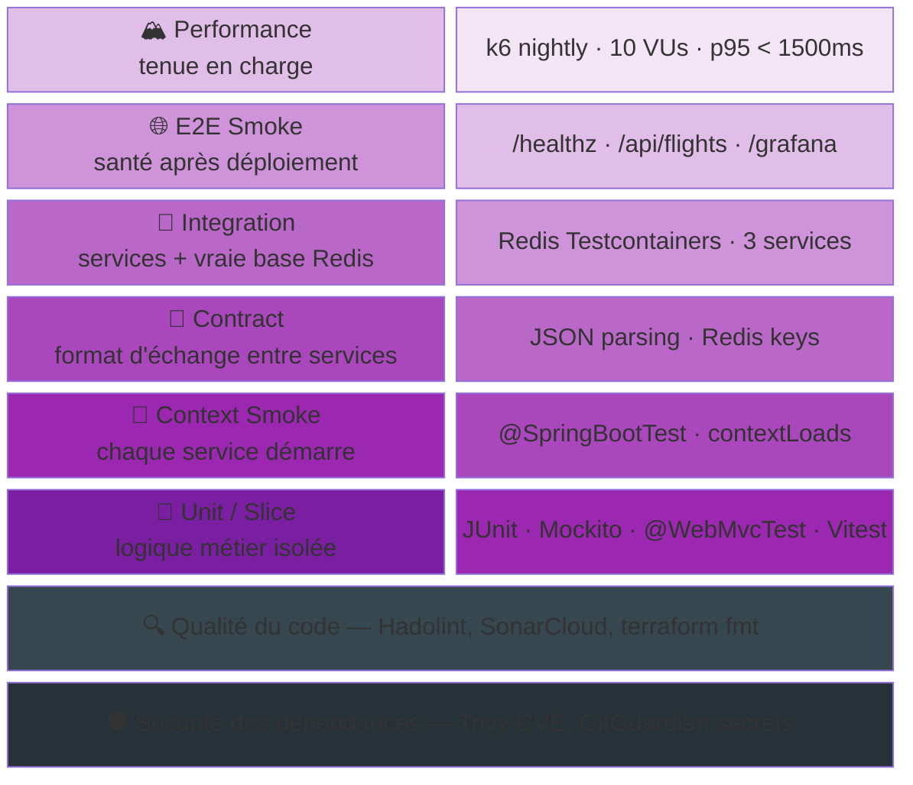
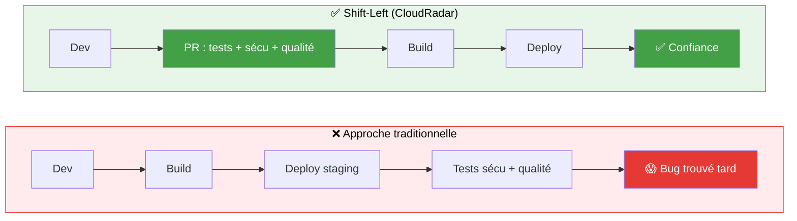
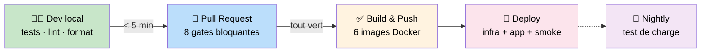
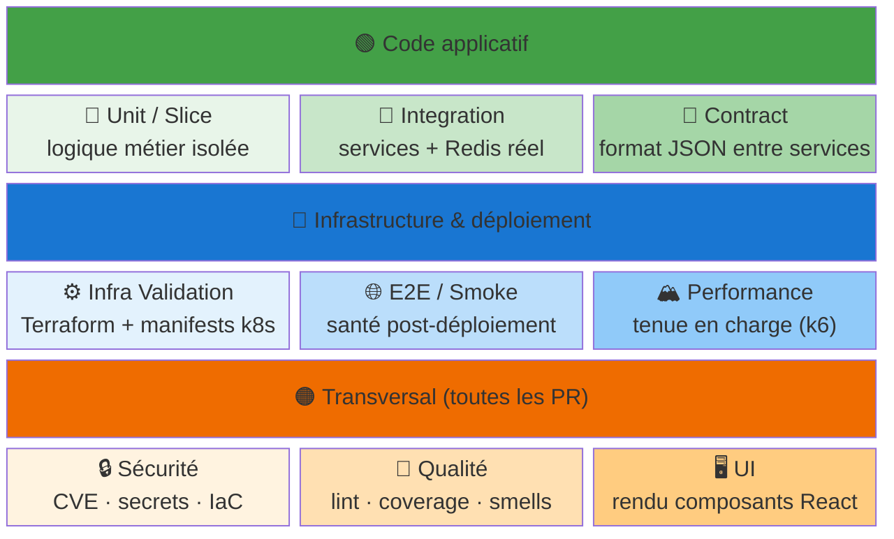
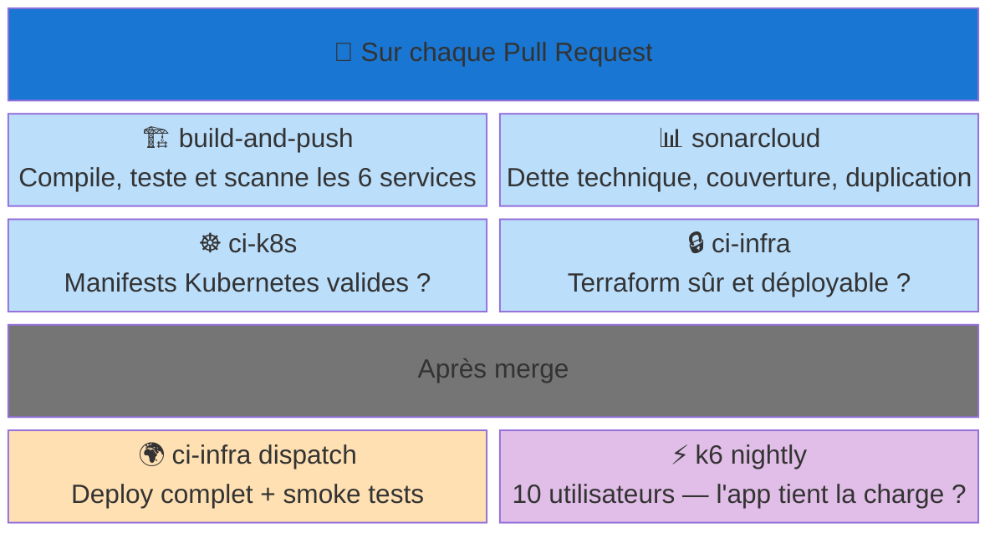
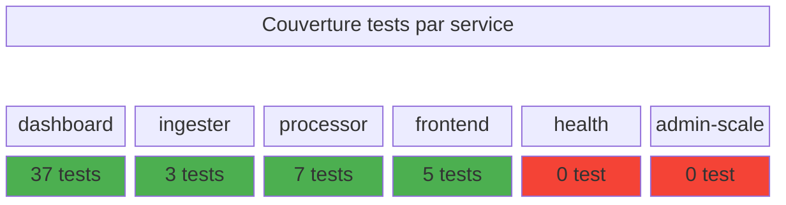
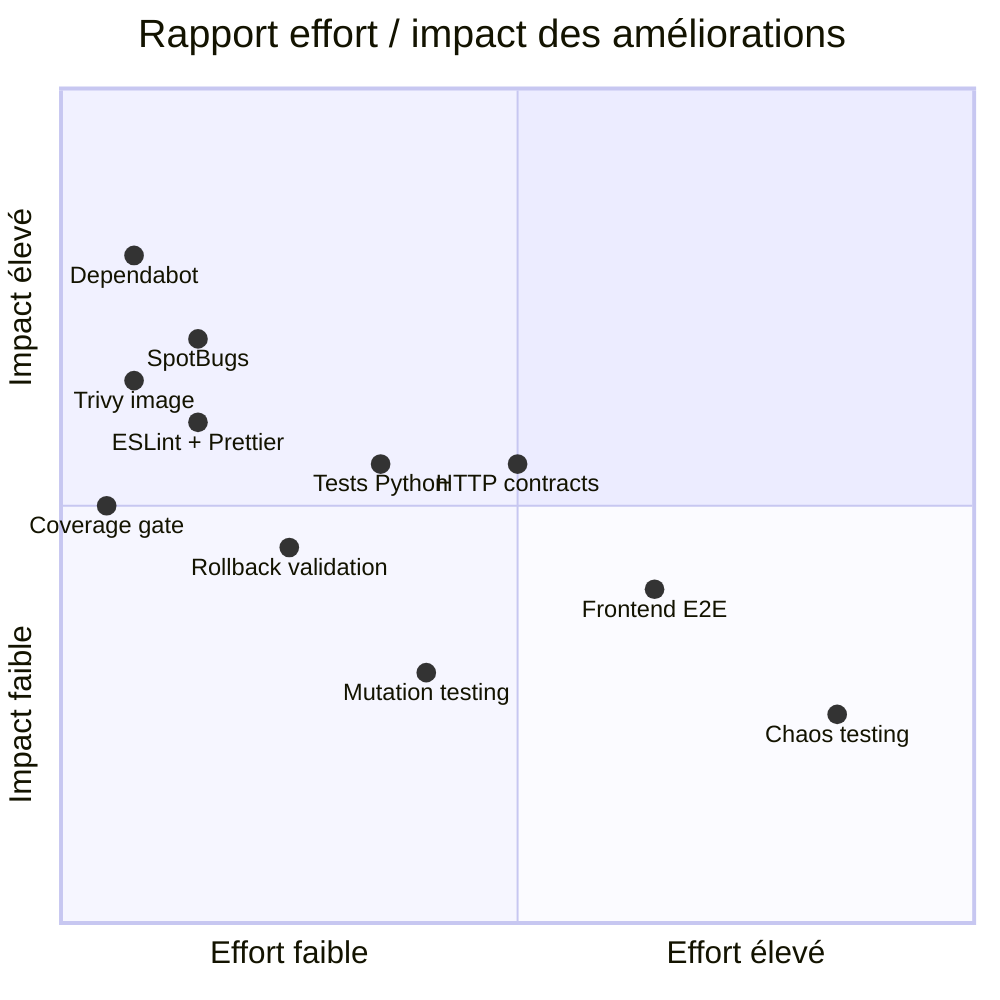

# CloudRadar — Testing & Quality Assurance Overview

> Vue consolidée de la stratégie de tests, des pipelines de qualité et des pratiques DevSecOps du projet CloudRadar.
> Objectif : montrer une approche structurée, multi-couche, conforme aux bonnes pratiques Cloud Architecture et DevSecOps.

---

## Table des matières

- [CloudRadar — Testing \& Quality Assurance Overview](#cloudradar--testing--quality-assurance-overview)
  - [Table des matières](#table-des-matières)
  - [1. Big Picture](#1-big-picture)
    - [Chiffres clés](#chiffres-clés)
  - [2. Shift-Left Testing](#2-shift-left-testing)
  - [3. Les 9 catégories de tests](#3-les-9-catégories-de-tests)
    - [Matrice catégorie × couverture](#matrice-catégorie--couverture)
  - [4. Pipelines CI/CD](#4-pipelines-cicd)
  - [5. Couverture par service](#5-couverture-par-service)
  - [6. Améliorations possibles](#6-améliorations-possibles)

---

## 1. Big Picture

CloudRadar est composé de **6 microservices** écrits en 4 langages (Java, TypeScript, Python, Shell), communiquant via **Redis** comme bus de données. Cette diversité technique impose une stratégie de tests multi-couche : on ne peut pas tout couvrir avec un seul framework. La pyramide ci-dessous montre comment les tests sont empilés, du plus rapide (unitaire) au plus lent (performance).

> Lecture de bas en haut. Les couches basses sont rapides (< 1 min) et nombreuses. Plus on monte, plus les tests sont lents et ciblés. Les deux barres sombres sont **transversales** : elles tournent en parallèle de tout le reste.

| Couche | Ce qu'elle protège | Exemple concret |
|---|---|---|
| Unit / Slice | La logique métier isolée | "le parsing d'un vol OpenSky retourne les bons champs" |
| Context Smoke | Le démarrage de chaque service | "Spring Boot démarre sans erreur de configuration" |
| Contract | Le format d'échange entre services | "le JSON écrit par l'ingester est lisible par le processor" |
| Integration | Le fonctionnement avec une vraie base Redis | "l'ingester écrit dans Redis, le dashboard relit correctement" |
| E2E Smoke | L'application déployée en conditions réelles | "après deploy, /api/flights retourne du JSON valide" |
| Performance | La tenue en charge | "10 utilisateurs simultanés, temps de réponse < 1.5s" |
| Qualité du code | Le respect des standards et bonnes pratiques | "les Dockerfiles suivent les best-practices, l'IaC est sécurisée" |
| Sécurité dépendances | L'absence de failles connues dans les librairies | "aucune CVE critique dans les dépendances Maven/npm" |

### Chiffres clés

| Indicateur | Valeur |
|---|---|
| Tests automatisés | **52 tests** (15 fichiers, 4 langages) |
| Catégories de tests couvertes | **9** (unit, slice, integration, contract, smoke, security, quality, infra, perf) |
| Workflows GitHub Actions | **9** (dont 5 liés aux tests/qualité) |
| Services avec tests | **4/6** (ingester, processor, dashboard, frontend) |
| Ratio pyramide (unit / integ / E2E) | ~70% / 20% / 10% |

---

## 2. Shift-Left Testing

### Le concept

Dans une approche classique, les tests de sécurité, de qualité et d'infrastructure sont exécutés **tard** dans le cycle : en staging, voire en production. On découvre les problèmes après avoir déployé, quand corriger coûte cher en temps et en énergie.

Le **Shift-Left** inverse cette logique : on **décale les vérifications vers la gauche** de la timeline (= vers le début), pour attraper les erreurs le plus tôt possible — idéalement dès que le développeur pousse son code.

### Ce que CloudRadar applique

Dans ce projet, **8 vérifications automatiques sur 10 tournent avant le merge**. Le développeur obtient un retour en quelques minutes, pas après un déploiement raté.

Concrètement, quand un développeur ouvre une Pull Request sur CloudRadar, **4 workflows GitHub Actions se lancent en parallèle** : les tests applicatifs (Java + React), la validation Kubernetes, la vérification Terraform, et l'analyse SonarCloud. Le tout prend environ 5 minutes. Si un seul échoue, le merge est bloqué — impossible de casser `main` par accident.

> **80% des checks** se jouent sur les deux premières étapes (Dev + PR). Les 20% restants (build d'images, deploy, perf) ne tournent qu'après le merge ou en nightly.

**Pourquoi c'est du Shift-Left ?** Traditionnellement, les tests de sécurité, de qualité et d'infrastructure se font tard (en staging ou en prod). Ici, ils sont tous exécutés **sur chaque Pull Request**, avant le merge :

| Gate PR (bloquant) | Ce qu'on vérifie | Temps |
|---|---|---|
| Tests Java (3 services) | Le code métier fonctionne | 1–4 min |
| Tests Frontend (Vitest) | L'interface s'affiche correctement | 20–60s |
| Hadolint (6 Dockerfiles) | Les images Docker suivent les bonnes pratiques | 20–60s |
| Trivy (dépendances) | Aucune faille de sécurité connue (CVE) | 30–120s |
| kubeconform (manifests k8s) | Les fichiers Kubernetes sont valides | 3–5s |
| tfsec (Terraform) | L'infrastructure as code est sécurisée | 10–30s |
| Terraform plan | L'infra peut être appliquée sans erreur | 1–3 min |
| SonarCloud | La qualité globale du code est maintenue | 2–4 min |

---

## 3. Les 9 catégories de tests

Pour couvrir à la fois le code applicatif, l'infrastructure cloud (Terraform, Kubernetes) et la sécurité des dépendances, CloudRadar utilise **9 catégories de tests** réparties en 3 familles. Cette organisation garantit que chaque type de changement — qu'il touche du Java, un manifest k8s ou un module Terraform — est validé par des checks adaptés.

> **3 familles** : les tests **verts** valident le code applicatif (Java/React), les tests **bleus** valident l'infrastructure et le déploiement, les tests **oranges** sont transversaux et s'exécutent sur chaque PR quelle que soit la nature du changement.

### Matrice catégorie × couverture

| Catégorie | Quoi | Quand | Où | Statut |
|---|---|---|---|---|
| 🧪 **Unit / Slice** | Business logic, contrôleurs, parsing | PR | `build-and-push` | ✅ Implémenté |
| 🔗 **Integration** | Context Spring Boot + data-path Redis | PR | `build-and-push` | ✅ Implémenté |
| 📝 **Contract** | JSON serialization, Redis key format | PR | `build-and-push` | ✅ Implémenté |
| 🌐 **E2E / Smoke** | Health + data pipeline post-deploy | Dispatch | `ci-infra` | ✅ Implémenté |
| 🔒 **Security** | Dépendances CVE, secrets, IaC | PR | `build-and-push` + `ci-infra` | ✅ Implémenté |
| 📏 **Code Quality** | Smells, duplication, coverage trends | PR | `sonarcloud` + `build-and-push` | ✅ Implémenté |
| ⚙️ **Infra Validation** | Terraform + k8s manifest schemas | PR | `ci-infra` + `ci-k8s` | ✅ Implémenté |
| 🏔️ **Performance** | Latence p95, taux d'erreur | Nightly / dispatch | `k6-nightly-baseline` | ✅ Implémenté |
| 🖥️ **UI** | Render smoke composants React | PR | `build-and-push` | ✅ Implémenté |

---

## 4. Pipelines CI/CD

Les 9 workflows GitHub Actions de CloudRadar sont organisés pour **tourner en parallèle** et donner un feedback rapide. Chaque workflow a un périmètre clair et un déclencheur précis. L'authentification AWS se fait par **OIDC** (pas de clés stockées), et les builds Docker utilisent une **matrice** pour construire les 6 images en parallèle.

Voici **qui vérifie quoi, et quand** :

| Workflow | Rôle en une phrase | Vérifie | Temps |
|---|---|---|---|
| **build-and-push** | Compiler et tester les 6 services | Tests Java ×3, React, lint Dockerfiles ×6, scan CVE | 2–5 min |
| **sonarcloud** | Surveiller la dette technique | Quality gate, coverage, code smells, duplication | 2–4 min |
| **ci-k8s** | Valider les fichiers Kubernetes | Schemas kubeconform, sync versions, noms d'images | < 1 min |
| **ci-infra** (PR) | Vérifier l'infra avant déploiement | terraform fmt/validate/plan, tfsec sécurité | 1–3 min |
| **ci-infra** (dispatch) | Déployer et vérifier en conditions réelles | Terraform apply → ArgoCD sync → smoke tests | 5–15 min |
| **k6-nightly** | Mesurer la performance chaque nuit | p95 < 1.5s, taux d'erreur < 5%, checks > 95% | ~1 min |

> Détails de chaque workflow : voir `docs/runbooks/ci-cd/`.

---

## 5. Couverture par service

CloudRadar a 6 microservices. Les 3 services Java (ingester, processor, dashboard) concentrent la majorité des tests car ils portent la logique métier — ingestion OpenSky, agrégation Redis, API REST. Le frontend React a des tests de rendu (Vitest). Les 2 services Python (health, admin-scale) sont des utilitaires légers sans tests pour l'instant.

4 services sur 6 ont des tests automatisés (52 tests, 15 fichiers). Les 3 services Java couvrent les 3 niveaux de la pyramide : unitaire (Mockito, @WebMvcTest), intégration (Redis Testcontainers), et context smoke (@SpringBootTest). Le frontend couvre le rendu composant (Vitest + Testing Library).

Les contrats inter-services (clés Redis, format JSON) sont validés par des tests Testcontainers dédiés dans chaque service — documentés dans `docs/events-schemas/redis-keys.md`.

SonarCloud ingère la couverture Java (JaCoCo) et frontend (lcov) pour un suivi de tendance unifié.

---

## 6. Workflow × catégorie : qui vérifie quoi ?

Cette matrice croise les 6 workflows avec les 9 catégories de tests. Elle permet de vérifier d'un coup d'œil qu'**aucune catégorie n'est orpheline** — chaque type de vérification est porté par au moins un workflow.

| Catégorie | build-and-push | sonarcloud | ci-k8s | ci-infra PR | ci-infra deploy | k6 nightly |
|---|:---:|:---:|:---:|:---:|:---:|:---:|
| 🧪 Unit | 🟢 | | | | | |
| 🔗 Integ | 🟢 | | | | | |
| 📝 Contract | 🟢 | | | | | |
| 🖥️ UI | 🟢 | | | | | |
| 🔒 Sécu | 🟢 | | | 🟢 | | |
| 📏 Qualité | | 🟢 | | | | |
| ⚙️ Infra | | | 🟢 | 🟢 | | |
| 🌐 E2E | | | | | 🟢 | |
| 🏔️ Perf | | | | | | 🟢 |

> `build-and-push` porte **5/9 catégories**. Toutes les catégories sont couvertes par au moins un workflow.

---

## 7. Améliorations possibles

| Priorité | Amélioration | Pourquoi | Effort |
|---|---|---|---|
| 🔴 Haute | **Dependabot** | PR automatiques de mise à jour dépendances (Maven, npm, Actions) | ~15 min |
| 🔴 Haute | **SpotBugs** | Détection statique NPE, concurrence, anti-patterns Java | ~30 min |
| 🔴 Haute | **ESLint + Prettier** | Aucun linting TypeScript/React en CI | ~30 min |
| 🔴 Haute | **Trivy image** | Scan couches OS/runtime des images Docker (seul Trivy fs existe) | ~15 min |
| 🟡 Moyenne | **Tests Python** | 2/6 services sans tests (health, admin-scale) | ~2h |
| 🟡 Moyenne | **HTTP contract tests** | Parsing OpenSky et payload `/api/flights` testés sans serveur HTTP mock | ~3h |
| 🟡 Moyenne | **Coverage enforcement** | Activer le seuil bloquant SonarCloud sur le nouveau code | ~10 min |
| 🔵 Basse | **Rollback validation** | Aucune vérification de la capacité de rollback ArgoCD | ~1h |
| 🔵 Basse | **Frontend E2E** | Pas de test navigateur réel (Playwright/Cypress) | ~4h |
| 🔵 Basse | **Mutation testing** | Vérifier que les tests détectent réellement les régressions (PIT) | ~2h |
