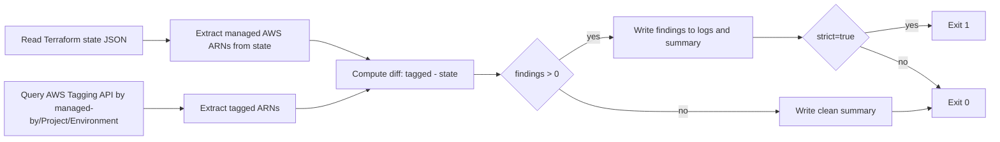

# find-orphans.sh

Detects orphan resources by comparing Terraform state against AWS tagged resources.

## Purpose

- Fail fast before deploy when AWS has Terraform-tagged resources that are absent from Terraform state.
- Report tagged residual resources after destroy.
- Publish a short summary to `GITHUB_STEP_SUMMARY` in CI.

## Detection model

- **A (expected):** AWS resources managed by Terraform state (ARNs from `terraform show -json`).
- **B (observed):** AWS resources returned by Resource Groups Tagging API with tags:
  - `managed-by=<value>` (default `terraform`)
  - `Project=<project>`
  - `Environment=<env>`
- **Findings:** `B - A`
  - tagged resources present in AWS but not present in Terraform state.

## Modes

- `pre-deploy`:
  - default mode
  - strict by default (`--strict true`)
  - exits non-zero on findings
- `post-destroy`:
  - report mode by default (`--strict false`)
  - still computes findings, but usually does not fail the workflow

Backward compatibility:
- `--mode preflight` is accepted as an alias of `pre-deploy`.

## Usage

```bash
scripts/ci/find-orphans.sh \
  --environment dev \
  --project cloudradar \
  --tf-dir infra/aws/live/dev \
  --mode pre-deploy \
  --strict true \
  --summary-path "$GITHUB_STEP_SUMMARY"
```

```bash
scripts/ci/find-orphans.sh \
  --environment dev \
  --project cloudradar \
  --tf-dir infra/aws/live/dev \
  --mode post-destroy \
  --strict false \
  --summary-path "$GITHUB_STEP_SUMMARY"
```

## Flow



## Scope and limitations

- Designed for live infra pipelines (`ci-infra`, `ci-infra-destroy`).
- Bootstrap stack is out of scope.
- Comparison currently relies on ARN matching from Terraform state; resources without ARN in state are not part of this diff.
