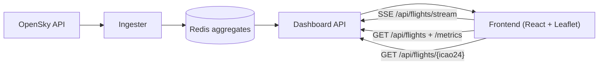
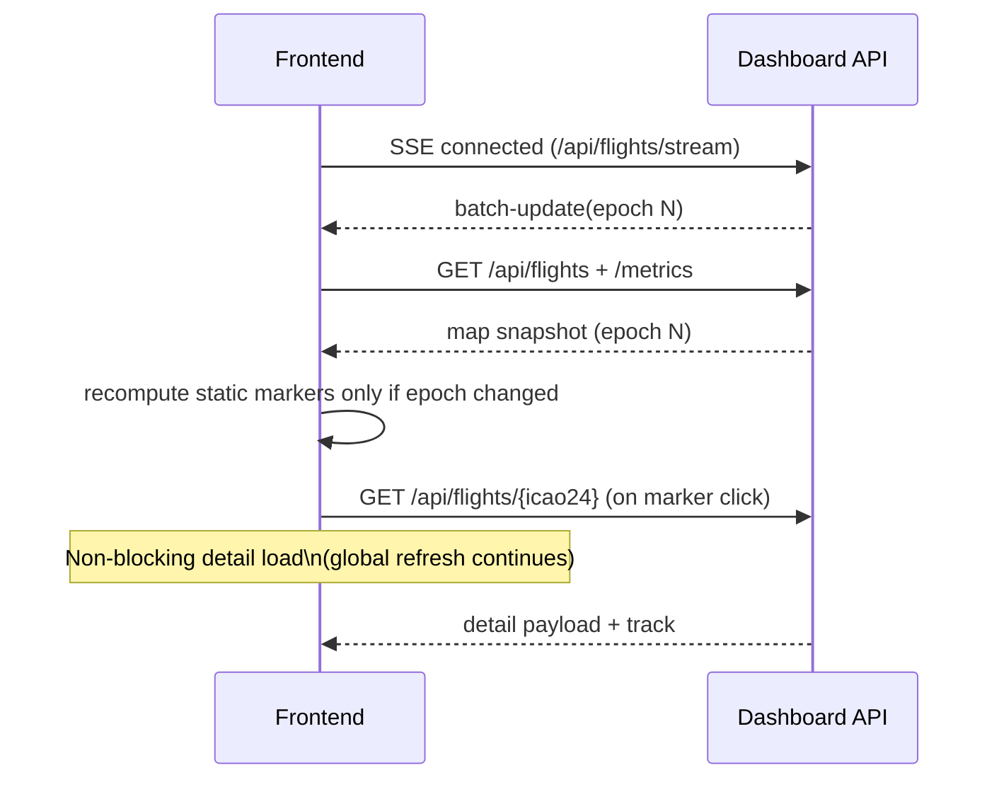

# CloudRadar Frontend

Frontend dashboard for issue #130.
Stack: React 18 + Vite + Leaflet.

This service renders the live IDF map, aircraft markers, flight detail panel, and KPI cards from the Dashboard API.

## Status

- Implemented in this scope:
  - full-screen map UI with dark/cyber style
  - `dark/satellite` map modes
  - aircraft markers with heading-oriented SVG icons
  - click-to-open detail panel (desktop sidebar, mobile bottom sheet behavior)
  - KPI strip based on `/api/flights/metrics`
  - backend-driven refresh via SSE (`/api/flights/stream`) with 10s fallback polling
  - marker interpolation between consecutive OpenSky batches (smooth N-1 -> N movement)
  - ingester ON/OFF toggle via `/admin/ingester/scale` (Basic Auth prompt on first toggle action, not on page load)
- Deferred by design:
  - live zones/alerts integration (`#128`, `#424`)

## Technical Architecture

### Global frontend data path



### Runtime model

- Single-page app served as static files by Nginx (`/`, SPA fallback to `index.html`)
- Health endpoint exposed at `/healthz`
- API calls use relative paths (`/api/flights...`) to stay same-origin behind edge proxy

### Data flow

1. Frontend subscribes to `GET /api/flights/stream` (SSE):
   - on `batch-update`, it refreshes map + metrics
2. Fallback polling runs every 10s (resilience if SSE disconnects)
3. On marker click, frontend fetches:
   - `GET /api/flights/{icao24}?include=track,enrichment`
4. Detail panel and track polyline are updated from this detail payload.
5. On each new batch, map markers animate from previous known position to next one over the measured batch interval.
6. On ingester toggle, frontend sends `POST /admin/ingester/scale` then polls `GET /admin/ingester/scale` until target state convergence.

### Main UI modules

- `src/App.tsx`
  - orchestration layer (polling, selection, status computation, map rendering)
- `src/components/Header.tsx`
  - API/OpenSky status badges, UTC clock, theme switch
- `src/components/DetailPanel.tsx`
  - structured aircraft detail view using `military hint` wording
- `src/components/KpiStrip.tsx`
  - KPI cards and lightweight sparkline rendering
- `src/api.ts`
  - typed API client wrappers
- `src/types.ts`
  - frontend contracts matching backend response models
- `src/constants.ts`
  - bbox and refresh constants

### State and refresh strategy

- Refresh interval fallback: `10s` (`REFRESH_INTERVAL_MS`)
- Optional override: `VITE_UI_REFRESH_MS`
- API status:
  - `online` when refresh succeeds
  - `degraded` if refresh fails after a successful cycle
  - `offline` if no successful cycle is available
- OpenSky feed status:
  - derived from freshest `lastSeen` in flights list
  - marked `stale` when age exceeds threshold (`STALE_AFTER_SECONDS`)
- Marker interpolation:
  - animation duration derives from OpenSky batch epoch delta when available
  - fallback to `REFRESH_INTERVAL_MS` when epoch delta is missing
  - interpolation is skipped for unrealistic jumps (too old / too far)
- Marker static/grayed state:
  - computed from movement between two distinct OpenSky batches only (`latestOpenSkyBatchEpoch` changed)
  - marker is rendered dimmed when movement is below `STATIC_POSITION_THRESHOLD_KM`
  - static map is reset when active bbox changes (boost on/off or bbox switch)
- Selection/detail behavior:
  - selecting a marker triggers detail fetch asynchronously
  - detail fetch must never block global map refresh cycles
- Ingester toggle behavior:
  - toggle uses optimistic UI (`ON/OFF`) and shows `applying ...` while reconciliation is in progress
  - frontend polls ingester scale state for up to 30s to confirm target convergence

### Refresh and selection interaction



### Mapping and rendering choices

- Leaflet base layers:
  - `dark`: Carto Dark tiles
  - `satellite`: Esri World Imagery
- Operational bbox is displayed with a dashed cyan rectangle
- Map movement constrained with `maxBounds`
- Track breadcrumb is rendered as polyline from `recentTrack`

## API contract used by this frontend

- `GET /api/flights`
- `GET /api/flights/{icao24}`
- `GET /api/flights/metrics`
- `GET /admin/ingester/scale` (read current replicas, no Basic Auth prompt)
- `POST /admin/ingester/scale` (replicas `0|1`, authenticated)

Note: `/api/alerts` is intentionally not consumed yet (deferred to #424).

## Local development

```bash
cd src/frontend
npm install
npm run dev
```

Default dev proxy:
- `/api` -> `http://localhost:8080`
- `/admin` -> `http://localhost:8080`

Override API origin:

```bash
VITE_DEV_API_ORIGIN=http://localhost:8081 npm run dev
```

Run locally against deployed edge/API (example):

```bash
VITE_DEV_API_ORIGIN=https://cloudradar.iotx.fr npm run dev
```

If your edge certificate is self-signed in non-prod, allow insecure TLS in dev proxy:

```bash
VITE_DEV_API_ORIGIN=https://cloudradar.iotx.fr VITE_DEV_API_INSECURE=true npm run dev
```

Build production assets:

```bash
npm run build
```

## Container and deployment

- Dockerfile: `src/frontend/Dockerfile`
  - build stage: Node + Vite build
  - runtime stage: `nginxinc/nginx-unprivileged`
- Nginx config: `src/frontend/nginx.conf`
  - serves SPA
  - exposes `/healthz`

Kubernetes manifests:
- `k8s/apps/frontend/deployment.yaml`
- `k8s/apps/frontend/service.yaml`
- `k8s/apps/frontend/ingress.yaml`

## Design notes

- Visual direction follows issue #130 mockup:
  - dark glass panels
  - cyan accent (`#00F5FF`)
  - military hint accent (`#FF4B4B`)
  - JetBrains Mono for instrumentation-style labels
- Mobile behavior is intentionally adapted from desktop:
  - detail panel becomes a bottom sheet style panel
  - KPI cards stack vertically
