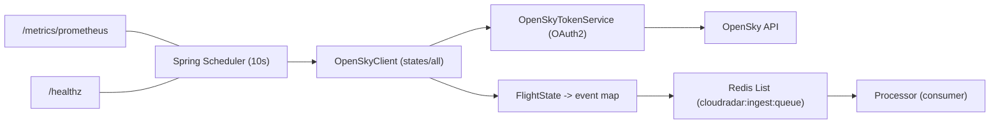
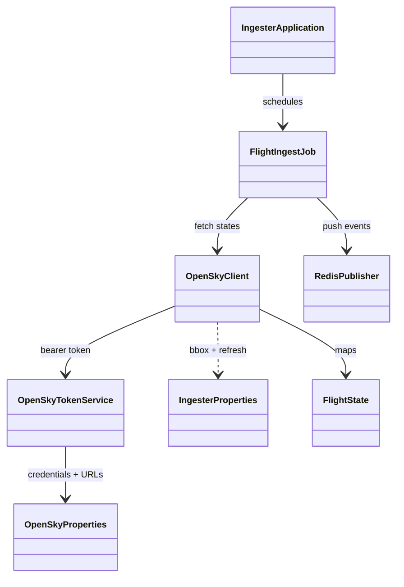

# CloudRadar Ingester

OpenSky ingestion service (Java 17 / Spring Boot) that fetches live flight states and pushes events to Redis.

## Architecture



## Code organization

- `com.cloudradar.ingester.IngesterApplication`  
  Spring Boot entrypoint with scheduling enabled.
- `com.cloudradar.ingester.config.*`  
  Configuration records and shared beans (HTTP client, OpenSkyProperties).
- `com.cloudradar.ingester.opensky.*`  
  OAuth2 token handling, API client, and data mapping into `FlightState`.
- `com.cloudradar.ingester.redis.RedisPublisher`  
  Serializes events as JSON and pushes them to a Redis List.
- `com.cloudradar.ingester.FlightIngestJob`  
  Scheduled job that pulls from OpenSky and pushes to Redis.

## Class diagram

<div align="center">



</div>

## How it works

1. `FlightIngestJob` runs every `INGESTER_REFRESH_MS` (default 10s).
2. `OpenSkyClient` requests `/states/all` for the IDF bbox, using an OAuth2 token.
3. The response is mapped to `FlightState` objects, then to a simple JSON payload.
4. `RedisPublisher` pushes each payload into a Redis List (`cloudradar:ingest:queue`).
5. Metrics and health endpoints are exposed via Actuator (`/metrics/prometheus`, `/healthz`).
6. When OpenSky is unreachable, the ingester applies progressive backoff and stops after the final tier until restart.

### Failure backoff

When OpenSky connections fail, the ingester waits:

`1s → 2s → 5s → 10s → 30s → 60s → 5m → 10m → 30m → 1h → stop`

After the last backoff tier, ingestion is disabled until the pod restarts.

## Local run

```bash
export OPENSKY_CLIENT_ID="<client-id>"
export OPENSKY_CLIENT_SECRET="<client-secret>"
export REDIS_HOST=localhost
export REDIS_PORT=6379

mvn -q spring-boot:run
```

## Optional env overrides
- `INGESTER_REFRESH_MS` (default: 10000)
- `INGESTER_REDIS_KEY` (default: `cloudradar:ingest:queue`)
- `OPENSKY_LAT_MIN`, `OPENSKY_LAT_MAX`, `OPENSKY_LON_MIN`, `OPENSKY_LON_MAX`
- `OPENSKY_BASE_URL` (from K8s Secret, set by ExternalSecret)
- `OPENSKY_TOKEN_URL` (from K8s Secret, set by ExternalSecret)
- `OPENSKY_CLIENT_ID` (from K8s Secret, set by ExternalSecret)
- `OPENSKY_CLIENT_SECRET` (from K8s Secret, set by ExternalSecret)

> All OpenSky configuration is injected via K8s Secret created by External Secrets Operator (ESO) from AWS SSM Parameter Store (`/cloudradar/opensky/*`). See [ESO runbook](../../docs/runbooks/external-secrets-operator.md).

## Health & metrics
- `GET /healthz`
- `GET /metrics/prometheus`

### Notable metrics

OpenSky performance:
- `ingester_opensky_states_http_duration_seconds_*` (Timer; use histogram quantiles for p50/p95)
- `ingester_opensky_states_http_requests_total{outcome="success|rate_limited|client_error|server_error|exception"}`
- `ingester_opensky_states_http_last_status` (gauge; `0` means exception)
- `ingester_opensky_token_http_duration_seconds_*` (Timer)
- `ingester_opensky_token_http_requests_total{outcome="success|client_error|server_error|exception"}`
- `ingester_opensky_credits_consumed_percent` (gauge)
- `ingester_opensky_reset_eta_seconds` (gauge; `0` if header not available)

Throughput (telemetry ingestion):
- `ingester_fetch_total` (counter; increments by number of states fetched)
- `ingester_push_total` (counter; increments by number of events pushed to Redis)
- `ingester_opensky_states_last_count` (gauge; number of states returned by the latest OpenSky poll)

## Deployment notes
- For Kubernetes, use a Secret named `opensky-secret` with keys:
  - `client-id`
  - `client-secret`
  - `base-url`
  - `token-url`
