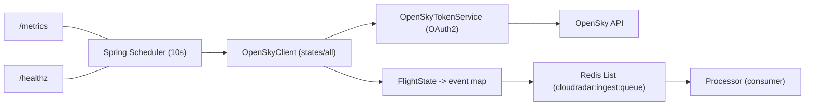
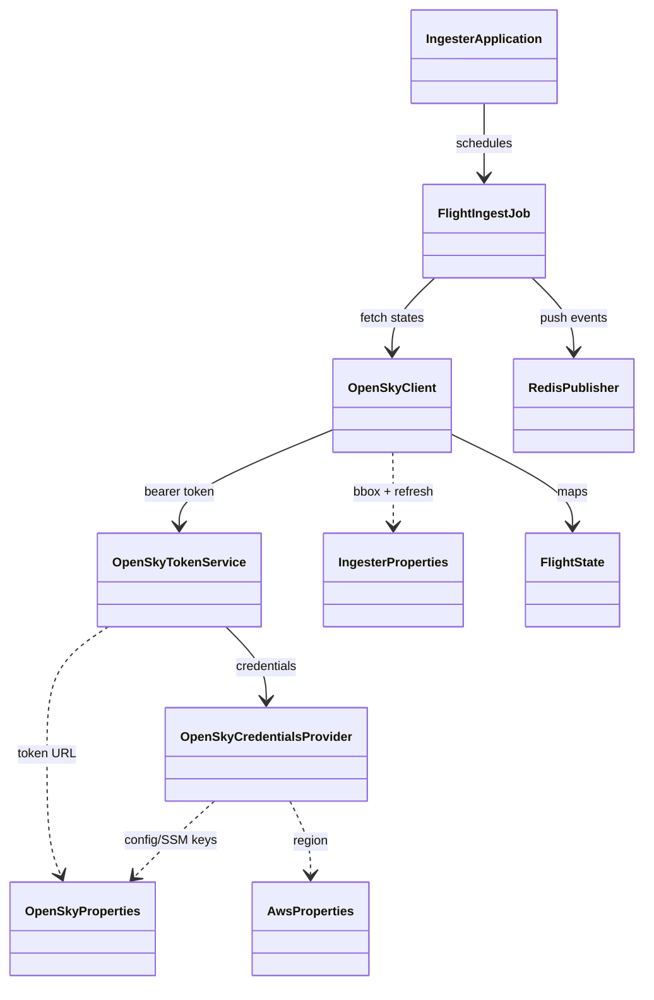

# CloudRadar Ingester

OpenSky ingestion service (Java 17 / Spring Boot) that fetches live flight states and pushes events to Redis.

## Architecture



## Code organization

- `com.cloudradar.ingester.IngesterApplication`  
  Spring Boot entrypoint with scheduling enabled.
- `com.cloudradar.ingester.config.*`  
  Configuration records and shared beans (HTTP client, SSM client).
- `com.cloudradar.ingester.opensky.*`  
  OAuth2 token handling, API client, and data mapping into `FlightState`.
- `com.cloudradar.ingester.redis.RedisPublisher`  
  Serializes events as JSON and pushes them to a Redis List.
- `com.cloudradar.ingester.FlightIngestJob`  
  Scheduled job that pulls from OpenSky and pushes to Redis.

## Class diagram

<div align="center">



</div>

## How it works

1. `FlightIngestJob` runs every `INGESTER_REFRESH_MS` (default 10s).
2. `OpenSkyClient` requests `/states/all` for the IDF bbox, using an OAuth2 token.
3. The response is mapped to `FlightState` objects, then to a simple JSON payload.
4. `RedisPublisher` pushes each payload into a Redis List (`cloudradar:ingest:queue`).
5. Metrics and health endpoints are exposed via Actuator (`/metrics`, `/healthz`).

## Local run

```bash
export OPENSKY_CLIENT_ID="<client-id>"
export OPENSKY_CLIENT_SECRET="<client-secret>"
export REDIS_HOST=localhost
export REDIS_PORT=6379

mvn -q spring-boot:run
```

## Optional env overrides
- `INGESTER_REFRESH_MS` (default: 10000)
- `INGESTER_REDIS_KEY` (default: `cloudradar:ingest:queue`)
- `OPENSKY_LAT_MIN`, `OPENSKY_LAT_MAX`, `OPENSKY_LON_MIN`, `OPENSKY_LON_MAX`
- `OPENSKY_BASE_URL`, `OPENSKY_TOKEN_URL`

## Health & metrics
- `GET /healthz`
- `GET /metrics`

## Deployment notes
- For Kubernetes, use a Secret named `opensky-credentials` with keys `client_id` and `client_secret`.
- Alternatively set `OPENSKY_CLIENT_ID_SSM` and `OPENSKY_CLIENT_SECRET_SSM` and grant SSM access.
