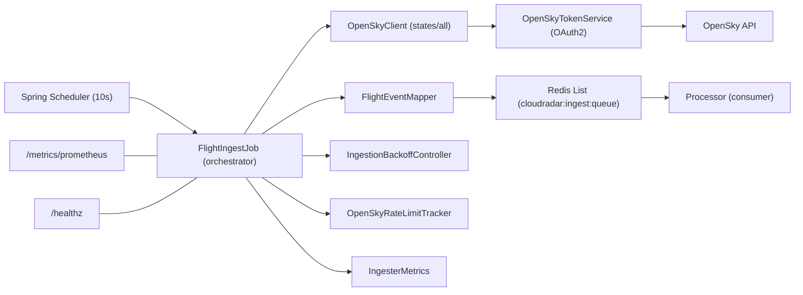
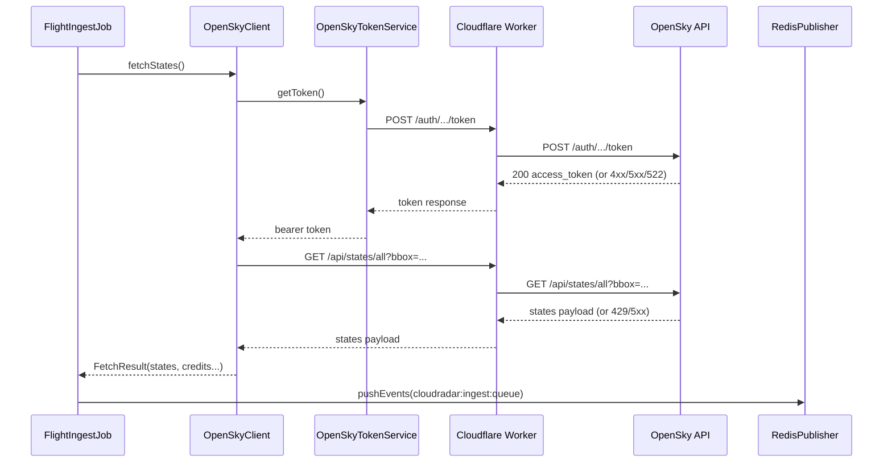
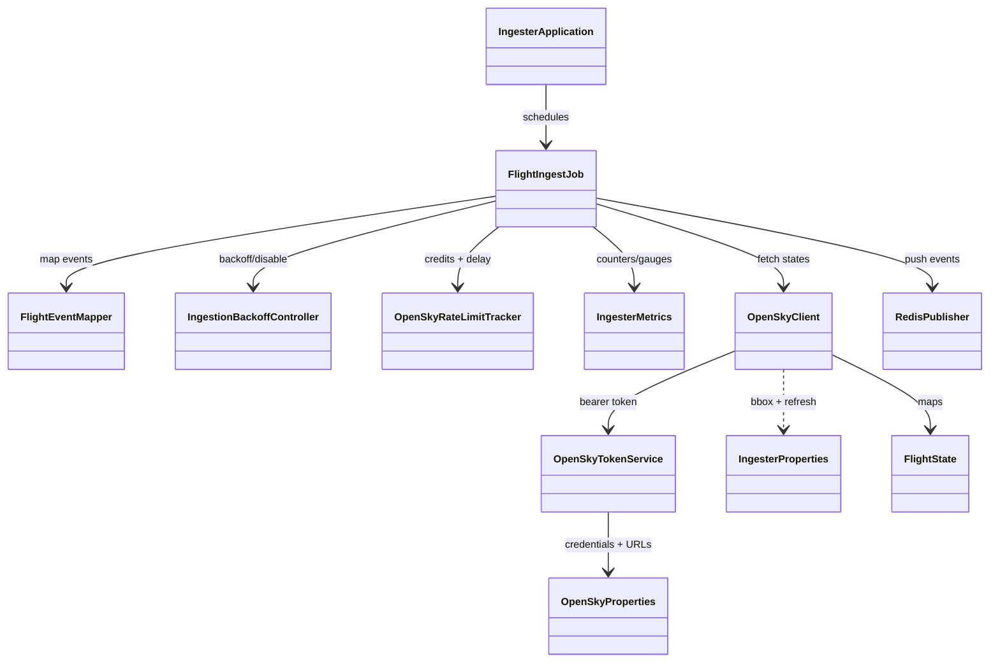

# CloudRadar Ingester

OpenSky ingestion service (Java 17 / Spring Boot) that fetches live flight states and pushes events to Redis.

## Architecture


```mermaid
flowchart LR
  Scheduler["Spring Scheduler (10s)"] --> Job["FlightIngestJob (orchestrator)"]
  Job --> Fetch["OpenSkyClient (states/all)"]
  Fetch --> Token["OpenSkyTokenService (OAuth2)"]
  Token --> OpenSky["OpenSky API"]
  Job --> Mapper["FlightEventMapper"]
  Job --> Backoff["IngestionBackoffController"]
  Job --> RateLimit["OpenSkyRateLimitTracker"]
  Job --> IMetrics["IngesterMetrics"]
  Mapper --> Redis["Redis List (cloudradar:ingest:queue)"]
  Redis --> Processor["Processor (consumer)"]
  Metrics["/metrics/prometheus"] --- Job
  Health["/healthz"] --- Job
```

### OpenSky Proxy Sequence (Ingester -> Worker -> OpenSky)


```mermaid
sequenceDiagram
  participant J as FlightIngestJob
  participant C as OpenSkyClient
  participant T as OpenSkyTokenService
  participant W as Cloudflare Worker
  participant O as OpenSky API
  participant R as RedisPublisher

  J->>C: fetchStates()
  C->>T: getToken()
  T->>W: POST /auth/.../token
  W->>O: POST /auth/.../token
  O-->>W: 200 access_token (or 4xx/5xx/522)
  W-->>T: token response
  T-->>C: bearer token
  C->>W: GET /api/states/all?bbox=...
  W->>O: GET /api/states/all?bbox=...
  O-->>W: states payload (or 429/5xx)
  W-->>C: states payload
  C-->>J: FetchResult(states, credits...)
  J->>R: pushEvents(cloudradar:ingest:queue)
```

This sequence shows the runtime path when OpenSky URLs are configured through the Cloudflare Worker gateway (`OPENSKY_TOKEN_URL`, `OPENSKY_BASE_URL`).
If OpenSky or the proxy path fails, the ingester tracks failures and applies progressive backoff before disabling ingestion.

## Code organization

- `com.cloudradar.ingester.IngesterApplication`  
  Spring Boot entrypoint with scheduling enabled.
- `com.cloudradar.ingester.config.*`  
  Configuration records and shared beans (HTTP client, OpenSkyProperties).
- `com.cloudradar.ingester.opensky.*`  
  OAuth2 token handling and OpenSky API client helpers (`OpenSkyClient`, `OpenSkyTokenService`, HTTP metrics/request helpers).
- `com.cloudradar.ingester.redis.RedisPublisher`  
  Serializes events as JSON and pushes them to a Redis List.
- `com.cloudradar.ingester.FlightIngestJob`  
  Scheduled orchestrator (fetch, map, publish, failure handling).
- `com.cloudradar.ingester.FlightEventMapper`  
  Maps `FlightState` into Redis payload (`opensky_fetch_epoch` included).
- `com.cloudradar.ingester.IngestionBackoffController`  
  Progressive backoff and disable-after-threshold policy.
- `com.cloudradar.ingester.OpenSkyRateLimitTracker`  
  Effective quota tracking and refresh-delay adaptation.
- `com.cloudradar.ingester.IngesterMetrics`  
  Ingestion counters/gauges registration and updates.

## Class diagram

<div align="center">


```mermaid
%%{init: {'themeVariables': {'fontSize': '10px'}}}%%
classDiagram
  class IngesterApplication
  class FlightIngestJob
  class FlightEventMapper
  class IngestionBackoffController
  class OpenSkyRateLimitTracker
  class IngesterMetrics
  class OpenSkyClient
  class OpenSkyTokenService
  class RedisPublisher
  class IngesterProperties
  class OpenSkyProperties
  class FlightState

  IngesterApplication --> FlightIngestJob : schedules
  FlightIngestJob --> OpenSkyClient : fetch states
  FlightIngestJob --> FlightEventMapper : map events
  FlightIngestJob --> IngestionBackoffController : backoff/disable
  FlightIngestJob --> OpenSkyRateLimitTracker : credits + delay
  FlightIngestJob --> IngesterMetrics : counters/gauges
  FlightIngestJob --> RedisPublisher : push events
  OpenSkyClient --> OpenSkyTokenService : bearer token
  OpenSkyTokenService --> OpenSkyProperties : credentials + URLs
  OpenSkyClient --> FlightState : maps
  OpenSkyClient ..> IngesterProperties : bbox + refresh
```

</div>

## How it works

1. `FlightIngestJob` runs every `INGESTER_REFRESH_MS` (default 10s) and orchestrates one ingestion cycle.
2. `OpenSkyClient` requests `/states/all` for the configured bbox, using an OAuth2 token from `OpenSkyTokenService`.
3. `OpenSkyRateLimitTracker` updates effective quota/credits and computes the next refresh delay tier.
4. `FlightEventMapper` converts `FlightState` into Redis payloads (including `opensky_fetch_epoch`).
5. `RedisPublisher` pushes payloads into `cloudradar:ingest:queue`.
6. `IngesterMetrics` updates ingestion and OpenSky gauges/counters; `IngestionBackoffController` handles failure backoff/disable behavior.

### Failure backoff

When OpenSky connections fail, the ingester waits:

`1s → 2s → 5s → 10s → 30s → 60s → 5m → 10m → 30m → 1h → stop`

After the last backoff tier, ingestion is disabled until the pod restarts.

## Local run

```bash
export OPENSKY_CLIENT_ID="<client-id>"
export OPENSKY_CLIENT_SECRET="<client-secret>"
export REDIS_HOST=localhost
export REDIS_PORT=6379

mvn -q spring-boot:run
```

## Local tests

```bash
mvn -B test
```

Current Java test baseline:
- `IngesterApplicationTests.contextLoads()` validates Spring wiring/startup.
- `FlightIngestJobTest` validates orchestrator behavior (fetch -> map -> publish, error path/backoff).
- `FlightEventMapperTest` validates `FlightState -> event` mapping (including `opensky_fetch_epoch`).
- `IngestionBackoffControllerTest` validates progressive backoff tiers and disable-after-threshold behavior.
- `OpenSkyRateLimitTrackerTest` validates effective quota headers, counters reset, and refresh-delay adaptation.
- `IngesterMetricsTest` validates counter/gauge registration + updates.
- `OpenSkyClientTest` validates OpenSky JSON row mapping (`states[]`) and rate-limit header parsing.
- `OpenSkyTokenServiceTest` validates token caching/refresh and error propagation.
- `TokenCooldownPolicyTest` validates token cooldown progression/reset independently.

## Optional env overrides
- `INGESTER_REFRESH_MS` (default: 10000)
- `INGESTER_REDIS_KEY` (default: `cloudradar:ingest:queue`)
- `OPENSKY_LAT_MIN`, `OPENSKY_LAT_MAX`, `OPENSKY_LON_MIN`, `OPENSKY_LON_MAX`
- `OPENSKY_BASE_URL` (from K8s Secret, set by ExternalSecret)
- `OPENSKY_TOKEN_URL` (from K8s Secret, set by ExternalSecret)
- `OPENSKY_CLIENT_ID` (from K8s Secret, set by ExternalSecret)
- `OPENSKY_CLIENT_SECRET` (from K8s Secret, set by ExternalSecret)

> All OpenSky configuration is injected via K8s Secret created by External Secrets Operator (ESO) from AWS SSM Parameter Store (`/cloudradar/opensky/*`). See [ESO runbook](../../docs/runbooks/external-secrets-operator.md).

## Health & metrics
- `GET /healthz`
- `GET /metrics/prometheus`

### Notable metrics

OpenSky performance:
- `ingester_opensky_states_http_duration_seconds_*` (Timer; use histogram quantiles for p50/p95)
- `ingester_opensky_states_http_requests_total{outcome="success|rate_limited|client_error|server_error|exception"}`
- `ingester_opensky_states_http_last_status` (gauge; `0` means exception)
- `ingester_opensky_token_http_duration_seconds_*` (Timer)
- `ingester_opensky_token_http_requests_total{outcome="success|client_error|server_error|exception"}`
- `ingester_opensky_credits_consumed_percent` (gauge)
- `ingester_opensky_reset_eta_seconds` (gauge; `0` if header not available)
- `ingester_opensky_backoff_seconds` (gauge; OpenSky failure backoff duration)
- `ingester_opensky_disabled` (gauge; `1` when ingestion is disabled after repeated failures)

Throughput (telemetry ingestion):
- `ingester_fetch_total` (counter; increments by number of states fetched)
- `ingester_push_total` (counter; increments by number of events pushed to Redis)
- `ingester_opensky_states_last_count` (gauge; number of states returned by the latest OpenSky poll)

## Deployment notes
- For Kubernetes, use a Secret named `opensky-secret` with keys:
  - `client-id`
  - `client-secret`
  - `base-url`
  - `token-url`
