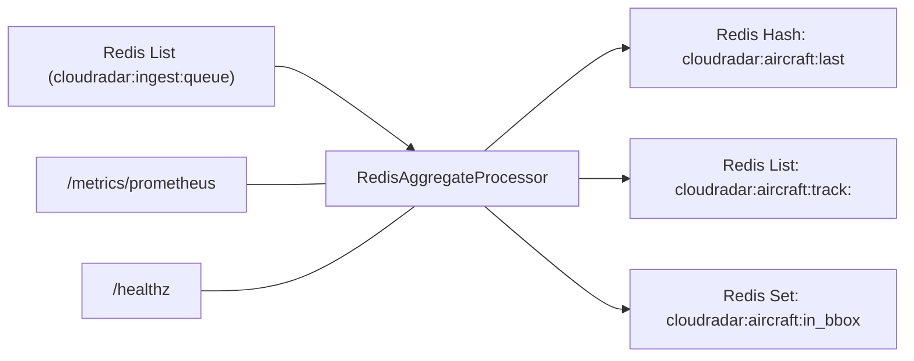
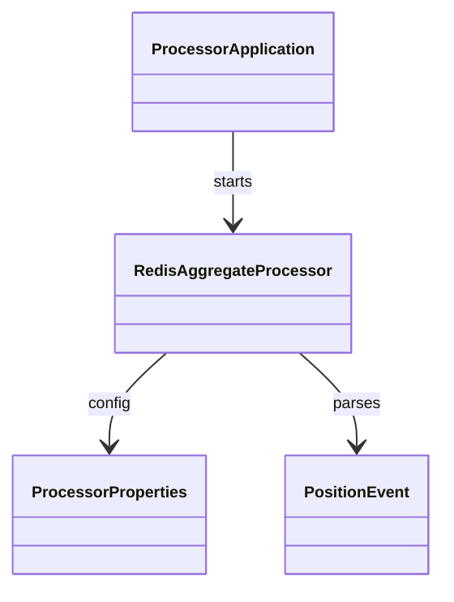

# CloudRadar Processor

Redis aggregation service (Java 17 / Spring Boot) that consumes ingester events and builds in-memory aggregates for the UI.

## Architecture



## Code organization

- `com.cloudradar.processor.ProcessorApplication`
  Spring Boot entrypoint.
- `com.cloudradar.processor.config.ProcessorProperties`
  Configuration properties (bbox, Redis keys, polling timeout).
- `com.cloudradar.processor.service.PositionEvent`
  JSON model for ingested OpenSky events.
- `com.cloudradar.processor.service.RedisAggregateProcessor`
  Blocking loop that consumes Redis events and updates aggregates.

## Class diagram

<div align="center">



</div>

## How it works

1. `RedisAggregateProcessor` blocks on the Redis input list with a short timeout.
2. Each event is parsed into a `PositionEvent`.
3. Aggregates are updated:
   - Last position hash (`cloudradar:aircraft:last`)
   - Short track list per aircraft (`cloudradar:aircraft:track:<icao24>`)
   - Bbox membership set (`cloudradar:aircraft:in_bbox`)
4. Metrics and health endpoints are exposed via Actuator (`/metrics/prometheus`, `/healthz`).

## Local run

```bash
export REDIS_HOST=localhost
export REDIS_PORT=6379

mvn -q spring-boot:run
```

## Optional env overrides
- `PROCESSOR_POLL_TIMEOUT_SECONDS` (default: 2)
- `PROCESSOR_TRACK_LENGTH` (default: 180)
- `PROCESSOR_REDIS_INPUT_KEY` (default: `cloudradar:ingest:queue`)
- `PROCESSOR_LAST_POSITIONS_KEY` (default: `cloudradar:aircraft:last`)
- `PROCESSOR_TRACK_KEY_PREFIX` (default: `cloudradar:aircraft:track:`)
- `PROCESSOR_BBOX_SET_KEY` (default: `cloudradar:aircraft:in_bbox`)
- `PROCESSOR_LAT_MIN`, `PROCESSOR_LAT_MAX`, `PROCESSOR_LON_MIN`, `PROCESSOR_LON_MAX`

## Health & metrics
- `GET /healthz`
- `GET /metrics/prometheus`

## Deployment notes
- Processor uses Redis only in v1; SQLite persistence is tracked in #165.
- Ensure Redis is reachable at `redis.data.svc.cluster.local:6379` inside the cluster.
